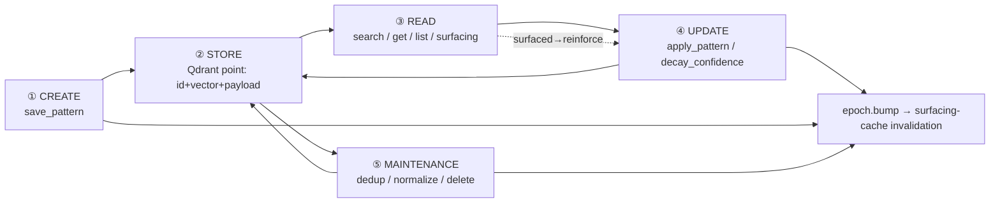
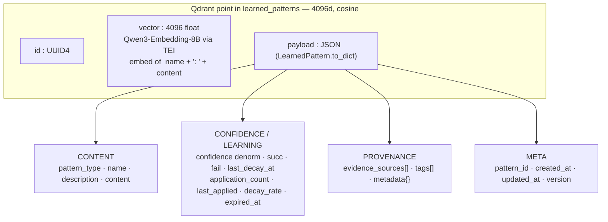
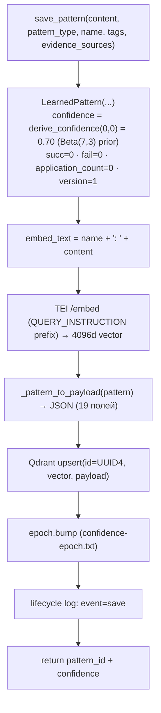
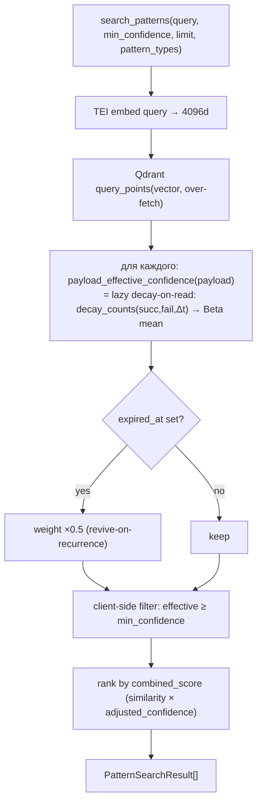
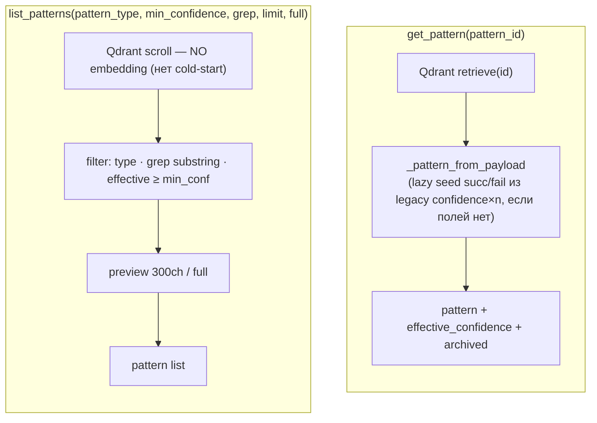
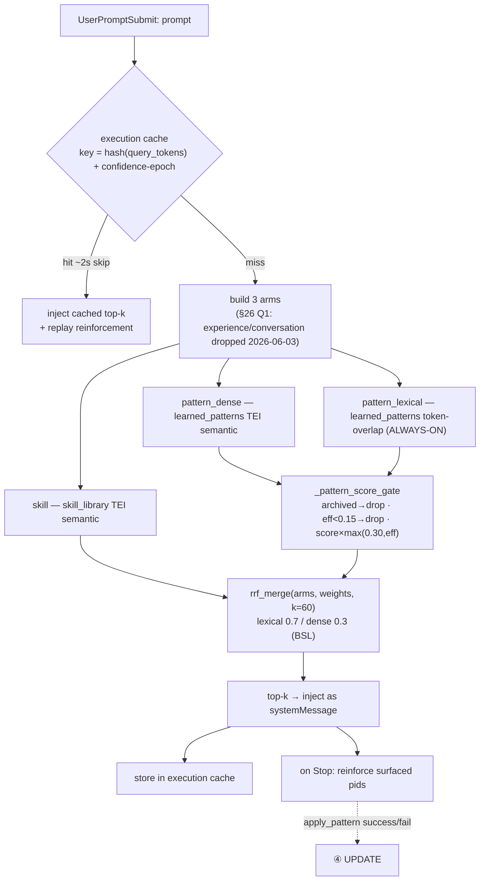
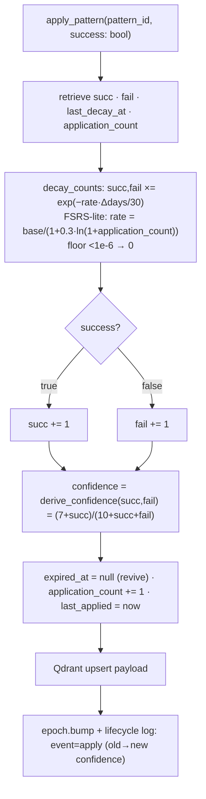
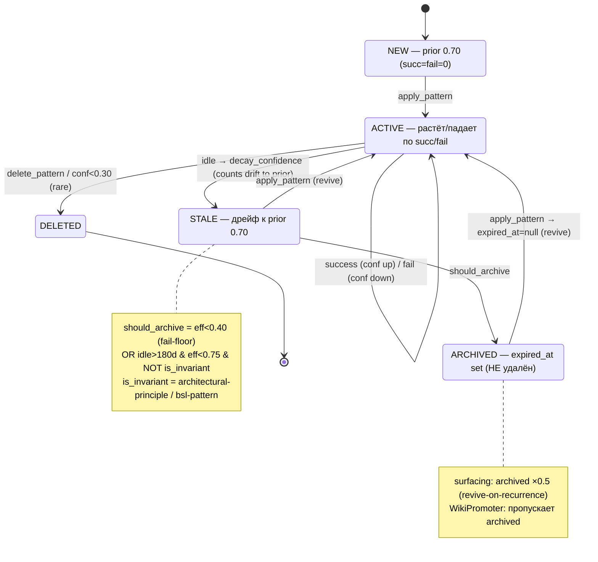

# 27.11 Жизненный цикл паттерна — create / store / read / update (наглядная схема)

> Максимально детальная карта того, как `LearnedPattern` рождается, хранится, читается и
> обновляется в vector-memory (`learned_patterns`, Qdrant 4096d Qwen3). Диаграммы — Mermaid
> (рендерятся в GitHub/VS Code/Obsidian). Источники кода: [`models.py`](../../../src/memory/vector_memory/models.py),
> [`server.py`](../../../src/memory/vector_memory/server.py), [`confidence.py`](../../../src/memory/vector_memory/confidence.py),
> [`epoch.py`](../../../src/memory/vector_memory/epoch.py), `memory-first-hook.py`. Связано: [27.7](27.7_MCP_инструменты.md), [27.9](27.9_Confidence_Lifecycle.md), [27.10](27.10_Memory_Surfacing_Quality.md).

---

## 0. Карта циклов (обзор)



---

## 1. ② STORE — модель хранения (1 паттерн = 1 точка Qdrant)



**Два слоя информации:** `vector` (4096d) — для semantic-поиска по смыслу; `payload` (JSON) — само знание + метаданные доверия/происхождения.

**Два формата payload в живой коллекции:**

```mermaid
flowchart LR
  RICH["RICH (LearnedPattern)<br/>pattern_id, pattern_type, succ/fail, version, ..."] -->|"read via _pattern_from_payload"| OK["полные поля"]
  LIGHT["LIGHT (migrated, memory-ai)<br/>original_id, category, importance, source"] -->|"read via _pattern_from_payload"| DEF["category→default code-convention<br/>importance→default 0.5 (теряются)"]
  LIGHT -.normalize_light_patterns.py.-> RICH
```

> Нормализация (light→rich): [`scripts/normalize_light_patterns.py`](../../../scripts/normalize_light_patterns.py) — `pattern_type ← CATEGORY_MAP[category]`, `confidence ← importance`, провенанс в `metadata`. См. [27.7 §Реализация](27.7_MCP_инструменты.md).

### 1.1 Где паттерн хранится (и где НЕ хранится)

`learned_pattern` — это **запись в Qdrant** (векторная БД на `localhost:6333`; физически — бинарные файлы в volume Qdrant `qdrant_storage` / `/qdrant/storage`, **не** файл в git и **не** `.md`). Прочитать можно только через Qdrant API / MCP (`get_pattern`, `list_patterns`, `search_patterns`), не открыть как файл.

**Всё смысловое содержание паттерна — в строковом поле `content`** внутри JSON-payload (`name` = обрезка из `content`; `description` обычно пуст; остальные поля — метаданные доверия/происхождения, не знание). У больших паттернов `content` — это многострочный markdown-**текст**, но он всё равно лежит в поле `content` точки Qdrant, а не в отдельном `.md`.

**Не путать с двумя другими memory-слоями** (только у одного есть `.md`):

| Слой | Где | `.md`? |
|---|---|---|
| **vector-memory** `learned_patterns` (паттерны) | Qdrant (БД) | ❌ JSON-поле `content` |
| **Курируемая память** `MEMORY.md` + `memory/*.md` | файлы в `~/.claude/projects/<...>/memory/` | ✅ да, реальные `.md` |
| **memory-ai** (episodic) | SQLite `data/memory_ai.db` | ❌ |

`memory-first-hook` при surfacing (§3.4) ищет во **всех** слоях сразу и мёржит через RRF — отсюда естественная путаница «паттерн vs .md-память». Конкретно **learned_pattern всегда = точка Qdrant**, его текст — в `content`.

---

## 2. ① CREATE — `save_pattern`



> Advisory-аргумент `confidence` при save **игнорируется** — доверие стартует с prior 0.70 и
> растёт только через реальные применения (`apply_pattern`). Это §22-инвариант.

---

## 3. ③ READ — четыре пути чтения

### 3.1 `search_patterns` — semantic (нужен TEI)



### 3.2 `get_pattern` — один по ID · 3.3 `list_patterns` — обзор без запроса (scroll, без TEI)



### 3.4 Surfacing — `memory-first-hook` (главный авто-путь чтения, §24)



> TEI down → dense arms пусты, `pattern_lexical` всё ещё populated → lexical-only RRF
> (graceful degradation, surfacing не падает). Веса/пороги тюнятся через
> `surfacing_tuning.json` (§25). Подробно: [27.10](27.10_Memory_Surfacing_Quality.md).

---

## 4. ④ UPDATE — `apply_pattern` (рост/падение доверия)



**Примеры (старт 0.70):** 5 чистых успехов → 0.80; +1 фейл → ~0.75. Простой без применений → `decay_confidence` тянет счётчики к prior (де-промоушен, не обнуление).

---

## 5. §22 — машина состояний доверия (полный цикл)



---

## 6. Сквозная инвалидация: mutation → epoch → cache

```mermaid
flowchart LR
  M["любая мутация:<br/>save · apply · decay · delete · archive"] --> EP["epoch.bump() → confidence-epoch.txt (time.time)"]
  EP --> CK["memory-first-hook: cache_key включает epoch (дешёвый локальный read)"]
  CK --> INV["мгновенный surfacing-cache miss<br/>(закрыт 5-мин stale-window между §22 и §24)"]
  M -.MCP-side (server.py).-> RC["⚠ persistent stdio-процесс держит старый код<br/>→ нужен /mcp reconnect; хуки спавнятся свежими"]
```

---

## 7. ⑤ MAINTENANCE — операции над коллекцией

| Операция | Инструмент | Что делает | Безопасность |
|---|---|---|---|
| Точный дедуп | [`scripts/dedupe_learned_patterns.py`](../../../scripts/dedupe_learned_patterns.py) | схлоп по content-hash (keep oldest+richest, sum succ/fail) + opt-in test-drop | dry-run default, vector-backup, `--restore` |
| Нормализация | [`scripts/normalize_light_patterns.py`](../../../scripts/normalize_light_patterns.py) | light (original_id) → full LearnedPattern (category→pattern_type, importance→confidence) | dry-run default, backup, `--seed-importance N` |
| Просмотр | [`scripts/view_learned_patterns.py`](../../../scripts/view_learned_patterns.py) / MCP `list_patterns` | scroll + фильтры type/conf/grep, читаемый дамп | read-only |
| Семантический схлоп | (курируемо, по ID + backup) | кириллица/транслит дубли с разным текстом | backup + delete by id |

---

## 8. Поля payload (справочник `_pattern_to_payload`)

| Поле | Тип | Роль |
|---|---|---|
| `pattern_id` | str (UUID4) | id точки |
| `pattern_type` | enum | code-convention / workflow-pattern / debugging-heuristic / architectural-principle / project-structure / bsl-pattern |
| `name` · `description` · `content` | str | контент знания |
| `confidence` | float | **денорм-кэш** Beta mean (для Qdrant-фильтра; ранжирование идёт по effective) |
| `succ` · `fail` | float | §22 Beta-счётчики (суть обучения; decay'ятся при чтении) |
| `last_decay_at` | iso | отметка для lazy decay-on-read |
| `application_count` · `last_applied` | int / iso | счётчик применений (FSRS-lite stability) |
| `decay_rate` | float | базовая скорость затухания (0.05) |
| `expired_at` | iso / null | флаг архива (invalidate-not-delete) |
| `evidence_sources[]` | list | EvidenceSource: source_type (file/commit/conversation/tool-use) + reference + weight |
| `tags[]` · `metadata{}` | list / dict | теги + произвольные метаданные (включая провенанс нормализации) |
| `created_at` · `updated_at` · `version` | iso / int | служебное |

---

## Связанные разделы

- [27.7 MCP инструменты](27.7_MCP_инструменты.md) — vector-memory tools + результаты реализации
- [27.9 Confidence Lifecycle](27.9_Confidence_Lifecycle.md) — §22 Beta-математика
- [27.10 Memory Surfacing Quality](27.10_Memory_Surfacing_Quality.md) — §24 surfacing + §25 self-tuning
- Skill: `memory-unified`

---

## 9. Человекочитаемая схема (ASCII — рендерится везде без Mermaid)

```text
================================================================================
                 ЖИЗНЕННЫЙ ЦИКЛ ПАТТЕРНА  (vector-memory / learned_patterns)
================================================================================

  (1) CREATE  --  save_pattern(content, pattern_type, name, tags)
   |               * confidence = 0.70   (Beta(7,3) prior; advisory arg ignored)
   |               * succ = 0 , fail = 0 , application_count = 0 , version = 1
   |               * embed_text = "name: content"  --TEI-->  vector[4096]  (Qwen3)
   v
  (2) STORE   --  Qdrant point  =  id(UUID4)  +  vector[4096, cosine]  +  payload{JSON}
   |    +-------------------------------------------------------------------------+
   |    | payload:  content . pattern_type . name . description                   |
   |    |           confidence(denorm) . succ . fail . last_decay_at              |
   |    |           application_count . last_applied . decay_rate . expired_at    |
   |    |           evidence_sources[] . tags[] . metadata{} . created/updated/ver|
   |    +-------------------------------------------------------------------------+
   |        ^                                                        |
   |  upsert|  (new succ/fail/confidence)                  scroll /  | query / retrieve
   |        |                                                        v
  (3) READ -+----------------------------------------------------------------------+
   |        | search_patterns  : query --TEI embed--> vec --> top-k (semantic)     |
   |        | get_pattern      : by id                                             |
   |        | list_patterns    : scroll  (NO embed -> no cold-start)               |
   |        | surfacing        : memory-first-hook -> 3 arms -> RRF(k=60) -> inject |
   |        +----------------------------------+-----------------------------------+
   |                                           | ранжирование по EFFECTIVE_CONFIDENCE
   |                                           |   = Beta(7,3) над succ/fail,
   |                                           |     decay-on-read по времени
   |                                           v
  (4) UPDATE  --  apply_pattern(success)  <----+----  (паттерн всплыл и помог? -> reinforce)
   |               1. decay succ,fail  (x exp(-rate * dt/30) , FSRS-lite)
   |               2. succ++   (success)   |   fail++   (failure)
   |               3. confidence = (7+succ) / (10+succ+fail)
   |               4. expired_at = null    (revive)  ,  application_count++
   |               5. upsert  ----------------------------------------------+
   v                                                                        |
  (назад в (2) STORE)  <-----------------------------------------------------+

  (5) MAINTENANCE  --  dedup (content-hash) . normalize (light->full) . view
                       . semantic-collapse        (все: dry-run + vector-backup + restore)

  --------------------------------------------------------------------------------
  ЛЮБАЯ мутация (save / apply / decay / delete / archive)
        --> epoch.bump()  -->  surfacing-cache INVALIDATION (мгновенный miss)
        --> правки кода MCP-сервера  -->  нужен  /mcp reconnect


  ШКАЛА effective_confidence  (Beta(7,3) posterior mean, старт 0.70):

   0.0        0.30          0.40            0.70                         1.0
    |----------|-------------|---------------|----------------------------|
    | EXPIRED  |  delete?    |  fail-floor   |  PRIOR (новый паттерн)  ->  | растёт
    | (мёртв)  | (conf<0.30, |  (архив если  |  succ/fail = 0              | с каждым
    |          |  редко)     |  eff<0.40)    |                             | success
    мёртвое <------------------- дрейф при простое (decay) ------------- доверенное

  ARCHIVE != DELETE:  expired_at помечает паттерн (invalidate-not-delete),
  surfacing отдаёт его x0.5 (revive-on-recurrence); любой apply_pattern оживляет.
  is_invariant (architectural-principle / bsl-pattern) -> по времени НЕ архивируется.

  ДВА ФОРМАТА payload в живой коллекции:
    RICH  (pattern_id, succ/fail, version, ...) = настоящий LearnedPattern
    LIGHT (original_id, category, importance)   = мигрировано из memory-ai
          --normalize_light_patterns.py-->  RICH (category->type, importance->conf)
================================================================================
```
