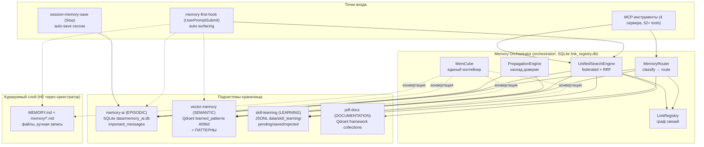
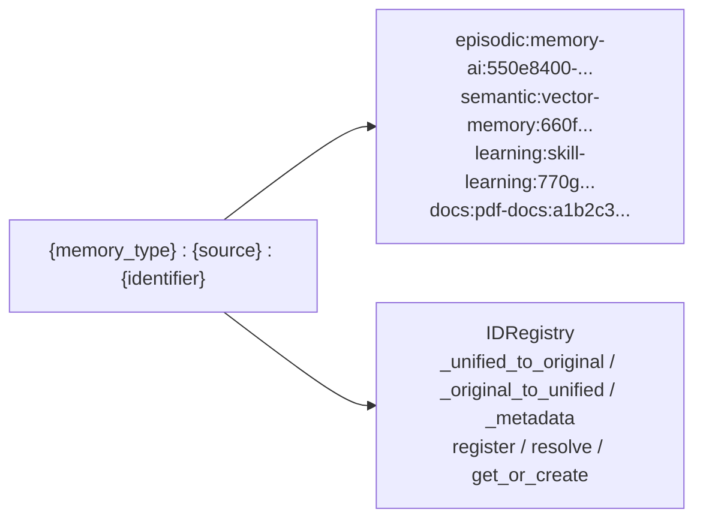
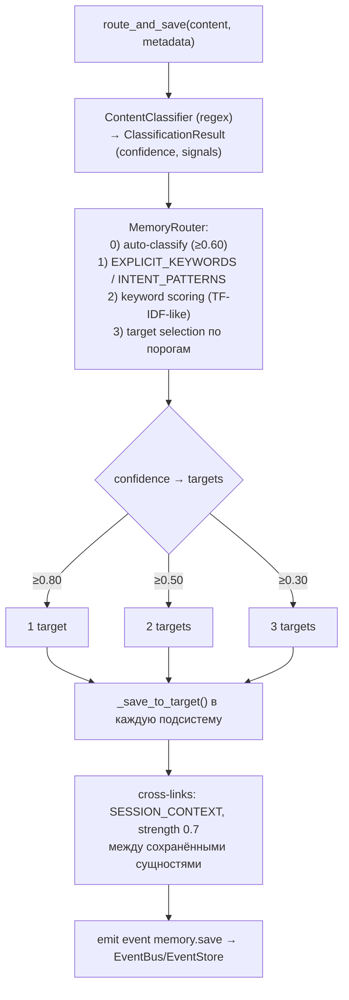
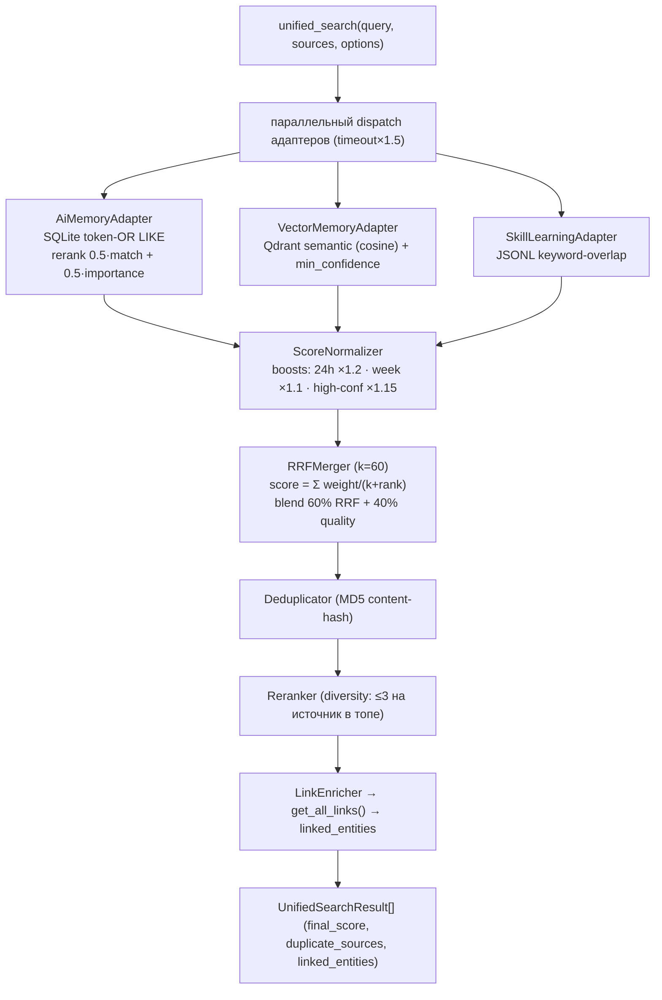
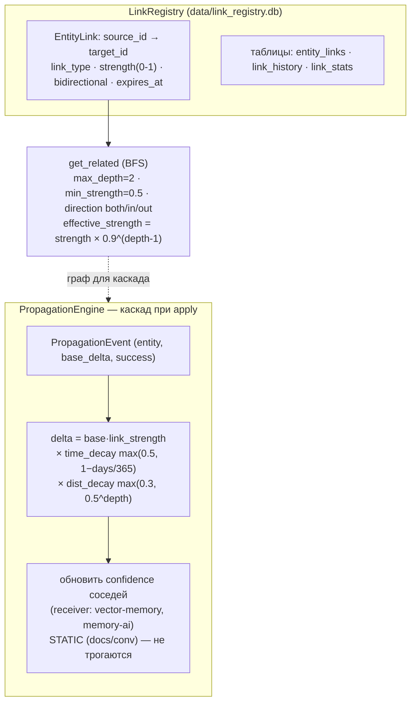
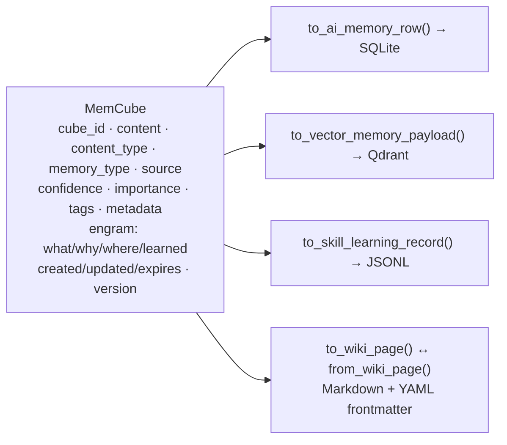
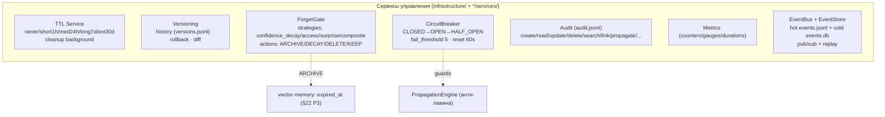
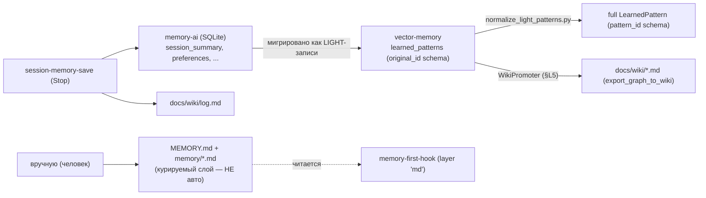

# 27.12 Карта систем памяти и потоки данных (глубокий разбор + схемы)

> Полная архитектурная карта Unified Memory System: **оркестратор + 4 подсистемы-хранилища +
> курируемый `.md`-слой + хуки**, и как данные **пишутся, читаются, связываются, мигрируют и
> затухают** между ними. Зум-аут к «большой картине» поверх per-подсистемных глав
> ([27.2 Оркестратор](27.2_Оркестратор.md), [27.5 Поиск](27.5_Поиск_и_сервисы.md),
> [27.11 Pattern Lifecycle](27.11_Pattern_Lifecycle.md)). Все факты — из кода `src/memory/`.

---

## 1. Большая картина — кто есть кто

Память — это **НЕ одно хранилище**, а федерация из нескольких независимых store'ов, объединённых оркестратором на уровне записи/поиска/связей. Плюс отдельный курируемый `.md`-слой и хуки, которые всё это «всплывают».



**Ключевой принцип:** подсистемы **не знают друг о друге** — координацию (роутинг, federated-поиск, связи, каскад) делает оркестратор. Курируемый `.md`-слой живёт **в стороне** (его читает только `memory-first-hook`, не оркестратор).

---

## 2. Хранилища — физическая карта (где что лежит)

| Подсистема | MemoryType | Backend | Физический путь | Что хранит | `.md`? |
|---|---|---|---|---|---|
| **memory-ai** | `episodic` | SQLite | `data/memory_ai.db` (таблица `important_messages`) | сообщения/факты сессий + importance | ❌ |
| **vector-memory** | `semantic` | Qdrant | `localhost:6333`, коллекция `learned_patterns` (4096d cosine) | **паттерны** (LearnedPattern) | ❌ (поле `content`) |
| **skill-learning** | `learning` | JSONL | `data/skill_learning/` (`pending/saved/rejected_patterns.jsonl`) | паттерны навыков на подтверждение | ❌ |
| **pdf-docs** | `docs` | Qdrant | framework-коллекции | документация (RAG) | ❌ |
| **Link Registry** | — | SQLite | `data/link_registry.db` (`entity_links`/`link_history`/`link_stats`) | связи между сущностями | ❌ |
| **Event Store** | — | JSONL+SQLite | `data/events.jsonl` (hot) + `data/events.db` (cold) | события шины | ❌ |
| **Курируемая память** | — | файлы | `~/.claude/projects/<...>/memory/*.md` + `MEMORY.md` | ручные заметки/feedback | ✅ **да** |

> Подытог по частому вопросу: **паттерн (`learned_patterns`) — это запись в Qdrant, НЕ `.md`.** `.md` есть только у курируемого слоя — это **отдельная система**.

---

## 3. UnifiedID — общий «адрес» сущности



- **MemoryType (6):** `episodic` · `semantic` · `learning` · `docs` · `wiki` · `graph`.
- **SourceServer (7):** `memory-ai` · `vector-memory` · `skill-learning` · `pdf-docs` · `orchestrator` · `obsidian-vault` · `lightrag`.
- `identifier` валидируется regex `^[a-zA-Z0-9_:\-]+$`. `IDRegistry` хранит двунаправленный маппинг unified↔original (источниковый id паттерна/сообщения) + метаданные.

---

## 4. WRITE — как данные ПОПАДАЮТ в память



**ContentType (7):** `FACT` · `PREFERENCE` · `RULE` · `SKILL` · `CODE` · `OBSERVATION` · `WIKI`.
**CATEGORY_TARGETS** маппит категорию → подсистему(ы). Уверенность определяет, в **сколько** хранилищ уйдёт запись (1/2/3). Прямые пути записи (минуя роутер): `save_pattern` (→ Qdrant), `save_important_message` (→ SQLite), `capture_pattern` (→ JSONL), Stop-хук `session-memory-save` (→ SQLite + `docs/wiki/log.md`).

---

## 5. READ — federated search (как данные ЧИТАЮТСЯ обратно)



**Адаптеры — паттерн «один интерфейс на подсистему»:** оркестратор не лезет в БД напрямую, каждый `BaseSearchAdapter` инкапсулирует свой store. Это позволяет добавлять/убирать подсистемы без изменения движка.

> Второй путь чтения — **surfacing** (`memory-first-hook`, §3.4 [27.11](27.11_Pattern_Lifecycle.md)): свой облегчённый RRF (k=60, плечи skill/exp/conv/pattern_dense/pattern_lexical) + confidence-gating + execution-cache. Он бьёт по store'ам напрямую (не через оркестратор) ради hot-path-латентности (<3s).

---

## 6. Граф связей и каскад доверия



**LinkType (10):** `based_on` · `supports` · `contradicts` · `extends` · `derives_from` · `session_context` · `promoted_to` · `superseded_by` · `mirrors` · `graph_node`.
Каскад ограничен: `max_depth=3`, `max_entities_per_event=10`, `min_delta_threshold=0.001`, дедуп событий + Circuit Breaker (защита от лавины). Связь со страхом самовозбуждения — двойной decay (время + расстояние).

---

## 7. MemCube — единый контейнер (мост между форматами)



MemCube — это «эсперанто» памяти: одна сущность, которую можно сериализовать в формат любой подсистемы (или в wiki-`.md` с секциями `## What/Why/Where/Learned`). Через него идёт миграция между store'ами. `touch()` бампает версию + timestamp; `is_expired()` — TTL.

---

## 8. Governance — жизненный цикл и защита (P4-сервисы)



§22 confidence-lifecycle ([27.9](27.9_Confidence_Lifecycle.md)) — это *частный* случай governance, встроенный прямо в vector-memory (Beta-posterior, decay-on-read, forget/revive). ForgetGate — более общий механизм с 4 стратегиями и 4 действиями.

---

## 9. Миграция и связь с курируемым `.md`-слоем



**Три разных «памяти» — не путать:**
1. **vector-memory `learned_patterns`** (Qdrant) — авто-выученные паттерны, §22 confidence.
2. **Курируемая `MEMORY.md` + `memory/*.md`** (файлы) — **ручной** слой, пишется человеком/подтверждением; авто-захват только в *черновики* `data/memory_drafts/`.
3. **memory-ai** (SQLite) — эпизодические сессии (авто, Stop-хук).
Данные **перетекают** (memory-ai → learned_patterns light → normalize → full; learned_patterns → wiki через WikiPromoter), но системы остаются разными.

---

## 10. Мастер-схема (человекочитаемая, ASCII)

```text
================================================================================
        UNIFIED MEMORY SYSTEM — карта хранилищ и потоков (одна картинка)
================================================================================

  ВХОД (запись)                  КООРДИНАЦИЯ                   ВЫХОД (чтение)
  ┌───────────────┐         ┌──────────────────────┐      ┌──────────────────┐
  │ route_and_save│────────►│  Memory Orchestrator │◄─────│ unified_search   │
  │ save_pattern  │         │  ┌────────────────┐  │      │ (federated+RRF60)│
  │ save_message  │         │  │ Router(classify│  │      └──────────────────┘
  │ capture_pattn │         │  │  →route 1/2/3) │  │      ┌──────────────────┐
  │ Stop-hook     │         │  │ Search(adapters│  │◄─────│ memory-first-hook│
  └───────────────┘         │  │  →RRF→dedup→   │  │      │ (surfacing, hot) │
                            │  │  rerank→links) │  │      └──────────────────┘
                            │  │ LinkRegistry   │  │
                            │  │ Propagation    │  │
                            │  │ MemCube (мост) │  │
                            │  └────────────────┘  │
                            └──────────┬───────────┘
            ┌──────────────────────────┼──────────────────────────┐
            ▼              ▼            ▼            ▼              ▼
   ┌──────────────┐ ┌────────────┐ ┌──────────┐ ┌──────────┐ ┌──────────────┐
   │ memory-ai    │ │vector-     │ │ skill-   │ │ pdf-docs │ │ LinkRegistry │
   │ EPISODIC     │ │ memory     │ │ learning │ │ DOCS     │ │ (граф связей)│
   │ SQLite       │ │ SEMANTIC   │ │ LEARNING │ │ Qdrant   │ │ SQLite       │
   │ memory_ai.db │ │ Qdrant     │ │ JSONL    │ │ framework│ │ link_registry│
   │ important_   │ │ learned_   │ │ pending/ │ │ collect. │ │ .db          │
   │ messages     │ │ patterns   │ │ saved/   │ │          │ │ 10 link-types│
   │              │ │ 4096d      │ │ rejected │ │          │ │ BFS get_rel  │
   └──────────────┘ │ =ПАТТЕРНЫ  │ └──────────┘ └──────────┘ └──────────────┘
        ▲           │ §22 conf   │
        │           └────────────┘
        │ мигрируют как LIGHT → normalize → FULL
        └──────────────────────────────────────┘

  ╔══════════════════════════════════════════════════════════════════════════╗
  ║  ОТДЕЛЬНО (не через оркестратор):                                          ║
  ║   • Курируемая память: MEMORY.md + memory/*.md  ← РУЧНОЙ слой, .md-файлы   ║
  ║       читается только memory-first-hook (layer 'md')                       ║
  ║   • Event Store: events.jsonl (hot) + events.db (cold) — pub/sub + replay  ║
  ╚══════════════════════════════════════════════════════════════════════════╝

  GOVERNANCE поверх всего:  TTL · Versioning · ForgetGate(archive/decay/delete)
                            · CircuitBreaker · Audit · Metrics · §22 confidence

  ПОТОКИ:
   write : вход → Router.classify → 1..3 store'а → cross-link(0.7) → event
   read  : query → adapters(parallel) → normalize → RRF(k=60) → dedup → rerank → link-enrich
   cascade: apply → Propagation(BFS, time×dist decay) → confidence соседей
   migrate: memory-ai → learned_patterns(light) → normalize(full) → wiki(promoter)
================================================================================
```

---

## Связанные разделы

- [27.1 Обзор](27.1_Обзор.md) · [27.2 Оркестратор](27.2_Оркестратор.md) · [27.5 Поиск и сервисы](27.5_Поиск_и_сервисы.md)
- [27.7 MCP инструменты](27.7_MCP_инструменты.md) — 52+ tools по подсистемам
- [27.9 Confidence Lifecycle](27.9_Confidence_Lifecycle.md) · [27.10 Memory Surfacing](27.10_Memory_Surfacing_Quality.md) · [27.11 Pattern Lifecycle](27.11_Pattern_Lifecycle.md)
- Skill: `memory-unified`
