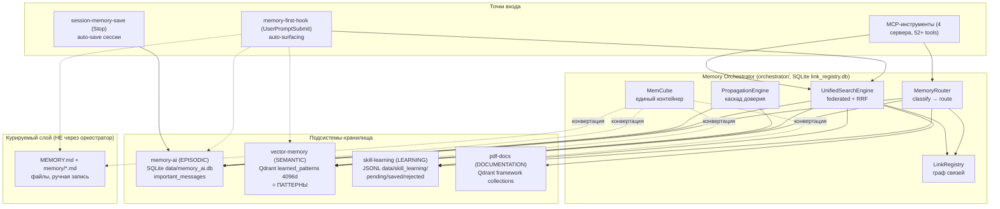
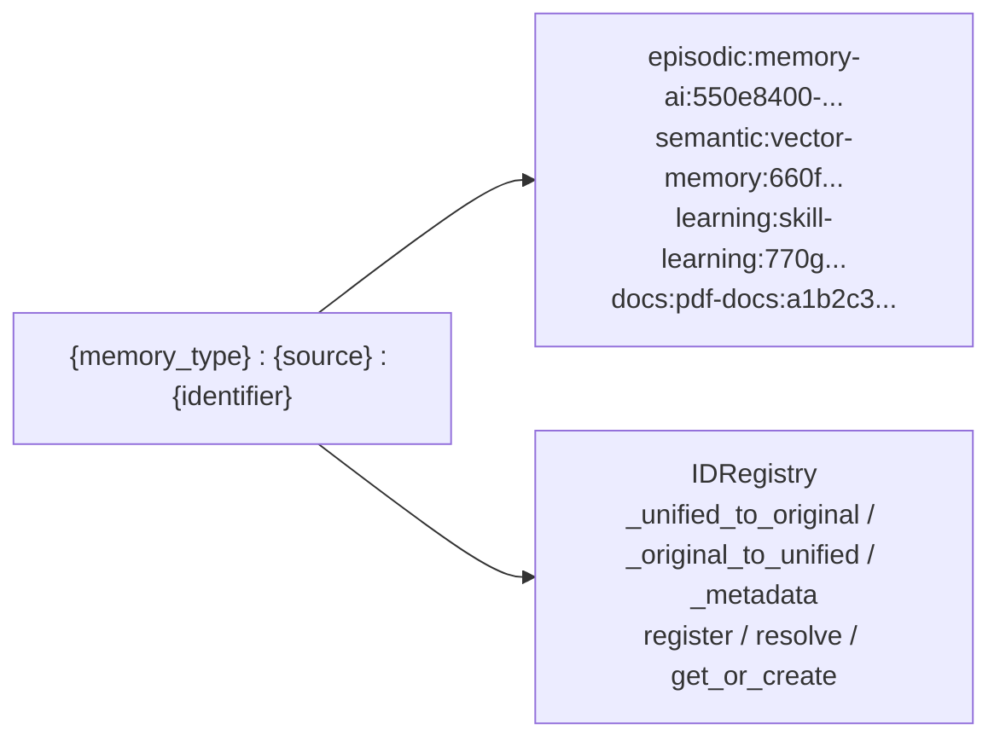
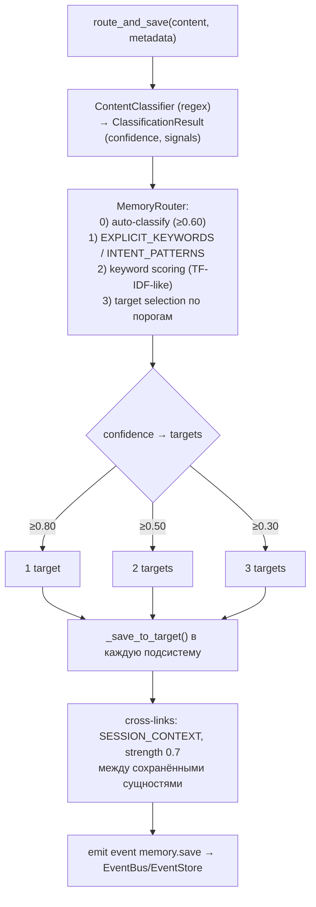
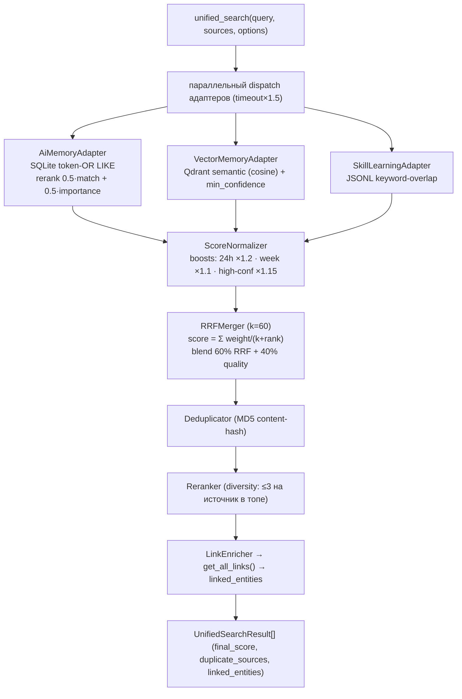
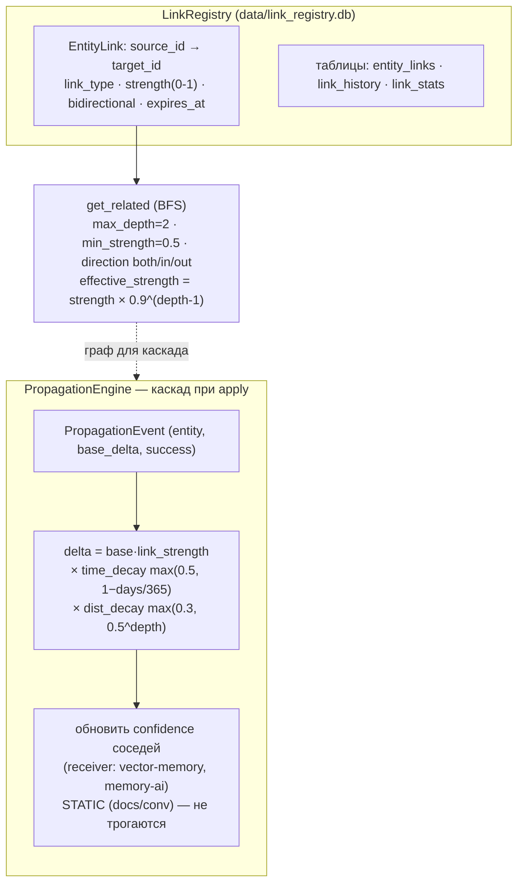
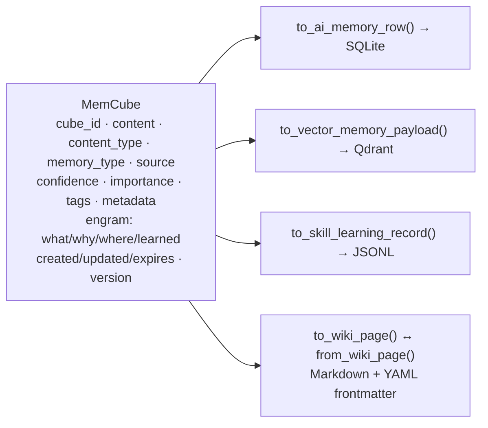
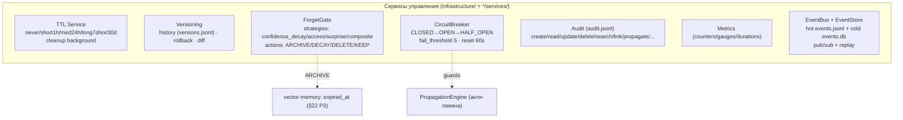
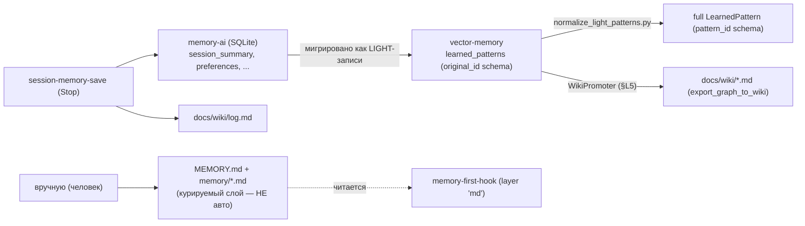

# 27.12 Карта систем памяти и потоки данных (глубокий разбор + схемы)

> Полная архитектурная карта Unified Memory System: **оркестратор + 4 подсистемы-хранилища +
> курируемый `.md`-слой + хуки**, и как данные **пишутся, читаются, связываются, мигрируют и
> затухают** между ними. Зум-аут к «большой картине» поверх per-подсистемных глав
> ([27.2 Оркестратор](27.2_Оркестратор.md), [27.5 Поиск](27.5_Поиск_и_сервисы.md),
> [27.11 Pattern Lifecycle](27.11_Pattern_Lifecycle.md)). Все факты — из кода `src/memory/`.

---

## 1. Большая картина — кто есть кто

Память — это **НЕ одно хранилище**, а федерация из нескольких независимых store'ов, объединённых оркестратором на уровне записи/поиска/связей. Плюс отдельный курируемый `.md`-слой и хуки, которые всё это «всплывают».



**Ключевой принцип:** подсистемы **не знают друг о друге** — координацию (роутинг, federated-поиск, связи, каскад) делает оркестратор. Курируемый `.md`-слой живёт **в стороне** (его читает только `memory-first-hook`, не оркестратор).

---

## 2. Хранилища — физическая карта (где что лежит)

| Подсистема | MemoryType | Backend | Физический путь | Что хранит | `.md`? |
|---|---|---|---|---|---|
| **memory-ai** | `episodic` | SQLite | `data/memory_ai.db` (таблица `important_messages`) | сообщения/факты сессий + importance | ❌ |
| **vector-memory** | `semantic` | Qdrant | `localhost:6333`, коллекция `learned_patterns` (4096d cosine) | **паттерны** (LearnedPattern) | ❌ (поле `content`) |
| **skill-learning** | `learning` | JSONL | `data/skill_learning/` (`pending/saved/rejected_patterns.jsonl`) | паттерны навыков на подтверждение | ❌ |
| **pdf-docs** | `docs` | Qdrant | framework-коллекции | документация (RAG) | ❌ |
| **Link Registry** | — | SQLite | `data/link_registry.db` (`entity_links`/`link_history`/`link_stats`) | связи между сущностями | ❌ |
| **Event Store** | — | JSONL+SQLite | `data/events.jsonl` (hot) + `data/events.db` (cold) | события шины | ❌ |
| **Курируемая память** | — | файлы | `~/.claude/projects/<...>/memory/*.md` + `MEMORY.md` | ручные заметки/feedback | ✅ **да** |

> Подытог по частому вопросу: **паттерн (`learned_patterns`) — это запись в Qdrant, НЕ `.md`.** `.md` есть только у курируемого слоя — это **отдельная система**.

---

## 3. UnifiedID — общий «адрес» сущности



- **MemoryType (6):** `episodic` · `semantic` · `learning` · `docs` · `wiki` · `graph`.
- **SourceServer (7):** `memory-ai` · `vector-memory` · `skill-learning` · `pdf-docs` · `orchestrator` · `obsidian-vault` · `lightrag`.
- `identifier` валидируется regex `^[a-zA-Z0-9_:\-]+$`. `IDRegistry` хранит двунаправленный маппинг unified↔original (источниковый id паттерна/сообщения) + метаданные.

---

## 4. WRITE — как данные ПОПАДАЮТ в память



**ContentType (7):** `FACT` · `PREFERENCE` · `RULE` · `SKILL` · `CODE` · `OBSERVATION` · `WIKI`.
**CATEGORY_TARGETS** маппит категорию → подсистему(ы). Уверенность определяет, в **сколько** хранилищ уйдёт запись (1/2/3). Прямые пути записи (минуя роутер): `save_pattern` (→ Qdrant), `save_important_message` (→ SQLite), `capture_pattern` (→ JSONL), Stop-хук `session-memory-save` (→ SQLite + `docs/wiki/log.md`).

---

## 5. READ — federated search (как данные ЧИТАЮТСЯ обратно)



**Адаптеры — паттерн «один интерфейс на подсистему»:** оркестратор не лезет в БД напрямую, каждый `BaseSearchAdapter` инкапсулирует свой store. Это позволяет добавлять/убирать подсистемы без изменения движка.

> Второй путь чтения — **surfacing** (`memory-first-hook`, §3.4 [27.11](27.11_Pattern_Lifecycle.md)): свой облегчённый RRF (k=60, плечи skill/pattern_dense/pattern_lexical) + confidence-gating + execution-cache. Он бьёт по store'ам напрямую (не через оркестратор) ради hot-path-латентности (<3s).
>
> **Deprecated 2026-06-03 (§26 Q1 ADR — [260603_ADR_Q1](../../roadmap/260603_ADR_Q1_EXPERIENCE_CONVERSATION_COLLECTIONS.md)):** Qdrant-коллекции `experience_embeddings` / `conversation_memory` и их surfacing-плечи `exp`/`conv` удалены — 0-writer коллекции, роль покрыта episodic (`memory_ai.db`) → reflection → semantic (`learned_patterns`); популяция плодила бы cross-store дубликаты (анти-цель §26). NB: класс `ConversationMemory` (SQLite chat-history API) — отдельная живая сущность, не затронут.

---

## 6. Граф связей и каскад доверия



**LinkType (10):** `based_on` · `supports` · `contradicts` · `extends` · `derives_from` · `session_context` · `promoted_to` · `superseded_by` · `mirrors` · `graph_node`.
Каскад ограничен: `max_depth=3`, `max_entities_per_event=10`, `min_delta_threshold=0.001`, дедуп событий + Circuit Breaker (защита от лавины). Связь со страхом самовозбуждения — двойной decay (время + расстояние).

---

## 7. MemCube — единый контейнер (мост между форматами)



MemCube — это «эсперанто» памяти: одна сущность, которую можно сериализовать в формат любой подсистемы (или в wiki-`.md` с секциями `## What/Why/Where/Learned`). Через него идёт миграция между store'ами. `touch()` бампает версию + timestamp; `is_expired()` — TTL.

---

## 8. Governance — жизненный цикл и защита (P4-сервисы)



§22 confidence-lifecycle ([27.9](27.9_Confidence_Lifecycle.md)) — это *частный* случай governance, встроенный прямо в vector-memory (Beta-posterior, decay-on-read, forget/revive). ForgetGate — более общий механизм с 4 стратегиями и 4 действиями.

---

## 9. Миграция и связь с курируемым `.md`-слоем



**Три разных «памяти» — не путать:**
1. **vector-memory `learned_patterns`** (Qdrant) — авто-выученные паттерны, §22 confidence.
2. **Курируемая `MEMORY.md` + `memory/*.md`** (файлы) — **ручной** слой, пишется человеком/подтверждением; авто-захват только в *черновики* `data/memory_drafts/`.
3. **memory-ai** (SQLite) — эпизодические сессии (авто, Stop-хук).
Данные **перетекают** (memory-ai → learned_patterns light → normalize → full; learned_patterns → wiki через WikiPromoter), но системы остаются разными.

---

## 10. Мастер-схема (человекочитаемая, ASCII)

```text
================================================================================
        UNIFIED MEMORY SYSTEM — карта хранилищ и потоков (одна картинка)
================================================================================

  ВХОД (запись)                  КООРДИНАЦИЯ                   ВЫХОД (чтение)
  ┌───────────────┐         ┌──────────────────────┐      ┌──────────────────┐
  │ route_and_save│────────►│  Memory Orchestrator │◄─────│ unified_search   │
  │ save_pattern  │         │  ┌────────────────┐  │      │ (federated+RRF60)│
  │ save_message  │         │  │ Router(classify│  │      └──────────────────┘
  │ capture_pattn │         │  │  →route 1/2/3) │  │      ┌──────────────────┐
  │ Stop-hook     │         │  │ Search(adapters│  │◄─────│ memory-first-hook│
  └───────────────┘         │  │  →RRF→dedup→   │  │      │ (surfacing, hot) │
                            │  │  rerank→links) │  │      └──────────────────┘
                            │  │ LinkRegistry   │  │
                            │  │ Propagation    │  │
                            │  │ MemCube (мост) │  │
                            │  └────────────────┘  │
                            └──────────┬───────────┘
            ┌──────────────────────────┼──────────────────────────┐
            ▼              ▼            ▼            ▼              ▼
   ┌──────────────┐ ┌────────────┐ ┌──────────┐ ┌──────────┐ ┌──────────────┐
   │ memory-ai    │ │vector-     │ │ skill-   │ │ pdf-docs │ │ LinkRegistry │
   │ EPISODIC     │ │ memory     │ │ learning │ │ DOCS     │ │ (граф связей)│
   │ SQLite       │ │ SEMANTIC   │ │ LEARNING │ │ Qdrant   │ │ SQLite       │
   │ memory_ai.db │ │ Qdrant     │ │ JSONL    │ │ framework│ │ link_registry│
   │ important_   │ │ learned_   │ │ pending/ │ │ collect. │ │ .db          │
   │ messages     │ │ patterns   │ │ saved/   │ │          │ │ 10 link-types│
   │              │ │ 4096d      │ │ rejected │ │          │ │ BFS get_rel  │
   └──────────────┘ │ =ПАТТЕРНЫ  │ └──────────┘ └──────────┘ └──────────────┘
        ▲           │ §22 conf   │
        │           └────────────┘
        │ мигрируют как LIGHT → normalize → FULL
        └──────────────────────────────────────┘

  ╔══════════════════════════════════════════════════════════════════════════╗
  ║  ОТДЕЛЬНО (не через оркестратор):                                          ║
  ║   • Курируемая память: MEMORY.md + memory/*.md  ← РУЧНОЙ слой, .md-файлы   ║
  ║       читается только memory-first-hook (layer 'md')                       ║
  ║   • Event Store: events.jsonl (hot) + events.db (cold) — pub/sub + replay  ║
  ╚══════════════════════════════════════════════════════════════════════════╝

  GOVERNANCE поверх всего:  TTL · Versioning · ForgetGate(archive/decay/delete)
                            · CircuitBreaker · Audit · Metrics · §22 confidence

  ПОТОКИ:
   write : вход → Router.classify → 1..3 store'а → cross-link(0.7) → event
   read  : query → adapters(parallel) → normalize → RRF(k=60) → dedup → rerank → link-enrich
   cascade: apply → Propagation(BFS, time×dist decay) → confidence соседей
   migrate: memory-ai → learned_patterns(light) → normalize(full) → wiki(promoter)
================================================================================
```

> 🎯 **Где на схеме «паттерны»:** колонка **vector-memory** (2-я слева) — строка
> `learned_patterns 4096d =ПАТТЕРНЫ §22 conf`. Это **единственный** store паттернов
> (Qdrant). Остальные 4 колонки — НЕ паттерны: `memory-ai` (эпизодические сообщения),
> `skill-learning` (паттерны навыков на подтверждение — отдельный store), `pdf-docs`
> (документация), `LinkRegistry` (граф связей). Паттерны **входят** сверху (`save_pattern`/
> `route_and_save`) и снизу (миграция `memory-ai → light → normalize → full`), **читаются**
> сверху (`unified_search` / surfacing), а их доверие (`§22 conf`) живёт в том же box'е.

### Легенда — что означает каждый блок

**ВХОД (запись) — как данные попадают в память:**
- `route_and_save` — «умная» запись: классифицирует контент и сам решает, в какие подсистемы его положить (1–3 store'а).
- `save_pattern` — прямая запись **паттерна** в vector-memory (Qdrant).
- `save_message` — прямая запись эпизодического сообщения/факта в memory-ai (SQLite).
- `capture_pattn` — захват паттерна навыка в skill-learning (JSONL, статус pending).
- `Stop-hook` — `session-memory-save`: авто-сохранение итогов сессии в memory-ai + `docs/wiki/log.md`.

**КООРДИНАЦИЯ — Memory Orchestrator (мозг, сам данные не хранит):**
- `Router` — классификатор + маршрутизатор: куда писать (по порогам уверенности 0.80/0.50/0.30).
- `Search` — federated-поиск: опрашивает все подсистемы параллельно и сливает через RRF(k=60).
- `LinkRegistry` — граф связей между сущностями (10 типов, отдельная SQLite `link_registry.db`).
- `Propagation` — каскад доверия: при `apply` обновляет confidence соседей по графу (с затуханием).
- `MemCube` — единый контейнер-«мост»: конвертирует сущность в формат любой подсистемы.

**ХРАНИЛИЩА (5 колонок) — где физически лежат данные:**
- `memory-ai` (EPISODIC) — эпизодическая память: сообщения/факты/сводки сессий. SQLite.
- `vector-memory` (SEMANTIC) — **ПАТТЕРНЫ** (`learned_patterns`), §22 confidence. Qdrant 4096d.
- `skill-learning` (LEARNING) — паттерны навыков на подтверждение (pending/saved/rejected). JSONL.
- `pdf-docs` (DOCS) — проиндексированная документация для RAG. Qdrant.
- `LinkRegistry` — не «контент», а **связи** между записями всех store'ов. SQLite.

**ВЫХОД (чтение) — как данные достаются обратно:**
- `unified_search` — явный federated-поиск по всем подсистемам (через оркестратор).
- `memory-first-hook` — авто-surfacing на каждый промпт (свой быстрый RRF + confidence-gating, мимо оркестратора ради скорости).

**ОТДЕЛЬНО (вне оркестратора):**
- `Курируемая память` — `MEMORY.md` + `memory/*.md`: **ручной** `.md`-слой (пишется человеком/подтверждением), читается только хуком.
- `Event Store` — журнал событий памяти: hot `events.jsonl` + cold `events.db`, для pub/sub и replay.

**GOVERNANCE (поверх всего) — жизненный цикл и защита:**
- `TTL` — срок жизни записи (never/1h/24h/7d/30d) + авто-очистка просроченного.
- `Versioning` — история версий записи + rollback + diff.
- `ForgetGate` — «забывание»: archive / decay / delete по стратегиям (confidence/access/surprise).
- `CircuitBreaker` — предохранитель от лавины (защищает каскад Propagation).
- `Audit` — журнал всех операций (create/read/update/delete/search/link/...).
- `Metrics` — счётчики/латентности.
- `§22 confidence` — Beta-доверие паттернов (рост при apply, decay при простое, forget/revive).

**ПОТОКИ (стрелки внизу схемы):**
- `write` — вход → Router классифицирует → 1–3 store'а → cross-link(0.7) → событие.
- `read` — запрос → адаптеры (параллельно) → нормализация → RRF(k=60) → dedup → rerank → обогащение связями.
- `cascade` — `apply` → Propagation (BFS, затухание время×расстояние) → confidence соседей.
- `migrate` — `memory-ai → learned_patterns (light) → normalize (full) → wiki (promoter)`.

### 10.1 Сквозной пример — путь ОДНОГО факта через всю карту

Проследим жизнь одного реального паттерна сверху вниз по мастер-схеме (значения — из живых логов 2026-06-05; `pattern_id = UUID5(content_hash)` — детерминированный point-id):

```text
  ФАКТ:  content_hash = 26f728e9e8eb528e
         pattern_id   = a328be68-9cdb-5513-ae7b-6ca3edd3e882   (= UUID5(content_hash))

  (1) WRITE ─ patterns-harvester (Stop-hook) намайнил session-lesson
      └─► ingest_items() → upsert в [vector-memory] (2-я колонка)
          memory-ingestion.log:
          {"event":"ingest","store":"learned_patterns","action":"saved",
           "content_hash":"26f728e9e8eb528e","pattern_id":"a328be68-…","harvester":"patterns"}
          (re-harvest того же факта → action="dup": тот же UUID5 point-id = идемпотентность)

  (2) STORE ─ [vector-memory] Qdrant point:
          id = a328be68-…  ·  vector[4096] (Qwen3/TEI)  ·  payload{
              confidence = 0.70  (Beta(7,3) prior — advisory arg игнорируется),
              succ = 0 , fail = 0 , content_hash, pattern_type, … }

  (3) READ ─ на следующий промпт memory-first-hook (surfacing, hot-path):
          3 arms {skill, pattern_dense, pattern_lexical} → RRF(k=60) → inject
          memory-first-surfacing.log:
          {"arms":{"skill":5,"pattern_dense":5,"pattern_lexical":3},"outcome":"injected","tei":"ok"}

  (4) UPDATE ─ паттерн помог → apply_pattern(success=True)  → §22 confidence ↑
          confidence-lifecycle.log:
          {"event":"apply","old_confidence":0.70,"new_confidence":0.7273}   ← (7+1)/(10+1) = 8/11
          …после 4 успехов / 1 фейла (reinforce на Stop):
          {"event":"reinforce","succ":4,"fail":1,"new_confidence":0.7333}   ← (7+4)/(10+4+1) = 11/15

  (5) EPOCH ─ любая мутация (save/apply/decay/forget) → epoch.bump()
          → confidence-epoch.txt → memory-first-hook cache-key meняется → instant cache-miss
          (закрыт 5-мин stale-window между §22 confidence и §24 surfacing)

  (6) CASCADE + GOVERNANCE
          Propagation (BFS) обновляет confidence соседей по [LinkRegistry] (5-я колонка);
          ForgetGate периодически: should_archive = eff<0.40 OR (idle>180д & eff<0.75 & не invariant)
          → сейчас eff≈0.73, не idle → KEEP (archive=0 — bounded-growth ещё не сработал)

  (7) TRACE (§27 observability) ─ весь путь восстанавливается ОДНОЙ командой:
          python scripts/memory_observability_query.py --view fact-trace \
                 --key a328be68-9cdb-5513-ae7b-6ca3edd3e882
          → треды ingestion(saved) → reinforce → (forget) по pattern_id через ВСЕ sink'и
          (content_hash тредит ingestion-сторону; pattern_id — confidence-lifecycle-сторону)
```

**Что показывает пример:** один факт пересекает 3 столбца карты — `vector-memory` (живёт), `LinkRegistry` (связи/каскад), `memory-ai` (если мигрировал как LIGHT) — и весь его жизненный цикл (write→store→read→update→forget) оставляет структурный след в sink'ах §22/§24/§26/§27. Полная сверка математики §22 и потоков — [27.11 §9.1](27.11_Pattern_Lifecycle.md). Список всех sink'ов и метрик — `scripts/memory_observability_report.py`.

### 10.2 Взаимосвязь потоков write / read / cascade / migrate (глубокий анализ)

4 потока **НЕ независимы**: они едут по **3 общим «рельсам»** и образуют **замкнутую петлю обратной связи**. Тезис: `write` создаёт субстрат, `read` его поднимает, `cascade` его укрепляет, `migrate` его переформовывает — а связывает их одна валюта (**confidence**), один граф (**LinkRegistry**) и одни часы (**epoch/events**). Константы — из кода ([`memory_router.py`](../../../src/memory/orchestrator/memory_router.py), [`unified_search.py`](../../../src/memory/orchestrator/unified_search.py), [`propagation_engine.py`](../../../src/memory/orchestrator/propagation_engine.py)).

**Рельс 1 — `§22 confidence` (общая валюта; что каждый поток с ней делает):**

| Поток | Действие над confidence |
|---|---|
| **write** | СТАВИТ prior **0.70** (Beta(7,3); advisory-arg игнорируется) |
| **read** | РАНЖИРУЕТ по **effective** (lazy decay-on-read); gate `eff<0.15→drop`, score`×max(0.30,eff)` |
| **cascade** | МУТИРУЕТ: `apply→(7+succ)/(10+succ+fail)`; соседям — `delta` (см. рельс 2) |
| **migrate** | ГЕЙТИТ: wiki-promote ⇐ `conf≥0.8 & application_count≥5`; forget archive ⇐ `eff<0.40` |

**Рельс 2 — `LinkRegistry` (общий граф, 10 link-типов; что каждый поток со связями делает):**

| Поток | Действие над связями |
|---|---|
| **write** | СОЗДАЁТ cross-link `strength=0.7` при мульти-store save (`saved_entities>1`, цепочкой) |
| **read** | ЕДЕТ по ним: `LinkEnricher` добавляет related (BFS, `effective=0.9^(depth-1)`) |
| **cascade** | ОБХОДИТ их: Propagation BFS по `FORWARD/REVERSE`-link-типам (BASED_ON/SUPPORTS/EXTENDS/DERIVES_FROM) |
| **migrate** | ДОБАВЛЯЕТ: `PROMOTED_TO` (wiki), `MIRRORS` (cross-store dedup, canonical priority `wiki>learned_patterns>skill_learning>memory_ai`) |

**Рельс 3 — `epoch` + Event Store (часы + журнал):** любая мутация (`save/apply/decay/forget`) → `epoch.bump()` → read-cache **instant miss**; любая запись → событие (`events.jsonl`) → replay/audit. Это и есть провод, по которому `cascade` бьёт обратно в `read`.

**Петля обратной связи (ядро — как 3 «быстрых» потока крутятся):**

```text
   write ──► [store: prior 0.70] ──► read (rank by effective) ──► surfaced
                                                                     │
                                                       помог? apply(success=True)
                                                                     │
                       confidence ↑  (7+succ)/(10+succ+fail) ◄───────┤
                            │                                        ▼
                            │                          cascade: Propagation BFS (depth≤3)
                            │                          обновляет confidence СОСЕДЕЙ:
                            │                          delta = base·link_strength
                            │                                 · max(0.5, 1−days/365)   (time)
                            │                                 · max(0.3, 0.5^depth)    (distance)
                            │                          rate-limit: ≤10 узлов/событие; CircuitBreaker(5 fail→OPEN)
                            ▼                                        │
                     epoch.bump() ◄──────────────────────────────────┘
                            │
                     read-cache MISS ──► СЛЕДУЮЩИЙ read видит ПЕРЕ-ранжирование  ⟲ петля замкнулась
```

**Критичный контракт `read → cascade`:** surfacing записывает всплывшие pids (`record_surfaced`) → Stop-hook `reinforce_session` → `apply` → `cascade`. Если мостик рвётся (напр. import-collision `shared.pattern_reinforce`, **починен 2026-06-05**) — петля разрывается: `read` работает, но reinforcement/cascade не идёт, confidence «замерзает» на prior. То есть `read` без рабочего `record_surfaced` — это **разомкнутая** петля.

> **Cascade-on-apply wired (2026-06-05):** до этого `apply_pattern` поднимал confidence только самого паттерна — шаг `cascade` (распространение на соседей) в автономе **не срабатывал** (это §22 P3 deferred «neighbour-aware link_registry gate»). Теперь `handle_apply_pattern` зовёт `_cascade_confidence` (`vector_memory/server.py`): depth-1, same-store, нудж Beta `succ/fail` соседей по `SUPPORTS/EXTENDS/BASED_ON/DERIVES_FROM` с декеем `link_strength×0.5×time`, bounded ≤10, fail-soft, gated `MEMORY_APPLY_CASCADE_DISABLE=1`, пишет `memory-propagation.log` + bump epoch. **⚠ No-op пока нет реальных pattern↔pattern связей** (сегодня граф `link_registry` — только тест-фикстуры; реальные связи появляются через `DERIVES_FROM`/cross-link/`MIRRORS`/`PROMOTED_TO`). MCP-side → нужен `/mcp reconnect`.

**`migrate` — ортогональная медленная ось (консолидация, НЕ в hot-loop):** запускается по cadence (Stop-hook раз в N сессий, **dry-run по умолчанию**), переформовывает субстрат — `light→full` (схема), cross-store dedup (`MIRRORS`), wiki-promote (escape в курируемый слой), forget (archive stale). Возвращается в петлю: нормализованные паттерны лучше ранжируются; promoted-wiki = новый read-источник (layer); archived выпадают из surfacing.

**Баланс сил (почему рост ограничен — bounded growth):**

```text
   РОСТ + усиление          ⇄ общая валюта ⇄          КОНСОЛИДАЦИЯ + распад
   write · read · cascade   ───  confidence  ───   migrate · forget · decay · TTL
   (добавляют/всплывают/         (apply ↑ · decay/forget ↓)     (мержат/прунят/стареют)
    укрепляют)
```

`apply` поднимает confidence, `decay`/`forget` опускают к prior/архиву — обе силы давят на одну метрику, поэтому система не растёт бесконечно. **Вывод:** изолированно ни один поток не «работа с памятью»; память — это **цикл** write→read→apply→cascade→(epoch)→read, который `migrate`+governance периодически уплотняют. Поломка любого моста (write без content_hash → read не дедупит; read без record_surfaced → cascade мёртв; cascade без epoch.bump → stale read-cache) рвёт цикл, и наблюдается это только в логах §27 (`fact-trace`, observability report).

---

## 11. §26 Ingestion & Cross-Store Sync — контракт писателя (P0)

> **Статус:** P0 в работе ([roadmap 260602](../../roadmap/260602_ROADMAP_MEMORY_INGESTION_SYNC.md)). Замыкает «асимметрию»: retrieval/governance богаты, ingestion — силосный. Базис синхронизации — **общий ключ идемпотентности**.

### 11.1 `content_hash` — общий join-ключ всех store'ов

Каждая запись несёт **`content_hash` = `sha256(content)[:16]`** — один факт хэшируется одинаково в любом store, поэтому это ключ cross-store dedup и связи «не копии».

- **Каноническая реализация (single source):** [`src/memory/orchestrator/content_hash.py`](../../../src/memory/orchestrator/content_hash.py) — `content_key(payload)` / `hash_content(text)` (приоритет `content`, fallback `description`).
- `MemoryCube` авто-проставляет `content_hash` в `__post_init__` и **протаскивает во все проекции** (`to_vector_memory_payload` / `to_ai_memory_row` / `to_skill_learning_record` / `to_wiki_page`) + `to_dict`/`from_dict` (recompute при отсутствии).
- `scripts/dedupe_learned_patterns.py:content_key` **делегирует** в канонический модуль (нет второго хэша).
- Backfill существующих точек: [`scripts/backfill_content_hash.py`](../../../scripts/backfill_content_hash.py) (dry-run by default, backup, идемпотентно). Применён к `learned_patterns` — 23/23 застемплено.

### 11.2 Per-store «писатель»-контракт

| Store | Прямой писатель | Через MemoryCube | Ключ дедупа |
|---|---|---|---|
| `learned_patterns` (Qdrant) | `save_pattern` | `to_vector_memory_payload()` | `content_hash` (payload) |
| `memory-ai` (SQLite) | `save_important_message`, Stop-хук | `to_ai_memory_row()` | `content_hash` (row) |
| `skill-learning` (JSONL) | `capture_pattern` → `confirm` | `to_skill_learning_record()` | `content_hash` (record) |
| wiki (`.md`) | `WikiPromoter` / `export_graph_to_wiki` | `to_wiki_page()` ↔ `from_wiki_page()` | `content_hash` (frontmatter) |

**Контракт:** любой новый писатель (P1-харвестеры) строит `MemoryCube` → проекция в целевой store; перед записью проверяет `content_hash` (skip-on-exists = идемпотентность). Это превращает запись из «слепого upsert» в gated ingestion.

### 11.3 Метрики ingestion → §25

Каждая попытка записи логируется через [`src/memory/orchestrator/ingest_metrics.py`](../../../src/memory/orchestrator/ingest_metrics.py) (`record_ingest(store, action, content_hash, reason)`): persistent JSONL `.claude/cache/memory-ingestion.log` (cross-process источник для §25 analyzer) + best-effort in-process counters для `memory_metrics`. Действия: `saved` / `dup` / `skipped` / `error`. Метаданные-only (без тел). Opt-out `MEMORY_INGEST_LOG_DISABLE=1`.

---

## Связанные разделы

- [27.1 Обзор](27.1_Обзор.md) · [27.2 Оркестратор](27.2_Оркестратор.md) · [27.5 Поиск и сервисы](27.5_Поиск_и_сервисы.md)
- [27.7 MCP инструменты](27.7_MCP_инструменты.md) — 52+ tools по подсистемам
- [27.9 Confidence Lifecycle](27.9_Confidence_Lifecycle.md) · [27.10 Memory Surfacing](27.10_Memory_Surfacing_Quality.md) · [27.11 Pattern Lifecycle](27.11_Pattern_Lifecycle.md)
- Skill: `memory-unified`
