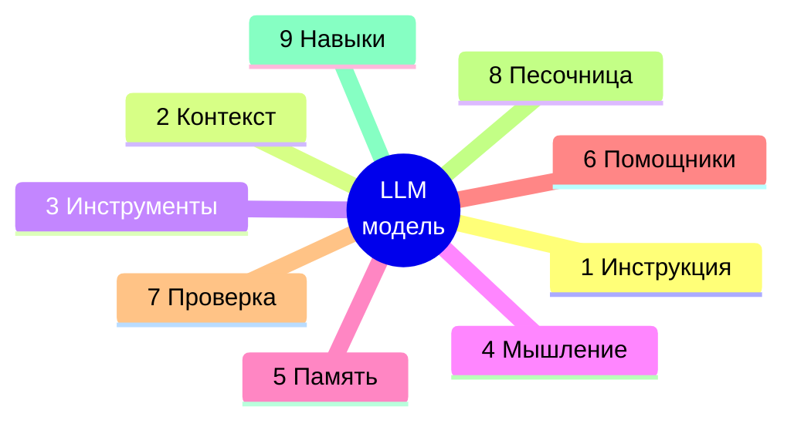

# 49. Карта Harness — системообразующая схема

> Точка входа в документацию. Сама LLM — только ядро. Всё, что превращает её в рабочего агента, — «обвязка» (harness) из 9 слоёв вокруг модели. Эта глава сводит все главы документации к 9 слоям: отвечает на вопрос «где что искать» и задаёт порядок чтения.

Образ взят из инфографики «The AI Agent Harness» (Rakesh Gohel, https://x.com/rakeshgohel01) и лёг в основу того, как организован фреймворк.

---

## Модель = ядро, harness = 9 слоёв

Модель генерирует текст и запросы к инструментам. Harness даёт контекст, инструменты, память, проверку, оркестрацию. Условные обозначения:
- **Слой** = концепция из схемы
- **Главы** = где реализовано в документации

---

## Интерактивная схема

- [harness-map.html](harness-map.html) — 9 карточек-слоёв с реальными компонентами: memory-first-hook, .mcp.json, code-verify, .claude/skills/; светлая/тёмная темы, адаптив.
- Опубликованная версия (Artifact): https://claude.ai/code/artifact/fdb471da-177c-4dd1-8bac-a2c5dfe8dc84

---

## 9 слоёв → главы документации

### 1 · Инструкция
Системный контракт задаче: правила, цель, обязательный алгоритм, поверхность команд.

| Глава | Название |
|-------|----------|
| [12](../12_ДЕКОМПОЗИЦИЯ_ЗАДАЧ/) | Декомпозиция задач (Task Protocol, классификация) |
| [24](../24_SPEC_DRIVEN_DEVELOPMENT/) | Spec-Driven Development (спека как контракт, approval-гейт) |
| [Команды](../КОМАНДЫ_CLAUDE_CODE.md) | Реестр slash-команд проекта |

### 2 · Контекст
Что подмешивается в промпт до ответа: индексация, поиск, RAG, кэш.

| Глава | Название |
|-------|----------|
| [03](../03_ИНДЕКСАЦИЯ/) | Индексация документов |
| [04](../04_ПОИСК/) | Поиск (14 стратегий, Hybrid, GraphRAG) |
| [05](../05_RAG_АГЕНТЫ/) | RAG-агенты |
| [07](../07_КЭШИРОВАНИЕ/) | Кэширование (семантический / embedding / LLM) |
| [19](../19_ИНДЕКСАЦИЯ_ПРОЕКТОВ/) | Индексация проектов (BSL / метаданные) |
| [28](../28_BSL_SEMANTIC_SEARCH/) | BSL Semantic Search |
| [28_1](../28_1_AUTO_REPORTS/) | Auto-Reports (пост-анализ качества индексации) |
| [31](../31_QWEN3_RETRIEVAL_PRODUCTION/) | Qwen3 Retrieval Production (TEI, коллекции) |
| [34](../34_KNOWLEDGE_BASE/) | Knowledge Base (коллекции документов) |
| [44](../44_ECOSYSTEM_SCAN/) | Ecosystem Scan (research в контекст, 1С/RU-поиск, ИТС) |

### 3 · Инструменты
Вызовы во внешний мир: интерфейсы, MCP-серверы, подключение 1С, отладка, медиа.

| Глава | Название |
|-------|----------|
| [06](../06_ИНТЕРФЕЙСЫ/) | Интерфейсы (REST / CLI / MCP / Python API) |
| [16](../16_ПОДКЛЮЧЕНИЕ_1С/) | Подключение к 1С (COM / RAC / MCP-серверы 1С) |
| [26](../26_LAZY_MCP/) | Lazy-MCP (on-demand загрузка серверов) |
| [35](../35_EXTENSIONS/) | Extensions (расширения и плагины) |
| [36](../36_AUTONOMOUS_DEBUG_CONTROL/) | Autonomous Debug Control (live BP-trace 1С) |
| [47](../47_SCENE_DETECT_MCP/) | Scene-Detect MCP (раскадровка видео) |
| [48](../48_ТРАНСКРИБАЦИЯ/) | Транскрибация (Whisper ASR) |

### 4 · Мышление
Планирование и рассуждение до кода: разбить задачу, спроектировать, самоулучшение.

| Глава | Название |
|-------|----------|
| [18](../18_AUTORESEARCH/) | AutoResearch (measure→change→verify) |
| [20](../20_AUTORESEARCH_V2/) | AutoResearch v2 (трёхагентный движок) |
| [22](../22_ANALYZE_1C_RESEARCH/) | Analyze-1C-Research (итеративный анализ задач) |
| [43](../43_ПАЙПЛАЙН_1С/) | Пайплайн 1С (4-этапная парадигма planning→test) |
| [45](../45_АРХИТЕКТУРА_1С/) | Архитектура 1С-решений (дизайн-шаг) |
| [46](../46_ПАТТЕРНЫ_ОРКЕСТРАЦИИ/) | Паттерны мульти-агентной оркестрации |

### 5 · Память
Сохранение фактов, опыта и выученного между сессиями.

| Глава | Название |
|-------|----------|
| [27](../27_UNIFIED_MEMORY/) | Unified Memory System |
| [32](../32_WIKI_KNOWLEDGE_LAYER/) | Wiki Knowledge Layer (L3 + L5 слои памяти) |
| [37](../37_HERMES_LLM_WIKI/) | Hermes / LLM Wiki (5-слойная модель памяти) |

### 6 · Помощники
Суб-агенты под подзадачи: делегирование, автономные циклы, ротация провайдеров.

| Глава | Название |
|-------|----------|
| [14](../14_RALPH_WIGGUM/) | Ralph Wiggum (автономный self-correcting цикл) |
| [15](../15_TOKEN_ECONOMY/) | Token Economy (делегирование Z.AI) |
| [21](../21_LLM_ROTATION/) | LLM Rotation (мульти-провайдер + fallback) |
| [23](../23_GLM_AGENT_FACTORY/) | GLM Agent Factory (маршрутизация Agent() на GLM) |

### 7 · Проверка
Верификация до завершения: качество, тесты, гейты, guardrails, мониторинг, эксплуатация.

| Глава | Название |
|-------|----------|
| [08](../08_ОЦЕНКА_КАЧЕСТВА/) | Оценка качества (RAGAS, smoke gate) |
| [09](../09_АДМИНИСТРИРОВАНИЕ/) | Администрирование (хуки, enforcement, мониторинг, deploy) |
| [10](../10_УСТРАНЕНИЕ_НЕПОЛАДОК/) | Устранение неполадок (диагностика) |
| [17](../17_ТЕСТИРОВАНИЕ_1С/) | Тестирование 1С (VA BDD + YAxUnit) |
| [30](../30_ЭФФЕКТИВНОСТЬ/) | Эффективность (роутер + enforcers + метрики) |
| [33](../33_GUARDRAILS/) | Guardrails (PII, prompt injection) |
| [39](../39_LANGFUSE/) | Langfuse Observability |
| [40](../40_PR_AUTOMATION/) | PR Automation (git-гейты, enforcers) |
| [41](../41_SUBMODULE_1C_CI/) | Submodule 1C CI |
| [42](../42_MONITOR_CI/) | Monitor CI (realtime watcher) |

### 8 · Песочница

> Отдельной главы пока нет — слой покрыт разделами: [05.6 Sandbox исполнения](../05_RAG_АГЕНТЫ/05.6_Sandbox_исполнения.md) (DryRun / LangSmith / E2B) и [37.6 Sandbox подсистема](../37_HERMES_LLM_WIKI/37.6_Sandbox_подсистема.md) (threat model, select_backend). Кандидат на выделение в самостоятельную главу.

### 9 · Навыки
Переиспользуемые процедуры: скиллы, каталог, роутинг, обучение приёмов.

| Глава | Название |
|-------|----------|
| [11](../11_СИСТЕМА_СКИЛЛОВ/) | Система скиллов (формат, router, enforcement) |
| [13](../13_ТРИАДА_HOOK_SKILL_MCP/) | Триада Hook + Skill + MCP |
| [25](../25_LEARNING_LOOP/) | Learning Loop (SEARCH → CREATE skill) |
| [29](../29_XSKILL_CONTINUOUS_LEARNING/) | XSkill Continuous Learning |

---

## Вне слоёв — введение и навигация

Эти главы описывают фреймворк целиком и служат входом, а не отдельным слоем:

| Глава | Название |
|-------|----------|
| [00](../00_СОДЕРЖАНИЕ.md) | Содержание (полное оглавление) |
| [01](../01_ОБЗОР/) | Обзор (введение, архитектура, техстек) |
| [02](../02_БЫСТРЫЙ_СТАРТ/) | Быстрый старт (установка, конфигурация, первый запуск) |

---

## Сквозные связки

Карта задаёт основной дом каждой главы. Часть глав сквозные:

- **Хуки** — соединительная ткань. Отдельного «слоя хуков» нет: хуки реализуют слои 1 (инъекция инструкций, UPS), 2 (surfacing контекста, memory-first-hook), 7 (Stop-гейты, enforcers). Устройство — главы [09](../09_АДМИНИСТРИРОВАНИЕ/), [13](../13_ТРИАДА_HOOK_SKILL_MCP/), [30](../30_ЭФФЕКТИВНОСТЬ/).

- **[13 Триада](../13_ТРИАДА_HOOK_SKILL_MCP/)** покрывает слои 3 (MCP), 9 (скиллы), 1/7 (хуки) — размещена в «Навыки».

- **[43 Пайплайн 1С](../43_ПАЙПЛАЙН_1С/)** проходит через 1 → 4 → 7 → 8 — размещён в «Мышление».

- **[27 Unified Memory](../27_UNIFIED_MEMORY/) и [32 Wiki](../32_WIKI_KNOWLEDGE_LAYER/)** — память (5), но surfacing питает и слой 2.

- **[46 Паттерны оркестрации](../46_ПАТТЕРНЫ_ОРКЕСТРАЦИИ/)** — мышление (4) о координации помощников (6).

---

## Связь с инфографикой-образом

Вторая схема образа (Production Control Plane, 8 блоков) тоже ложится на главы:

| Блок образа | Наши главы |
|-------------|-----------|
| Tool Ecosystem | 06, 16, 26 |
| Execution Layer | 09 (Docker), 08 (Sandbox 05.6/37.6) |
| Task Orchestration | 43, 46, 12 |
| Memory & Context | 27, 32, 37 |
| Feedback Loop | 25, 29, 08.4 |
| Scheduled Automation | 40, 42 (cron / CI-autopilot) |
| Session Persistence | 27.8, 37 (session bridge, HMR) |
| Agent Orchestrator | 23, 30 (routing), 27.2 (memory-orchestrator) |

---

**Источник образа:** «The AI Agent Harness», Rakesh Gohel ([@rakeshgohel01](https://x.com/rakeshgohel01)).

**Сопоставление:** 2026-07-04.
