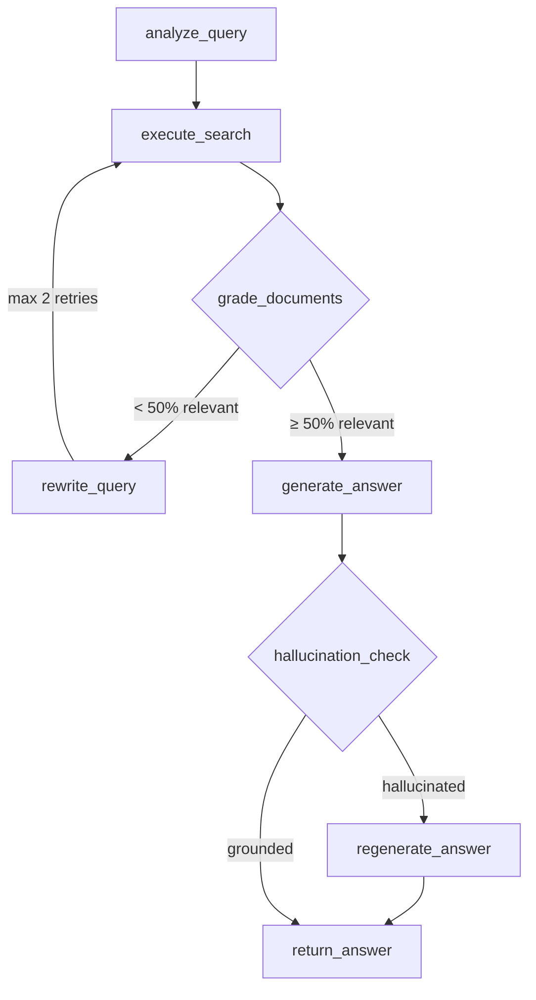

# Phase 5: Self-RAG & Corrective RAG (v0.6.0)

## Обзор

| Параметр | Значение |
|----------|----------|
| **Цель** | Агент автоматически оценивает качество извлечённых документов, переформулирует запрос при необходимости и проверяет ответ на галлюцинации |
| **Источники** | FlashRAG, LangGraph CRAG tutorial, LangChain Corrective RAG template |
| **Сложность** | Средняя |
| **Влияние** | Высокое — значительное улучшение качества ответов |
| **Ориентир. срок** | 2–3 недели |
| **Версия** | v0.6.0 |

### Концепция

**Self-RAG** (Self-Reflective Retrieval Augmented Generation) — это подход, при котором система автоматически оценивает качество извлечённых документов и собственного ответа, принимая решения о необходимости повторного поиска или регенерации. В отличие от стандартного RAG, Self-RAG добавляет "рефлексию" — агент критически оценивает свои промежуточные результаты.

**Corrective RAG (CRAG)** — расширение идеи Self-RAG, в котором при обнаружении нерелевантных документов система корректирует стратегию поиска: переформулирует запрос и/или эскалирует стратегию (vector → hybrid → two_stage). Ключевые компоненты:

1. **Document Grading** — бинарная оценка релевантности каждого документа через LLM
2. **Query Rewriting** — переформулирование запроса при низкой релевантности результатов
3. **Hallucination Checking** — проверка, что каждое утверждение в ответе подтверждено контекстом

> **Источники**: [Self-RAG: Learning to Retrieve, Generate, and Critique (Asai et al., 2023)](https://arxiv.org/abs/2310.11511), [Corrective RAG (Yan et al., 2024)](https://arxiv.org/abs/2401.15884), FlashRAG framework, LangGraph CRAG tutorial

> **Связь с LangChain**: Hallucination Check — это по сути **Guardrail** (см. `docs/documentation/Lang Chain Docs/Lang Chain/Расширенное использование/Ограждения.md`). Document Grading и Query Rewriting реализуются как кастомные LangGraph nodes, альтернативно — через `@after_model` middleware (см. `docs/documentation/Lang Chain Docs/Lang Chain/Расширенное использование/Контекстная инженерия в агентах.md`).

### Архитектура обновлённого RAG-агента



### Альтернативные подходы

| Подход | Описание | Когда использовать |
|--------|----------|-------------------|
| **LangGraph nodes** (текущий) | Кастомные узлы в StateGraph с conditional edges | Полный контроль, кастомный RAG pipeline |
| **LangChain Middleware** | `@after_model` guardrail для hallucination check | Стандартный `create_agent`, минимальная настройка |
| **Keyword-based grading** | Без LLM — оценка по TF-IDF/BM25 overlap | Бюджетный вариант, нет расходов на LLM grading |

## Предварительные требования

- **Phases 1–4 завершены** (v0.5.0)
- Существующий RAG-агент в `src/pdf_framework/agents/rag/agent.py`
- LangGraph, LangChain, ChatAnthropic установлены
- **Новых зависимостей не требуется**

## Прогресс

> **Статус:** ✅ **РЕАЛИЗОВАНО** (2025-02-07)

- [x] 5.1 — Расширение RAGState ✅
- [x] 5.2 — Document Grader node ✅
- [x] 5.3 — Query Rewriter node ✅
- [x] 5.4 — Hallucination Checker node ✅
- [x] 5.5 — Обновление графа RAG-агента ✅
- [x] Тесты и верификация ✅ (73 unit-тестов: парсеры, conditional edges, strategy escalation)
- [x] Документация обновлена ✅

### Реализованные компоненты

| Компонент | Файл | Статус |
|-----------|------|--------|
| RAGState (v0.6.0) | `src/pdf_framework/agents/rag/state.py` | ✅ |
| SelfRAGSettings | `src/pdf_framework/config.py` | ✅ |
| Document Grader | `src/pdf_framework/agents/rag/nodes/grader.py` | ✅ |
| Query Rewriter | `src/pdf_framework/agents/rag/nodes/rewriter.py` | ✅ |
| Hallucination Checker | `src/pdf_framework/agents/rag/nodes/hallucination_checker.py` | ✅ |
| RAG Agent (Self-RAG) | `src/pdf_framework/agents/rag/agent.py` | ✅ |

---

## Этап 5.1: Расширение RAGState

### Описание

Добавить новые поля в `RAGState` для поддержки грейдинга документов, подсчёта ретраев и результатов проверки галлюцинаций.

### Файлы

| Файл | Действие |
|------|----------|
| `src/pdf_framework/agents/rag/state.py` | **MODIFY** |

### Задачи

- [x] Добавить поле `retry_count: int` (default 0) — счётчик ретраев ✅
- [x] Добавить поле `max_retries: int` (default 2) — максимум ретраев ✅
- [x] Добавить поле `graded_documents: list[dict]` — результаты грейдинга ✅
- [x] Добавить поле `relevance_ratio: float` — доля релевантных документов ✅
- [x] Добавить поле `is_hallucinated: bool` — результат проверки галлюцинаций ✅
- [x] Добавить поле `generation_attempts: int` (default 0) — попытки генерации ✅

### Пример кода

```python
class RAGState(TypedDict):
    # --- Existing fields ---
    question: str
    query_type: str
    search_strategy: str
    search_response: SearchResponse | None
    context: str
    relevance_score: float
    needs_more_context: bool
    answer: str
    sources: list[str]
    error: str

    # --- Phase 5: Self-RAG ---
    retry_count: int                  # Текущий номер ретрая
    max_retries: int                  # Макс. ретраев (default 2)
    graded_documents: list[dict]      # [{chunk_id, is_relevant, reason}]
    relevance_ratio: float            # % релевантных документов
    is_hallucinated: bool             # Результат hallucination check
    generation_attempts: int          # Попытки генерации ответа
```

### Критерии готовности

- [x] RAGState содержит все новые поля ✅
- [x] Существующие поля не изменены (обратная совместимость) ✅
- [x] Новые поля имеют дефолтные значения ✅

---

## Этап 5.2: Document Grader Node

### Описание

Создать узел LangGraph, который оценивает каждый извлечённый документ на релевантность запросу. Используется binary grading через Claude Haiku (быстро, дёшево).

### Файлы

| Файл | Действие |
|------|----------|
| `src/pdf_framework/agents/rag/nodes/__init__.py` | **NEW** |
| `src/pdf_framework/agents/rag/nodes/grader.py` | **NEW** |

### Задачи

- [x] Создать директорию `nodes/` с `__init__.py` ✅
- [x] Реализовать функцию `grade_documents(state: RAGState) -> dict` ✅
- [x] Для каждого результата из `search_response.results`:
  - [x] Отправить LLM-промпт: "Is this document relevant to the query? Answer yes or no." ✅
  - [x] Записать результат в `graded_documents` ✅
- [x] Вычислить `relevance_ratio` = relevant_count / total_count ✅
- [x] Использовать Claude Haiku для экономии (быстрая модель) ✅
- [x] Обработать ошибки LLM (таймаут, rate limit) — при ошибке считать документ релевантным ✅

### Пример кода

```python
async def grade_documents(state: RAGState) -> dict:
    """Grade each retrieved document for relevance to the query."""
    question = state["question"]
    search_response = state.get("search_response")

    if not search_response or not search_response.results:
        return {"graded_documents": [], "relevance_ratio": 0.0}

    graded = []
    for result in search_response.results:
        grade = await _grade_single(question, result.chunk.content, llm)
        graded.append({
            "chunk_id": result.chunk.id,
            "is_relevant": grade,
            "content": result.chunk.content[:200],
        })

    relevant_count = sum(1 for g in graded if g["is_relevant"])
    ratio = relevant_count / len(graded) if graded else 0.0

    return {"graded_documents": graded, "relevance_ratio": ratio}
```

### Критерии готовности

- [x] Каждый документ оценивается binary (yes/no) ✅
- [x] `relevance_ratio` корректно вычисляется ✅
- [x] Ошибки LLM обрабатываются gracefully ✅
- [x] Используется быстрая модель (Haiku) для минимальной латентности ✅

---

## Этап 5.3: Query Rewriter Node

### Описание

При низкой релевантности (< 50%) — LLM переформулирует запрос и повторяет поиск. Реализует стратегию эскалации: vector → hybrid → two_stage.

### Файлы

| Файл | Действие |
|------|----------|
| `src/pdf_framework/agents/rag/nodes/rewriter.py` | **NEW** |

### Задачи

- [x] Реализовать функцию `rewrite_query(state: RAGState) -> dict` ✅
- [x] LLM-промпт: "Rewrite this query to improve search results. Original: {query}. Reason: retrieved documents were not relevant." ✅
- [x] Инкрементировать `retry_count` ✅
- [x] Реализовать стратегию эскалации:
  - [x] retry 1: сохранить текущую стратегию, переписать запрос ✅
  - [x] retry 2: эскалировать стратегию (vector → hybrid → two_stage) ✅
- [x] Вернуть обновлённый `question` и `search_strategy` ✅
- [x] Логировать каждый rewrite для debugging ✅

### Пример кода

```python
STRATEGY_ESCALATION = {
    "vector": "hybrid",
    "hybrid": "two_stage",
    "two_stage": "two_stage",  # max level
    "mmr": "hybrid",
    "graph": "hybrid",
}

async def rewrite_query(state: RAGState) -> dict:
    """Rewrite the query and optionally escalate search strategy."""
    retry_count = state.get("retry_count", 0) + 1
    current_strategy = state.get("search_strategy", "vector")

    # Rewrite query via LLM
    rewritten = await _rewrite_via_llm(state["question"], llm)

    # Escalate strategy on second retry
    new_strategy = current_strategy
    if retry_count >= 2:
        new_strategy = STRATEGY_ESCALATION.get(current_strategy, "hybrid")

    return {
        "question": rewritten,
        "search_strategy": new_strategy,
        "retry_count": retry_count,
    }
```

### Критерии готовности

- [x] Запрос переформулируется через LLM ✅
- [x] `retry_count` инкрементируется ✅
- [x] Стратегия эскалируется на 2-м ретрае ✅
- [x] Не более `max_retries` ретраев (предотвращение зацикливания) ✅

---

## Этап 5.4: Hallucination Checker Node

### Описание

После генерации ответа — проверить, что каждое утверждение обосновано контекстом. При обнаружении галлюцинации — регенерировать ответ с более строгим промптом.

### Файлы

| Файл | Действие |
|------|----------|
| `src/pdf_framework/agents/rag/nodes/hallucination_checker.py` | **NEW** |

### Задачи

- [x] Реализовать функцию `check_hallucination(state: RAGState) -> dict` ✅
- [x] LLM-промпт: "Is every claim in this answer supported by the provided context? Answer yes or no, and explain." ✅
- [x] Парсить binary ответ (yes/no) → `is_hallucinated` ✅
- [x] Реализовать функцию `regenerate_answer(state: RAGState) -> dict` ✅
  - [x] Более строгий промпт: "Answer ONLY using the provided context. Do NOT add any information not present in the context." ✅
  - [x] Инкрементировать `generation_attempts` ✅
- [x] Максимум 1 регенерация (чтобы избежать зацикливания) ✅

### Пример кода

```python
async def check_hallucination(state: RAGState) -> dict:
    """Check if the answer is grounded in the retrieved context."""
    answer = state.get("answer", "")
    context = state.get("context", "")

    if not answer or not context:
        return {"is_hallucinated": False}

    prompt = f"""Given the context and answer below, determine if every claim
    in the answer is supported by the context.

    Context: {context}
    Answer: {answer}

    Is the answer fully grounded? Reply 'yes' or 'no'."""

    response = await llm.ainvoke([HumanMessage(content=prompt)])
    text = parser.invoke(response).strip().lower()

    return {"is_hallucinated": "no" in text}
```

### Критерии готовности

- [x] Ответ проверяется на обоснованность контекстом ✅
- [x] При галлюцинации — регенерация с более строгим промптом ✅
- [x] Максимум 1 попытка регенерации ✅
- [x] Результат проверки логируется ✅

---

## Этап 5.5: Обновление графа RAG-агента

### Описание

Интегрировать все новые узлы в существующий LangGraph RAG-агент. Заменить простую логику evaluate_results → should_retry на полноценный Self-RAG пайплайн.

### Файлы

| Файл | Действие |
|------|----------|
| `src/pdf_framework/agents/rag/agent.py` | **MODIFY** |
| `src/pdf_framework/config.py` | **MODIFY** — добавить SelfRAGSettings |

### Задачи

- [x] Импортировать новые node-функции из `nodes/` ✅
- [x] Заменить узел `evaluate` на `grade_documents` ✅
- [x] Добавить узел `rewrite_query` ✅
- [x] Добавить узел `hallucination_check` после `generate_answer` ✅
- [x] Добавить узел `regenerate_answer` ✅
- [x] Реализовать conditional edges:
  - [x] `grade_documents` → `rewrite_query` (если `relevance_ratio < 0.5` И `retry_count < max_retries`) ✅
  - [x] `grade_documents` → `generate_answer` (если `relevance_ratio >= 0.5`) ✅
  - [x] `hallucination_check` → `regenerate_answer` (если `is_hallucinated` И `generation_attempts < 1`) ✅
  - [x] `hallucination_check` → END (если не hallucinated) ✅
- [x] Добавить `SelfRAGSettings` в `config.py`:
  - [x] `relevance_threshold: float = 0.5` ✅
  - [x] `max_retries: int = 2` ✅
  - [x] `hallucination_check_enabled: bool = True` ✅
  - [x] `grading_model: str = "claude-haiku-4-5-20251001"` ✅
- [x] Обновить `Components` для передачи новых настроек ✅
- [x] Сохранить обратную совместимость: если Self-RAG отключён → старое поведение ✅

### Пример обновлённого графа

```python
graph = StateGraph(RAGState)

graph.add_node("analyze", analyze_query)
graph.add_node("search", execute_search)
graph.add_node("grade", grade_documents)         # NEW
graph.add_node("rewrite", rewrite_query)          # NEW
graph.add_node("generate", generate_answer)
graph.add_node("hallucinate_check", check_hallucination)  # NEW
graph.add_node("regenerate", regenerate_answer)           # NEW

graph.set_entry_point("analyze")
graph.add_edge("analyze", "search")
graph.add_edge("search", "grade")

graph.add_conditional_edges("grade", should_rewrite_or_generate, {
    "rewrite": "rewrite",
    "generate": "generate",
})
graph.add_edge("rewrite", "search")
graph.add_edge("generate", "hallucinate_check")

graph.add_conditional_edges("hallucinate_check", should_regenerate, {
    "regenerate": "regenerate",
    "end": END,
})
graph.add_edge("regenerate", END)
```

### Критерии готовности

- [x] Граф компилируется без ошибок ✅
- [x] Self-RAG цикл (grade → rewrite → search) работает ✅
- [x] Hallucination check срабатывает после генерации ✅
- [x] Максимум ретраев ограничен (нет зацикливания) ✅
- [x] При отключении Self-RAG → старое поведение сохраняется ✅
- [x] CLI команда `ask` работает с новым агентом ✅ (--verbose, --no-self-rag)

---

## Конфигурация (.env)

```ini
# Phase 5: Self-RAG & Corrective RAG
SELF_RAG__RELEVANCE_THRESHOLD=0.5
SELF_RAG__MAX_RETRIES=2
SELF_RAG__HALLUCINATION_CHECK_ENABLED=true
SELF_RAG__GRADING_MODEL=claude-haiku-4-5-20251001
```

## CLI команды

```bash
# Существующие команды работают как прежде (с улучшенным агентом):
pdf-framework ask "Что такое 1С Предприятие?"

# Отключить Self-RAG (если нужно):
# SELF_RAG__HALLUCINATION_CHECK_ENABLED=false в .env
```

## Верификация

```bash
# 1. Проверить, что RAG-агент работает с Self-RAG
pdf-framework ask "Что такое конфигуратор в 1С?"

# 2. Проверить грейдинг (должен быть в логах)
pdf-framework ask "Несуществующая тема XYZ" --verbose

# 3. Проверить evaluation (Phase 4)
pdf-framework eval data/eval/sample_dataset.json --strategy vector
```

### Ожидаемый output (--verbose)

```
$ pdf-framework ask "Что такое конфигуратор?" --verbose

[SEARCH] Strategy: vector, query: "Что такое конфигуратор?"
[SEARCH] Found 5 results

[GRADE] Document 1 (score=0.89): relevant ✓
[GRADE] Document 2 (score=0.76): relevant ✓
[GRADE] Document 3 (score=0.42): not relevant ✗
[GRADE] Document 4 (score=0.81): relevant ✓
[GRADE] Document 5 (score=0.55): relevant ✓
[GRADE] Relevance ratio: 0.80 (threshold: 0.50) → proceed to generation

[GENERATE] Generating answer from 4 relevant documents...

[HALLUCINATION] Checking answer groundedness...
[HALLUCINATION] Result: grounded ✓

Answer: Конфигуратор — это среда разработки в платформе 1С:Предприятие...
Sources: [doc1.pdf:p.15, doc2.pdf:p.42, doc4.pdf:p.8]
```

```
$ pdf-framework ask "Квантовая физика в 1С" --verbose

[SEARCH] Strategy: vector, query: "Квантовая физика в 1С"
[SEARCH] Found 5 results

[GRADE] Document 1: not relevant ✗
[GRADE] Document 2: not relevant ✗
[GRADE] Document 3: not relevant ✗
[GRADE] Document 4: relevant ✓
[GRADE] Document 5: not relevant ✗
[GRADE] Relevance ratio: 0.20 (threshold: 0.50) → rewriting query (retry 1/2)

[REWRITE] Original: "Квантовая физика в 1С"
[REWRITE] Rewritten: "Физические процессы моделирование 1С"
[REWRITE] Strategy: vector (unchanged)

[SEARCH] Strategy: vector, query: "Физические процессы моделирование 1С"
[SEARCH] Found 5 results

[GRADE] Relevance ratio: 0.40 → rewriting query (retry 2/2)
[REWRITE] Strategy escalated: vector → hybrid

[SEARCH] Strategy: hybrid, query: "..."
[GRADE] Relevance ratio: 0.60 → proceed to generation

[GENERATE] Generating answer...
[HALLUCINATION] Result: grounded ✓

Answer: В документации 1С нет прямого упоминания квантовой физики...
```

## Связанные файлы

| Файл | Действие | Статус | Описание |
|------|----------|--------|----------|
| `src/pdf_framework/agents/rag/state.py` | **MODIFY** | ✅ | RAGState с Self-RAG полями |
| `src/pdf_framework/agents/rag/nodes/__init__.py` | **NEW** | ✅ | Package init |
| `src/pdf_framework/agents/rag/nodes/grader.py` | **NEW** | ✅ | Document Grader |
| `src/pdf_framework/agents/rag/nodes/rewriter.py` | **NEW** | ✅ | Query Rewriter |
| `src/pdf_framework/agents/rag/nodes/hallucination_checker.py` | **NEW** | ✅ | Hallucination Check |
| `src/pdf_framework/agents/rag/agent.py` | **MODIFY** | ✅ | RAG Agent с Self-RAG графом |
| `src/pdf_framework/config.py` | **MODIFY** | ✅ | SelfRAGSettings |
| `src/cli/main.py` | **MODIFY** | ✅ | CLI ask с Self-RAG агентом |
| `tests/test_self_rag/test_parsers.py` | **NEW** | ✅ | Unit-тесты парсеров (44 теста) |
| `tests/test_self_rag/test_conditional_edges.py` | **NEW** | ✅ | Unit-тесты conditional edges (20 тестов) |
| `tests/test_self_rag/test_strategy_escalation.py` | **NEW** | ✅ | Unit-тесты эскалации стратегий (7 тестов) |

## Связанная документация

| Документ | Связь с Phase 5 |
|----------|-----------------|
| [Ограждения](../documentation/Lang%20Chain%20Docs/Lang%20Chain/Расширенное%20использование/Ограждения.md) | Hallucination Check = Guardrail паттерн, `@after_model` middleware |
| [Контекстная инженерия](../documentation/Lang%20Chain%20Docs/Lang%20Chain/Расширенное%20использование/Контекстная%20инженерия%20в%20агентах.md) | Управление контекстом модели, lifecycle context |
| [Кратковременная память](../documentation/Lang%20Chain%20Docs/Lang%20Chain/Основные%20компоненты/Кратковременная%20память.md) | State management, RAGState как кратковременная память агента |
| [Агенты](../documentation/Lang%20Chain%20Docs/Lang%20Chain/Основные%20компоненты/Агенты.md) | ReAct loop, structured output, middleware pattern |
| [Стриминг](../documentation/Lang%20Chain%20Docs/Lang%20Chain/Основные%20компоненты/Стриминг/Обзор.md) | `stream_mode="updates"` для отображения прогресса grading |
