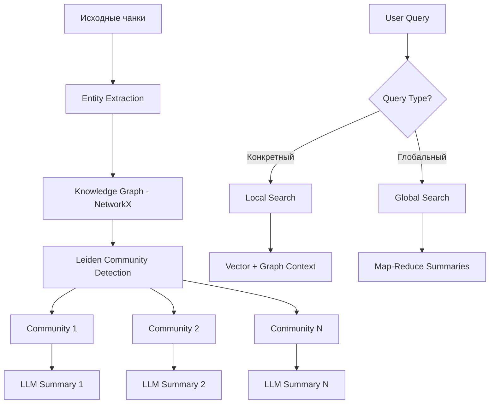

# Phase 6: GraphRAG — Community Detection & Global Search (v0.7.0)

## Обзор

| Параметр | Значение |
|----------|----------|
| **Цель** | Превратить NetworkX-граф в полноценный GraphRAG с Leiden communities, Local/Global Search |
| **Источники** | Microsoft GraphRAG, LightRAG, Kotaemon |
| **Сложность** | Высокая |
| **Влияние** | Высокое — кардинальное улучшение graph-enhanced retrieval |
| **Ориентир. срок** | 4–6 недель |
| **Версия** | v0.7.0 |

### Концепция

**GraphRAG** (Graph-based Retrieval Augmented Generation) — подход Microsoft Research, который организует документы в граф знаний с выделением сообществ (communities) для более глубокого понимания тем. В отличие от стандартного vector search, GraphRAG позволяет отвечать на "глобальные" вопросы ("О чём этот набор документов?"), которые невозможны при поиске по отдельным чанкам.

Ключевые компоненты:
1. **Community Detection** — алгоритм Leiden выделяет тематические кластеры в графе знаний
2. **Community Summaries** — LLM генерирует резюме для каждого кластера
3. **Local Search** — vector search + обогащение контекста из графа (соседние сущности)
4. **Global Search** — map-reduce по всем community summaries для ответа на широкие вопросы

> **Источники**: [From Local to Global: A Graph RAG Approach (Microsoft, 2024)](https://arxiv.org/abs/2404.16130), [microsoft/graphrag](https://github.com/microsoft/graphrag), [graspologic](https://github.com/microsoft/graspologic)

> **Связь с LangChain**: GraphRAG использует NetworkX для хранения графа (не Neo4j), что совпадает с подходом LangChain для lightweight graph operations. Community detection через graspologic — внешняя зависимость, не входящая в LangChain.

### Архитектура GraphRAG



### Альтернативные подходы

| Подход | Описание | Когда использовать |
|--------|----------|-------------------|
| **Leiden + NetworkX** (текущий) | graspologic для community detection | Средние графы (< 100K nodes), без внешних DB |
| **Neo4j + GDS** | Neo4j Graph Data Science для clustering | Большие графы, production, distributed |
| **LightRAG incremental** | Инкрементальное обновление графа | Частые обновления документов |

## Предварительные требования

- **Phase 5 завершена** (Self-RAG)
- Существующий граф-store: `src/pdf_framework/graph_store/providers/networkx_store.py`
- Существующий entity extractor: `src/pdf_framework/processing/entity_extractor.py`
- **Новые зависимости:**
  - `graspologic` — Leiden community detection (альтернатива: `leidenalg`)

## Прогресс

> **Статус:** 🚧 **В РАЗРАБОТКЕ** (2025-02-07)

- [x] 6.1 — Leiden Community Detection ✅
- [x] 6.2 — Community Summaries ✅
- [x] 6.3 — Local Search (граф-усиленный vector search) ✅
- [x] 6.4 — Global Search (map-reduce по сообществам) ✅
- [x] 6.5 — Incremental Graph Updates ✅
- [x] 6.6 — Регистрация стратегий, CLI, конфигурация ✅
- [ ] Тесты и верификация (TODO)
- [x] Документация обновлена ✅

### Реализованные компоненты

| Компонент | Файл | Статус |
|-----------|------|--------|
| CommunityDetector | `src/pdf_framework/graph_store/community.py` | ✅ |
| CommunitySummarizer | `src/pdf_framework/graph_store/summarizer.py` | ✅ |
| GraphRAGLocalStrategy | `src/pdf_framework/search/strategies/graphrag_local.py` | ✅ |
| GraphRAGGlobalStrategy | `src/pdf_framework/search/strategies/graphrag_global.py` | ✅ |
| IncrementalGraphUpdater | `src/pdf_framework/graph_store/incremental.py` | ✅ |
| GraphRAGSettings | `src/pdf_framework/config.py` | ✅ |

---

## Этап 6.1: Leiden Community Detection

### Описание

Применить алгоритм Leiden для обнаружения кластеров (сообществ) в NetworkX-графе. Каждая сущность получает `community_id` и `community_level`.

### Файлы

| Файл | Действие |
|------|----------|
| `src/pdf_framework/graph_store/community.py` | **NEW** |

### Задачи

- [ ] Установить `graspologic` (`uv pip install graspologic`)
- [ ] Реализовать класс `CommunityDetector`:
  - [ ] `detect(graph: nx.DiGraph, resolution: float = 1.0) -> dict[str, int]` — entity_id → community_id
  - [ ] `detect_hierarchical(graph, levels: int = 3) -> list[dict[str, int]]` — многоуровневое обнаружение
- [ ] Конвертировать NetworkX DiGraph → undirected для Leiden (Leiden работает на undirected)
- [ ] Сохранить `community_id` и `community_level` как атрибуты узлов в NetworkX
- [ ] Обработать edge case: граф без рёбер, одиночные узлы, disconnected components
- [ ] Логировать результат: "Detected N communities at level L"

### Пример кода

```python
from graspologic.partition import leiden

class CommunityDetector:
    def detect(self, graph: nx.DiGraph, resolution: float = 1.0) -> dict[str, int]:
        undirected = graph.to_undirected()
        partition = leiden(undirected, resolution=resolution)
        # partition: dict[node_id -> community_id]
        return partition

    def detect_hierarchical(self, graph: nx.DiGraph, levels: int = 3):
        results = []
        for level in range(levels):
            resolution = 1.0 * (2 ** level)  # higher resolution = more communities
            partition = self.detect(graph, resolution)
            results.append(partition)
        return results
```

### Критерии готовности

- [ ] Leiden алгоритм корректно обнаруживает сообщества
- [ ] Многоуровневое обнаружение работает (минимум 2 уровня)
- [ ] Результаты сохраняются в атрибутах узлов NetworkX
- [ ] Пустой граф и edge cases обрабатываются без ошибок

---

## Этап 6.2: Community Summaries

### Описание

Для каждого сообщества генерировать LLM-резюме: какие сущности входят, какие связи, основные темы.

### Файлы

| Файл | Действие |
|------|----------|
| `src/pdf_framework/graph_store/summarizer.py` | **NEW** |

### Задачи

- [ ] Реализовать класс `CommunitySummarizer`:
  - [ ] `summarize(community_entities: list[Entity], community_relations: list[Relation]) -> str`
  - [ ] `summarize_all(graph, communities: dict) -> dict[int, str]` — community_id → summary
- [ ] LLM-промпт: "Summarize this group of entities and their relationships. Entities: [...]. Relations: [...]. Provide a 2-3 sentence summary of the main themes."
- [ ] Хранить резюме как узлы типа `COMMUNITY` в NetworkX-графе:
  - [ ] node type: `COMMUNITY`
  - [ ] атрибуты: `summary`, `level`, `entity_count`, `entity_ids`
- [ ] Связать community-узлы с entity-узлами через рёбра `BELONGS_TO`
- [ ] Кэшировать резюме (не пересоздавать если сообщество не изменилось)
- [ ] Батчевая генерация: group communities для параллельного вызова LLM

### Критерии готовности

- [ ] Для каждого сообщества генерируется осмысленное резюме
- [ ] Резюме хранятся в графе как узлы COMMUNITY
- [ ] Иерархические уровни поддерживаются
- [ ] Кэш предотвращает повторную генерацию

---

## Этап 6.3: Local Search (граф-усиленный vector search)

### Описание

При извлечении чанков через ChromaDB — дополнительно извлечь связанные сущности и их отношения из NetworkX и добавить граф-контекст к промпту LLM.

### Файлы

| Файл | Действие |
|------|----------|
| `src/pdf_framework/search/strategies/graphrag_local.py` | **NEW** |

### Задачи

- [ ] Реализовать `GraphRAGLocalStrategy` (наследник базовой стратегии):
  - [ ] `async def search(query, k, filter, **kwargs) -> SearchResponse`
- [ ] Алгоритм:
  - [ ] Шаг 1: Vector search → top-k чанков (через VectorSearchStrategy)
  - [ ] Шаг 2: Извлечь имена сущностей из текста чанков (NER или regex)
  - [ ] Шаг 3: Для каждой сущности → `graph_store.find_entities(name)` → `get_neighbors(depth=1)`
  - [ ] Шаг 4: Сформировать граф-контекст: "Related entities: X --[relation]--> Y"
  - [ ] Шаг 5: Добавить граф-контекст к metadata каждого SearchResult
- [ ] Добавить граф-контекст к community summary (если entity принадлежит сообществу)
- [ ] Зарегистрировать стратегию `graphrag_local` в SearchManager

### Критерии готовности

- [ ] Vector search обогащается граф-контекстом
- [ ] Сущности корректно извлекаются из чанков
- [ ] Соседние сущности и их связи включаются в контекст
- [ ] Стратегия зарегистрирована и доступна через CLI

---

## Этап 6.4: Global Search (map-reduce по сообществам)

### Описание

Для широких/тематических вопросов — map-reduce по резюме сообществ вместо поиска по отдельным чанкам.

### Файлы

| Файл | Действие |
|------|----------|
| `src/pdf_framework/search/strategies/graphrag_global.py` | **NEW** |

### Задачи

- [ ] Реализовать `GraphRAGGlobalStrategy`:
  - [ ] `async def search(query, k, filter, **kwargs) -> SearchResponse`
- [ ] Алгоритм Map-Reduce:
  - [ ] Map: для каждого community summary → LLM: "Based on this community summary, provide relevant information for the query: {query}"
  - [ ] Фильтрация: отбросить пустые/нерелевантные частичные ответы
  - [ ] Reduce: объединить все частичные ответы → LLM: "Synthesize these partial answers into a comprehensive response"
- [ ] Оптимизация: ранжировать сообщества по embedding-similarity с запросом, обрабатывать только top-N
- [ ] Вернуть результат как SearchResponse с `source: "global"`
- [ ] Зарегистрировать стратегию `global` в SearchManager

### Критерии готовности

- [ ] Map-reduce по сообществам работает
- [ ] Широкие вопросы ("О чём эти документы?") получают осмысленные ответы
- [ ] Только релевантные сообщества обрабатываются (оптимизация)
- [ ] Стратегия зарегистрирована как `global`

---

## Этап 6.5: Incremental Graph Updates

### Описание

Добавлять новые документы в граф без полной переиндексации. Merge новых сущностей с существующими, обновить только затронутые сообщества.

### Файлы

| Файл | Действие |
|------|----------|
| `src/pdf_framework/graph_store/incremental.py` | **NEW** |
| `src/pdf_framework/graph_store/providers/networkx_store.py` | **MODIFY** |

### Задачи

- [ ] Реализовать класс `IncrementalGraphUpdater`:
  - [ ] `async def update(new_entities, new_relations, graph_store) -> UpdateResult`
- [ ] Merge-логика для сущностей:
  - [ ] Поиск существующей сущности по (name, entity_type)
  - [ ] Если найдена → merge source_chunk_ids, обновить properties
  - [ ] Если нет → добавить как новую
- [ ] Определить затронутые сообщества (сообщества, в которые попали новые сущности)
- [ ] Пересчитать community detection только для затронутых подграфов
- [ ] Регенерировать резюме только для изменённых сообществ
- [ ] Вернуть `UpdateResult`: new_entities, merged_entities, affected_communities

### Критерии готовности

- [ ] Новые документы добавляются инкрементально
- [ ] Существующие сущности корректно мержатся
- [ ] Пересчёт сообществ минимальный (только затронутые)
- [ ] Резюме обновляются для изменённых сообществ

---

## Этап 6.6: Регистрация стратегий, CLI, конфигурация

### Описание

Зарегистрировать новые стратегии в SearchManager, добавить CLI-опции и настройки.

### Файлы

| Файл | Действие |
|------|----------|
| `src/pdf_framework/config.py` | **MODIFY** |
| `src/api/dependencies/components.py` | **MODIFY** |
| `src/cli/main.py` | **MODIFY** |

### Задачи

- [ ] Добавить `GraphRAGSettings` в `config.py`:
  - [ ] `community_detection_enabled: bool = True`
  - [ ] `leiden_resolution: float = 1.0`
  - [ ] `community_levels: int = 2`
  - [ ] `global_search_max_communities: int = 20`
- [ ] Зарегистрировать стратегии в Components:
  - [ ] `graphrag_local` → `GraphRAGLocalStrategy`
  - [ ] `global` → `GraphRAGGlobalStrategy`
- [ ] Обновить CLI:
  - [ ] `--strategy graphrag_local` — граф-усиленный vector search
  - [ ] `--strategy global` — global search по сообществам
  - [ ] `pdf-framework index doc.pdf --graph --communities` — с обнаружением сообществ
- [ ] Обновить MCP-сервер: добавить стратегии в `search_documents`
- [ ] Обновить REST API: добавить стратегии в `/search/`

### Критерии готовности

- [ ] Все новые стратегии доступны через CLI, API, MCP
- [ ] Конфигурация через `.env` работает
- [ ] Документация обновлена

---

## Конфигурация (.env)

```ini
# Phase 6: GraphRAG
GRAPHRAG__COMMUNITY_DETECTION_ENABLED=true
GRAPHRAG__LEIDEN_RESOLUTION=1.0
GRAPHRAG__COMMUNITY_LEVELS=2
GRAPHRAG__GLOBAL_SEARCH_MAX_COMMUNITIES=20
```

## CLI команды

```bash
# Индексация с community detection
pdf-framework index doc.pdf --graph --communities

# Local Search (vector + graph context)
pdf-framework search "OpenAI GPT" --strategy graphrag_local

# Global Search (map-reduce по сообществам)
pdf-framework search "Какие основные темы документов?" --strategy global
```

## Верификация

```bash
# 1. Индексация с графом и community detection
pdf-framework index data/pdfs/test.pdf --graph --communities

# 2. Проверить статистику
pdf-framework stats
# → Graph: N entities, M relations, K communities

# 3. Local search
pdf-framework search "OpenAI" --strategy graphrag_local

# 4. Global search
pdf-framework search "О чём эти документы?" --strategy global
```

### Ожидаемый output

```
$ pdf-framework search "Какие основные темы документации?" --strategy graphrag_global

[GLOBAL SEARCH] Processing 12 community summaries...
[GLOBAL SEARCH] Map phase: generating partial answers from each community
[GLOBAL SEARCH] Reduce phase: combining into final answer

Answer: Документация охватывает следующие основные темы:
1. Архитектура платформы 1С:Предприятие (Community 1, 15 entities)
2. Язык программирования 1С (Community 2, 23 entities)
3. Администрирование и настройка (Community 3, 8 entities)
Sources: [community_1_summary, community_2_summary, community_3_summary]
```

## Связанные файлы

| Файл | Действие | Описание |
|------|----------|----------|
| `src/pdf_framework/graph_store/community.py` | **NEW** | Leiden community detection |
| `src/pdf_framework/graph_store/summarizer.py` | **NEW** | Community summaries via LLM |
| `src/pdf_framework/graph_store/incremental.py` | **NEW** | Incremental graph updates |
| `src/pdf_framework/search/strategies/graphrag_local.py` | **NEW** | Local Search strategy |
| `src/pdf_framework/search/strategies/graphrag_global.py` | **NEW** | Global Search strategy |
| `src/pdf_framework/graph_store/providers/networkx_store.py` | **MODIFY** | Community attributes |
| `src/pdf_framework/config.py` | **MODIFY** | GraphRAGSettings |
| `src/api/dependencies/components.py` | **MODIFY** | Register strategies |
| `src/cli/main.py` | **MODIFY** | CLI options |

## Связанная документация

| Документ | Связь с Phase 6 |
|----------|-----------------|
| [Агенты](../documentation/Lang%20Chain%20Docs/Lang%20Chain/Основные%20компоненты/Агенты.md) | Паттерн агентов для map-reduce в Global Search |
| [Контекстная инженерия](../documentation/Lang%20Chain%20Docs/Lang%20Chain/Расширенное%20использование/Контекстная%20инженерия%20в%20агентах.md) | Обогащение контекста модели данными из графа |
| [Многоагентный](../documentation/Lang%20Chain%20Docs/Lang%20Chain/Расширенное%20использование/Многоагентный/Многоагентный.md) | Map-reduce = multi-agent pattern |
