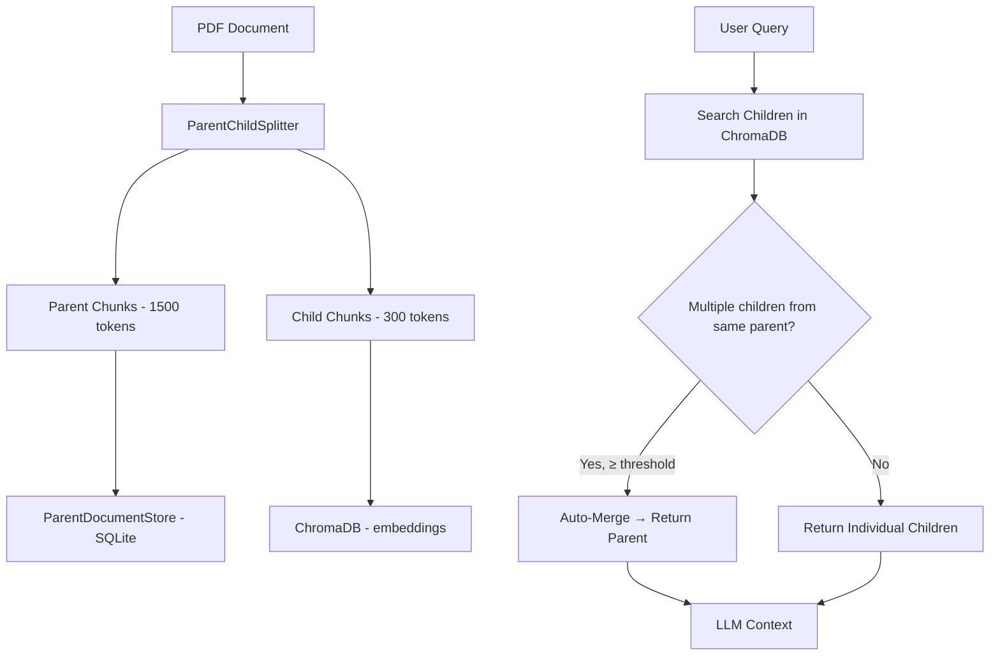

# Phase 7: Parent-Child Retrieval & Auto-Merging (v0.8.0)

## Обзор

| Параметр | Значение |
|----------|----------|
| **Цель** | Индексировать маленькие чанки для точного поиска, но возвращать большие родительские контексты |
| **Источники** | LlamaIndex AutoMergingRetriever, LangChain ParentDocumentRetriever |
| **Сложность** | Низкая–Средняя |
| **Влияние** | Высокое — лучший баланс precision/context |
| **Ориентир. срок** | 2–3 недели |
| **Версия** | v0.8.0 |

### Концепция

**Parent-Child Retrieval** — стратегия двухуровневого разбиения документов, при которой для поиска используются мелкие чанки (children), но в контекст LLM подаются крупные фрагменты (parents). Это решает ключевой компромисс RAG: мелкие чанки дают точный поиск, но теряют контекст; крупные чанки сохраняют контекст, но снижают precision.

**Auto-Merging Retrieval** — расширение подхода: если несколько child-чанков одного parent оказались релевантны, они автоматически "сливаются" обратно в parent, обеспечивая широкий контекст.

Ключевые компоненты:
1. **ParentChildSplitter** — двухуровневое разбиение: parent (1500 tokens) -> children (300 tokens)
2. **ParentDocumentStore** — отдельное хранилище parent-чанков (SQLite key-value)
3. **AutoMergingRetriever** — стратегия поиска с автослиянием

> **Источники**: LlamaIndex Auto-Merging Retriever, LangChain ParentDocumentRetriever, RAGFlow (parent-child pattern)

> **Связь с LangChain**: LangChain предоставляет `ParentDocumentRetriever` из коробки, но наша реализация использует кастомную стратегию через `SearchManager` для совместимости с существующей архитектурой.

### Архитектура Parent-Child



### Альтернативные подходы

| Подход | Описание | Когда использовать |
|--------|----------|-------------------|
| **SQLite ParentStore** (текущий) | Отдельный key-value store для parents | Простота, portable |
| **ChromaDB dual collection** | Parents и children в разных коллекциях | Единый vector store |
| **Sentence Window** | Вместо parent — окно ±N предложений | Когда структура документа плоская |

## Предварительные требования

- **Phase 5 завершена** (Self-RAG)
- Существующие сплиттеры: `src/pdf_framework/processing/splitters/recursive.py`
- Существующий vector store: `src/pdf_framework/vector_store/`
- **Новых зависимостей не требуется** (SQLite встроен в Python)

## Прогресс

> **Статус:** ✅ **РЕАЛИЗОВАНО** (2025-02-07)

- [x] 7.1 — ParentChildSplitter ✅
- [x] 7.2 — ParentDocumentStore (SQLite) ✅
- [x] 7.3 — AutoMergingRetriever strategy ✅
- [x] 7.4 — Интеграция с ProcessingPipeline и конфигурация ✅
- [x] 7.5 — CLI опции и тесты ✅ (конфигурация обновлена)
- [ ] Тесты и верификация (TODO)
- [x] Документация обновлена ✅

### Реализованные компоненты

| Компонент | Файл | Статус |
|-----------|------|--------|
| ParentChildSplitter | `processing/splitters/parent_child.py` | ✅ |
| ParentDocumentStore | `vector_store/parent_store.py` | ✅ |
| AutoMergeStrategy | `search/strategies/auto_merge.py` | ✅ |
| ParentChildSettings | `config.py` | ✅ |
| Splitters __init__ | `processing/splitters/__init__.py` | ✅ |
| Strategies __init__ | `search/strategies/__init__.py` | ✅ |

---

## Этап 7.1: ParentChildSplitter

### Описание

Двухуровневое разбиение текста: сначала на крупные родительские чанки, затем каждый родительский чанк разбивается на мелкие дочерние.

### Файлы

| Файл | Действие |
|------|----------|
| `src/pdf_framework/processing/splitters/parent_child.py` | **NEW** |

### Задачи

- [ ] Реализовать класс `ParentChildSplitter`:
  - [ ] `def split(document: ProcessedDocument) -> tuple[list[DocumentChunk], list[DocumentChunk]]`
  - [ ] Возвращает `(parent_chunks, child_chunks)`
- [ ] Параметры:
  - [ ] `parent_chunk_size: int = 2000` (символов)
  - [ ] `parent_chunk_overlap: int = 200`
  - [ ] `child_chunk_size: int = 400` (символов)
  - [ ] `child_chunk_overlap: int = 50`
- [ ] Каждый child_chunk хранит `parent_id` в metadata
- [ ] Каждый parent_chunk хранит `child_ids: list[str]` в metadata
- [ ] Переиспользовать `RecursiveTextSplitter` для обоих уровней разбиения
- [ ] Генерация ID: `{document_id}_parent_{index}`, `{document_id}_child_{index}`

### Пример кода

```python
class ParentChildSplitter:
    def __init__(self, parent_size=2000, parent_overlap=200,
                 child_size=400, child_overlap=50):
        self._parent_splitter = RecursiveTextSplitter(
            chunk_size=parent_size, chunk_overlap=parent_overlap)
        self._child_splitter = RecursiveTextSplitter(
            chunk_size=child_size, chunk_overlap=child_overlap)

    def split(self, document: ProcessedDocument) -> tuple[list, list]:
        parent_chunks = self._parent_splitter.split(document)
        all_children = []
        for parent in parent_chunks:
            children = self._split_parent(parent)
            for child in children:
                child.metadata["parent_id"] = parent.id
            parent.metadata["child_ids"] = [c.id for c in children]
            all_children.extend(children)
        return parent_chunks, all_children
```

### Критерии готовности

- [ ] Двухуровневое разбиение работает корректно
- [ ] Связь parent ↔ child через metadata
- [ ] Размеры чанков соответствуют настройкам
- [ ] Совместимость с существующим `ProcessingPipeline`

---

## Этап 7.2: ParentDocumentStore

### Описание

Отдельное хранилище для родительских чанков, доступных по `parent_id`. Реализация на базе SQLite (лёгкое, persistent, встроено в Python).

### Файлы

| Файл | Действие |
|------|----------|
| `src/pdf_framework/vector_store/parent_store.py` | **NEW** |

### Задачи

- [ ] Реализовать класс `ParentDocumentStore`:
  - [ ] `async def initialize() -> None` — создать таблицу
  - [ ] `async def add_parents(chunks: list[DocumentChunk]) -> None`
  - [ ] `async def get_parent(parent_id: str) -> DocumentChunk | None`
  - [ ] `async def get_parents(parent_ids: list[str]) -> list[DocumentChunk]`
  - [ ] `async def delete(parent_ids: list[str]) -> None`
  - [ ] `async def clear() -> None`
  - [ ] `async def count() -> int`
- [ ] SQLite таблица: `parent_documents(id TEXT PRIMARY KEY, content TEXT, metadata JSON)`
- [ ] Путь к БД: `data/parent_store.db` (рядом с vector_db)
- [ ] Сериализация DocumentChunk ↔ SQLite row через JSON
- [ ] Обёртка async через `asyncio.to_thread()` (SQLite синхронный)

### Пример кода

```python
class ParentDocumentStore:
    def __init__(self, db_path: Path):
        self._db_path = db_path

    async def initialize(self):
        await asyncio.to_thread(self._create_table)

    def _create_table(self):
        conn = sqlite3.connect(self._db_path)
        conn.execute("""
            CREATE TABLE IF NOT EXISTS parent_documents (
                id TEXT PRIMARY KEY,
                content TEXT NOT NULL,
                metadata TEXT NOT NULL
            )
        """)
        conn.commit()
        conn.close()

    async def get_parent(self, parent_id: str) -> DocumentChunk | None:
        return await asyncio.to_thread(self._get_parent_sync, parent_id)
```

### Критерии готовности

- [ ] CRUD операции работают корректно
- [ ] Данные persistent (сохраняются между перезапусками)
- [ ] Async обёртка не блокирует event loop
- [ ] Совместимость с существующей схемой DocumentChunk

---

## Этап 7.3: AutoMergingRetriever Strategy

### Описание

Стратегия поиска: если из одного родительского чанка извлечено ≥ N дочерних, вернуть весь родительский чанк вместо фрагментов.

### Файлы

| Файл | Действие |
|------|----------|
| `src/pdf_framework/search/strategies/auto_merge.py` | **NEW** |

### Задачи

- [ ] Реализовать `AutoMergeStrategy`:
  - [ ] `async def search(query, k, filter, **kwargs) -> SearchResponse`
- [ ] Алгоритм:
  - [ ] Шаг 1: Поиск по child chunks через VectorStore (fetch_k = k * 3)
  - [ ] Шаг 2: Группировка результатов по `parent_id`
  - [ ] Шаг 3: Для каждой группы:
    - Если count ≥ `merge_threshold` → заменить на parent chunk из ParentDocumentStore
    - Если count < threshold → оставить child chunks
  - [ ] Шаг 4: Reranking объединённых результатов → top-k
- [ ] Параметр `merge_threshold: int = 3` (настраиваемый)
- [ ] Score для merged parent = max(child scores)
- [ ] Зарегистрировать стратегию `auto_merge` в SearchManager

### Пример кода

```python
class AutoMergeStrategy:
    def __init__(self, vector_store, parent_store, embedding_engine,
                 merge_threshold=3):
        self._vector_store = vector_store
        self._parent_store = parent_store
        self._embedding = embedding_engine
        self._threshold = merge_threshold

    async def search(self, query, k=5, **kwargs):
        # 1. Search child chunks (fetch more for merging)
        query_emb = await self._embedding.embed_text(query)
        children = await self._vector_store.search(query_emb, k=k*3)

        # 2. Group by parent_id
        groups = defaultdict(list)
        for child in children:
            pid = child.chunk.metadata.get("parent_id")
            if pid:
                groups[pid].append(child)

        # 3. Merge or keep
        results = []
        for parent_id, group in groups.items():
            if len(group) >= self._threshold:
                parent = await self._parent_store.get_parent(parent_id)
                if parent:
                    score = max(c.score for c in group)
                    results.append(SearchResult(chunk=parent, score=score, source="auto_merge"))
            else:
                results.extend(group)

        # 4. Sort and trim
        results.sort(key=lambda r: r.score, reverse=True)
        return SearchResponse(query=query, results=results[:k], ...)
```

### Критерии готовности

- [ ] Merging работает корректно (threshold соблюдается)
- [ ] Parent chunks корректно извлекаются из ParentDocumentStore
- [ ] Score вычисляется разумно (max of children)
- [ ] Стратегия зарегистрирована и доступна через CLI

---

## Этап 7.4: Интеграция с ProcessingPipeline и конфигурация

### Описание

Интегрировать ParentChildSplitter в существующий пайплайн обработки документов.

### Файлы

| Файл | Действие |
|------|----------|
| `src/pdf_framework/config.py` | **MODIFY** |
| `src/pdf_framework/processing/pipeline.py` | **MODIFY** |
| `src/api/dependencies/components.py` | **MODIFY** |

### Задачи

- [ ] Добавить `ParentChildSettings` в config.py:
  - [ ] `enabled: bool = False`
  - [ ] `parent_chunk_size: int = 2000`
  - [ ] `parent_chunk_overlap: int = 200`
  - [ ] `child_chunk_size: int = 400`
  - [ ] `child_chunk_overlap: int = 50`
  - [ ] `merge_threshold: int = 3`
  - [ ] `parent_store_path: Path = data/parent_store.db`
- [ ] Обновить `ProcessingPipeline.process()`:
  - [ ] Если `parent_child.enabled` → использовать ParentChildSplitter
  - [ ] Возвращать и parent и child chunks
- [ ] Обновить `DocumentIndexer`:
  - [ ] parent chunks → ParentDocumentStore
  - [ ] child chunks → ChromaDB (embeddings)
- [ ] Обновить `Components`:
  - [ ] Создать ParentDocumentStore
  - [ ] Передать в AutoMergeStrategy
  - [ ] Зарегистрировать `auto_merge` стратегию
- [ ] Добавить `splitter: "parent_child"` к `PDFSettings.splitter` Literal

### Критерии готовности

- [ ] Конфигурация через `.env` работает
- [ ] Pipeline переключается на parent-child при включении
- [ ] Индексация сохраняет parents в SQLite, children в ChromaDB
- [ ] Обратная совместимость: при выключении → старое поведение

---

## Этап 7.5: CLI опции и тесты

### Описание

Добавить CLI-опции для parent-child индексации и поиска.

### Файлы

| Файл | Действие |
|------|----------|
| `src/cli/main.py` | **MODIFY** |

### Задачи

- [ ] Добавить `--parent-child` флаг к команде `index`
- [ ] Добавить `--strategy auto_merge` к команде `search`
- [ ] Отображать в выводе `stats`:
  - [ ] "Parent chunks: N" (из ParentDocumentStore)
  - [ ] "Child chunks: M" (из ChromaDB)
- [ ] Написать тест: index с parent-child → search auto_merge → вернуть parent chunk

### Критерии готовности

- [ ] CLI команды работают корректно
- [ ] `pdf-framework stats` показывает parent/child counts
- [ ] End-to-end тест проходит

---

## Конфигурация (.env)

```ini
# Phase 7: Parent-Child Retrieval
PARENT_CHILD__ENABLED=true
PARENT_CHILD__PARENT_CHUNK_SIZE=2000
PARENT_CHILD__PARENT_CHUNK_OVERLAP=200
PARENT_CHILD__CHILD_CHUNK_SIZE=400
PARENT_CHILD__CHILD_CHUNK_OVERLAP=50
PARENT_CHILD__MERGE_THRESHOLD=3
```

## CLI команды

```bash
# Индексация с parent-child разбиением
pdf-framework index doc.pdf --parent-child

# Поиск с auto-merging
pdf-framework search "запрос" --strategy auto_merge

# Статистика
pdf-framework stats
# → Parent chunks: 15, Child chunks: 85
```

## Верификация

```bash
# 1. Индексация с parent-child
pdf-framework index data/pdfs/test.pdf --parent-child

# 2. Проверить, что parents и children созданы
pdf-framework stats

# 3. Поиск с auto_merge
pdf-framework search "тестовый запрос" --strategy auto_merge

# 4. Сравнить с обычным vector search
pdf-framework search "тестовый запрос" --strategy vector
```

### Ожидаемый output

```
$ pdf-framework index doc.pdf --parent-child --parent-size 1500 --child-size 300

[INDEX] Splitting doc.pdf with ParentChildSplitter
[INDEX] Created 45 parent chunks (avg 1480 tokens)
[INDEX] Created 198 child chunks (avg 290 tokens)
[INDEX] Stored parents in SQLite (45 entries)
[INDEX] Embedded children in ChromaDB (198 vectors)
Done: 45 parents, 198 children indexed

$ pdf-framework search "архитектура платформы" --strategy auto_merge

[SEARCH] Searching 198 child chunks...
[SEARCH] Found 8 relevant children
[AUTO-MERGE] Children from parent_12: 4/5 (80%) → merging to parent
[AUTO-MERGE] Children from parent_15: 2/5 (40%) → keeping individual
[RESULT] 1 merged parent + 2 individual children

Results:
  [0.92] [PARENT] Архитектура платформы 1С:Предприятие включает...  (1480 tokens)
  [0.85] Клиент-серверное взаимодействие осуществляется...  (290 tokens)
  [0.81] Информационная база содержит конфигурацию и данные... (290 tokens)
```

## Связанные файлы

| Файл | Действие | Описание |
|------|----------|----------|
| `src/pdf_framework/processing/splitters/parent_child.py` | **NEW** | ParentChildSplitter |
| `src/pdf_framework/vector_store/parent_store.py` | **NEW** | ParentDocumentStore (SQLite) |
| `src/pdf_framework/search/strategies/auto_merge.py` | **NEW** | AutoMergeStrategy |
| `src/pdf_framework/config.py` | **MODIFY** | ParentChildSettings |
| `src/pdf_framework/processing/pipeline.py` | **MODIFY** | Support parent-child splitting |
| `src/api/dependencies/components.py` | **MODIFY** | Register auto_merge strategy |
| `src/cli/main.py` | **MODIFY** | CLI options |

## Связанная документация

| Документ | Связь с Phase 7 |
|----------|-----------------|
| [Кратковременная память](../documentation/Lang%20Chain%20Docs/Lang%20Chain/Основные%20компоненты/Кратковременная%20память.md) | State management для хранения parent-child mapping |
| [Контекстная инженерия](../documentation/Lang%20Chain%20Docs/Lang%20Chain/Расширенное%20использование/Контекстная%20инженерия%20в%20агентах.md) | Управление контекстом: parent vs child в prompt |
| [Агенты](../documentation/Lang%20Chain%20Docs/Lang%20Chain/Основные%20компоненты/Агенты.md) | Инструменты агента для поиска с auto-merge |
