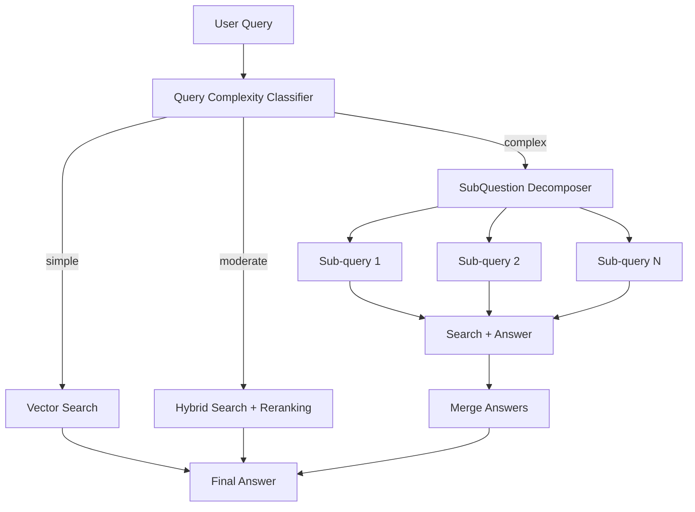

# Phase 8: Adaptive RAG & Query Routing (v0.9.0)

## Обзор

| Параметр | Значение |
|----------|----------|
| **Цель** | Автоматически выбирать оптимальный пайплайн на основе сложности и типа запроса |
| **Источники** | FlashRAG (Adaptive RAG), LlamaIndex RouterQueryEngine, Haystack ConditionalRouter |
| **Сложность** | Средняя |
| **Влияние** | Высокое — автоматическая оптимизация без ручного выбора стратегии |
| **Ориентир. срок** | 2–3 недели |
| **Версия** | v0.9.0 |

### Концепция

**Adaptive RAG** — подход динамической маршрутизации запросов, при котором система автоматически определяет сложность вопроса и выбирает оптимальную стратегию поиска. Простые вопросы обрабатываются быстрым vector search, сложные — через multi-step pipeline с декомпозицией.

Ключевые компоненты:
1. **Query Complexity Classifier** — LLM (Claude Haiku) классифицирует запрос: simple / moderate / complex
2. **Strategy Router** — маршрутизирует на оптимальную стратегию по сложности
3. **SubQuestion Decomposer** — разбивает сложные вопросы на подвопросы

> **Источники**: [Adaptive-RAG: Learning to Adapt Retrieval-Augmented Large Language Models (Jeong et al., 2024)](https://arxiv.org/abs/2403.14403), Haystack Pipeline Routing, LlamaIndex RouterRetriever

> **Связь с LangChain**: LangChain docs описывают паттерн **Маршрутизатор** (см. `docs/documentation/Lang Chain Docs/Lang Chain/Расширенное использование/Многоагентный/Маршрутизатор.md`) для направления запросов к специализированным субагентам — аналогичный подход, но на уровне стратегий поиска.

### Архитектура Adaptive RAG



### Альтернативные подходы

| Подход | Описание | Когда использовать |
|--------|----------|-------------------|
| **LLM Classifier** (текущий) | Claude Haiku определяет сложность | Высокая точность, но расход токенов |
| **Rule-based routing** | По длине запроса, наличию операторов | Бесплатно, быстро, но грубая оценка |
| **Embedding-based** | Clustering запросов по эмбеддингам | Когда есть обучающая выборка |

## Предварительные требования

- **Phase 5 завершена** (Self-RAG — используется для complex queries)
- **Phase 6 завершена** (GraphRAG Global — используется для thematic queries)
- Директория `src/pdf_framework/search/routing/` уже существует (пустая, готова)
- **Новых зависимостей не требуется**

## Прогресс

- [x] 8.1 — Query Complexity Classifier ✅
- [x] 8.2 — Strategy Router ✅
- [x] 8.3 — SubQuestion Decomposer ✅
- [x] 8.4 — AdaptiveSearchStrategy (обёртка) ✅
- [x] 8.5 — CLI и конфигурация ✅
- [ ] Тесты и верификация
- [x] Документация обновлена ✅

---

## Этап 8.1: Query Complexity Classifier

### Описание

LLM-классификатор, определяющий сложность и тип запроса. Использует Claude Haiku для минимальной латентности.

### Файлы

| Файл | Действие |
|------|----------|
| `src/pdf_framework/search/routing/classifier.py` | **NEW** |

### Задачи

- [ ] Реализовать класс `QueryClassifier`:
  - [ ] `async def classify(query: str) -> QueryClassification`
- [ ] Модель `QueryClassification`:
  - [ ] `complexity: Literal["simple", "moderate", "complex", "thematic"]`
  - [ ] `query_type: str` — factual, analytical, comparative, thematic
  - [ ] `confidence: float` — 0.0–1.0
- [ ] LLM-промпт для классификации:
  - [ ] `simple` — факт, одна сущность ("Какая версия?", "Кто автор?")
  - [ ] `moderate` — концептуальный вопрос ("Как работает X?", "Что такое Y?")
  - [ ] `complex` — сравнение, многошаговый анализ ("Сравни X и Y", "Перечисли все Z")
  - [ ] `thematic` — широкий обзор ("О чём документ?", "Основные темы?")
- [ ] Fallback: при ошибке LLM → `moderate` (безопасный default)
- [ ] Кэширование: одинаковые запросы → одинаковый результат (in-memory LRU)

### Пример кода

```python
class QueryClassification(BaseModel):
    complexity: Literal["simple", "moderate", "complex", "thematic"]
    query_type: str
    confidence: float

class QueryClassifier:
    async def classify(self, query: str) -> QueryClassification:
        prompt = f"""Classify this search query by complexity:
        - simple: factual, single entity lookup
        - moderate: conceptual question, how/what/why
        - complex: comparison, multi-step analysis, listing
        - thematic: broad overview, main themes

        Query: {query}
        Reply with: complexity query_type confidence
        Example: moderate analytical 0.85"""

        response = await self._llm.ainvoke([HumanMessage(content=prompt)])
        return self._parse(response)
```

### Критерии готовности

- [ ] Классификация корректно определяет 4 уровня сложности
- [ ] Fallback работает при ошибках LLM
- [ ] Латентность < 500ms (Haiku)

---

## Этап 8.2: Strategy Router

### Описание

Маршрутизатор, направляющий запрос в подходящий пайплайн на основе классификации.

### Файлы

| Файл | Действие |
|------|----------|
| `src/pdf_framework/search/routing/router.py` | **NEW** |

### Задачи

- [ ] Реализовать класс `StrategyRouter`:
  - [ ] `async def route(classification: QueryClassification) -> RoutingDecision`
- [ ] Модель `RoutingDecision`:
  - [ ] `strategy: str` — имя стратегии для SearchManager
  - [ ] `use_reranking: bool`
  - [ ] `use_query_expansion: bool`
  - [ ] `decompose: bool` — нужна ли декомпозиция (для complex)
  - [ ] `k: int` — количество результатов
- [ ] Маршруты по умолчанию:
  - [ ] `simple` → `{"strategy": "vector", "use_reranking": False, "k": 3}`
  - [ ] `moderate` → `{"strategy": "hybrid", "use_reranking": True, "k": 5}`
  - [ ] `complex` → `{"strategy": "two_stage", "use_reranking": True, "decompose": True, "k": 10}`
  - [ ] `thematic` → `{"strategy": "global", "use_reranking": False, "k": 5}`
- [ ] Настраиваемые маршруты через конфигурацию
- [ ] Fallback если стратегия недоступна → ближайшая доступная

### Критерии готовности

- [ ] Каждый уровень сложности маршрутизируется в подходящую стратегию
- [ ] Fallback работает для недоступных стратегий
- [ ] Маршруты настраиваемы через конфигурацию

---

## Этап 8.3: SubQuestion Decomposer

### Описание

Для сложных запросов — декомпозиция на 2–4 под-вопроса с раздельным поиском и синтезом ответов.

### Файлы

| Файл | Действие |
|------|----------|
| `src/pdf_framework/search/routing/decomposer.py` | **NEW** |

### Задачи

- [ ] Реализовать класс `SubQuestionDecomposer`:
  - [ ] `async def decompose(query: str) -> list[str]` — список под-вопросов
  - [ ] `async def synthesize(query: str, sub_answers: list[str]) -> str` — синтез ответов
- [ ] LLM-промпт для декомпозиции:
  - [ ] "Break this complex query into 2-4 simpler sub-questions that can be answered independently"
  - [ ] Ограничить максимум 4 под-вопроса
- [ ] Для каждого под-вопроса:
  - [ ] Отдельный поиск через SearchManager
  - [ ] Сбор контекста
- [ ] Синтез: объединить ответы на под-вопросы в единый ответ
- [ ] Fallback: если декомпозиция не нужна (1 вопрос) → обычный поиск

### Пример кода

```python
class SubQuestionDecomposer:
    async def decompose(self, query: str) -> list[str]:
        prompt = f"""Break this query into 2-4 simpler sub-questions:
        Query: {query}
        Return each sub-question on a new line."""

        response = await self._llm.ainvoke([HumanMessage(content=prompt)])
        lines = parser.invoke(response).strip().split("\n")
        return [l.strip().lstrip("0123456789.-) ") for l in lines if l.strip()][:4]

    async def synthesize(self, query: str, sub_answers: list[str]) -> str:
        prompt = f"""Original question: {query}
        Sub-answers: {sub_answers}
        Synthesize a comprehensive answer."""

        response = await self._llm.ainvoke([HumanMessage(content=prompt)])
        return parser.invoke(response)
```

### Критерии готовности

- [ ] Сложные запросы декомпозируются на 2–4 под-вопроса
- [ ] Под-вопросы осмысленные и отвечаемые независимо
- [ ] Синтез объединяет ответы корректно
- [ ] Простые запросы не декомпозируются

---

## Этап 8.4: AdaptiveSearchStrategy

### Описание

Обёртка-стратегия, которая оркестрирует classify → route → search (→ decompose).

### Файлы

| Файл | Действие |
|------|----------|
| `src/pdf_framework/search/strategies/adaptive.py` | **NEW** |

### Задачи

- [ ] Реализовать `AdaptiveSearchStrategy`:
  - [ ] `async def search(query, k, filter, **kwargs) -> SearchResponse`
- [ ] Алгоритм:
  - [ ] Шаг 1: `classifier.classify(query)` → classification
  - [ ] Шаг 2: `router.route(classification)` → decision
  - [ ] Шаг 3a: Если `decision.decompose` → decomposer.decompose → multi-search → synthesize
  - [ ] Шаг 3b: Иначе → SearchManager.search(strategy=decision.strategy)
- [ ] Добавить classification и routing info в metadata ответа
- [ ] Зарегистрировать как `adaptive` в SearchManager
- [ ] Поддержка `--force-route` для ручного выбора маршрута (bypass classifier)

### Критерии готовности

- [ ] Adaptive strategy автоматически выбирает лучший подход
- [ ] Декомпозиция работает для complex queries
- [ ] Classification info доступна в ответе
- [ ] Force-route позволяет обойти классификатор

---

## Этап 8.5: CLI и конфигурация

### Файлы

| Файл | Действие |
|------|----------|
| `src/pdf_framework/config.py` | **MODIFY** |
| `src/cli/main.py` | **MODIFY** |
| `src/api/dependencies/components.py` | **MODIFY** |

### Задачи

- [ ] Добавить `AdaptiveRAGSettings` в config.py:
  - [ ] `classifier_model: str = "claude-haiku-4-5-20251001"`
  - [ ] `decomposition_enabled: bool = True`
  - [ ] `max_sub_questions: int = 4`
- [ ] Обновить CLI:
  - [ ] `--strategy adaptive` — автоматический выбор
  - [ ] `--force-route simple|moderate|complex|thematic` — принудительный маршрут
- [ ] Зарегистрировать компоненты в Components
- [ ] Обновить REST API и MCP-сервер

### Критерии готовности

- [ ] Все CLI опции работают
- [ ] Конфигурация через `.env`
- [ ] REST API поддерживает adaptive strategy

---

## Конфигурация (.env)

```ini
# Phase 8: Adaptive RAG
ADAPTIVE_RAG__CLASSIFIER_MODEL=claude-haiku-4-5-20251001
ADAPTIVE_RAG__DECOMPOSITION_ENABLED=true
ADAPTIVE_RAG__MAX_SUB_QUESTIONS=4
```

## CLI команды

```bash
# Автоматический выбор стратегии
pdf-framework search "Какая версия?" --strategy adaptive
# → routed to: simple → vector search

pdf-framework search "Как работает конфигуратор?" --strategy adaptive
# → routed to: moderate → hybrid + reranking

pdf-framework search "Сравни PostgreSQL и MS SQL" --strategy adaptive
# → routed to: complex → decompose + multi-search

# Принудительный маршрут
pdf-framework search "запрос" --strategy adaptive --force-route complex
```

## Верификация

```bash
# 1. Simple query → должен выбрать vector
pdf-framework search "версия 1С" --strategy adaptive

# 2. Complex query → должен декомпозировать
pdf-framework search "Сравни способы подключения к серверу" --strategy adaptive

# 3. Thematic → должен использовать global search
pdf-framework search "О чём все эти документы?" --strategy adaptive
```

### Ожидаемый output

```
$ pdf-framework search "Что такое регистр накопления?" --strategy adaptive --verbose

[CLASSIFY] Query complexity: simple (confidence: 0.92)
[ROUTE] Strategy: vector (fast path)
[SEARCH] Found 5 results in 120ms

Results:
  [0.94] Регистр накопления — прикладной объект конфигурации...
  [0.87] Регистры накопления предназначены для учёта...

$ pdf-framework search "Сравни архитектуру клиент-сервера в 1С и SAP, какие преимущества?" --strategy adaptive --verbose

[CLASSIFY] Query complexity: complex (confidence: 0.88)
[DECOMPOSE] Sub-questions:
  1. "Архитектура клиент-сервера в 1С"
  2. "Архитектура клиент-сервера в SAP"
  3. "Преимущества 1С перед SAP в архитектуре"
[SEARCH] Sub-query 1: hybrid, 5 results (450ms)
[SEARCH] Sub-query 2: hybrid, 3 results (420ms)
[SEARCH] Sub-query 3: hybrid, 4 results (440ms)
[MERGE] Combining 12 results into coherent answer

Answer: Архитектура клиент-сервера в 1С и SAP имеет ряд отличий...
```

## Связанные файлы

| Файл | Действие | Описание |
|------|----------|----------|
| `src/pdf_framework/search/routing/classifier.py` | **NEW** | Query Complexity Classifier |
| `src/pdf_framework/search/routing/router.py` | **NEW** | Strategy Router |
| `src/pdf_framework/search/routing/decomposer.py` | **NEW** | SubQuestion Decomposer |
| `src/pdf_framework/search/strategies/adaptive.py` | **NEW** | AdaptiveSearchStrategy |
| `src/pdf_framework/config.py` | **MODIFY** | AdaptiveRAGSettings |
| `src/api/dependencies/components.py` | **MODIFY** | Register components |
| `src/cli/main.py` | **MODIFY** | --strategy adaptive, --force-route |

## Связанная документация

| Документ | Связь с Phase 8 |
|----------|-----------------|
| [Маршрутизатор](../documentation/Lang%20Chain%20Docs/Lang%20Chain/Расширенное%20использование/Многоагентный/Маршрутизатор.md) | Паттерн маршрутизации запросов к специализированным агентам |
| [Субагенты](../documentation/Lang%20Chain%20Docs/Lang%20Chain/Расширенное%20использование/Многоагентный/Субагенты.md) | SubQuestion decomposition = sub-agent pattern |
| [Агенты](../documentation/Lang%20Chain%20Docs/Lang%20Chain/Основные%20компоненты/Агенты.md) | Динамическая модель и middleware для routing |
| [Структурированный вывод](../documentation/Lang%20Chain%20Docs/Lang%20Chain/Основные%20компоненты/Структурированный%20вывод.md) | Structured output для classifier response |
