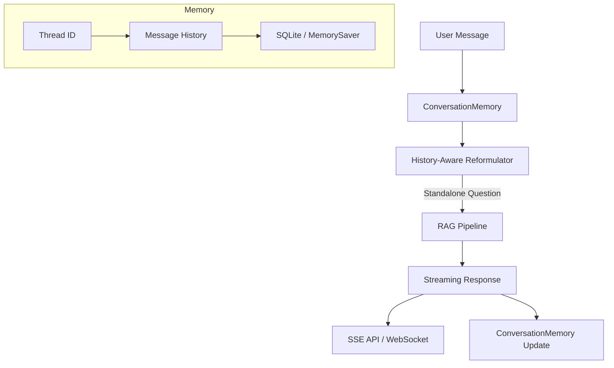

# Phase 9: Conversational RAG & Streaming (v1.0.0)

## Обзор

| Параметр | Значение |
|----------|----------|
| **Цель** | Многоходовые диалоги с памятью и потоковая отдача ответов |
| **Источники** | LangGraph checkpointer, LangChain RunnableWithMessageHistory, Quivr |
| **Сложность** | Средняя |
| **Влияние** | Высокое — необходимо для chat-интерфейса |
| **Ориентир. срок** | 3–4 недели |
| **Версия** | v1.0.0 |

### Концепция

**Conversational RAG** — расширение RAG-системы для поддержки многошаговых диалогов. В стандартном RAG каждый запрос обрабатывается независимо. Conversational RAG учитывает историю диалога, переформулируя вопросы с учётом контекста ("Расскажи подробнее" → "Расскажи подробнее о регистрах накопления в 1С").

**Streaming** — потоковая передача ответов по мере генерации для мгновенной обратной связи. Критично для UX — пользователь видит начало ответа через ~200ms, а не ждёт 3-5 секунд.

Ключевые компоненты:
1. **ConversationMemory** — хранение истории диалога (LangGraph MemorySaver / SQLite)
2. **History-Aware Reformulator** — переформулирование запроса с учётом истории
3. **Streaming Pipeline** — SSE (Server-Sent Events) для потоковой отдачи через API

> **Источники**: LangGraph persistence, LangChain ConversationalRetrievalChain, PrivateGPT chat interface

> **Связь с LangChain**: Стриминг реализуется через `agent.stream()` с `stream_mode="messages"` (см. `docs/documentation/Lang Chain Docs/Lang Chain/Основные компоненты/Стриминг/Обзор.md`). Память диалога — через checkpointer (см. `docs/documentation/Lang Chain Docs/Lang Chain/Основные компоненты/Кратковременная память.md`).

### Архитектура Conversational RAG



### Альтернативные подходы

| Подход | Описание | Когда использовать |
|--------|----------|-------------------|
| **LangGraph MemorySaver** (текущий) | In-memory / SQLite checkpointer | Разработка и небольшие deployments |
| **PostgresSaver** | PostgreSQL checkpointer | Production, масштабируемость |
| **Custom ConversationBuffer** | Ручное управление окном сообщений | Специфические требования к памяти |

## Предварительные требования

- **Phase 5 завершена** (Self-RAG agent)
- LangGraph `MemorySaver` / SQLite checkpointer
- `sse-starlette` для Server-Sent Events в FastAPI
- **Новые зависимости:** `sse-starlette`

## Прогресс

- [x] 9.1 — Conversation Memory ✅
- [x] 9.2 — History-Aware Query Reformulation ✅
- [x] 9.3 — Streaming Pipeline ✅
- [x] 9.4 — Chat API endpoints ✅
- [x] 9.5 — CLI chat command ✅
- [ ] Тесты и верификация
- [x] Документация обновлена ✅

---

## Этап 9.1: Conversation Memory

### Описание

Хранение истории диалога по `thread_id` с управляемым окном контекста.

### Файлы

| Файл | Действие |
|------|----------|
| `src/pdf_framework/agents/memory/__init__.py` | **NEW** |
| `src/pdf_framework/agents/memory/conversation.py` | **NEW** |

### Задачи

- [ ] Реализовать класс `ConversationMemory`:
  - [ ] `async def get_history(thread_id: str, limit: int = 10) -> list[Message]`
  - [ ] `async def add_message(thread_id: str, role: str, content: str) -> None`
  - [ ] `async def clear_thread(thread_id: str) -> None`
  - [ ] `async def list_threads() -> list[str]`
- [ ] Модель `Message`:
  - [ ] `role: Literal["user", "assistant"]`
  - [ ] `content: str`
  - [ ] `timestamp: datetime`
  - [ ] `metadata: dict` — стратегия, sources и т.д.
- [ ] Backends:
  - [ ] `MemoryBackend` — in-memory (для dev/testing)
  - [ ] `SQLiteBackend` — persistent (для production)
- [ ] Окно контекста: возвращать последние N сообщений (по умолчанию 10)
- [ ] Автоочистка: удалять threads старше N дней (настраиваемо)

### Критерии готовности

- [ ] История сохраняется и извлекается по thread_id
- [ ] Окно контекста ограничено
- [ ] SQLite backend persistent между перезапусками
- [ ] Модель Message содержит все нужные поля

---

## Этап 9.2: History-Aware Query Reformulation

### Описание

Перед поиском — переформулировать запрос с учётом истории диалога, чтобы разрешить анафорические ссылки ("это", "его", "А как?").

### Файлы

| Файл | Действие |
|------|----------|
| `src/pdf_framework/agents/rag/nodes/reformulator.py` | **NEW** |

### Задачи

- [ ] Реализовать функцию `reformulate_query(state: RAGState) -> dict`:
  - [ ] Получить историю из `ConversationMemory`
  - [ ] Если история пустая → вернуть запрос как есть
  - [ ] Если есть → LLM: "Given chat history, reformulate the latest query to be self-contained"
- [ ] Добавить `chat_history: list[Message]` в RAGState
- [ ] Добавить `thread_id: str` в RAGState
- [ ] Пример реформулирования:
  - [ ] History: "Расскажи про PostgreSQL" / Answer: "PostgreSQL — это СУБД..."
  - [ ] New query: "А как его настроить?" → "Как настроить PostgreSQL для 1С?"
- [ ] Fallback: при ошибке LLM → использовать оригинальный запрос

### Пример кода

```python
async def reformulate_query(state: RAGState) -> dict:
    history = state.get("chat_history", [])
    if not history:
        return {}  # no reformulation needed

    prompt = f"""Given the chat history below, rewrite the latest query
    to be self-contained (resolve pronouns, references).

    Chat history:
    {_format_history(history)}

    Latest query: {state["question"]}

    Rewritten query:"""

    response = await llm.ainvoke([HumanMessage(content=prompt)])
    rewritten = parser.invoke(response).strip()
    return {"question": rewritten}
```

### Критерии готовности

- [ ] Анафорические ссылки разрешаются корректно
- [ ] Без истории → запрос не меняется
- [ ] Reformulated query используется для поиска

---

## Этап 9.3: Streaming Pipeline

### Описание

Потоковая отдача ответа через LangGraph `astream_events` и SSE.

### Файлы

| Файл | Действие |
|------|----------|
| `src/pdf_framework/agents/rag/streaming.py` | **NEW** |

### Задачи

- [ ] Реализовать `StreamingRAGRunner`:
  - [ ] `async def stream(question, thread_id, **kwargs) -> AsyncIterator[StreamEvent]`
- [ ] Модель `StreamEvent`:
  - [ ] `type: Literal["token", "source", "status", "error", "done"]`
  - [ ] `data: str`
- [ ] Использовать LangGraph `astream_events(input, version="v2")`:
  - [ ] Фильтровать события: `on_chat_model_stream` → отдавать tokens
  - [ ] `on_chain_end` для generate_answer → отдавать sources
- [ ] Поддержка отмены (cancel) через async cancellation
- [ ] Отправлять статусы: "searching...", "grading...", "generating..."

### Пример кода

```python
class StreamingRAGRunner:
    async def stream(self, question, thread_id=None):
        input_state = {"question": question, "thread_id": thread_id}

        async for event in self._graph.astream_events(input_state, version="v2"):
            if event["event"] == "on_chat_model_stream":
                chunk = event["data"]["chunk"]
                if hasattr(chunk, "content") and chunk.content:
                    yield StreamEvent(type="token", data=chunk.content)
            elif event["event"] == "on_chain_end" and event["name"] == "generate":
                sources = event["data"]["output"].get("sources", [])
                yield StreamEvent(type="source", data=json.dumps(sources))

        yield StreamEvent(type="done", data="")
```

### Критерии готовности

- [ ] Токены отдаются по одному (streaming)
- [ ] Sources отправляются после генерации
- [ ] Статусы этапов передаются клиенту
- [ ] Отмена работает без утечек

---

## Этап 9.4: Chat API endpoints

### Описание

REST API для многоходового диалога с SSE streaming.

### Файлы

| Файл | Действие |
|------|----------|
| `src/api/routes/chat.py` | **NEW** |
| `src/api/app.py` | **MODIFY** — подключить router |

### Задачи

- [ ] `POST /chat/message` — отправить сообщение и получить SSE-поток:
  - [ ] Request: `{"thread_id": "abc", "message": "Как настроить?", "strategy": "adaptive"}`
  - [ ] Response: SSE stream с событиями token/source/status/done
- [ ] `GET /chat/history/{thread_id}` — получить историю диалога:
  - [ ] Response: `{"thread_id": "abc", "messages": [...]}`
- [ ] `DELETE /chat/history/{thread_id}` — очистить историю
- [ ] `GET /chat/threads` — список активных диалогов
- [ ] Автоматическая генерация `thread_id` если не передан
- [ ] Подключить router в `app.py`
- [ ] Добавить `sse-starlette` в зависимости

### Критерии готовности

- [ ] SSE streaming работает в браузере
- [ ] История сохраняется между запросами
- [ ] Thread management (list, delete) работает
- [ ] Совместимость с существующими endpoints

---

## Этап 9.5: CLI chat command

### Описание

Интерактивный chat-режим в CLI.

### Файлы

| Файл | Действие |
|------|----------|
| `src/cli/main.py` | **MODIFY** |

### Задачи

- [ ] Добавить команду `pdf-framework chat`:
  - [ ] Интерактивный REPL-цикл
  - [ ] Показывать streaming ответ в реальном времени
  - [ ] Команды: `/quit`, `/clear`, `/history`, `/strategy <name>`
  - [ ] Автоматический thread_id для сессии
- [ ] Добавить `--stream` флаг к команде `ask`:
  - [ ] `pdf-framework ask "вопрос" --stream` — streaming вывод
- [ ] Поддержка Ctrl+C для отмены текущего ответа

### Пример использования

```
$ pdf-framework chat
Chat started (thread: abc123). Type /quit to exit.

You: Расскажи про PostgreSQL в 1С
Assistant: PostgreSQL поддерживается в 1С Предприятие как одна из СУБД...
  [Sources: doc1.pdf:15, doc2.pdf:23]

You: А как его настроить?
Assistant: Для настройки PostgreSQL в 1С необходимо...

You: /history
  [1] You: Расскажи про PostgreSQL в 1С
  [2] Assistant: PostgreSQL поддерживается...
  [3] You: А как его настроить?
  [4] Assistant: Для настройки PostgreSQL...

You: /quit
```

### Критерии готовности

- [ ] Интерактивный chat работает
- [ ] История сохраняется в рамках сессии
- [ ] Streaming отображается в реальном времени
- [ ] Команды `/quit`, `/clear`, `/history` работают

---

## Конфигурация (.env)

```ini
# Phase 9: Conversational RAG
CONVERSATION__MEMORY_BACKEND=sqlite
CONVERSATION__MAX_HISTORY=10
CONVERSATION__AUTO_CLEANUP_DAYS=30
CONVERSATION__DB_PATH=data/conversations.db
```

## CLI команды

```bash
# Интерактивный chat
pdf-framework chat

# Одиночный вопрос с streaming
pdf-framework ask "Что такое 1С?" --stream

# Продолжить предыдущий диалог
pdf-framework chat --thread abc123
```

## Верификация

```bash
# 1. Chat mode
pdf-framework chat
> Расскажи про PostgreSQL
> А как его настроить?  # должен понять контекст

# 2. API streaming (curl)
curl -N -X POST http://localhost:8000/chat/message \
  -H "Content-Type: application/json" \
  -d '{"message": "Что такое 1С?", "thread_id": "test"}'

# 3. History
curl http://localhost:8000/chat/history/test
```

### Ожидаемый output

```
$ pdf-framework chat

PDF Framework Chat (type 'exit' to quit)
Strategy: adaptive | Model: claude-sonnet-4-5

> Что такое регистр накопления?

Регистр накопления — это прикладной объект конфигурации 1С:Предприятие,
предназначенный для учёта числовых показателей (остатков и оборотов)...
[Sources: manual.pdf:p.142, reference.pdf:p.85]

> А чем он отличается от регистра сведений?

[REFORMULATE] "А чем он отличается от регистра сведений?"
  → "Чем регистр накопления отличается от регистра сведений в 1С?"

Основные отличия регистра накопления от регистра сведений:
1. Регистр накопления хранит числовые данные с возможностью агрегации...
2. Регистр сведений хранит произвольные данные без агрегации...
[Sources: manual.pdf:p.142, manual.pdf:p.156]

> exit
Chat saved (thread_id: abc123, 4 messages)
```

## Связанные файлы

| Файл | Действие | Описание |
|------|----------|----------|
| `src/pdf_framework/agents/memory/__init__.py` | **NEW** | Package init |
| `src/pdf_framework/agents/memory/conversation.py` | **NEW** | ConversationMemory |
| `src/pdf_framework/agents/rag/nodes/reformulator.py` | **NEW** | History-aware reformulation |
| `src/pdf_framework/agents/rag/streaming.py` | **NEW** | StreamingRAGRunner |
| `src/pdf_framework/agents/rag/state.py` | **MODIFY** | Add chat_history, thread_id |
| `src/api/routes/chat.py` | **NEW** | Chat API endpoints |
| `src/api/app.py` | **MODIFY** | Register chat router |
| `src/cli/main.py` | **MODIFY** | chat command, --stream flag |
| `src/pdf_framework/config.py` | **MODIFY** | ConversationSettings |

## Связанная документация

| Документ | Связь с Phase 9 |
|----------|-----------------|
| [Стриминг - Обзор](../documentation/Lang%20Chain%20Docs/Lang%20Chain/Основные%20компоненты/Стриминг/Обзор.md) | `stream_mode`, SSE, токены LLM в реальном времени |
| [Стриминг - Внешний интерфейс](../documentation/Lang%20Chain%20Docs/Lang%20Chain/Основные%20компоненты/Стриминг/Внешний%20интерфейс.md) | `useStream` для React UI |
| [Кратковременная память](../documentation/Lang%20Chain%20Docs/Lang%20Chain/Основные%20компоненты/Кратковременная%20память.md) | Checkpointer, thread persistence, trim messages |
| [Человек в процессе](../documentation/Lang%20Chain%20Docs/Lang%20Chain/Расширенное%20использование/Человек%20в%20процессе.md) | Interrupt/resume для human-in-the-loop в chat |
