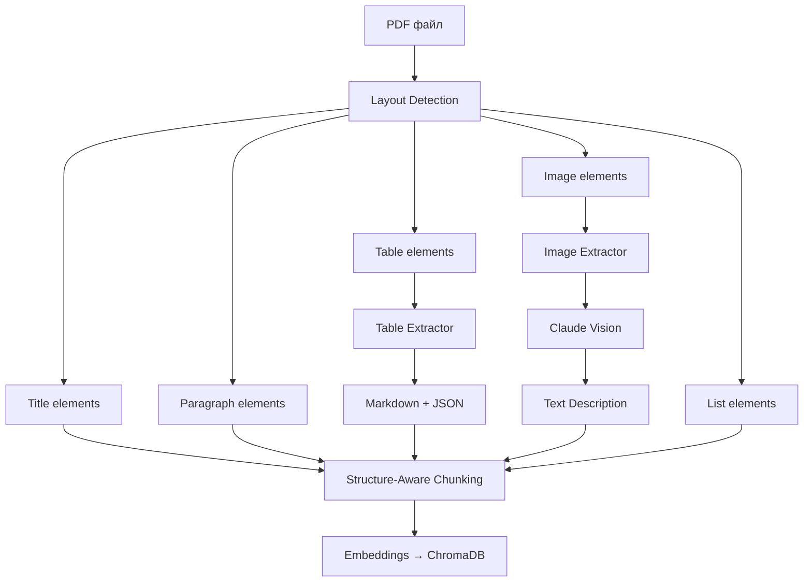

# Phase 10: Layout-Aware PDF Parsing & Multi-Modal RAG (v1.1.0)

## Обзор

| Параметр | Значение |
|----------|----------|
| **Цель** | Понимание структуры PDF (заголовки, таблицы, изображения) до чанкинга |
| **Источники** | RAGFlow (DeepDoc), LlamaIndex Multi-Modal, Kotaemon |
| **Сложность** | Высокая |
| **Влияние** | Высокое — кардинальное улучшение качества чанков из PDF |
| **Ориентир. срок** | 4–6 недель |
| **Версия** | v1.1.0 |

### Концепция

**Layout-Aware PDF Parsing** — подход к извлечению информации из PDF с учётом визуальной структуры страницы: заголовки, параграфы, таблицы, изображения, списки. Стандартный текстовый парсинг (PyMuPDF) теряет структуру документа — таблицы превращаются в мешанину текста, заголовки не связаны с содержимым.

**Multi-Modal RAG** — расширение RAG для работы с изображениями в PDF через Claude Vision, что позволяет индексировать графики, диаграммы и схемы как текстовые описания.

Ключевые компоненты:
1. **Layout Detection** — определение типа каждого элемента страницы (unstructured/surya)
2. **Structure-Aware Chunking** — разбиение с учётом структуры (не разрывать таблицы)
3. **Table Extraction** — извлечение таблиц как Markdown + JSON
4. **Image Understanding** — описание изображений через Claude Vision

> **Источники**: RAGFlow (DeepDoc), LlamaIndex Multi-Modal RAG, unstructured.io, surya-ocr, Kotaemon

> **Связь с LangChain**: LangChain предоставляет `UnstructuredLoader` для layout-aware parsing, но наша реализация использует кастомный `LayoutAwareLoader` для лучшего контроля и совместимости с provider pattern.

### Архитектура Layout-Aware Parsing



### Альтернативные подходы

| Подход | Описание | Когда использовать |
|--------|----------|-------------------|
| **unstructured** (текущий) | hi_res стратегия с ML моделями | Максимальное качество, сложные PDF |
| **surya-ocr** | Lightweight layout model | Быстрее, меньше зависимостей |
| **PyMuPDF + эвристики** | Анализ шрифтов и позиций | Простые PDF, без внешних моделей |

## Предварительные требования

- **Phase 7 завершена** (Parent-Child — переиспользуем паттерн)
- Существующие loaders: `src/pdf_framework/loaders/providers/`
- **Новые зависимости:**
  - `unstructured[pdf]` — layout detection + PDF parsing
  - Или `surya-ocr` — layout model (альтернатива)
  - `camelot-py` или `pdfplumber` — table extraction (pdfplumber уже есть)

## Прогресс

- [x] 10.1 — Layout Detection provider ✅
- [x] 10.2 — Structure-Aware Chunking ✅
- [x] 10.3 — Table Extraction ✅
- [x] 10.4 — Image Understanding (Claude Vision) ✅
- [x] 10.5 — Template-Based Parsing ✅
- [x] 10.6 — Интеграция и конфигурация ✅
- [ ] Тесты и верификация
- [x] Документация обновлена ✅

---

## Этап 10.1: Layout Detection Provider

### Описание

Определение структуры страницы PDF: заголовки, параграфы, таблицы, рисунки, списки.

### Файлы

| Файл | Действие |
|------|----------|
| `src/pdf_framework/loaders/providers/layout_parser.py` | **NEW** |

### Задачи

- [ ] Реализовать класс `LayoutAwareLoader(BaseLoader)`:
  - [ ] `async def load(source: Path) -> ProcessedDocument`
  - [ ] `def supported_extensions() -> list[str]` → `[".pdf"]`
- [ ] Использовать `unstructured.partition.pdf.partition_pdf()`:
  - [ ] `strategy="hi_res"` для максимального качества
  - [ ] `infer_table_structure=True` для таблиц
  - [ ] `extract_images_in_pdf=True` для изображений
- [ ] Модель `LayoutElement`:
  - [ ] `type: Literal["title", "paragraph", "table", "image", "list", "header", "footer", "page_number"]`
  - [ ] `content: str`
  - [ ] `page_number: int`
  - [ ] `bbox: tuple[float, float, float, float] | None` — bounding box
  - [ ] `metadata: dict` — дополнительные атрибуты
- [ ] Сохранять layout elements в `ProcessedDocument.metadata["layout_elements"]`
- [ ] Fallback: если unstructured не установлен → использовать PyMuPDF loader

### Критерии готовности

- [ ] Разные типы элементов корректно определяются
- [ ] Bounding box сохраняется для каждого элемента
- [ ] Fallback на PyMuPDF работает без ошибок

---

## Этап 10.2: Structure-Aware Chunking

### Описание

Разбиение документа с учётом структуры: не разрывать таблицы, сохранять связь заголовка с текстом.

### Файлы

| Файл | Действие |
|------|----------|
| `src/pdf_framework/processing/splitters/structure_aware.py` | **NEW** |

### Задачи

- [ ] Реализовать `StructureAwareSplitter`:
  - [ ] `def split(document: ProcessedDocument) -> list[DocumentChunk]`
- [ ] Правила разбиения:
  - [ ] `title` + следующие `paragraph` → один чанк (до max_chunk_size)
  - [ ] `table` → отдельный чанк (никогда не разрывать)
  - [ ] `list` → сохранить как единое целое
  - [ ] `image` → отдельный чанк с описанием
  - [ ] `header/footer/page_number` → пропустить (не индексировать)
- [ ] Если paragraph слишком большой → RecursiveTextSplitter как fallback
- [ ] Metadata каждого чанка:
  - [ ] `element_type: str` — тип исходного элемента
  - [ ] `page_number: int`
  - [ ] `bbox: tuple | None`
  - [ ] `section_title: str` — заголовок текущей секции
- [ ] Добавить `"structure_aware"` в `PDFSettings.splitter` Literal

### Критерии готовности

- [ ] Таблицы не разрываются
- [ ] Заголовки привязаны к следующему тексту
- [ ] Section title propagation работает
- [ ] Metadata содержит page_number и element_type

---

## Этап 10.3: Table Extraction

### Описание

Извлечение таблиц как структурированных данных (Markdown для эмбеддинга, JSON для metadata).

### Файлы

| Файл | Действие |
|------|----------|
| `src/pdf_framework/processing/table_extractor.py` | **NEW** |

### Задачи

- [ ] Реализовать класс `TableExtractor`:
  - [ ] `def extract(page, bbox) -> TableData`
  - [ ] `def to_markdown(table_data) -> str`
  - [ ] `def to_json(table_data) -> dict`
- [ ] Модель `TableData`:
  - [ ] `headers: list[str]`
  - [ ] `rows: list[list[str]]`
  - [ ] `caption: str | None`
  - [ ] `page_number: int`
- [ ] Использовать `pdfplumber.extract_tables()` (уже установлен)
- [ ] Генерировать Markdown-таблицу для эмбеддинга:
  ```
  | Column1 | Column2 |
  |---------|---------|
  | value1  | value2  |
  ```
- [ ] Хранить JSON-представление в `chunk.metadata["table_data"]`
- [ ] Обработать edge cases: пустые таблицы, merged cells, nested tables

### Критерии готовности

- [ ] Таблицы корректно извлекаются из PDF
- [ ] Markdown-формат подходит для эмбеддинга
- [ ] JSON-данные доступны для структурированного доступа

---

## Этап 10.4: Image Understanding (Claude Vision)

### Описание

Извлечение изображений из PDF и генерация текстового описания через Claude Vision.

### Файлы

| Файл | Действие |
|------|----------|
| `src/pdf_framework/processing/image_extractor.py` | **NEW** |

### Задачи

- [ ] Реализовать класс `ImageExtractor`:
  - [ ] `async def extract_and_describe(pdf_path, page_number, bbox) -> ImageDescription`
  - [ ] `async def extract_all(pdf_path) -> list[ImageDescription]`
- [ ] Модель `ImageDescription`:
  - [ ] `image_bytes: bytes`
  - [ ] `description: str` — текстовое описание от Claude Vision
  - [ ] `page_number: int`
  - [ ] `bbox: tuple`
- [ ] Алгоритм:
  - [ ] Извлечь изображение через PyMuPDF (`page.get_images()`)
  - [ ] Конвертировать в base64
  - [ ] Отправить в Claude Vision: "Describe this image in the context of a technical document"
  - [ ] Сохранить описание как текстовый чанк с `element_type: "image"`
- [ ] Фильтровать маленькие изображения (< 50x50 px) — это иконки/декор
- [ ] Кэшировать описания (не пересоздавать для одного и того же изображения)
- [ ] Обработать edge case: ANTHROPIC_API_KEY не задан → пропустить с warning

### Критерии готовности

- [ ] Изображения корректно извлекаются из PDF
- [ ] Claude Vision генерирует осмысленные описания
- [ ] Маленькие изображения фильтруются
- [ ] Работает без API ключа (graceful degradation)

---

## Этап 10.5: Template-Based Parsing

### Описание

Разные стратегии парсинга для разных типов документов.

### Файлы

| Файл | Действие |
|------|----------|
| `src/pdf_framework/loaders/templates/__init__.py` | **NEW** |
| `src/pdf_framework/loaders/templates/base.py` | **NEW** |
| `src/pdf_framework/loaders/templates/research_paper.py` | **NEW** |
| `src/pdf_framework/loaders/templates/user_manual.py` | **NEW** |

### Задачи

- [ ] Реализовать базовый класс `ParseTemplate`:
  - [ ] `element_priorities: dict[str, int]` — приоритеты элементов
  - [ ] `skip_elements: list[str]` — элементы для пропуска
  - [ ] `chunk_size_overrides: dict[str, int]` — размеры чанков per element type
- [ ] Шаблон `research_paper`:
  - [ ] Приоритеты: abstract > methodology > results > conclusion
  - [ ] Пропуск: references, acknowledgments, page_number
- [ ] Шаблон `user_manual`:
  - [ ] Приоритеты: instructions > warnings > examples
  - [ ] Сохранять numbered lists как единое целое
- [ ] Автоопределение типа документа (по структуре/ключевым словам) или ручной выбор
- [ ] Конфигурация: `PDF__PARSE_TEMPLATE=auto|research_paper|user_manual|generic`

### Критерии готовности

- [ ] Минимум 2 шаблона реализованы
- [ ] Автоопределение работает для типичных документов
- [ ] Конфигурация через `.env`

---

## Этап 10.6: Интеграция и конфигурация

### Файлы

| Файл | Действие |
|------|----------|
| `src/pdf_framework/config.py` | **MODIFY** |
| `src/pdf_framework/loaders/__init__.py` | **MODIFY** |
| `src/api/dependencies/components.py` | **MODIFY** |
| `src/cli/main.py` | **MODIFY** |

### Задачи

- [ ] Добавить `LayoutSettings` в config.py:
  - [ ] `layout_detection_enabled: bool = False`
  - [ ] `layout_provider: Literal["unstructured", "surya", "none"] = "unstructured"`
  - [ ] `extract_tables: bool = True`
  - [ ] `extract_images: bool = False`
  - [ ] `image_description_model: str = "claude-sonnet-4-5-20250929"`
  - [ ] `parse_template: str = "auto"`
- [ ] Обновить фабрику `get_loader()` для layout-aware провайдера
- [ ] CLI: `pdf-framework index doc.pdf --layout-aware --extract-images`
- [ ] Обновить `ProcessingPipeline` для structure-aware splitting

### Критерии готовности

- [ ] Layout-aware parsing активируется через конфигурацию
- [ ] CLI опции работают
- [ ] Fallback на стандартный PyMuPDF при отсутствии unstructured

---

## Конфигурация (.env)

```ini
# Phase 10: Layout-Aware PDF
LAYOUT__LAYOUT_DETECTION_ENABLED=true
LAYOUT__LAYOUT_PROVIDER=unstructured
LAYOUT__EXTRACT_TABLES=true
LAYOUT__EXTRACT_IMAGES=false
LAYOUT__IMAGE_DESCRIPTION_MODEL=claude-sonnet-4-5-20250929
LAYOUT__PARSE_TEMPLATE=auto
```

## CLI команды

```bash
# Layout-aware индексация
pdf-framework index doc.pdf --layout-aware

# С извлечением изображений
pdf-framework index doc.pdf --layout-aware --extract-images

# С конкретным шаблоном
pdf-framework index paper.pdf --layout-aware --template research_paper
```

## Верификация

```bash
# 1. Индексация с layout detection
pdf-framework index data/pdfs/test.pdf --layout-aware

# 2. Проверить, что таблицы извлечены как отдельные чанки
pdf-framework search "таблица" --strategy vector

# 3. Проверить metadata
python -c "
import asyncio
from src.api.dependencies.components import Components
async def check():
    c = Components(); await c.initialize()
    r = await c.search_manager.search('таблица', k=1)
    print(r.results[0].chunk.metadata)
asyncio.run(check())
"
```

### Ожидаемый output

```
$ pdf-framework index data/pdfs/manual.pdf --layout-aware --extract-images

[LAYOUT] Analyzing manual.pdf (245 pages)...
[LAYOUT] Detected elements:
  - Titles: 89
  - Paragraphs: 1,245
  - Tables: 34
  - Images: 18
  - Lists: 67
  - Headers/Footers: 490 (skipped)

[TABLE] Extracting 34 tables...
[TABLE] Table p.42: 5 columns × 12 rows → Markdown + JSON

[IMAGE] Processing 18 images...
[IMAGE] Filtered: 7 decorative (< 50×50px)
[IMAGE] Describing 11 images via Claude Vision...
[IMAGE] p.15: "Диаграмма клиент-серверной архитектуры 1С..."
[IMAGE] p.23: "Скриншот конфигуратора с деревом метаданных..."

[CHUNK] Structure-aware splitting...
[CHUNK] Created 542 chunks (avg 380 tokens)
  - paragraph chunks: 412
  - table chunks: 34 (never split)
  - image description chunks: 11
  - list chunks: 67
  - section (title+text) chunks: 18

[INDEX] Embedded and stored in ChromaDB
Done: 542 chunks from 245 pages
```

## Связанные файлы

| Файл | Действие | Описание |
|------|----------|----------|
| `src/pdf_framework/loaders/providers/layout_parser.py` | **NEW** | Layout-aware PDF loader |
| `src/pdf_framework/processing/splitters/structure_aware.py` | **NEW** | Structure-aware splitter |
| `src/pdf_framework/processing/table_extractor.py` | **NEW** | Table extraction |
| `src/pdf_framework/processing/image_extractor.py` | **NEW** | Image extraction + Vision |
| `src/pdf_framework/loaders/templates/__init__.py` | **NEW** | Templates package |
| `src/pdf_framework/loaders/templates/base.py` | **NEW** | Base ParseTemplate |
| `src/pdf_framework/loaders/templates/research_paper.py` | **NEW** | Research paper template |
| `src/pdf_framework/loaders/templates/user_manual.py` | **NEW** | User manual template |
| `src/pdf_framework/config.py` | **MODIFY** | LayoutSettings |
| `src/pdf_framework/loaders/__init__.py` | **MODIFY** | Factory update |
| `src/api/dependencies/components.py` | **MODIFY** | Integration |
| `src/cli/main.py` | **MODIFY** | CLI options |

## Связанная документация

| Документ | Связь с Phase 10 |
|----------|-----------------|
| [Контекстная инженерия](../documentation/Lang%20Chain%20Docs/Lang%20Chain/Расширенное%20использование/Контекстная%20инженерия%20в%20агентах.md) | Обогащение контекста структурированными данными из таблиц |
| [Инструменты](../documentation/Lang%20Chain%20Docs/Lang%20Chain/Основные%20компоненты/Инструменты.md) | Image extraction как tool для агента |
