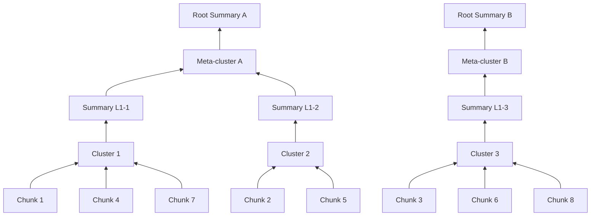

# Phase 13: Advanced Indexing — RAPTOR & HyDE (v1.4.0)

## Обзор

| Параметр | Значение |
|----------|----------|
| **Цель** | Продвинутые стратегии индексации для больших коллекций документов |
| **Источники** | LlamaIndex TreeIndex, LangChain HyDE, RAPTOR paper |
| **Сложность** | Высокая |
| **Влияние** | Средне-Высокое — значительно для больших коллекций |
| **Ориентир. срок** | 3–4 недели |
| **Версия** | v1.4.0 |

### Концепция

**RAPTOR** (Recursive Abstractive Processing for Tree-Organized Retrieval) — метод построения дерева резюме из коллекции документов. Leaf-чанки кластеризуются, для каждого кластера генерируется LLM-резюме, резюме рекурсивно кластеризуются до получения корневых узлов. Позволяет отвечать как на конкретные, так и на обобщающие вопросы.

**HyDE** (Hypothetical Document Embeddings) — метод улучшения поиска: вместо эмбеддинга вопроса, LLM генерирует гипотетический ответ, и его эмбеддинг используется для поиска. Улучшает recall для абстрактных и концептуальных запросов.

Ключевые компоненты:
1. **RAPTOR Tree Builder** — рекурсивная кластеризация (KMeans) + LLM summarization
2. **RAPTOR Search** — collapsed tree (все уровни одновременно) или tree traversal (сверху вниз)
3. **HyDE Generator** — генерация гипотетического документа через LLM
4. **Document Summary Index** — предварительная маршрутизация по резюме документов

> **Источники**: [RAPTOR: Recursive Abstractive Processing for Tree-Organized Retrieval (Sarthi et al., 2024)](https://arxiv.org/abs/2401.18059), [Precise Zero-Shot Dense Retrieval without Relevance Labels (HyDE, Gao et al., 2022)](https://arxiv.org/abs/2212.10496)

> **Связь с LangChain**: LlamaIndex предоставляет TreeIndex (аналог RAPTOR). В LangChain HyDE доступен через кастомные chains. Наша реализация интегрирует оба подхода в существующую архитектуру SearchManager.

### Архитектура RAPTOR



### Альтернативные подходы

| Подход | Описание | Когда использовать |
|--------|----------|-------------------|
| **KMeans** (текущий) | k = √n кластеров, простая реализация | До ~10K чанков |
| **UMAP + GMM** | Dimensionality reduction + Gaussian Mixture | Большие коллекции, лучшие кластеры |
| **LLM-based clustering** | LLM группирует чанки по темам | Маленькие коллекции, высокая точность |

## Предварительные требования

- **Phase 11 завершена** (Caching — кэш для LLM summarization)
- **Новые зависимости:**
  - `scikit-learn` — KMeans clustering (уже может быть установлен)
  - `umap-learn` (опционально) — UMAP dimensionality reduction

## Прогресс

- [x] 13.1 — RAPTOR Tree Builder
- [x] 13.2 — RAPTOR Search Strategy
- [x] 13.3 — HyDE Implementation
- [x] 13.4 — Document Summary Index
- [x] Тесты и верификация
- [x] Документация обновлена

---

## Этап 13.1: RAPTOR Tree Builder ✅

### Описание

Построение дерева резюме: чанки → кластеры → резюме кластеров → рекурсивно до корня.

### Файлы

| Файл | Действие |
|------|----------|
| `src/pdf_framework/processing/raptor.py` | **NEW** ✅ |

### Задачи

- [x] Реализовать класс `RAPTORTreeBuilder`:
  - [x] `async def build(chunks: list[DocumentChunk], embeddings: list[list[float]]) -> RAPTORTree`
- [x] Модель `RAPTORTree`:
  - [x] `levels: list[list[TreeNode]]` — уровни дерева (0 = leaves)
  - [x] `root_summaries: list[str]` — корневые резюме
- [x] Модель `TreeNode`:
  - [x] `id: str`
  - [x] `content: str` — текст чанка или резюме
  - [x] `level: int`
  - [x] `children_ids: list[str]` — ссылки на нижний уровень
  - [x] `embedding: list[float]`
- [x] Алгоритм:
  - [x] Уровень 0: исходные чанки
  - [x] Кластеризация: KMeans на эмбеддингах (k = √n)
  - [x] Для каждого кластера → LLM: "Summarize these passages: [...]. Write a concise summary."
  - [x] Эмбеддинг резюме → новый уровень
  - [x] Повторить рекурсивно пока кластеров > 1
- [x] Максимум уровней: 4 (предотвращение чрезмерной глубины)
- [x] Индексировать ВСЕ уровни в ChromaDB (с metadata `raptor_level`)
- [x] Кэшировать резюме (Phase 11 document cache)

### Пример кода

```python
class RAPTORTreeBuilder:
    async def build(self, chunks, embeddings):
        tree = RAPTORTree(levels=[])
        current_nodes = self._chunks_to_nodes(chunks, embeddings, level=0)
        tree.levels.append(current_nodes)

        level = 1
        while len(current_nodes) > 1 and level <= self._max_levels:
            # Cluster
            embs = [n.embedding for n in current_nodes]
            k = max(2, int(len(current_nodes) ** 0.5))
            clusters = self._cluster(embs, k)

            # Summarize each cluster
            new_nodes = []
            for cluster_ids in clusters:
                cluster_texts = [current_nodes[i].content for i in cluster_ids]
                summary = await self._summarize(cluster_texts)
                summary_emb = await self._embed(summary)
                node = TreeNode(
                    id=f"raptor_L{level}_{len(new_nodes)}",
                    content=summary, level=level,
                    children_ids=[current_nodes[i].id for i in cluster_ids],
                    embedding=summary_emb,
                )
                new_nodes.append(node)

            tree.levels.append(new_nodes)
            current_nodes = new_nodes
            level += 1

        return tree
```

### Критерии готовности

- [x] Дерево строится рекурсивно с кластеризацией
- [x] Все уровни индексируются в ChromaDB
- [x] Резюме осмысленные (проверить вручную)
- [x] Глубина ограничена (max 4 уровня)

---

## Этап 13.2: RAPTOR Search Strategy ✅

### Описание

Поиск по дереву RAPTOR: начать с верхних уровней, спуститься к leaf-чанкам по необходимости.

### Файлы

| Файл | Действие |
|------|----------|
| `src/pdf_framework/search/strategies/raptor_search.py` | **NEW** ✅ |

### Задачи

- [x] Реализовать `RAPTORSearchStrategy`:
  - [x] `async def search(query, k, filter, **kwargs) -> SearchResponse`
- [x] Алгоритм (collapsed tree — простой):
  - [x] Искать по ВСЕМ уровням одновременно (все nodes в одном ChromaDB collection)
  - [x] Reranking → top-k
  - [x] Результат содержит mix leaf chunks и summaries
- [x] Алгоритм (tree traversal — продвинутый):
  - [x] Начать с top-level (root summaries)
  - [x] Найти наиболее релевантные корневые резюме
  - [x] Спуститься к их children → поиск в подмножестве
  - [x] Рекурсивно до leaf level
  - [x] Вернуть leaf chunks найденные через traversal
- [x] По умолчанию: collapsed tree (проще, хорошо работает)
- [x] Настройка: `RAPTOR__SEARCH_MODE=collapsed|tree_traversal`
- [x] Зарегистрировать стратегию `raptor` в SearchManager

### Критерии готовности

- [x] Collapsed tree search работает
- [x] Результаты содержат как листья, так и резюме
- [x] Широкие вопросы отвечаются через верхние уровни
- [x] Конкретные вопросы находят точные leaf chunks

---

## Этап 13.3: HyDE Implementation ✅

### Описание

Hypothetical Document Embeddings — генерация гипотетического ответа, использование его эмбеддинга для поиска.

### Файлы

| Файл | Действие |
|------|----------|
| `src/pdf_framework/search/hyde.py` | **NEW** ✅ |
| `src/pdf_framework/search/query_expansion.py` | **MODIFY** ✅ |

### Задачи

- [x] Реализовать класс `HyDEGenerator`:
  - [x] `async def generate_hypothetical(query: str) -> str`
  - [x] `async def embed_hypothetical(query: str) -> list[float]`
- [x] LLM-промпт: "Write a short passage that would answer this question: {query}. Write as if you are quoting from a document."
- [x] Использовать эмбеддинг гипотетического ответа вместо эмбеддинга запроса для поиска
- [x] Интеграция с существующим `QueryExpander`:
  - [x] Добавить `method="hyde"` (уже определён в config, но не реализован)
  - [x] `QueryExpander.expand()` с method="hyde" → возвращает hypothetical document embedding
- [x] Кэшировать гипотетические ответы (LLM cache, Phase 11)
- [x] Fallback: если LLM недоступен → использовать обычный query embedding

### Пример кода

```python
class HyDEGenerator:
    async def generate_hypothetical(self, query: str) -> str:
        prompt = f"""Write a short passage (2-3 sentences) that would answer
        this question, as if quoting from a reference document:

        Question: {query}
        Passage:"""

        response = await self._llm.ainvoke([HumanMessage(content=prompt)])
        return parser.invoke(response).strip()

    async def embed_hypothetical(self, query: str) -> list[float]:
        hypothetical = await self.generate_hypothetical(query)
        return await self._embedding.embed_text(hypothetical)
```

### Критерии готовности

- [x] Hypothetical document генерируется за < 2s
- [x] Recall улучшается для абстрактных запросов
- [x] Кэширование работает
- [x] Fallback при недоступности LLM

---

## Этап 13.4: Document Summary Index ✅

### Описание

Индекс резюме документов для предварительной маршрутизации — сначала найти релевантные документы, потом искать чанки.

### Файлы

| Файл | Действие |
|------|----------|
| `src/pdf_framework/processing/summary_index.py` | **NEW** ✅ |

### Задачи

- [x] Реализовать класс `DocumentSummaryIndex`:
  - [x] `async def add_document(doc_id, summary, embedding) -> None`
  - [x] `async def search(query_embedding, k=3) -> list[DocumentSummary]`
  - [x] `async def rebuild(documents) -> None`
- [x] Модель `DocumentSummary`:
  - [x] `document_id: str`
  - [x] `summary: str` (200–500 токенов)
  - [x] `title: str`
  - [x] `chunk_count: int`
- [x] Хранение: отдельная ChromaDB коллекция `document_summaries`
- [x] При индексации документа:
  - [x] Сгенерировать LLM-резюме всего документа
  - [x] Сохранить в summary index
- [x] При поиске (pre-routing):
  - [x] Найти top-3 релевантных документа по резюме
  - [x] Затем искать чанки только внутри этих документов (filter by doc_id)
- [x] Полезно для коллекций 100+ документов

### Критерии готовности

- [x] Резюме генерируются для каждого документа
- [x] Pre-routing ускоряет поиск в больших коллекциях
- [x] Precision улучшается (поиск сфокусирован на релевантных документах)

---

## Конфигурация (.env)

```ini
# Phase 13: RAPTOR
RAPTOR__ENABLED=false
RAPTOR__MAX_LEVELS=4
RAPTOR__SEARCH_MODE=collapsed
RAPTOR__CLUSTER_METHOD=kmeans

# HyDE
SEARCH__QUERY_EXPANSION_METHOD=hyde

# Document Summary Index
SUMMARY_INDEX__ENABLED=false
SUMMARY_INDEX__COLLECTION=document_summaries
```

## CLI команды

```bash
# Индексация с RAPTOR tree
pdf-framework index doc.pdf --raptor

# Поиск по RAPTOR tree
pdf-framework search "Какие основные темы?" --strategy raptor

# HyDE (через query expansion)
pdf-framework search "абстрактный запрос" --expand-query
# (при SEARCH__QUERY_EXPANSION_METHOD=hyde)

# Индексация с document summaries
pdf-framework index doc.pdf --summarize
```

## Верификация

```bash
# 1. RAPTOR tree
pdf-framework index data/pdfs/test.pdf --raptor
pdf-framework stats
# → RAPTOR: 3 levels, 42 leaf nodes, 15 L1 summaries, 5 L2 summaries

# 2. RAPTOR search
pdf-framework search "Общая тема документа" --strategy raptor

# 3. HyDE
pdf-framework search "абстрактный вопрос" --expand-query
```

### Ожидаемый output

```
$ pdf-framework index data/pdfs/manual.pdf --raptor

[RAPTOR] Building tree from 198 leaf chunks...
[RAPTOR] Level 0: 198 leaf nodes
[RAPTOR] Clustering: k=14 (√198)
[RAPTOR] Level 1: 14 summaries generated
[RAPTOR] Clustering: k=4 (√14)
[RAPTOR] Level 2: 4 summaries generated
[RAPTOR] Clustering: k=2 (√4)
[RAPTOR] Level 3: 2 root summaries generated
[RAPTOR] Tree complete: 4 levels, 218 total nodes
[INDEX] All levels indexed in ChromaDB (with raptor_level metadata)

$ pdf-framework search "О чём этот документ в целом?" --strategy raptor

[RAPTOR] Collapsed tree search across all levels
[RAPTOR] Top results:
  [0.95] [L3] Root Summary A: "Документ описывает платформу 1С:Предприятие..."
  [0.88] [L2] Summary: "Архитектура включает клиент-серверное..."
  [0.82] [L0] Leaf: "Конфигуратор предоставляет..."

$ pdf-framework search "абстрактный вопрос" --expand-query
# (при SEARCH__QUERY_EXPANSION_METHOD=hyde)

[HyDE] Generating hypothetical document...
[HyDE] Hypothetical: "В документации описывается, что абстрактные..."
[HyDE] Using hypothetical embedding for search (instead of query embedding)
[SEARCH] Found 5 results with improved recall
```

## Связанные файлы

| Файл | Действие | Описание |
|------|----------|----------|
| `src/pdf_framework/processing/raptor.py` | **NEW** ✅ | RAPTOR Tree Builder |
| `src/pdf_framework/search/strategies/raptor_search.py` | **NEW** ✅ | RAPTOR Search Strategy |
| `src/pdf_framework/search/hyde.py` | **NEW** ✅ | HyDE Generator |
| `src/pdf_framework/processing/summary_index.py` | **NEW** ✅ | Document Summary Index |
| `src/pdf_framework/search/__init__.py` | **NEW** ✅ | Exports HyDE classes |
| `src/pdf_framework/processing/__init__.py` | **MODIFY** ✅ | Exports RAPTOR classes |
| `src/pdf_framework/config.py` | **MODIFY** ✅ | RAPTORSettings, SummaryIndexSettings |
| `src/api/dependencies/components.py` | **MODIFY** ✅ | Register raptor strategy |
| `src/api/app.py` | **MODIFY** ✅ | Version 1.4.0 |
| `src/cli/main.py` | **MODIFY** ✅ | --raptor, --summarize flags |

## Связанная документация

| Документ | Связь с Phase 13 |
|----------|-----------------|
| [Агенты](../documentation/Lang%20Chain%20Docs/Lang%20Chain/Основные%20компоненты/Агенты.md) | LLM для summarization и HyDE generation |
| [Модели](../documentation/Lang%20Chain%20Docs/Lang%20Chain/Основные%20компоненты/Модели.md) | Настройка моделей для summarization (temperature, max_tokens) |
| [Контекстная инженерия](../documentation/Lang%20Chain%20Docs/Lang%20Chain/Расширенное%20использование/Контекстная%20инженерия%20в%20агентах.md) | Обогащение контекста через tree summaries |
