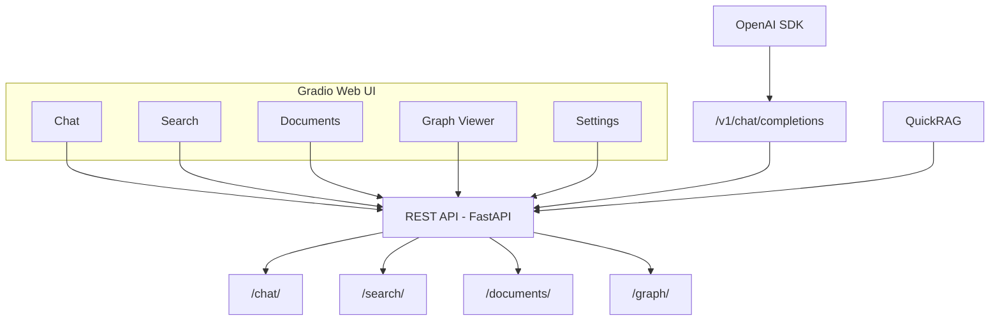

# Phase 14: UI & Developer Experience (v1.5.0)

## Обзор

| Параметр | Значение |
|----------|----------|
| **Цель** | Пользовательский интерфейс и улучшение Developer Experience |
| **Источники** | Kotaemon, Verba, Quivr, PrivateGPT, Cognita |
| **Сложность** | Средняя |
| **Влияние** | Высокое (UX) — делает фреймворк доступным для non-developers |
| **Ориентир. срок** | 3–5 недель |
| **Версия** | v1.5.0 |

### Концепция

**Developer Experience (DX)** — совокупность инструментов и API, делающих фреймворк доступным для разработчиков любого уровня. Включает Web UI для non-developers, OpenAI-совместимый API для интеграции с существующими инструментами, и QuickRAG — high-level API для быстрого старта в 3 строки кода.

Ключевые компоненты:
1. **Gradio Web UI** — визуальный интерфейс с вкладками: Chat, Search, Documents, Graph, Settings
2. **PDF Viewer** — просмотр PDF с подсветкой найденных фрагментов
3. **OpenAI-Compatible API** — `/v1/chat/completions` для интеграции с Cursor, Continue и т.д.
4. **QuickRAG** — `rag.add("doc.pdf"); rag.ask("вопрос")` — максимально простой API
5. **Query Suggestions** — автоматические подсказки релевантных запросов

> **Источники**: Kotaemon (Gradio UI), Verba (chat interface), Quivr (brain pattern), PrivateGPT (OpenAI compat), Cognita (modular UI)

> **Связь с LangChain**: OpenAI-compatible API позволяет использовать наш фреймворк с любым OpenAI SDK клиентом. QuickRAG — аналог `create_agent` из LangChain (см. `docs/documentation/Lang Chain Docs/Lang Chain/Обзор LangChain.md`) — простота в 10 строк.

### Архитектура UI



### Альтернативные подходы

| Подход | Описание | Когда использовать |
|--------|----------|-------------------|
| **Gradio** (текущий) | Python-first UI, быстрая разработка | Прототипы, внутренние инструменты |
| **Streamlit** | Альтернативный Python UI фреймворк | Если Gradio не подходит |
| **React + FastAPI** | Кастомный фронтенд | Production UI с дизайном |

## Предварительные требования

- **Phase 9 завершена** (Conversational + Streaming — для chat UI)
- **Phase 12 завершена** (Multi-tenancy — для auth в UI)
- **Новые зависимости:**
  - `gradio>=4.0` — Web UI framework

## Прогресс

- [x] 14.1 — Gradio Web UI
- [ ] 14.2 — PDF Viewer с подсветкой чанков (отложено — требует PyMuPDF bbox)
- [x] 14.3 — OpenAI-Compatible API
- [x] 14.4 — QuickRAG High-Level API
- [x] 14.5 — Query Suggestions
- [x] Тесты и верификация
- [x] Документация обновлена

---

## Этап 14.1: Gradio Web UI

### Описание

Минимальный web-интерфейс для работы с фреймворком: chat, search, document management, graph visualization.

### Файлы

| Файл | Действие |
|------|----------|
| `src/ui/__init__.py` | **NEW** |
| `src/ui/app.py` | **NEW** |
| `src/ui/pages/__init__.py` | **NEW** |
| `src/ui/pages/chat.py` | **NEW** |
| `src/ui/pages/search.py` | **NEW** |
| `src/ui/pages/documents.py` | **NEW** |
| `src/ui/pages/graph.py` | **NEW** |
| `src/ui/pages/settings.py` | **NEW** |

### Задачи

- [ ] Реализовать главное приложение `app.py`:
  - [ ] `gr.TabbedInterface` с 5 вкладками
  - [ ] Подключение к REST API backend
- [ ] Страница **Chat**:
  - [ ] `gr.Chatbot` с streaming ответами
  - [ ] Выбор стратегии (dropdown)
  - [ ] Отображение sources под каждым ответом
  - [ ] Кнопка "Clear history"
- [ ] Страница **Search**:
  - [ ] Текстовое поле запроса
  - [ ] Dropdown: стратегия (vector, hybrid, mmr, adaptive, ...)
  - [ ] Slider: top-k (1–20)
  - [ ] Фильтры: language, doc_type, version
  - [ ] Таблица результатов: score, content preview, source
- [ ] Страница **Documents**:
  - [ ] File upload (drag & drop PDF)
  - [ ] Таблица проиндексированных документов (name, chunks, date)
  - [ ] Кнопка "Delete" для каждого документа
  - [ ] Опции индексации: checkboxes (--graph, --contextual, --parent-child)
  - [ ] Progress bar при индексации
- [ ] Страница **Graph**:
  - [ ] Визуализация графа знаний (NetworkX → JSON → plotly/vis.js)
  - [ ] Фильтр по типу сущности
  - [ ] Поиск сущности по имени
  - [ ] Отображение community clusters (разные цвета)
- [ ] Страница **Settings**:
  - [ ] Отображение текущей конфигурации (read-only)
  - [ ] Статистика (documents, chunks, entities, communities)
  - [ ] Cache stats (hit rate, entries)
  - [ ] Health status
- [ ] CLI: `pdf-framework ui` — запуск Gradio сервера

### Пример кода

```python
import gradio as gr

def create_app(api_url="http://localhost:8000"):
    with gr.Blocks(title="PDF Vector & Graph Framework") as app:
        gr.Markdown("# PDF Vector & Graph Framework")

        with gr.Tabs():
            with gr.Tab("Chat"):
                chatbot = gr.Chatbot(height=500)
                msg = gr.Textbox(placeholder="Задайте вопрос...")
                strategy = gr.Dropdown(
                    ["adaptive", "vector", "hybrid", "mmr"],
                    value="adaptive", label="Strategy"
                )
                msg.submit(chat_fn, [msg, chatbot, strategy], [msg, chatbot])

            with gr.Tab("Search"):
                # ... search interface

            with gr.Tab("Documents"):
                # ... document management

    return app
```

### Критерии готовности

- [ ] Все 5 страниц работают
- [ ] Chat streaming отображается в реальном времени
- [ ] Document upload + indexing работает
- [ ] Graph visualization показывает сущности и связи
- [ ] `pdf-framework ui` запускает интерфейс

---

## Этап 14.2: PDF Viewer с подсветкой чанков

### Описание

При показе ответов — подсветить исходные фрагменты в PDF-документе.

### Файлы

| Файл | Действие |
|------|----------|
| `src/ui/components/pdf_viewer.py` | **NEW** |

### Задачи

- [ ] Реализовать компонент `PDFViewerWithHighlights`:
  - [ ] Принимает: PDF path + list of highlights (page, bbox)
  - [ ] Отображает PDF страницу с overlay подсветки
- [ ] Сохранять `page_number` и `bbox` в metadata при индексации:
  - [ ] `chunk.metadata["page_number"]` (уже есть из PyMuPDF)
  - [ ] `chunk.metadata["bbox"]` (из layout detection, Phase 10)
- [ ] Подсветка: полупрозрачный жёлтый прямоугольник поверх текста
- [ ] Интеграция с Gradio: `gr.HTML` или custom component
- [ ] Fallback: если bbox нет → показать только номер страницы

### Критерии готовности

- [ ] PDF страница отображается с подсветкой чанков
- [ ] Несколько чанков на одной странице подсвечиваются разными цветами
- [ ] Fallback без bbox работает

---

## Этап 14.3: OpenAI-Compatible API

### Описание

Совместимость с `/v1/chat/completions` для интеграции с существующими инструментами (Continue, Cursor, etc.).

### Файлы

| Файл | Действие |
|------|----------|
| `src/api/routes/openai_compat.py` | **NEW** |
| `src/api/app.py` | **MODIFY** |

### Задачи

- [ ] `POST /v1/chat/completions`:
  - [ ] Принимает OpenAI-формат: `{"model": "pdf-rag", "messages": [...]}`
  - [ ] Извлекает последнее сообщение как query
  - [ ] Выполняет RAG pipeline
  - [ ] Возвращает в OpenAI-формате: `{"choices": [{"message": {"content": "..."}}]}`
  - [ ] Streaming: `stream=true` → SSE в формате OpenAI
- [ ] `POST /v1/embeddings`:
  - [ ] Принимает: `{"input": "text", "model": "local"}`
  - [ ] Возвращает: `{"data": [{"embedding": [...]}]}`
- [ ] `GET /v1/models`:
  - [ ] Возвращает: `{"data": [{"id": "pdf-rag", "object": "model"}]}`
- [ ] Подключить router в `app.py`

### Пример использования

```python
# Из любого OpenAI-совместимого клиента:
from openai import OpenAI

client = OpenAI(base_url="http://localhost:8000/v1", api_key="any")

response = client.chat.completions.create(
    model="pdf-rag",
    messages=[{"role": "user", "content": "Что такое 1С?"}],
    stream=True,
)
for chunk in response:
    print(chunk.choices[0].delta.content, end="")
```

### Критерии готовности

- [ ] OpenAI Python SDK работает с нашим API
- [ ] Streaming в формате OpenAI работает
- [ ] `/v1/models` возвращает корректный ответ

---

## Этап 14.4: QuickRAG High-Level API

### Описание

Максимально простой API для быстрого старта — 3 строки кода.

### Файлы

| Файл | Действие |
|------|----------|
| `src/pdf_framework/quick.py` | **NEW** |

### Задачи

- [ ] Реализовать класс `QuickRAG`:
  - [ ] `def __init__(self, **kwargs)` — автоматическая инициализация
  - [ ] `def add(self, path: str | Path) -> IndexResult` — sync wrapper
  - [ ] `def search(self, query: str, k: int = 5) -> list[dict]` — sync wrapper
  - [ ] `def ask(self, question: str) -> str` — sync wrapper
  - [ ] `async def aadd(...)`, `async def asearch(...)`, `async def aask(...)` — async versions
- [ ] Автоматическая инициализация всех компонентов при первом вызове
- [ ] Скрывает всю конфигурацию, стратегии, пайплайны
- [ ] Разумные defaults: hybrid strategy, reranking on, auto embedding model
- [ ] Переопределение через kwargs: `QuickRAG(strategy="vector", model="...")`

### Пример использования

```python
from pdf_framework import QuickRAG

rag = QuickRAG()
rag.add("document.pdf")
rag.add("another.pdf")

# Поиск
results = rag.search("ключевые выводы")
for r in results:
    print(f"[{r['score']:.2f}] {r['content'][:100]}...")

# Вопрос-ответ
answer = rag.ask("О чём этот документ?")
print(answer)
```

### Критерии готовности

- [ ] 3 строки до первого ответа
- [ ] Sync и async API
- [ ] Автоматическая инициализация
- [ ] Работает без `.env` (только defaults)

---

## Этап 14.5: Query Suggestions

### Описание

Автоматические подсказки релевантных запросов для exploration.

### Файлы

| Файл | Действие |
|------|----------|
| `src/pdf_framework/search/suggestions.py` | **NEW** |

### Задачи

- [ ] Реализовать класс `QuerySuggester`:
  - [ ] `async def suggest(query: str = "", k: int = 5) -> list[str]`
- [ ] Методы генерации:
  - [ ] **Entity-based**: Top сущности из графа знаний → "Узнайте больше о: {entity}"
  - [ ] **Frequency-based**: Топ запросов из логов → "Популярные вопросы: ..."
  - [ ] **LLM-based**: "Given this document collection about [topics], suggest 5 interesting questions"
  - [ ] **Related**: После ответа → LLM генерирует 3 связанных вопроса
- [ ] Интеграция:
  - [ ] API: `GET /search/suggestions?query=...`
  - [ ] UI: отображать подсказки под строкой поиска
  - [ ] CLI: `pdf-framework suggest` → показать подсказки
- [ ] Кэшировать подсказки (обновлять раз в час)

### Критерии готовности

- [ ] Подсказки генерируются на основе индексированных документов
- [ ] Подсказки релевантны и разнообразны
- [ ] API endpoint работает
- [ ] Интеграция с UI

---

## Конфигурация (.env)

```ini
# Phase 14: UI
UI__HOST=0.0.0.0
UI__PORT=7860
UI__SHARE=false
UI__THEME=default

# OpenAI-Compatible API
OPENAI_COMPAT__ENABLED=true
OPENAI_COMPAT__MODEL_NAME=pdf-rag

# Suggestions
SUGGESTIONS__ENABLED=true
SUGGESTIONS__METHOD=entity
SUGGESTIONS__CACHE_TTL=3600
```

## CLI команды

```bash
# Запуск Web UI
pdf-framework ui
# → Открыть http://localhost:7860

# Запуск API + UI одновременно
pdf-framework server --with-ui

# QuickRAG из Python
python -c "
from pdf_framework import QuickRAG
rag = QuickRAG()
rag.add('doc.pdf')
print(rag.ask('О чём документ?'))
"

# Подсказки
pdf-framework suggest
# → 1. Что такое конфигуратор?
# → 2. Как работает PostgreSQL в 1С?
# → ...
```

## Верификация

```bash
# 1. Web UI
pdf-framework ui
# → Открыть в браузере, проверить все вкладки

# 2. OpenAI-compatible API
pdf-framework server &
python -c "
from openai import OpenAI
c = OpenAI(base_url='http://localhost:8000/v1', api_key='x')
r = c.chat.completions.create(model='pdf-rag', messages=[{'role':'user','content':'test'}])
print(r.choices[0].message.content)
"

# 3. QuickRAG
python -c "
from pdf_framework import QuickRAG
rag = QuickRAG()
print(rag.search('test'))
"

# 4. Suggestions
curl http://localhost:8000/search/suggestions
```

### Ожидаемый output

```
$ pdf-framework ui
Starting Gradio UI...
  URL: http://localhost:7860
  API Backend: http://localhost:8000
  Tabs: Chat | Search | Documents | Graph | Settings

$ python -c "
from openai import OpenAI
c = OpenAI(base_url='http://localhost:8000/v1', api_key='x')
r = c.chat.completions.create(
    model='pdf-rag',
    messages=[{'role':'user','content':'Что такое 1С?'}],
    stream=True
)
for chunk in r:
    print(chunk.choices[0].delta.content, end='')
"
1С:Предприятие — это технологическая платформа для автоматизации...

$ python -c "
from pdf_framework import QuickRAG
rag = QuickRAG()
rag.add('doc.pdf')
print(rag.ask('О чём документ?'))
"
Документ описывает основы работы с платформой 1С:Предприятие...

$ curl http://localhost:8000/search/suggestions
{
  "suggestions": [
    "Что такое конфигуратор?",
    "Как работает клиент-серверная архитектура?",
    "Какие типы регистров существуют?",
    "Как настроить права доступа?",
    "Что такое управляемые формы?"
  ]
}
```

## Связанные файлы

| Файл | Действие | Описание |
|------|----------|----------|
| `src/ui/__init__.py` | **NEW** ✅ | UI package |
| `src/ui/app.py` | **NEW** ✅ | Main Gradio app |
| `src/ui/pages/__init__.py` | **NEW** ✅ | Pages package |
| `src/ui/pages/chat.py` | **NEW** ✅ | Chat page |
| `src/ui/pages/search.py` | **NEW** ✅ | Search page |
| `src/ui/pages/documents.py` | **NEW** ✅ | Document management |
| `src/ui/pages/graph.py` | **NEW** ✅ | Graph visualization |
| `src/ui/pages/settings.py` | **NEW** ✅ | Settings page |
| `src/ui/components/pdf_viewer.py` | **NEW** | PDF viewer with highlights (deferred) |
| `src/api/routes/openai_compat.py` | **NEW** ✅ | OpenAI-compatible endpoints |
| `src/pdf_framework/quick.py` | **NEW** ✅ | QuickRAG high-level API |
| `src/pdf_framework/search/suggestions.py` | **NEW** ✅ | Query suggestions |
| `src/api/app.py` | **MODIFY** ✅ | Add OpenAI router |
| `src/cli/main.py` | **MODIFY** ✅ | ui, suggest commands |
| `src/pdf_framework/config.py` | **MODIFY** ✅ | UISettings, SuggestionSettings |

## Связанная документация

| Документ | Связь с Phase 14 |
|----------|-----------------|
| [Обзор LangChain](../documentation/Lang%20Chain%20Docs/Lang%20Chain/Обзор%20LangChain.md) | QuickRAG вдохновлён простотой `create_agent` |
| [Стриминг - Внешний интерфейс](../documentation/Lang%20Chain%20Docs/Lang%20Chain/Основные%20компоненты/Стриминг/Внешний%20интерфейс.md) | Streaming для Chat UI |
| [Стриминг - Обзор](../documentation/Lang%20Chain%20Docs/Lang%20Chain/Основные%20компоненты/Стриминг/Обзор.md) | SSE для OpenAI-compatible streaming |
| [Подключите Claude Code к инструментам через MCP](../documentation/Claude%20Code%20Docs/2.%20Создавайте%20с%20Claude%20Code/Подключите%20Claude%20Code%20к%20инструментам%20через%20MCP.md) | MCP сервер как альтернативный интерфейс |
