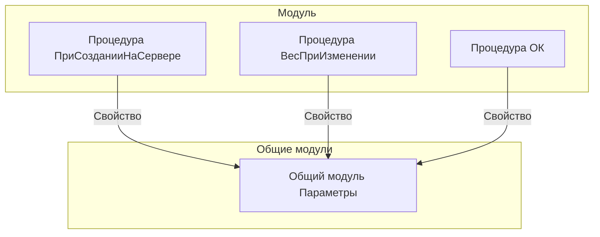

# Граф зависимостей: ФормаВводаВесаВручную

## Диаграмма

## Статистика

- **Процедур/функций:** 3
- **Экспортируемых:** 0
- **Внешних зависимостей:** 1
- **Внутренних вызовов:** 3

## Детали зависимостей

| Тип | Имя | Использований | Тип использования | Методы |
|-----|-----|---------------|-------------------|--------|
| module | Параметры | 1 | call | Свойство |

---
*Сгенерировано автоматически: 2026-03-09T01:58:29.373Z*
