# Граф зависимостей: ФормаДокумента

## Диаграмма

```mermaid
graph TD
    subgraph Модуль
        Процедура_ПриСозданииНаСервере[Процедура ПриСозданииНаСервере]
        Процедура_ПриЧтенииНаСервере[Процедура ПриЧтенииНаСервере]
        Процедура_ПриОткрытии[Процедура ПриОткрытии]
        Процедура_ПередЗаписью[Процедура ПередЗаписью]
        Процедура_ПередЗаписьюНаСервере[Процедура ПередЗаписьюНаСервере]
        Процедура_ПослеЗаписи[Процедура ПослеЗаписи]
        Процедура_ПослеЗаписиНаСервере[Процедура ПослеЗаписиНаСервере]
        Процедура_ОбработкаОповещения[Процедура ОбработкаОповещения]
        Процедура_ДокументРегистрацииПриИзменении[Процедура ДокументРегистрацииПриИзменении]
        Процедура_ВесыПриИзменении[Процедура ВесыПриИзменении]
        Процедура_ВвестиВесВручную[Процедура ВвестиВесВручную]
        Процедура_ПолучитьВес[Процедура ПолучитьВес]
        Процедура_УдалитьОчередьОтвета[Процедура УдалитьОчередьОтвета]
        Процедура_Подключаемый_ВыполнитьКоманду[Процедура Подключаемый_ВыполнитьКоманду]
        Процедура_Подключаемый_ПродолжитьВыполнениеКомандыНаСервере[Процедура Подключаемый_ПродолжитьВыполнениеКомандыНаСервере]
        Процедура_ВыполнитьКомандуНаСервере[Процедура ВыполнитьКомандуНаСервере]
        Процедура_Подключаемый_ОбновитьКоманды[Процедура Подключаемый_ОбновитьКоманды]
        Процедура_ПроверитьВозможностьРедактированияФормы[Процедура ПроверитьВозможностьРедактированияФормы]
        Процедура_ИнициализироватьРеквизитыФормы[Процедура ИнициализироватьРеквизитыФормы]
        Процедура_ОбновитьИнформациюПоВесам[Процедура ОбновитьИнформациюПоВесам]
        Процедура_ОбновитьОтклонениеПоВесам[Процедура ОбновитьОтклонениеПоВесам]
        Процедура_ИнициализироватьЧасовойПояс[Процедура ИнициализироватьЧасовойПояс]
        Процедура_ИнициализироватьТипВзвешивания[Процедура ИнициализироватьТипВзвешивания]
        Функция_ПроверятьМаксимальноДопустимуюМассуАвто([Функция ПроверятьМаксимальноДопустимуюМассуАвто])
        Процедура_ИнициализироватьДанныеРегистрации[Процедура ИнициализироватьДанныеРегистрации]
        Процедура_ИнициализироватьЭлементыФормы[Процедура ИнициализироватьЭлементыФормы]
        Процедура_ИнициализироватьСписокВыбораТочекМаршрута[Процедура ИнициализироватьСписокВыбораТочекМаршрута]
        Процедура_УстановитьВидимостьДоступностьЭлементовФормы[Процедура УстановитьВидимостьДоступностьЭлементовФормы]
        Процедура_УстановитьДоступностьКнопкиЗаписать[Процедура УстановитьДоступностьКнопкиЗаписать]
        Процедура_УстановитьВидимостьДоступностьДокументРегистрации[Процедура УстановитьВидимостьДоступностьДокументРегистрации]
        Процедура_УстановитьВидимостьДоступностьТочкиМаршрута[Процедура УстановитьВидимостьДоступностьТочкиМаршрута]
        Процедура_УстановитьВидимостьДоступностьОстальныхЭлементов[Процедура УстановитьВидимостьДоступностьОстальныхЭлементов]
        Процедура_УстановитьВидимостьДоступностьДат[Процедура УстановитьВидимостьДоступностьДат]
        Процедура_УстановитьВидимостьДоступностьКомандСервисаВзвешивания[Процедура УстановитьВидимостьДоступностьКомандСервисаВзвешивания]
        Процедура_УстановитьСостояниеПослеВзвешивания[Процедура УстановитьСостояниеПослеВзвешивания]
        Процедура_ДокументРегистрацииПриИзмененииНаСервере[Процедура ДокументРегистрацииПриИзмененииНаСервере]
        Процедура_ВвестиВесВручную_Закрытие[Процедура ВвестиВесВручную_Закрытие]
        Функция_СуществующийДокументОткрытИзАРМа([Функция СуществующийДокументОткрытИзАРМа])
        Процедура_ПолучитьВесНаСервере[Процедура ПолучитьВесНаСервере]
        Процедура_УдалитьОчередьОтветаНаСервере[Процедура УдалитьОчередьОтветаНаСервере]
        Процедура_ОбновитьИнформациюОПревышенииВесаАвтомобиля[Процедура ОбновитьИнформациюОПревышенииВесаАвтомобиля]
        Функция_ПроверкаДопустимогоВесаАвтомобиля([Функция ПроверкаДопустимогоВесаАвтомобиля])
    end

    subgraph Общие модули
        Модуль_Параметры["Модуль Параметры"]
        Модуль_ПодключаемыеКоманды["Модуль ПодключаемыеКоманды"]
        Модуль_ПодключаемыеКомандыКлиентСервер["Модуль ПодключаемыеКомандыКлиентСервер"]
        Модуль_ОбщегоНазначения["Модуль ОбщегоНазначения"]
        Модуль_МодульУправлениеДоступом["Модуль МодульУправлениеДоступом"]
        Модуль_гкс_УправлениеДоступом["Модуль гкс_УправлениеДоступом"]
        Модуль_ПодключаемыеКомандыКлиент["Модуль ПодключаемыеКомандыКлиент"]
        Модуль_ОценкаПроизводительностиКлиент["Модуль ОценкаПроизводительностиКлиент"]
        Модуль_Ссылка["Модуль Ссылка"]
        Модуль_ДополнительныеСвойства["Модуль ДополнительныеСвойства"]
        Модуль_УправлениеДоступом["Модуль УправлениеДоступом"]
        Модуль_ПараметрыФормы["Модуль ПараметрыФормы"]
        Модуль_ОбщегоНазначенияКлиент["Модуль ОбщегоНазначенияКлиент"]
        Модуль_ОбщегоНазначенияКлиентСервер["Модуль ОбщегоНазначенияКлиентСервер"]
        Модуль_Пользователи["Модуль Пользователи"]
        Модуль_Ключ["Модуль Ключ"]
        Модуль_гкс_ПриемкаНаПЛКСервер["Модуль гкс_ПриемкаНаПЛКСервер"]
        Модуль_гкс_ТипыВзвешивания["Модуль гкс_ТипыВзвешивания"]
        Модуль_гкс_РегистрацияНаПЛК["Модуль гкс_РегистрацияНаПЛК"]
        Модуль_гкс_ТипыТранспортныхСредствДоставки["Модуль гкс_ТипыТранспортныхСредствДоставки"]
        Модуль_СтруктураРеквизитов["Модуль СтруктураРеквизитов"]
        Модуль_МенеджерРегистра["Модуль МенеджерРегистра"]
        Модуль_СписокВыбора["Модуль СписокВыбора"]
        Модуль_ПодчиненныеЭлементы["Модуль ПодчиненныеЭлементы"]
        Модуль_гкс_ПриемкаТранспорта["Модуль гкс_ПриемкаТранспорта"]
        Модуль_гкс_НастройкиПользователейПриемкаНаПЛК["Модуль гкс_НастройкиПользователейПриемкаНаПЛК"]
        Модуль_гкс_ОбменДаннымиСВесами["Модуль гкс_ОбменДаннымиСВесами"]
        Модуль_МассивПодстрок["Модуль МассивПодстрок"]
    end

    subgraph Документы
        Документ_гкс_РегистрацияНаПЛК{{Документ гкс_РегистрацияНаПЛК}}
        Документ_гкс_Взвешивание{{Документ гкс_Взвешивание}}
    end

    subgraph Перечисления
        Перечисление_гкс_ТипРегистрации[[Перечисление гкс_ТипРегистрации]]
        Перечисление_гкс_ТипыВзвешивания[[Перечисление гкс_ТипыВзвешивания]]
        Перечисление_гкс_ТипыТранспортныхСредствДоставки[[Перечисление гкс_ТипыТранспортныхСредствДоставки]]
        Перечисление_гкс_СостоянияРегистрации[[Перечисление гкс_СостоянияРегистрации]]
    end

    subgraph Регистры
        Регистр_гкс_НастройкиПользователейПриемкаНаПЛК[(Регистр гкс_НастройкиПользователейПриемкаНаПЛК)]
    end

    Процедура_ПриСозданииНаСервере -->|Свойство| Модуль_Параметры
    Процедура_ПриСозданииНаСервере -->|ПриСозданииНаСервере| Модуль_ПодключаемыеКоманды
    Процедура_ПриСозданииНаСервере -->|ЗамерВремени| Модуль_ОценкаПроизводительностиКлиент
    Процедура_ПриСозданииНаСервере -->|НачатьОбновлениеКоманд| Модуль_ПодключаемыеКомандыКлиент
    Процедура_ПриСозданииНаСервере -->|ИнициализироватьРеквизитыФормы| Процедура_ИнициализироватьРеквизитыФормы
    Процедура_ПриСозданииНаСервере -->|ИнициализироватьЭлементыФормы| Процедура_ИнициализироватьЭлементыФормы
    Процедура_ПриСозданииНаСервере -->|УстановитьВидимостьДоступностьЭлементовФормы| Процедура_УстановитьВидимостьДоступностьЭлементовФормы

    Процедура_ПриЧтенииНаСервере -->|ПриЧтенииНаСервере| Модуль_МодульУправлениеДоступом
    Процедура_ПриЧтенииНаСервере -->|ОпределитьДоступностьВозможностьИзмененияДокументаПоРеестру| Модуль_гкс_УправлениеДоступом
    Процедура_ПриЧтенииНаСервере -->|ЗначениеРеквизитаОбъекта| Модуль_ОбщегоНазначения
    Процедура_ПриЧтенииНаСервере -->|ЗначенияРеквизитовОбъекта| Модуль_ОбщегоНазначения
    Процедура_ПриЧтенииНаСервере -->|ПроверитьВозможностьРедактированияФормы| Процедура_ПроверитьВозможностьРедактированияФормы

    Процедура_ПриОткрытии -->|ЗамерВремени| Модуль_ОценкаПроизводительностиКлиент
    Процедура_ПриОткрытии -->|НачатьОбновлениеКоманд| Модуль_ПодключаемыеКомандыКлиент
    Процедура_ПриОткрытии -->|ИнициализироватьРеквизитыФормы| Процедура_ИнициализироватьРеквизитыФормы
    Процедура_ПриОткрытии -->|ИнициализироватьЭлементыФормы| Процедура_ИнициализироватьЭлементыФормы
    Процедура_ПриОткрытии -->|УстановитьВидимостьДоступностьЭлементовФормы| Процедура_УстановитьВидимостьДоступностьЭлементовФормы

    Процедура_ПередЗаписью -->|ЗначениеРеквизитаОбъекта| Модуль_ОбщегоНазначения
    Процедура_ПередЗаписью -->|ПередЗаписьюНаСервере| Процедура_ПередЗаписьюНаСервере

    Процедура_ПередЗаписьюНаСервере -->|ЗначениеРеквизитаОбъекта| Модуль_ОбщегоНазначения
    Процедура_ПередЗаписьюНаСервере -->|ПередЗаписьюНаСервере| Процедура_ПередЗаписью
    Процедура_ПередЗаписьюНаСервере -->|ПослеЗаписиНаСервере| Процедура_ПослеЗаписиНаСервере
    Процедура_ПередЗаписьюНаСервере -->|УстановитьСостояниеПослеВзвешивания| Процедура_УстановитьСостояниеПослеВзвешивания

    Процедура_ПослеЗаписи -->|ПослеЗаписи| Модуль_УправлениеДоступом
    Процедура_ПослеЗаписи -->|ПослеЗаписиНаСервере| Процедура_ПослеЗаписиНаСервере
    Процедура_ПослеЗаписи -->|НачатьВыполнениеКоманды| Модуль_ПодключаемыеКомандыКлиент

    Процедура_ПослеЗаписиНаСервере -->|ПослеЗаписиНаСервере| Модуль_УправлениеДоступом
    Процедура_ПослеЗаписиНаСервере -->|ПослеЗаписиНаСервере| Процедура_ПослеЗаписи

    Процедура_ОбработкаОповещения -->|ЗначениеРеквизитаОбъекта| Модуль_ОбщегоНазначения
    Процедура_ОбработкаОповещения -->|СообщитьПользователю| Модуль_ОбщегоНазначения
    Процедура_ОбработкаОповещения -->|СообщитьПользователю| Модуль_ОбщегоНазначенияКлиент

    Процедура_ДокументРегистрацииПриИзменении -->|ДокументРегистрацииПриИзмененииНаСервере| Процедура_ДокументРегистрацииПриИзмененииНаСервере
    Процедура_ДокументРегистрацииПриИзменении -->|УстановитьВидимостьДоступностьДокументРегистрации| Процедура_УстановитьВидимостьДоступностьДокументРегистрации

    Процедура_ВесыПриИзменении -->|ОбновитьИнформациюПоВесам| Процедура_ОбновитьИнформациюПоВесам
    Процедура_ВесыПриИзменении -->|ОбновитьОтклонениеПоВесам| Процедура_ОбновитьОтклонениеПоВесам
    Процедура_ВесыПриИзменении -->|УстановитьВидимостьДоступностьКомандСервисаВзвешивания| Процедура_УстановитьВидимостьДоступностьКомандСервисаВзвешивания
    Процедура_ВесыПриИзменении -->|УстановитьСостояниеПослеВзвешивания| Процедура_УстановитьСостояниеПослеВзвешивания

    Процедура_ВвестиВесВручную -->|ВвестиВесВручную_Закрытие| Процедура_ВвестиВесВручную_Закрытие
    Процедура_ВвестиВесВручную -->|ПолучитьВесНаСервере| Процедура_ПолучитьВесНаСервере
    Процедура_ВвестиВесВручную -->|УдалитьОчередьОтветаНаСервере| Процедура_УдалитьОчередьОтветаНаСервере

    Процедура_ПолучитьВес -->|ПолучитьВесНаСервере| Процедура_ПолучитьВесНаСервере
    Процедура_ПолучитьВес -->|УдалитьОчередьОтветаНаСервере| Процедура_УдалитьОчередьОтветаНаСервере
    Процедура_ПолучитьВес -->|РезультатыВзвешивания| Модуль_гкс_ОбменДаннымиСВесами

    Процедура_УдалитьОчередьОтвета -->|УдалитьОчередьОтветаНаСервере| Процедура_УдалитьОчередьОтветаНаСервере
```

## Статистика

- **Процедур/функций:** 42
- **Экспортируемых:** 2
- **Внешних зависимостей:** 35
- **Внутренних вызовов:** 42

## Детали зависимостей

| Тип | Имя | Использований | Тип использования | Методы |
|-----|-----|---------------|-------------------|--------|
| module | Параметры | 3 | call | Свойство |
| module | ПодключаемыеКоманды | 2 | call | ПриСозданииНаСервере, ВыполнитьКоманду |
| module | ПодключаемыеКомандыКлиентСервер | 2 | call | ОбновитьКоманды |
| module | ОбщегоНазначения | 9 | call | ПодсистемаСуществует, ОбщийМодуль, ЗначениеРеквизитаОбъекта, СообщитьПользователю, ЗначенияРеквизитовОбъекта |
| module | МодульУправлениеДоступом | 1 | call | ПриЧтенииНаСервере |
| module | гкс_УправлениеДоступом | 1 | call | ОпределитьДоступностьВозможностьИзмененияДокументаПоРеестру |
| module | ПодключаемыеКомандыКлиент | 3 | call | НачатьОбновлениеКоманд, ПослеЗаписи, НачатьВыполнениеКоманды |
| module | ОценкаПроизводительностиКлиент | 2 | call | ЗамерВремени, УстановитьПризнакОшибкиЗамера |
| module | Ссылка | 1 | call | Пустая |
| module | ДополнительныеСвойства | 2 | call | Вставить |
| module | УправлениеДоступом | 1 | call | ПослеЗаписиНаСервере |
| module | ПараметрыФормы | 1 | call | Вставить |
| module | ОбщегоНазначенияКлиент | 2 | call | СообщитьПользователю |
| module | ОбщегоНазначенияКлиентСервер | 2 | call | СообщитьОшибкиПользователю, ДобавитьОшибкуПользователю |
| module | Пользователи | 4 | call | ЭтоПолноправныйПользователь, ТекущийПользователь |
| module | Ключ | 3 | call | Пустая |
| module | гкс_ПриемкаНаПЛКСервер | 1 | call | ПоказанияВесовПоРегистрации |
| module | гкс_ТипыВзвешивания | 1 | call | ВидВеса |
| module | гкс_РегистрацияНаПЛК | 1 | call | ЧасовойПоясРегистрации |
| module | гкс_ТипыТранспортныхСредствДоставки | 1 | call | ЭтоАвтоПеревозка |
| module | СтруктураРеквизитов | 7 | call | Вставить |
| module | МенеджерРегистра | 1 | call | НастроенныеТочкиМаршрутаПользователя |
| module | СписокВыбора | 3 | call | ЗагрузитьЗначения, Количество |
| module | ПодчиненныеЭлементы | 1 | call | Найти |
| module | гкс_ПриемкаТранспорта | 4 | call | ЭтоПользовательСРольюАдминистраторПЛК, ПроверкаЗаполненияДляКонтроляПревышенияВесаАвтомобиля, МаксимальныйДопустимыйВес, ПолучитьЕдиницуИзмеренияВесаПриемки |
| module | гкс_НастройкиПользователейПриемкаНаПЛК | 1 | call | НастроенныеТочкиМаршрутаПользователя |
| module | гкс_ОбменДаннымиСВесами | 2 | call | РезультатыВзвешивания, УдалитьОчередьСообщений |
| module | МассивПодстрок | 2 | call | Добавить |
| enum | гкс_ТипРегистрации | 2 | reference | - |
| enum | гкс_ТипыВзвешивания | 3 | reference | - |
| document | гкс_РегистрацияНаПЛК | 1 | reference | - |
| enum | гкс_ТипыТранспортныхСредствДоставки | 1 | reference | - |
| register | гкс_НастройкиПользователейПриемкаНаПЛК | 2 | reference | - |
| document | гкс_Взвешивание | 1 | reference | - |
| enum | гкс_СостоянияРегистрации | 1 | reference | - |

---
*Сгенерировано автоматически: 2026-03-09T01:58:39.012Z*
