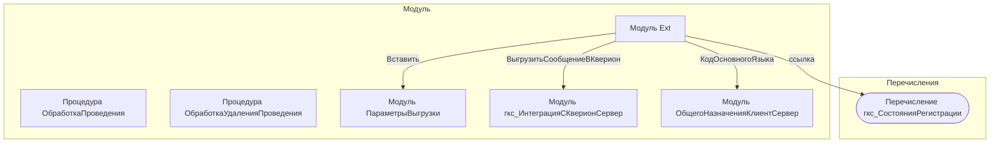

# Граф зависимостей: Ext

## Диаграмма

## Статистика

- **Процедур/функций:** 2
- **Экспортируемых:** 0
- **Внешних зависимостей:** 4
- **Внутренних вызовов:** 2

## Детали зависимостей

| Тип | Имя | Использований | Тип использования | Методы |
|-----|-----|---------------|-------------------|--------|
| module | ПараметрыВыгрузки | 6 | call | Вставить |
| module | гкс_ИнтеграцияСКверионСервер | 2 | call | ВыгрузитьСообщениеВКверион |
| module | ОбщегоНазначенияКлиентСервер | 1 | call | КодОсновногоЯзыка |
| enum | гкс_СостоянияРегистрации | 2 | reference | - |

---
*Сгенерировано автоматически: 2026-03-09T02:00:46.241Z*
