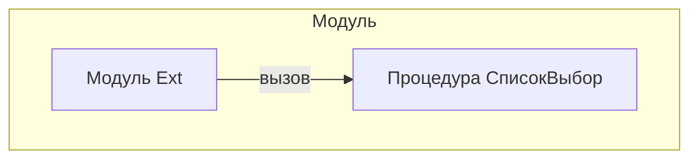

# Граф зависимостей: Ext

## Диаграмма

## Статистика

- **Процедур/функций:** 1
- **Экспортируемых:** 0
- **Внешних зависимостей:** 0
- **Внутренних вызовов:** 1

## Детали зависимостей

| Тип | Имя | Использований | Тип использования | Методы |
|-----|-----|---------------|-------------------|--------|

---
*Сгенерировано автоматически: 2026-03-09T01:56:19.073Z*
