# Граф зависимостей: ФормаДокумента

## Диаграмма

```mermaid
graph TD
    subgraph Модуль
        Процедура_ПриСозданииНаСервере[Процедура ПриСозданииНаСервере]
        Процедура_ПриЧтенииНаСервере[Процедура ПриЧтенииНаСервере]
        Процедура_ПриОткрытии[Процедура ПриОткрытии]
        Процедура_ПередЗаписью[Процедура ПередЗаписью]
        Процедура_ПослеЗаписи[Процедура ПослеЗаписи]
        Процедура_Подключаемый_ВыполнитьКоманду[Процедура Подключаемый_ВыполнитьКоманду]
        Процедура_Подключаемый_ПродолжитьВыполнениеКомандыНаСервере[Процедура Подключаемый_ПродолжитьВыполнениеКомандыНаСервере]
        Процедура_ВыполнитьКомандуНаСервере[Процедура ВыполнитьКомандуНаСервере]
        Процедура_Подключаемый_ОбновитьКоманды[Процедура Подключаемый_ОбновитьКоманды]
    end

    subgraph Общие модули
        Модуль_ПодключаемыеКоманды["Модуль ПодключаемыеКоманды"]
        Модуль_Параметры["Модуль Параметры"]
        Модуль_ПодключаемыеКомандыКлиентСервер["Модуль ПодключаемыеКомандыКлиентСервер"]
        Модуль_ПодключаемыеКомандыКлиент["Модуль ПодключаемыеКомандыКлиент"]
        Модуль_ОбщегоНазначенияКлиент["Модуль ОбщегоНазначенияКлиент"]
    end

    Процедура_ПриСозданииНаСервере -->|ПриСозданииНаСервере| Модуль_ПодключаемыеКоманды
    Процедура_ПриСозданииНаСервере -->|НачатьОбновлениеКоманд| Модуль_ПодключаемыеКомандыКлиент
    Процедура_ПриЧтенииНаСервере -->|Свойство| Модуль_Параметры
    Процедура_ПриОткрытии -->|НачатьОбновлениеКоманд| Модуль_ПодключаемыеКомандыКлиент
    Процедура_ПередЗаписью -->|ПослеЗаписи| Модуль_ПодключаемыеКомандыКлиент
    Процедура_ПослеЗаписи -->|ПослеЗаписи| Модуль_ПодключаемыеКомандыКлиент
    Процедура_Подключаемый_ВыполнитьКоманду -->|ВыполнитьКоманду| Модуль_ПодключаемыеКоманды
    Процедура_Подключаемый_ВыполнитьКоманду -->|НачатьВыполнениеКоманды| Модуль_ПодключаемыеКомандыКлиент
    Процедура_Подключаемый_ПродолжитьВыполнениеКомандыНаСервере -->|ОбновитьКоманды| Модуль_ПодключаемыеКомандыКлиентСервер
    Процедура_ВыполнитьКомандуНаСервере -->|СообщитьПользователю, ДатаСеанса| Модуль_ОбщегоНазначенияКлиент
    Процедура_Подключаемый_ОбновитьКоманды -->|ОбновитьКоманды| Модуль_ПодключаемыеКомандыКлиентСервер
```

## Статистика

- **Процедур/функций:** 9
- **Экспортируемых:** 1
- **Внешних зависимостей:** 5
- **Внутренних вызовов:** 9

## Детали зависимостей

| Тип | Имя | Использований | Тип использования | Методы |
|-----|-----|---------------|-------------------|--------|
| module | ПодключаемыеКоманды | 2 | call | ПриСозданииНаСервере, ВыполнитьКоманду |
| module | Параметры | 1 | call | Свойство |
| module | ПодключаемыеКомандыКлиентСервер | 2 | call | ОбновитьКоманды |
| module | ПодключаемыеКомандыКлиент | 3 | call | НачатьОбновлениеКоманд, ПослеЗаписи, НачатьВыполнениеКоманды |
| module | ОбщегоНазначенияКлиент | 2 | call | СообщитьПользователю, ДатаСеанса |

---
*Сгенерировано автоматически: 2026-03-09T01:58:44.622Z*
