# Граф зависимостей: гкс_ВъездНаКПП

## Диаграмма

```mermaid
graph TD
    subgraph module["Модуль"]
        Модуль_гкс_ВъездНаКПП["Модуль гкс_ВъездНаКПП"]
        Процедура_ОбработкаПроведения["Процедура ОбработкаПроведения"]
        Процедура_ОбработкаУдаленияПроведения["Процедура ОбработкаУдаленияПроведения"]
        Процедура_СписокВыбор["Процедура СписокВыбор"]
        Процедура_ПриСозданииНаСервере["Процедура ПриСозданииНаСервере"]
        Процедура_ПриЧтенииНаСервере["Процедура ПриЧтенииНаСервере"]
        Процедура_ПриОткрытии["Процедура ПриОткрытии"]
        Процедура_ПередЗаписью["Процедура ПередЗаписью"]
        Процедура_ПослеЗаписи["Процедура ПослеЗаписи"]
        Процедура_Подключаемый_ВыполнитьКоманду["Процедура Подключаемый_ВыполнитьКоманду"]
        Процедура_Подключаемый_ПродолжитьВыполнениеКомандыНаСервере_Экспорт["Процедура Подключаемый_ПродолжитьВыполнениеКомандыНаСервере Экспорт"]
        Процедура_ВыполнитьКомандуНаСервере["Процедура ВыполнитьКомандуНаСервере"]
        Процедура_Подключаемый_ОбновитьКоманды["Процедура Подключаемый_ОбновитьКоманды"]
    end
    subgraph module["Общие модули"]
        Модуль_ПараметрыВыгрузки["Модуль ПараметрыВыгрузки"]
        Модуль_гкс_ИнтеграцияСКверионСервер["Модуль гкс_ИнтеграцияСКверионСервер"]
        Модуль_ОбщегоНазначенияКлиентСервер["Модуль ОбщегоНазначенияКлиентСервер"]
        Модуль_ПодключаемыеКоманды["Модуль ПодключаемыеКоманды"]
        Модуль_Параметры["Модуль Параметры"]
        Модуль_ПодключаемыеКомандыКлиентСервер["Модуль ПодключаемыеКомандыКлиентСервер"]
        Модуль_ПодключаемыеКомандыКлиент["Модуль ПодключаемыеКомандыКлиент"]
        Модуль_ОбщегоНазначенияКлиент["Модуль ОбщегоНазначенияКлиент"]
    end
    subgraph enum["Перечисления"]
        Перечисление_гкс_СостоянияРегистрации(["Перечисление гкс_СостоянияРегистрации"])
    end
    Модуль_гкс_ВъездНаКПП -->|Вставить| Модуль_ПараметрыВыгрузки
    Модуль_гкс_ВъездНаКПП -->|ВыгрузитьСообщениеВКверион| Модуль_гкс_ИнтеграцияСКверионСервер
    Модуль_гкс_ВъездНаКПП -->|КодОсновногоЯзыка| Модуль_ОбщегоНазначенияКлиентСервер
    Модуль_гкс_ВъездНаКПП -->|ПриСозданииНаСервере, ВыполнитьКоманду| Модуль_ПодключаемыеКоманды
    Модуль_гкс_ВъездНаКПП -->|Свойство| Модуль_Параметры
    Модуль_гкс_ВъездНаКПП -->|ОбновитьКоманды| Модуль_ПодключаемыеКомандыКлиентСервер
    Модуль_гкс_ВъездНаКПП -->|НачатьОбновлениеКоманд, ПослеЗаписи, НачатьВыполнениеКоманды| Модуль_ПодключаемыеКомандыКлиент
    Модуль_гкс_ВъездНаКПП -->|СообщитьПользователю, ДатаСеанса| Модуль_ОбщегоНазначенияКлиент
    Модуль_гкс_ВъездНаКПП -->|ссылка| Перечисление_гкс_СостоянияРегистрации
```

## Статистика

- **Процедур/функций:** 12
- **Экспортируемых:** 1
- **Внешних зависимостей:** 9
- **Внутренних вызовов:** 12

## Детали зависимостей

| Тип | Имя | Использований | Тип использования | Методы |
|-----|-----|---------------|-------------------|--------|
| module | ПараметрыВыгрузки | 6 | call | Вставить |
| module | гкс_ИнтеграцияСКверионСервер | 2 | call | ВыгрузитьСообщениеВКверион |
| module | ОбщегоНазначенияКлиентСервер | 1 | call | КодОсновногоЯзыка |
| enum | гкс_СостоянияРегистрации | 2 | reference | - |
| module | ПодключаемыеКоманды | 2 | call | ПриСозданииНаСервере, ВыполнитьКоманду |
| module | Параметры | 1 | call | Свойство |
| module | ПодключаемыеКомандыКлиентСервер | 2 | call | ОбновитьКоманды |
| module | ПодключаемыеКомандыКлиент | 3 | call | НачатьОбновлениеКоманд, ПослеЗаписи, НачатьВыполнениеКоманды |
| module | ОбщегоНазначенияКлиент | 2 | call | СообщитьПользователю, ДатаСеанса |

---
*Сгенерировано автоматически: 2026-03-09T02:01:22.425Z*
