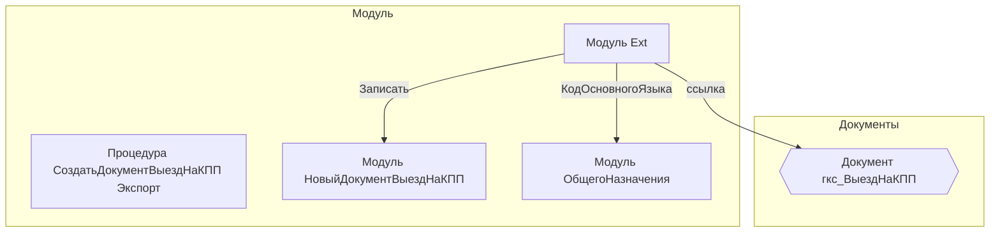

# Граф зависимостей: Ext

## Диаграмма

## Статистика

- **Процедур/функций:** 1
- **Экспортируемых:** 1
- **Внешних зависимостей:** 3
- **Внутренних вызовов:** 1

## Детали зависимостей

| Тип | Имя | Использований | Тип использования | Методы |
|-----|-----|---------------|-------------------|--------|
| module | НовыйДокументВыездНаКПП | 1 | call | Записать |
| module | ОбщегоНазначения | 1 | call | КодОсновногоЯзыка |
| document | гкс_ВыездНаКПП | 1 | reference | - |

---
*Сгенерировано автоматически: 2026-03-09T02:01:01.015Z*
