# Граф зависимостей: Forms

## Диаграмма

```mermaid
graph TD
    subgraph module["Модуль"]
        Модуль_Forms["Модуль Forms"]
        Процедура_ПриЧтенииНаСервере["Процедура ПриЧтенииНаСервере"]
        Процедура_ПриСозданииНаСервере["Процедура ПриСозданииНаСервере"]
        Процедура_ПриОткрытии["Процедура ПриОткрытии"]
        Процедура_ТранспортныйДокументПриИзменении["Процедура ТранспортныйДокументПриИзменении"]
        Процедура_ТранспортныйДокументНачалоВыбора["Процедура ТранспортныйДокументНачалоВыбора"]
        Процедура_ПослеЗаписиНаСервере["Процедура ПослеЗаписиНаСервере"]
        Процедура_ЗаполнитьКачественныеПоказатели["Процедура ЗаполнитьКачественныеПоказатели"]
        Процедура_КомандаТранспортВыбратьВсе["Процедура КомандаТранспортВыбратьВсе"]
        Процедура_КомандаТранспортСнятьВсе["Процедура КомандаТранспортСнятьВсе"]
        Процедура_КомандаАнализыВыбратьВсе["Процедура КомандаАнализыВыбратьВсе"]
        Процедура_КомандаАнализыСнятьВсе["Процедура КомандаАнализыСнятьВсе"]
        Процедура_ЗаполнитьТабличныеЧасти["Процедура ЗаполнитьТабличныеЧасти"]
        Процедура_ЗаполнитьТабличныеЧастиНаСервере["Процедура ЗаполнитьТабличныеЧастиНаСервере"]
        Процедура_ЗаполнитьТабличнуюЧастьАнализыНаСервере["Процедура ЗаполнитьТабличнуюЧастьАнализыНаСервере"]
        Процедура_УстановитьФлаги["Процедура УстановитьФлаги"]
        Процедура_Подключаемый_ВыполнитьКоманду["Процедура Подключаемый_ВыполнитьКоманду"]
        Процедура_Подключаемый_ВыполнитьКомандуНаСервере["Процедура Подключаемый_ВыполнитьКомандуНаСервере"]
        Процедура_Подключаемый_ОбновитьКоманды["Процедура Подключаемый_ОбновитьКоманды"]
        Процедура_ПриСозданииНаСервере["Процедура ПриСозданииНаСервере"]
        Процедура_СписокПриАктивизацииСтроки["Процедура СписокПриАктивизацииСтроки"]
        Процедура_ВыполнитьКомандуНаСервере["Процедура ВыполнитьКомандуНаСервере"]
        Процедура_Подключаемый_ПродолжитьВыполнениеКомандыНаСервере_Экспорт["Процедура Подключаемый_ПродолжитьВыполнениеКомандыНаСервере Экспорт"]
        Процедура_Подключаемый_ВыполнитьКоманду["Процедура Подключаемый_ВыполнитьКоманду"]
        Процедура_Подключаемый_ОбновитьКоманды["Процедура Подключаемый_ОбновитьКоманды"]
    end
    subgraph module["Общие модули"]
        Модуль_ОбщегоНазначения["Модуль ОбщегоНазначения"]
        Модуль_МодульУправлениеДоступом["Модуль МодульУправлениеДоступом"]
        Модуль_ПодключаемыеКомандыКлиентСервер["Модуль ПодключаемыеКомандыКлиентСервер"]
        Модуль_Параметры["Модуль Параметры"]
        Модуль_Ссылка["Модуль Ссылка"]
        Модуль_Пользователи["Модуль Пользователи"]
        Модуль_ПодключаемыеКоманды["Модуль ПодключаемыеКоманды"]
        Модуль_ПодключаемыеКомандыКлиент["Модуль ПодключаемыеКомандыКлиент"]
        Модуль_СтруктураОтбораПоЗаданию["Модуль СтруктураОтбораПоЗаданию"]
        Модуль_УправлениеДоступом["Модуль УправлениеДоступом"]
    end
    subgraph document["Документы"]
        Документ_ДокументОбъект{{Документ ДокументОбъект}}
    end
    Модуль_Forms -->|ПодсистемаСуществует, ОбщийМодуль| Модуль_ОбщегоНазначения
    Модуль_Forms -->|ПриЧтенииНаСервере| Модуль_МодульУправлениеДоступом
    Модуль_Forms -->|ОбновитьКоманды| Модуль_ПодключаемыеКомандыКлиентСервер
    Модуль_Forms -->|Свойство| Модуль_Параметры
    Модуль_Forms -->|Пустая| Модуль_Ссылка
    Модуль_Forms -->|ТекущийПользователь| Модуль_Пользователи
    Модуль_Forms -->|ПриСозданииНаСервере, ВыполнитьКоманду| Модуль_ПодключаемыеКоманды
    Модуль_Forms -->|НачатьОбновлениеКоманд, ВыполнитьКоманду, НачатьВыполнениеКоманды| Модуль_ПодключаемыеКомандыКлиент
    Модуль_Forms -->|Вставить| Модуль_СтруктураОтбораПоЗаданию
    Модуль_Forms -->|ПослеЗаписиНаСервере| Модуль_УправлениеДоступом
    Модуль_Forms -->|ЗаполнитьТабличнуюЧастьТранспортныеСредства, ЗаполнитьТабличнуюЧастьАнализы| Документ_ДокументОбъект
```

## Статистика

- **Процедур/функций:** 24
- **Экспортируемых:** 1
- **Внешних зависимостей:** 11
- **Внутренних вызовов:** 21

## Детали зависимостей

| Тип | Имя | Использований | Тип использования | Методы |
|-----|-----|---------------|-------------------|--------|
| module | ОбщегоНазначения | 2 | call | ПодсистемаСуществует, ОбщийМодуль |
| module | МодульУправлениеДоступом | 1 | call | ПриЧтенииНаСервере |
| module | ПодключаемыеКомандыКлиентСервер | 3 | call | ОбновитьКоманды |
| module | Параметры | 1 | call | Свойство |
| module | Ссылка | 1 | call | Пустая |
| module | Пользователи | 1 | call | ТекущийПользователь |
| module | ПодключаемыеКоманды | 4 | call | ПриСозданииНаСервере, ВыполнитьКоманду |
| module | ПодключаемыеКомандыКлиент | 4 | call | НачатьОбновлениеКоманд, ВыполнитьКоманду, НачатьВыполнениеКоманды |
| module | СтруктураОтбораПоЗаданию | 3 | call | Вставить |
| module | УправлениеДоступом | 1 | call | ПослеЗаписиНаСервере |
| document | ДокументОбъект | 3 | reference | ЗаполнитьТабличнуюЧастьТранспортныеСредства, ЗаполнитьТабличнуюЧастьАнализы |

---
*Сгенерировано автоматически: 2026-03-09T02:01:00.607Z*
