# Граф зависимостей: Ext

## Диаграмма

```mermaid
graph TD
    subgraph Модуль
        Процедура_ПриЧтенииНаСервере[Процедура ПриЧтенииНаСервере]
        Процедура_ПриСозданииНаСервере[Процедура ПриСозданииНаСервере]
        Процедура_ПриОткрытии[Процедура ПриОткрытии]
        Процедура_ТранспортныйДокументПриИзменении[Процедура ТранспортныйДокументПриИзменении]
        Процедура_ТранспортныйДокументНачалоВыбора[Процедура ТранспортныйДокументНачалоВыбора]
        Процедура_ПослеЗаписиНаСервере[Процедура ПослеЗаписиНаСервере]
        Процедура_ЗаполнитьКачественныеПоказатели[Процедура ЗаполнитьКачественныеПоказатели]
        Процедура_КомандаТранспортВыбратьВсе[Процедура КомандаТранспортВыбратьВсе]
        Процедура_КомандаТранспортСнятьВсе[Процедура КомандаТранспортСнятьВсе]
        Процедура_КомандаАнализыВыбратьВсе[Процедура КомандаАнализыВыбратьВсе]
        Процедура_КомандаАнализыСнятьВсе[Процедура КомандаАнализыСнятьВсе]
        Процедура_ЗаполнитьТабличныеЧасти[Процедура ЗаполнитьТабличныеЧасти]
        Процедура_ЗаполнитьТабличныеЧастиНаСервере[Процедура ЗаполнитьТабличныеЧастиНаСервере]
        Процедура_ЗаполнитьТабличнуюЧастьАнализыНаСервере[Процедура ЗаполнитьТабличнуюЧастьАнализыНаСервере]
        Процедура_УстановитьФлаги[Процедура УстановитьФлаги]
        Процедура_Подключаемый_ВыполнитьКоманду[Процедура Подключаемый_ВыполнитьКоманду]
        Процедура_Подключаемый_ВыполнитьКомандуНаСервере[Процедура Подключаемый_ВыполнитьКомандуНаСервере]
        Процедура_Подключаемый_ОбновитьКоманды[Процедура Подключаемый_ОбновитьКоманды]
    end

    subgraph Общие модули
        Модуль_ОбщегоНазначения["Общий модуль ОбщегоНазначения"]
        Модуль_МодульУправлениеДоступом["Общий модуль МодульУправлениеДоступом"]
        Модуль_ПодключаемыеКомандыКлиентСервер["Общий модуль ПодключаемыеКомандыКлиентСервер"]
        Модуль_Параметры["Общий модуль Параметры"]
        Модуль_Ссылка["Общий модуль Ссылка"]
        Модуль_Пользователи["Общий модуль Пользователи"]
        Модуль_ПодключаемыеКоманды["Общий модуль ПодключаемыеКоманды"]
        Модуль_ПодключаемыеКомандыКлиент["Общий модуль ПодключаемыеКомандыКлиент"]
        Модуль_СтруктураОтбораПоЗаданию["Общий модуль СтруктураОтбораПоЗаданию"]
        Модуль_УправлениеДоступом["Общий модуль УправлениеДоступом"]
    end

    subgraph Документы
        Документ_ДокументОбъект{{Документ ДокументОбъект}}
    end

    Процедура_ПриЧтенииНаСервере -->|ПриЧтенииНаСервере| Модуль_МодульУправлениеДоступом
    Процедура_ПриСозданииНаСервере -->|ПриСозданииНаСервере| Модуль_ПодключаемыеКоманды
    Процедура_ПослеЗаписиНаСервере -->|ПослеЗаписиНаСервере| Модуль_УправлениеДоступом
    Процедура_КомандаТранспортВыбратьВсе -->|ВыполнитьКоманду| Модуль_ПодключаемыеКоманды
    Процедура_КомандаТранспортСнятьВсе -->|ВыполнитьКоманду| Модуль_ПодключаемыеКоманды
    Процедура_КомандаАнализыВыбратьВсе -->|ВыполнитьКоманду| Модуль_ПодключаемыеКоманды
    Процедура_КомандаАнализыСнятьВсе -->|ВыполнитьКоманду| Модуль_ПодключаемыеКоманды
    Процедура_ЗаполнитьТабличныеЧасти -->|ЗаполнитьТабличнуюЧастьТранспортныеСредства, ЗаполнитьТабличнуюЧастьАнализы| Документ_ДокументОбъект
    Процедура_ЗаполнитьТабличныеЧасти -->|ЗаполнитьТабличныеЧасти| Процедура_ЗаполнитьТабличныеЧастиНаСервере
    Процедура_ЗаполнитьТабличныеЧастиНаСервере -->|ЗаполнитьТабличнуюЧастьАнализыНаСервере| Процедура_ЗаполнитьТабличнуюЧастьАнализыНаСервере
    Процедура_Подключаемый_ВыполнитьКоманду -->|ВыполнитьКоманду| Модуль_ПодключаемыеКомандыКлиент
    Процедура_Подключаемый_ВыполнитьКоманду -->|ВыполнитьКоманду| Модуль_ПодключаемыеКомандыКлиентСервер
    Процедура_Подключаемый_ВыполнитьКомандуНаСервере -->|ВыполнитьКоманду| Модуль_ПодключаемыеКомандыКлиент
    Процедура_Подключаемый_ОбновитьКоманды -->|ОбновитьКоманды| Модуль_ПодключаемыеКомандыКлиентСервер
    Процедура_Подключаемый_ОбновитьКоманды -->|НачатьОбновлениеКоманд| Модуль_ПодключаемыеКомандыКлиент

    Модуль_ОбщегоНазначения -->|ПодсистемаСуществует, ОбщийМодуль| Процедура_ПриЧтенииНаСервере
    Модуль_Параметры -->|Свойство| Процедура_ПриЧтенииНаСервере
    Модуль_Ссылка -->|Пустая| Процедура_ПриЧтенииНаСервере
    Модуль_Пользователи -->|ТекущийПользователь| Процедура_ПриЧтенииНаСервере
    Модуль_СтруктураОтбораПоЗаданию -->|Вставить| Процедура_ЗаполнитьКачественныеПоказатели
```

## Статистика

- **Процедур/функций:** 18
- **Экспортируемых:** 0
- **Внешних зависимостей:** 11
- **Внутренних вызовов:** 18

## Детали зависимостей

| Тип | Имя | Использований | Тип использования | Методы |
|-----|-----|---------------|-------------------|--------|
| module | ОбщегоНазначения | 2 | call | ПодсистемаСуществует, ОбщийМодуль |
| module | МодульУправлениеДоступом | 1 | call | ПриЧтенииНаСервере |
| module | ПодключаемыеКомандыКлиентСервер | 2 | call | ОбновитьКоманды |
| module | Параметры | 1 | call | Свойство |
| module | Ссылка | 1 | call | Пустая |
| module | Пользователи | 1 | call | ТекущийПользователь |
| module | ПодключаемыеКоманды | 2 | call | ПриСозданииНаСервере, ВыполнитьКоманду |
| module | ПодключаемыеКомандыКлиент | 2 | call | НачатьОбновлениеКоманд, ВыполнитьКоманду |
| module | СтруктураОтбораПоЗаданию | 3 | call | Вставить |
| module | УправлениеДоступом | 1 | call | ПослеЗаписиНаСервере |
| document | ДокументОбъект | 3 | reference | ЗаполнитьТабличнуюЧастьТранспортныеСредства, ЗаполнитьТабличнуюЧастьАнализы |

---
*Сгенерировано автоматически: 2026-03-09T01:56:23.618Z*
