# Граф зависимостей: гкс_ЗаданияНаПроверкуКачества

## Диаграмма

```mermaid
graph TD
    subgraph module["Модуль"]
        Модуль_гкс_ЗаданияНаПроверкуКачества["Модуль гкс_ЗаданияНаПроверкуКачества"]
        Процедура_ЗарегистрироватьУчетныеМеханизмы_Экспорт["Процедура ЗарегистрироватьУчетныеМеханизмы Экспорт"]
        Функция_ДанныеДокументаДляПроведения_Экспорт(["Функция ДанныеДокументаДляПроведения Экспорт"])
        Процедура_ЗаполнитьПараметрыИнициализации["Процедура ЗаполнитьПараметрыИнициализации"]
        Функция_ПолучитьСписокДоступныхТранспортныхДокументов_Экспорт(["Функция ПолучитьСписокДоступныхТранспортныхДокументов Экспорт"])
        Функция_ТекстЗапросаПолучениеСпискаНормативныПоказателейАнализа_Экспорт(["Функция ТекстЗапросаПолучениеСпискаНормативныПоказателейАнализа Экспорт"])
        Функция_ЗаполнитьПоказателиНоменклатурыСУчетомЗаданий_Экспорт(["Функция ЗаполнитьПоказателиНоменклатурыСУчетомЗаданий Экспорт"])
        Процедура_ПриЗаполненииОграниченияДоступа_Экспорт["Процедура ПриЗаполненииОграниченияДоступа Экспорт"]
        Функция_ТекстЗапросаТаблицагкс_ЗаданияНаПроверкуКачества(["Функция ТекстЗапросаТаблицагкс_ЗаданияНаПроверкуКачества"])
        Процедура_ЗаполнитьТабличнуюЧастьТранспортныеСредства_Экспорт["Процедура ЗаполнитьТабличнуюЧастьТранспортныеСредства Экспорт"]
        Процедура_ЗаполнитьТабличнуюЧастьАнализы_Экспорт["Процедура ЗаполнитьТабличнуюЧастьАнализы Экспорт"]
        Процедура_ПередЗаписью["Процедура ПередЗаписью"]
        Процедура_ПриЗаписи["Процедура ПриЗаписи"]
        Процедура_ОбработкаПроведения["Процедура ОбработкаПроведения"]
        Процедура_ОбработкаУдаленияПроведения["Процедура ОбработкаУдаленияПроведения"]
        Процедура_ОбработкаЗаполнения["Процедура ОбработкаЗаполнения"]
        Процедура_ПриЧтенииНаСервере["Процедура ПриЧтенииНаСервере"]
        Процедура_ПриСозданииНаСервере["Процедура ПриСозданииНаСервере"]
        Процедура_ПриОткрытии["Процедура ПриОткрытии"]
        Процедура_ТранспортныйДокументПриИзменении["Процедура ТранспортныйДокументПриИзменении"]
        Процедура_ТранспортныйДокументНачалоВыбора["Процедура ТранспортныйДокументНачалоВыбора"]
        Процедура_ПослеЗаписиНаСервере["Процедура ПослеЗаписиНаСервере"]
        Процедура_ЗаполнитьКачественныеПоказатели["Процедура ЗаполнитьКачественныеПоказатели"]
        Процедура_КомандаТранспортВыбратьВсе["Процедура КомандаТранспортВыбратьВсе"]
        Процедура_КомандаТранспортСнятьВсе["Процедура КомандаТранспортСнятьВсе"]
        Процедура_КомандаАнализыВыбратьВсе["Процедура КомандаАнализыВыбратьВсе"]
        Процедура_КомандаАнализыСнятьВсе["Процедура КомандаАнализыСнятьВсе"]
        Процедура_ЗаполнитьТабличныеЧасти["Процедура ЗаполнитьТабличныеЧасти"]
        Процедура_ЗаполнитьТабличныеЧастиНаСервере["Процедура ЗаполнитьТабличныеЧастиНаСервере"]
        Процедура_ЗаполнитьТабличнуюЧастьАнализыНаСервере["Процедура ЗаполнитьТабличнуюЧастьАнализыНаСервере"]
        Процедура_УстановитьФлаги["Процедура УстановитьФлаги"]
        Процедура_Подключаемый_ВыполнитьКоманду["Процедура Подключаемый_ВыполнитьКоманду"]
        Процедура_Подключаемый_ВыполнитьКомандуНаСервере["Процедура Подключаемый_ВыполнитьКомандуНаСервере"]
        Процедура_Подключаемый_ОбновитьКоманды["Процедура Подключаемый_ОбновитьКоманды"]
        Процедура_ПриСозданииНаСервере["Процедура ПриСозданииНаСервере"]
        Процедура_СписокПриАктивизацииСтроки["Процедура СписокПриАктивизацииСтроки"]
        Процедура_ВыполнитьКомандуНаСервере["Процедура ВыполнитьКомандуНаСервере"]
        Процедура_Подключаемый_ПродолжитьВыполнениеКомандыНаСервере_Экспорт["Процедура Подключаемый_ПродолжитьВыполнениеКомандыНаСервере Экспорт"]
        Процедура_Подключаемый_ВыполнитьКоманду["Процедура Подключаемый_ВыполнитьКоманду"]
        Процедура_Подключаемый_ОбновитьКоманды["Процедура Подключаемый_ОбновитьКоманды"]
    end
    subgraph module["Общие модули"]
        Модуль_МеханизмыДокумента["Модуль МеханизмыДокумента"]
        Модуль_гкс_ПроведениеДокументов["Модуль гкс_ПроведениеДокументов"]
        Модуль_ДопПараметры["Модуль ДопПараметры"]
        Модуль_Запрос["Модуль Запрос"]
        Модуль_Пользователи["Модуль Пользователи"]
        Модуль_гкс_ФормированиеНомераПробы["Модуль гкс_ФормированиеНомераПробы"]
        Модуль_РезультатЗапроса["Модуль РезультатЗапроса"]
        Модуль_ТаблицаТД["Модуль ТаблицаТД"]
        Модуль_гкс_ЗаданияНаПроверкуКачества["Модуль гкс_ЗаданияНаПроверкуКачества"]
        Модуль_Колонки["Модуль Колонки"]
        Модуль_ТекстыЗапроса["Модуль ТекстыЗапроса"]
        Модуль_ТранспортныеСредства["Модуль ТранспортныеСредства"]
        Модуль_ОбщегоНазначения["Модуль ОбщегоНазначения"]
        Модуль_Анализы["Модуль Анализы"]
        Модуль_ОбновлениеИнформационнойБазы["Модуль ОбновлениеИнформационнойБазы"]
        Модуль_гкс_ЗаполнениеДокументов["Модуль гкс_ЗаполнениеДокументов"]
        Модуль_МодульУправлениеДоступом["Модуль МодульУправлениеДоступом"]
        Модуль_ПодключаемыеКомандыКлиентСервер["Модуль ПодключаемыеКомандыКлиентСервер"]
        Модуль_Параметры["Модуль Параметры"]
        Модуль_Ссылка["Модуль Ссылка"]
        Модуль_ПодключаемыеКоманды["Модуль ПодключаемыеКоманды"]
        Модуль_ПодключаемыеКомандыКлиент["Модуль ПодключаемыеКомандыКлиент"]
        Модуль_СтруктураОтбораПоЗаданию["Модуль СтруктураОтбораПоЗаданию"]
        Модуль_УправлениеДоступом["Модуль УправлениеДоступом"]
    end
    subgraph enum["Перечисления"]
        Перечисление_гкс_ТипыТранспортныхСредствДоставки(["Перечисление гкс_ТипыТранспортныхСредствДоставки"])
        Перечисление_гкс_ТипРегистрации(["Перечисление гкс_ТипРегистрации"])
    end
    subgraph document["Документы"]
        Документ_гкс_ФормированиеНомераПробы{{Документ гкс_ФормированиеНомераПробы}}
        Документ_гкс_ЗаданияНаПроверкуКачества{{Документ гкс_ЗаданияНаПроверкуКачества}}
        Документ_ДокументОбъект{{Документ ДокументОбъект}}
    end
    Модуль_гкс_ЗаданияНаПроверкуКачества -->|Добавить| Модуль_МеханизмыДокумента
    Модуль_гкс_ЗаданияНаПроверкуКачества -->|ДопПараметрыИнициализироватьДанныеДокументаДляПроведения, ИнициализироватьДанныеДокументаДляПроведения, ТребуетсяТаблицаДляДвижений...| Модуль_гкс_ПроведениеДокументов
    Модуль_гкс_ЗаданияНаПроверкуКачества -->|Свойство| Модуль_ДопПараметры
    Модуль_гкс_ЗаданияНаПроверкуКачества -->|УстановитьПараметр, Выполнить| Модуль_Запрос
    Модуль_гкс_ЗаданияНаПроверкуКачества -->|ТекущийПользователь| Модуль_Пользователи
    Модуль_гкс_ЗаданияНаПроверкуКачества -->|ПустаяСсылка| Модуль_гкс_ФормированиеНомераПробы
    Модуль_гкс_ЗаданияНаПроверкуКачества -->|Пустой, Выгрузить| Модуль_РезультатЗапроса
    Модуль_гкс_ЗаданияНаПроверкуКачества -->|ВыгрузитьКолонку| Модуль_ТаблицаТД
    Модуль_гкс_ЗаданияНаПроверкуКачества -->|ТекстЗапросаПолучениеСпискаНормативныПоказателейАнализа, СрезПоследних| Модуль_гкс_ЗаданияНаПроверкуКачества
    Модуль_гкс_ЗаданияНаПроверкуКачества -->|Добавить| Модуль_Колонки
    Модуль_гкс_ЗаданияНаПроверкуКачества -->|Добавить| Модуль_ТекстыЗапроса
    Модуль_гкс_ЗаданияНаПроверкуКачества -->|Очистить, Загрузить, Количество| Модуль_ТранспортныеСредства
    Модуль_гкс_ЗаданияНаПроверкуКачества -->|СообщитьПользователю, ПодсистемаСуществует, ОбщийМодуль| Модуль_ОбщегоНазначения
    Модуль_гкс_ЗаданияНаПроверкуКачества -->|Очистить, Загрузить, Количество| Модуль_Анализы
    Модуль_гкс_ЗаданияНаПроверкуКачества -->|ПроверитьОбъектОбработан| Модуль_ОбновлениеИнформационнойБазы
    Модуль_гкс_ЗаданияНаПроверкуКачества -->|Заполнить| Модуль_гкс_ЗаполнениеДокументов
    Модуль_гкс_ЗаданияНаПроверкуКачества -->|ПриЧтенииНаСервере| Модуль_МодульУправлениеДоступом
    Модуль_гкс_ЗаданияНаПроверкуКачества -->|ОбновитьКоманды| Модуль_ПодключаемыеКомандыКлиентСервер
    Модуль_гкс_ЗаданияНаПроверкуКачества -->|Свойство| Модуль_Параметры
    Модуль_гкс_ЗаданияНаПроверкуКачества -->|Пустая| Модуль_Ссылка
    Модуль_гкс_ЗаданияНаПроверкуКачества -->|ПриСозданииНаСервере, ВыполнитьКоманду| Модуль_ПодключаемыеКоманды
    Модуль_гкс_ЗаданияНаПроверкуКачества -->|НачатьОбновлениеКоманд, ВыполнитьКоманду, НачатьВыполнениеКоманды| Модуль_ПодключаемыеКомандыКлиент
    Модуль_гкс_ЗаданияНаПроверкуКачества -->|Вставить| Модуль_СтруктураОтбораПоЗаданию
    Модуль_гкс_ЗаданияНаПроверкуКачества -->|ПослеЗаписиНаСервере| Модуль_УправлениеДоступом
    Модуль_гкс_ЗаданияНаПроверкуКачества -->|ссылка| Перечисление_гкс_ТипыТранспортныхСредствДоставки
    Модуль_гкс_ЗаданияНаПроверкуКачества -->|ссылка| Перечисление_гкс_ТипРегистрации
    Модуль_гкс_ЗаданияНаПроверкуКачества -->|ссылка| Документ_гкс_ФормированиеНомераПробы
    Модуль_гкс_ЗаданияНаПроверкуКачества -->|ссылка| Документ_гкс_ЗаданияНаПроверкуКачества
    Модуль_гкс_ЗаданияНаПроверкуКачества -->|ЗаполнитьТабличнуюЧастьТранспортныеСредства, ЗаполнитьТабличнуюЧастьАнализы| Документ_ДокументОбъект
```

## Статистика

- **Процедур/функций:** 39
- **Экспортируемых:** 9
- **Внешних зависимостей:** 29
- **Внутренних вызовов:** 36

## Детали зависимостей

| Тип | Имя | Использований | Тип использования | Методы |
|-----|-----|---------------|-------------------|--------|
| module | МеханизмыДокумента | 1 | call | Добавить |
| module | гкс_ПроведениеДокументов | 7 | call | ДопПараметрыИнициализироватьДанныеДокументаДляПроведения, ИнициализироватьДанныеДокументаДляПроведения, ТребуетсяТаблицаДляДвижений, ПередЗаписьюДокумента, ПриЗаписиДокумента... |
| module | ДопПараметры | 1 | call | Свойство |
| module | Запрос | 26 | call | УстановитьПараметр, Выполнить |
| module | Пользователи | 2 | call | ТекущийПользователь |
| module | гкс_ФормированиеНомераПробы | 1 | call | ПустаяСсылка |
| module | РезультатЗапроса | 5 | call | Пустой, Выгрузить |
| module | ТаблицаТД | 1 | call | ВыгрузитьКолонку |
| module | гкс_ЗаданияНаПроверкуКачества | 3 | call | ТекстЗапросаПолучениеСпискаНормативныПоказателейАнализа, СрезПоследних |
| module | Колонки | 1 | call | Добавить |
| module | ТекстыЗапроса | 1 | call | Добавить |
| enum | гкс_ТипыТранспортныхСредствДоставки | 2 | reference | - |
| enum | гкс_ТипРегистрации | 2 | reference | - |
| document | гкс_ФормированиеНомераПробы | 1 | reference | - |
| document | гкс_ЗаданияНаПроверкуКачества | 2 | reference | - |
| module | ТранспортныеСредства | 3 | call | Очистить, Загрузить, Количество |
| module | ОбщегоНазначения | 4 | call | СообщитьПользователю, ПодсистемаСуществует, ОбщийМодуль |
| module | Анализы | 3 | call | Очистить, Загрузить, Количество |
| module | ОбновлениеИнформационнойБазы | 1 | call | ПроверитьОбъектОбработан |
| module | гкс_ЗаполнениеДокументов | 1 | call | Заполнить |
| module | МодульУправлениеДоступом | 1 | call | ПриЧтенииНаСервере |
| module | ПодключаемыеКомандыКлиентСервер | 3 | call | ОбновитьКоманды |
| module | Параметры | 1 | call | Свойство |
| module | Ссылка | 1 | call | Пустая |
| module | ПодключаемыеКоманды | 4 | call | ПриСозданииНаСервере, ВыполнитьКоманду |
| module | ПодключаемыеКомандыКлиент | 4 | call | НачатьОбновлениеКоманд, ВыполнитьКоманду, НачатьВыполнениеКоманды |
| module | СтруктураОтбораПоЗаданию | 3 | call | Вставить |
| module | УправлениеДоступом | 1 | call | ПослеЗаписиНаСервере |
| document | ДокументОбъект | 3 | reference | ЗаполнитьТабличнуюЧастьТранспортныеСредства, ЗаполнитьТабличнуюЧастьАнализы |

---
*Сгенерировано автоматически: 2026-03-09T02:01:22.429Z*
