# Граф зависимостей: ФормаДокумента

## Диаграмма

```mermaid
graph TD
    subgraph Модуль
        Процедура_ПриСозданииНаСервере["Процедура ПриСозданииНаСервере"]
        Процедура_ПриЧтенииНаСервере["Процедура ПриЧтенииНаСервере"]
        Процедура_ПриОткрытии["Процедура ПриОткрытии"]
        Процедура_ПередЗаписью["Процедура ПередЗаписью"]
        Процедура_ПередЗаписьюНаСервере["Процедура ПередЗаписьюНаСервере"]
        Процедура_ПослеЗаписи["Процедура ПослеЗаписи"]
        Процедура_ПослеЗаписиНаСервере["Процедура ПослеЗаписиНаСервере"]
        Процедура_ПровестиИЗакрыть["Процедура ПровестиИЗакрыть"]
        Процедура_Провести["Процедура Провести"]
        Процедура_Подключаемый_ВыполнитьКоманду["Процедура Подключаемый_ВыполнитьКоманду"]
        Процедура_Подключаемый_ПродолжитьВыполнениеКомандыНаСервере["Процедура Подключаемый_ПродолжитьВыполнениеКомандыНаСервере"]
        Процедура_ВыполнитьКомандуНаСервере["Процедура ВыполнитьКомандуНаСервере"]
        Процедура_Подключаемый_ОбновитьКоманды["Процедура Подключаемый_ОбновитьКоманды"]
        Процедура_УстановитьВидимостьДоступностьФормы["Процедура УстановитьВидимостьДоступностьФормы"]
        Процедура_ПроверкаЗаполненияНаКлиенте["Процедура ПроверкаЗаполненияНаКлиенте"]
        Процедура_ВыполнитьНачальноеЗаполнение["Процедура ВыполнитьНачальноеЗаполнение"]
        Функция_ДанныеСтатистикиПоТР(["Функция ДанныеСтатистикиПоТР"])
    end

    subgraph Общие модули
        Модуль_Ключ["Модуль Ключ"]
        Модуль_ПодключаемыеКоманды["Модуль ПодключаемыеКоманды"]
        Модуль_ПодключаемыеКомандыКлиентСервер["Модуль ПодключаемыеКомандыКлиентСервер"]
        Модуль_ОбщегоНазначения["Модуль ОбщегоНазначения"]
        Модуль_МодульУправлениеДоступом["Модуль МодульУправлениеДоступом"]
        Модуль_ПодключаемыеКомандыКлиент["Модуль ПодключаемыеКомандыКлиент"]
        Модуль_ОценкаПроизводительностиКлиент["Модуль ОценкаПроизводительностиКлиент"]
        Модуль_ДополнительныеСвойства["Модуль ДополнительныеСвойства"]
        Модуль_УправлениеДоступом["Модуль УправлениеДоступом"]
        Модуль_гкс_ОбщегоНазначенияПЛККлиент["Модуль гкс_ОбщегоНазначенияПЛККлиент"]
        Модуль_Пользователи["Модуль Пользователи"]
        Модуль_гкс_ГрафикОтгрузкиПЛК["Модуль гкс_ГрафикОтгрузкиПЛК"]
    end

    subgraph Регистры
        Регистр_гкс_ГрафикОтгрузкиПЛК[(Регистр гкс_ГрафикОтгрузкиПЛК)]
    end

    Процедура_ПриСозданииНаСервере -->|ПриСозданииНаСервере| Модуль_ПодключаемыеКоманды
    Процедура_ПриСозданииНаСервере -->|ВыполнитьНачальноеЗаполнение| Процедура_ВыполнитьНачальноеЗаполнение
    Процедура_ПриСозданииНаСервере -->|УстановитьВидимостьДоступностьФормы| Процедура_УстановитьВидимостьДоступностьФормы
    Процедура_ПриЧтенииНаСервере -->|ПриЧтенииНаСервере| Модуль_МодульУправлениеДоступом
    Процедура_ПриЧтенииНаСервере -->|ПриЧтенииНаСервере| Процедура_ПриЧтенииНаСервере
    Процедура_ПриОткрытии -->|ПриОткрытии| Процедура_ПриОткрытии
    Процедура_ПередЗаписью -->|ПередЗаписью| Процедура_ПередЗаписью
    Процедура_ПередЗаписью -->|ПроверкаЗаполненияНаКлиенте| Процедура_ПроверкаЗаполненияНаКлиенте
    Процедура_ПередЗаписьюНаСервере -->|ПередЗаписьюНаСервере| Процедура_ПередЗаписьюНаСервере
    Процедура_ПослеЗаписи -->|ПослеЗаписи| Процедура_ПослеЗаписи
    Процедура_ПослеЗаписи -->|ПослеЗаписи| Модуль_ПодключаемыеКомандыКлиент
    Процедура_ПослеЗаписиНаСервере -->|ПослеЗаписиНаСервере| Процедура_ПослеЗаписиНаСервере
    Процедура_ПослеЗаписиНаСервере -->|ПослеЗаписиНаСервере| Модуль_УправлениеДоступом
    Процедура_ПровестиИЗакрыть -->|ПровестиИЗакрыть| Процедура_ПровестиИЗакрыть
    Процедура_ПровестиИЗакрыть -->|ПровестиИЗакрыть| Модуль_гкс_ОбщегоНазначенияПЛККлиент
    Процедура_Провести -->|Провести| Процедура_Провести
    Процедура_Провести -->|Провести| Модуль_гкс_ОбщегоНазначенияПЛККлиент
    Процедура_Подключаемый_ВыполнитьКоманду -->|ВыполнитьКоманду| Модуль_ПодключаемыеКоманды
    Процедура_Подключаемый_ВыполнитьКоманду -->|НачатьВыполнениеКоманды| Модуль_ПодключаемыеКомандыКлиент
    Процедура_Подключаемый_ПродолжитьВыполнениеКомандыНаСервере -->|Подключаемый_ПродолжитьВыполнениеКомандыНаСервере| Процедура_Подключаемый_ПродолжитьВыполнениеКомандыНаСервере
    Процедура_ВыполнитьКомандуНаСервере -->|ВыполнитьКомандуНаСервере| Процедура_ВыполнитьКомандуНаСервере
    Процедура_Подключаемый_ОбновитьКоманды -->|ОбновитьКоманды| Модуль_ПодключаемыеКомандыКлиентСервер
    Процедура_Подключаемый_ОбновитьКоманды -->|ОбновитьКоманды| Процедура_Подключаемый_ОбновитьКоманды
    Процедура_УстановитьВидимостьДоступностьФормы -->|УстановитьВидимостьДоступностьФормы| Процедура_УстановитьВидимостьДоступностьФормы
    Процедура_ПроверкаЗаполненияНаКлиенте -->|ПроверкаЗаполненияНаКлиенте| Процедура_ПроверкаЗаполненияНаКлиенте
    Процедура_ВыполнитьНачальноеЗаполнение -->|ВыполнитьНачальноеЗаполнение| Процедура_ВыполнитьНачальноеЗаполнение
    Функция_ДанныеСтатистикиПоТР -->|ДанныеСтатистикиПоТР| Функция_ДанныеСтатистикиПоТР
    Функция_ДанныеСтатистикиПоТР -->|СтатистикаПоТранспортнымСредствамДляЗаполнения| Модуль_гкс_ГрафикОтгрузкиПЛК
    Процедура_ПриСозданииНаСервере -->|Пустая| Модуль_Ключ
    Процедура_ПриСозданииНаСервере -->|ЗамерВремени, УстановитьПризнакОшибкиЗамера| Модуль_ОценкаПроизводительностиКлиент
    Процедура_ПриЧтенииНаСервере -->|ЗамерВремени, УстановитьПризнакОшибкиЗамера| Модуль_ОценкаПроизводительностиКлиент
    Процедура_ПриОткрытии -->|ЗамерВремени, УстановитьПризнакОшибкиЗамера| Модуль_ОценкаПроизводительностиКлиент
    Процедура_ПередЗаписью -->|ЗамерВремени, УстановитьПризнакОшибкиЗамера| Модуль_ОценкаПроизводительностиКлиент
    Процедура_ПередЗаписьюНаСервере -->|ЗамерВремени, УстановитьПризнакОшибкиЗамера| Модуль_ОценкаПроизводительностиКлиент
    Процедура_ПослеЗаписи -->|ЗамерВремени, УстановитьПризнакОшибкиЗамера| Модуль_ОценкаПроизводительностиКлиент
    Процедура_ПослеЗаписиНаСервере -->|ЗамерВремени, УстановитьПризнакОшибкиЗамера| Модуль_ОценкаПроизводительностиКлиент
    Процедура_ПровестиИЗакрыть -->|ЗамерВремени, УстановитьПризнакОшибкиЗамера| Модуль_ОценкаПроизводительностиКлиент
    Процедура_Провести -->|ЗамерВремени, УстановитьПризнакОшибкиЗамера| Модуль_ОценкаПроизводительностиКлиент
    Процедура_Подключаемый_ВыполнитьКоманду -->|ЗамерВремени, УстановитьПризнакОшибкиЗамера| Модуль_ОценкаПроизводительностиКлиент
    Процедура_Подключаемый_ПродолжитьВыполнениеКомандыНаСервере -->|ЗамерВремени, УстановитьПризнакОшибкиЗамера| Модуль_ОценкаПроизводительностиКлиент
    Процедура_ВыполнитьКомандуНаСервере -->|ЗамерВремени, УстановитьПризнакОшибкиЗамера| Модуль_ОценкаПроизводительностиКлиент
    Процедура_Подключаемый_ОбновитьКоманды -->|ЗамерВремени, УстановитьПризнакОшибкиЗамера| Модуль_ОценкаПроизводительностиКлиент
    Процедура_УстановитьВидимостьДоступностьФормы -->|ЗамерВремени, УстановитьПризнакОшибкиЗамера| Модуль_ОценкаПроизводительностиКлиент
    Процедура_ПроверкаЗаполненияНаКлиенте -->|ЗамерВремени, УстановитьПризнакОшибкиЗамера| Модуль_ОценкаПроизводительностиКлиент
    Процедура_ВыполнитьНачальноеЗаполнение -->|ЗамерВремени, УстановитьПризнакОшибкиЗамера| Модуль_ОценкаПроизводительностиКлиент
    Функция_ДанныеСтатистикиПоТР -->|ЗамерВремени, УстановитьПризнакОшибкиЗамера| Модуль_ОценкаПроизводительностиКлиент
    Процедура_ПриСозданииНаСервере -->|ПодсистемаСуществует, ОбщийМодуль| Модуль_ОбщегоНазначения
    Процедура_ПриЧтенииНаСервере -->|ПодсистемаСуществует, ОбщийМодуль| Модуль_ОбщегоНазначения
    Процедура_ПриОткрытии -->|ПодсистемаСуществует, ОбщийМодуль| Модуль_ОбщегоНазначения
    Процедура_ПередЗаписью -->|ПодсистемаСуществует, ОбщийМодуль| Модуль_ОбщегоНазначения
    Процедура_ПередЗаписьюНаСервере -->|ПодсистемаСуществует, ОбщийМодуль| Модуль_ОбщегоНазначения
    Процедура_ПослеЗаписи -->|ПодсистемаСуществует, ОбщийМодуль| Модуль_ОбщегоНазначения
    Процедура_ПослеЗаписиНаСервере -->|ПодсистемаСуществует, ОбщийМодуль| Модуль_ОбщегоНазначения
    Процедура_ПровестиИЗакрыть -->|ПодсистемаСуществует, ОбщийМодуль| Модуль_ОбщегоНазначения
    Процедура_Провести -->|ПодсистемаСуществует, ОбщийМодуль| Модуль_ОбщегоНазначения
    Процедура_Подключаемый_ВыполнитьКоманду -->|ПодсистемаСуществует, ОбщийМодуль| Модуль_ОбщегоНазначения
    Процедура_Подключаемый_ПродолжитьВыполнениеКомандыНаСервере -->|ПодсистемаСуществует, ОбщийМодуль| Модуль_ОбщегоНазначения
    Процедура_ВыполнитьКомандуНаСервере -->|ПодсистемаСуществует, ОбщийМодуль| Модуль_ОбщегоНазначения
    Процедура_Подключаемый_ОбновитьКоманды -->|ПодсистемаСуществует, ОбщийМодуль| Модуль_ОбщегоНазначения
    Процедура_УстановитьВидимостьДоступностьФормы -->|ПодсистемаСуществует, ОбщийМодуль| Модуль_ОбщегоНазначения
    Процедура_ПроверкаЗаполненияНаКлиенте -->|ПодсистемаСуществует, ОбщийМодуль| Модуль_ОбщегоНазначения
    Процедура_ВыполнитьНачальноеЗаполнение -->|ПодсистемаСуществует, ОбщийМодуль| Модуль_ОбщегоНазначения
    Функция_ДанныеСтатистикиПоТР -->|ПодсистемаСуществует, ОбщийМодуль| Модуль_ОбщегоНазначения
    Процедура_ПриСозданииНаСервере -->|НачатьОбновлениеКоманд| Модуль_ПодключаемыеКомандыКлиент
    Процедура_ВыполнитьКомандуНаСервере -->|НачатьВыполнениеКоманды| Модуль_ПодключаемыеКомандыКлиент
    Процедура_ПослеЗаписиНаСервере -->|Вставить| Модуль_ДополнительныеСвойства
    Процедура_ПослеЗаписиНаСервере -->|ПослеЗаписиНаСервере| Модуль_УправлениеДоступом
    Процедура_Провести -->|ЭтоПолноправныйПользователь| Модуль_Пользователи
    Регистр_гкс_ГрафикОтгрузкиПЛК -->|ссылка| Модуль_гкс_ГрафикОтгрузкиПЛК
```

## Статистика

- **Процедур/функций:** 17
- **Экспортируемых:** 1
- **Внешних зависимостей:** 13
- **Внутренних вызовов:** 17

## Детали зависимостей

| Тип | Имя | Использований | Тип использования | Методы |
|-----|-----|---------------|-------------------|--------|
| module | Ключ | 1 | call | Пустая |
| module | ПодключаемыеКоманды | 2 | call | ПриСозданииНаСервере, ВыполнитьКоманду |
| module | ПодключаемыеКомандыКлиентСервер | 2 | call | ОбновитьКоманды |
| module | ОбщегоНазначения | 2 | call | ПодсистемаСуществует, ОбщийМодуль |
| module | МодульУправлениеДоступом | 1 | call | ПриЧтенииНаСервере |
| module | ПодключаемыеКомандыКлиент | 3 | call | НачатьОбновлениеКоманд, ПослеЗаписи, НачатьВыполнениеКоманды |
| module | ОценкаПроизводительностиКлиент | 2 | call | ЗамерВремени, УстановитьПризнакОшибкиЗамера |
| module | ДополнительныеСвойства | 1 | call | Вставить |
| module | УправлениеДоступом | 1 | call | ПослеЗаписиНаСервере |
| module | гкс_ОбщегоНазначенияПЛККлиент | 2 | call | ПровестиИЗакрыть, Провести |
| module | Пользователи | 1 | call | ЭтоПолноправныйПользователь |
| module | гкс_ГрафикОтгрузкиПЛК | 1 | call | СтатистикаПоТранспортнымСредствамДляЗаполнения |
| register | гкс_ГрафикОтгрузкиПЛК | 1 | reference | - |

---
*Сгенерировано автоматически: 2026-03-09T01:59:01.664Z*
