# Граф зависимостей: Ext

## Диаграмма

```mermaid
graph TD
    subgraph module["Модуль"]
        Модуль_Ext["Модуль Ext"]
        Процедура_ЗарегистрироватьУчетныеМеханизмы_Экспорт["Процедура ЗарегистрироватьУчетныеМеханизмы Экспорт"]
        Функция_ДанныеДокументаДляПроведения_Экспорт(["Функция ДанныеДокументаДляПроведения Экспорт"])
        Процедура_ПриЗаполненииОграниченияДоступа_Экспорт["Процедура ПриЗаполненииОграниченияДоступа Экспорт"]
        Процедура_ЗаполнитьПараметрыИнициализации["Процедура ЗаполнитьПараметрыИнициализации"]
        Процедура_ТекстЗапросаТаблицаГрафикПриемкиПЛК["Процедура ТекстЗапросаТаблицаГрафикПриемкиПЛК"]
        Процедура_ПередЗаписью["Процедура ПередЗаписью"]
        Процедура_ОбработкаПроведения["Процедура ОбработкаПроведения"]
        Процедура_ОбработкаУдаленияПроведения["Процедура ОбработкаУдаленияПроведения"]
        Процедура_ПроверитьСвязанныеЗаписиВОчередь["Процедура ПроверитьСвязанныеЗаписиВОчередь"]
        Процедура_ЗаполнитьДополнительныеСвойстваОбъекта["Процедура ЗаполнитьДополнительныеСвойстваОбъекта"]
        Функция_ДанныеДокумента(["Функция ДанныеДокумента"])
        Процедура_ПроверитьЗаполнениеОбъектаПередЗаписью["Процедура ПроверитьЗаполнениеОбъектаПередЗаписью"]
        Функция_ЕстьИзменения(["Функция ЕстьИзменения"])
        Функция_ИзмененияДокумента(["Функция ИзмененияДокумента"])
        Процедура_ДобавитьПериодКонтроляИзменений["Процедура ДобавитьПериодКонтроляИзменений"]
        Процедура_ПроверитьДоступностьМестВГрафикеИОчереди["Процедура ПроверитьДоступностьМестВГрафикеИОчереди"]
        Функция_ЕстьСвободноеМестоВОчереди(["Функция ЕстьСвободноеМестоВОчереди"])
        Функция_ЕстьСвободноеМестоВОчередиДляИзмененнойЗаписи(["Функция ЕстьСвободноеМестоВОчередиДляИзмененнойЗаписи"])
        Функция_ЕстьЗаписьВОчередьПриемки(["Функция ЕстьЗаписьВОчередьПриемки"])
        Функция_ЕстьСвободноеМестоВГрафике(["Функция ЕстьСвободноеМестоВГрафике"])
        Процедура_УстановитьБлокировкуОчередиПоПараметрам["Процедура УстановитьБлокировкуОчередиПоПараметрам"]
        Процедура_ДобавитьЭлементБлокировкиОчереди["Процедура ДобавитьЭлементБлокировкиОчереди"]
        Процедура_УстановитьБлокировкуГрафика["Процедура УстановитьБлокировкуГрафика"]
    end
    subgraph module["Общие модули"]
        Модуль_МеханизмыДокумента["Модуль МеханизмыДокумента"]
        Модуль_гкс_ПроведениеДокументов["Модуль гкс_ПроведениеДокументов"]
        Модуль_ДопПараметры["Модуль ДопПараметры"]
        Модуль_Запрос["Модуль Запрос"]
        Модуль_ТекстыЗапроса["Модуль ТекстыЗапроса"]
        Модуль_ОбновлениеИнформационнойБазы["Модуль ОбновлениеИнформационнойБазы"]
        Модуль_ДополнительныеСвойства["Модуль ДополнительныеСвойства"]
        Модуль_ОбщегоНазначения["Модуль ОбщегоНазначения"]
        Модуль_Выборка["Модуль Выборка"]
        Модуль_ДанныеДокумента["Модуль ДанныеДокумента"]
        Модуль_гкс_ЭлектроннаяОчередь["Модуль гкс_ЭлектроннаяОчередь"]
        Модуль_ИзмененияДокумента["Модуль ИзмененияДокумента"]
        Модуль_Колонки["Модуль Колонки"]
        Модуль_ПериодыКонтроля["Модуль ПериодыКонтроля"]
        Модуль_ПараметрыЗаписиВОчередь["Модуль ПараметрыЗаписиВОчередь"]
        Модуль_гкс_ОчередьПриемкиПЛК["Модуль гкс_ОчередьПриемкиПЛК"]
        Модуль_гкс_ГрафикПриемкиПЛК["Модуль гкс_ГрафикПриемкиПЛК"]
        Модуль_Параметры["Модуль Параметры"]
        Модуль_Блокировка["Модуль Блокировка"]
        Модуль_ЭлементБлокировки["Модуль ЭлементБлокировки"]
        Модуль_ОбщегоНазначенияКлиентСервер["Модуль ОбщегоНазначенияКлиентСервер"]
    end
    subgraph register["Регистры"]
        Регистр_гкс_ОчередьПриемкиПЛК[(Регистр гкс_ОчередьПриемкиПЛК)]
        Регистр_гкс_ГрафикПриемкиПЛК[(Регистр гкс_ГрафикПриемкиПЛК)]
    end
    Модуль_Ext -->|Добавить| Модуль_МеханизмыДокумента
    Модуль_Ext -->|ДопПараметрыИнициализироватьДанныеДокументаДляПроведения, ИнициализироватьДанныеДокументаДляПроведения, ТребуетсяТаблицаДляДвижений...| Модуль_гкс_ПроведениеДокументов
    Модуль_Ext -->|Свойство| Модуль_ДопПараметры
    Модуль_Ext -->|УстановитьПараметр, Выполнить| Модуль_Запрос
    Модуль_Ext -->|Добавить| Модуль_ТекстыЗапроса
    Модуль_Ext -->|ПроверитьОбъектОбработан| Модуль_ОбновлениеИнформационнойБазы
    Модуль_Ext -->|Свойство, Вставить| Модуль_ДополнительныеСвойства
    Модуль_Ext -->|СообщитьПользователю, ЗначениеРеквизитаОбъекта| Модуль_ОбщегоНазначения
    Модуль_Ext -->|Следующий| Модуль_Выборка
    Модуль_Ext -->|Вставить| Модуль_ДанныеДокумента
    Модуль_Ext -->|ДатаЗаявкиАктуальна| Модуль_гкс_ЭлектроннаяОчередь
    Модуль_Ext -->|Свойство, Вставить| Модуль_ИзмененияДокумента
    Модуль_Ext -->|Добавить| Модуль_Колонки
    Модуль_Ext -->|Добавить| Модуль_ПериодыКонтроля
    Модуль_Ext -->|Вставить| Модуль_ПараметрыЗаписиВОчередь
    Модуль_Ext -->|ЕстьЗаписьВОчередь| Модуль_гкс_ОчередьПриемкиПЛК
    Модуль_Ext -->|ЕстьСвободноеМесто| Модуль_гкс_ГрафикПриемкиПЛК
    Модуль_Ext -->|Свойство| Модуль_Параметры
    Модуль_Ext -->|Заблокировать, Добавить| Модуль_Блокировка
    Модуль_Ext -->|УстановитьЗначение| Модуль_ЭлементБлокировки
    Модуль_Ext -->|КодОсновногоЯзыка| Модуль_ОбщегоНазначенияКлиентСервер
    Модуль_Ext -->|ссылка| Регистр_гкс_ОчередьПриемкиПЛК
    Модуль_Ext -->|ссылка| Регистр_гкс_ГрафикПриемкиПЛК
```

## Статистика

- **Процедур/функций:** 23
- **Экспортируемых:** 3
- **Внешних зависимостей:** 23
- **Внутренних вызовов:** 23

## Детали зависимостей

| Тип | Имя | Использований | Тип использования | Методы |
|-----|-----|---------------|-------------------|--------|
| module | МеханизмыДокумента | 1 | call | Добавить |
| module | гкс_ПроведениеДокументов | 6 | call | ДопПараметрыИнициализироватьДанныеДокументаДляПроведения, ИнициализироватьДанныеДокументаДляПроведения, ТребуетсяТаблицаДляДвижений, ПередЗаписьюДокумента, ОбработкаПроведенияДокумента... |
| module | ДопПараметры | 1 | call | Свойство |
| module | Запрос | 3 | call | УстановитьПараметр, Выполнить |
| module | ТекстыЗапроса | 1 | call | Добавить |
| module | ОбновлениеИнформационнойБазы | 1 | call | ПроверитьОбъектОбработан |
| module | ДополнительныеСвойства | 4 | call | Свойство, Вставить |
| module | ОбщегоНазначения | 5 | call | СообщитьПользователю, ЗначениеРеквизитаОбъекта |
| module | Выборка | 1 | call | Следующий |
| module | ДанныеДокумента | 4 | call | Вставить |
| module | гкс_ЭлектроннаяОчередь | 1 | call | ДатаЗаявкиАктуальна |
| module | ИзмененияДокумента | 8 | call | Свойство, Вставить |
| module | Колонки | 2 | call | Добавить |
| module | ПериодыКонтроля | 1 | call | Добавить |
| module | ПараметрыЗаписиВОчередь | 9 | call | Вставить |
| module | гкс_ОчередьПриемкиПЛК | 2 | call | ЕстьЗаписьВОчередь |
| module | гкс_ГрафикПриемкиПЛК | 1 | call | ЕстьСвободноеМесто |
| module | Параметры | 1 | call | Свойство |
| module | Блокировка | 4 | call | Заблокировать, Добавить |
| module | ЭлементБлокировки | 10 | call | УстановитьЗначение |
| module | ОбщегоНазначенияКлиентСервер | 1 | call | КодОсновногоЯзыка |
| register | гкс_ОчередьПриемкиПЛК | 2 | reference | - |
| register | гкс_ГрафикПриемкиПЛК | 1 | reference | - |

---
*Сгенерировано автоматически: 2026-03-09T02:01:03.254Z*
