# Граф зависимостей: Forms

## Диаграмма

```mermaid
graph TD
    subgraph module["Модуль"]
        Модуль_Forms["Модуль Forms"]
        Процедура_ПриСозданииНаСервере["Процедура ПриСозданииНаСервере"]
        Процедура_ПриЧтенииНаСервере["Процедура ПриЧтенииНаСервере"]
        Процедура_ПриОткрытии["Процедура ПриОткрытии"]
        Процедура_ПередЗаписью["Процедура ПередЗаписью"]
        Процедура_ПередЗаписьюНаСервере["Процедура ПередЗаписьюНаСервере"]
        Процедура_ПослеЗаписи["Процедура ПослеЗаписи"]
        Процедура_ПослеЗаписиНаСервере["Процедура ПослеЗаписиНаСервере"]
        Процедура_ПровестиИЗакрыть["Процедура ПровестиИЗакрыть"]
        Процедура_Провести["Процедура Провести"]
        Процедура_Подключаемый_ВыполнитьКоманду["Процедура Подключаемый_ВыполнитьКоманду"]
        Процедура_Подключаемый_ПродолжитьВыполнениеКомандыНаСервере_Экспорт["Процедура Подключаемый_ПродолжитьВыполнениеКомандыНаСервере Экспорт"]
        Процедура_ВыполнитьКомандуНаСервере["Процедура ВыполнитьКомандуНаСервере"]
        Процедура_Подключаемый_ОбновитьКоманды["Процедура Подключаемый_ОбновитьКоманды"]
        Процедура_УстановитьВидимостьДоступностьФормы["Процедура УстановитьВидимостьДоступностьФормы"]
        Функция_ЗаполнитьСписокВыбора(["Функция ЗаполнитьСписокВыбора"])
        Процедура_ПроверкаЗаполненияНаКлиенте["Процедура ПроверкаЗаполненияНаКлиенте"]
        Процедура_ВыполнитьНачальноеЗаполнение["Процедура ВыполнитьНачальноеЗаполнение"]
        Функция_ДанныеСтатистикиПоТР(["Функция ДанныеСтатистикиПоТР"])
        Процедура_ПриСозданииНаСервере["Процедура ПриСозданииНаСервере"]
        Процедура_СписокПриАктивизацииСтроки["Процедура СписокПриАктивизацииСтроки"]
        Процедура_Подключаемый_ВыполнитьКоманду["Процедура Подключаемый_ВыполнитьКоманду"]
        Процедура_Подключаемый_ПродолжитьВыполнениеКомандыНаСервере_Экспорт["Процедура Подключаемый_ПродолжитьВыполнениеКомандыНаСервере Экспорт"]
        Процедура_ВыполнитьКомандуНаСервере["Процедура ВыполнитьКомандуНаСервере"]
        Процедура_Подключаемый_ОбновитьКоманды["Процедура Подключаемый_ОбновитьКоманды"]
    end
    subgraph module["Общие модули"]
        Модуль_Ключ["Модуль Ключ"]
        Модуль_ПодключаемыеКоманды["Модуль ПодключаемыеКоманды"]
        Модуль_ПодключаемыеКомандыКлиентСервер["Модуль ПодключаемыеКомандыКлиентСервер"]
        Модуль_ОбщегоНазначения["Модуль ОбщегоНазначения"]
        Модуль_МодульУправлениеДоступом["Модуль МодульУправлениеДоступом"]
        Модуль_ПодключаемыеКомандыКлиент["Модуль ПодключаемыеКомандыКлиент"]
        Модуль_ОценкаПроизводительностиКлиент["Модуль ОценкаПроизводительностиКлиент"]
        Модуль_ДополнительныеСвойства["Модуль ДополнительныеСвойства"]
        Модуль_УправлениеДоступом["Модуль УправлениеДоступом"]
        Модуль_гкс_ОбщегоНазначенияПЛККлиент["Модуль гкс_ОбщегоНазначенияПЛККлиент"]
        Модуль_Пользователи["Модуль Пользователи"]
        Модуль_гкс_ТочкаМаршрутаБазы["Модуль гкс_ТочкаМаршрутаБазы"]
        Модуль_гкс_ГрафикПриемкиПЛК["Модуль гкс_ГрафикПриемкиПЛК"]
    end
    subgraph external["Внешние"]
        гкс_ТочкаМаршрутаБазы["гкс_ТочкаМаршрутаБазы"]
    end
    subgraph register["Регистры"]
        Регистр_гкс_ГрафикПриемкиПЛК[(Регистр гкс_ГрафикПриемкиПЛК)]
    end
    Модуль_Forms -->|Пустая| Модуль_Ключ
    Модуль_Forms -->|ПриСозданииНаСервере, ВыполнитьКоманду| Модуль_ПодключаемыеКоманды
    Модуль_Forms -->|ОбновитьКоманды| Модуль_ПодключаемыеКомандыКлиентСервер
    Модуль_Forms -->|ПодсистемаСуществует, ОбщийМодуль| Модуль_ОбщегоНазначения
    Модуль_Forms -->|ПриЧтенииНаСервере| Модуль_МодульУправлениеДоступом
    Модуль_Forms -->|НачатьОбновлениеКоманд, ПослеЗаписи, НачатьВыполнениеКоманды| Модуль_ПодключаемыеКомандыКлиент
    Модуль_Forms -->|ЗамерВремени, УстановитьПризнакОшибкиЗамера| Модуль_ОценкаПроизводительностиКлиент
    Модуль_Forms -->|Вставить| Модуль_ДополнительныеСвойства
    Модуль_Forms -->|ПослеЗаписиНаСервере| Модуль_УправлениеДоступом
    Модуль_Forms -->|ПровестиИЗакрыть, Провести| Модуль_гкс_ОбщегоНазначенияПЛККлиент
    Модуль_Forms -->|ЭтоПолноправныйПользователь| Модуль_Пользователи
    Модуль_Forms -->|Получить| Модуль_гкс_ТочкаМаршрутаБазы
    Модуль_Forms -->|СтатистикаПоТранспортнымСредствамДляЗаполнения| Модуль_гкс_ГрафикПриемкиПЛК
    Модуль_Forms -->|ссылка| гкс_ТочкаМаршрутаБазы
    Модуль_Forms -->|ссылка| Регистр_гкс_ГрафикПриемкиПЛК
```

## Статистика

- **Процедур/функций:** 24
- **Экспортируемых:** 2
- **Внешних зависимостей:** 15
- **Внутренних вызовов:** 19

## Детали зависимостей

| Тип | Имя | Использований | Тип использования | Методы |
|-----|-----|---------------|-------------------|--------|
| module | Ключ | 1 | call | Пустая |
| module | ПодключаемыеКоманды | 4 | call | ПриСозданииНаСервере, ВыполнитьКоманду |
| module | ПодключаемыеКомандыКлиентСервер | 3 | call | ОбновитьКоманды |
| module | ОбщегоНазначения | 2 | call | ПодсистемаСуществует, ОбщийМодуль |
| module | МодульУправлениеДоступом | 1 | call | ПриЧтенииНаСервере |
| module | ПодключаемыеКомандыКлиент | 5 | call | НачатьОбновлениеКоманд, ПослеЗаписи, НачатьВыполнениеКоманды |
| module | ОценкаПроизводительностиКлиент | 2 | call | ЗамерВремени, УстановитьПризнакОшибкиЗамера |
| module | ДополнительныеСвойства | 1 | call | Вставить |
| module | УправлениеДоступом | 1 | call | ПослеЗаписиНаСервере |
| module | гкс_ОбщегоНазначенияПЛККлиент | 2 | call | ПровестиИЗакрыть, Провести |
| module | Пользователи | 1 | call | ЭтоПолноправныйПользователь |
| module | гкс_ТочкаМаршрутаБазы | 1 | call | Получить |
| module | гкс_ГрафикПриемкиПЛК | 1 | call | СтатистикаПоТранспортнымСредствамДляЗаполнения |
| external | гкс_ТочкаМаршрутаБазы | 1 | reference | - |
| register | гкс_ГрафикПриемкиПЛК | 1 | reference | - |

---
*Сгенерировано автоматически: 2026-03-09T02:01:03.256Z*
