# Граф зависимостей: ФормаДокумента

## Диаграмма

```mermaid
graph TD
    subgraph "Модуль"
        Процедура_ПриСозданииНаСервере[Процедура ПриСозданииНаСервере]
        Процедура_ПриЧтенииНаСервере[Процедура ПриЧтенииНаСервере]
        Процедура_ПриОткрытии[Процедура ПриОткрытии]
        Процедура_ПередЗаписью[Процедура ПередЗаписью]
        Процедура_ПередЗаписьюНаСервере[Процедура ПередЗаписьюНаСервере]
        Процедура_ПослеЗаписи[Процедура ПослеЗаписи]
        Процедура_ПослеЗаписиНаСервере[Процедура ПослеЗаписиНаСервере]
        Процедура_ПровестиИЗакрыть[Процедура ПровестиИЗакрыть]
        Процедура_Провести[Процедура Провести]
        Процедура_Подключаемый_ВыполнитьКоманду[Процедура Подключаемый_ВыполнитьКоманду]
        Процедура_Подключаемый_ПродолжитьВыполнениеКомандыНаСервере[Процедура Подключаемый_ПродолжитьВыполнениеКомандыНаСервере]
        Процедура_ВыполнитьКомандуНаСервере[Процедура ВыполнитьКомандуНаСервере]
        Процедура_Подключаемый_ОбновитьКоманды[Процедура Подключаемый_ОбновитьКоманды]
        Процедура_УстановитьВидимостьДоступностьФормы[Процедура УстановитьВидимостьДоступностьФормы]
        Функция_ЗаполнитьСписокВыбора([Функция ЗаполнитьСписокВыбора])
        Процедура_ПроверкаЗаполненияНаКлиенте[Процедура ПроверкаЗаполненияНаКлиенте]
        Процедура_ВыполнитьНачальноеЗаполнение[Процедура ВыполнитьНачальноеЗаполнение]
        Функция_ДанныеСтатистикиПоТР([Функция ДанныеСтатистикиПоТР])
    end

    subgraph "Общие модули"
        Модуль_Ключ["Модуль Ключ"]
        Модуль_ПодключаемыеКоманды["Модуль ПодключаемыеКоманды"]
        Модуль_ПодключаемыеКомандыКлиентСервер["Модуль ПодключаемыеКомандыКлиентСервер"]
        Модуль_ОбщегоНазначения["Модуль ОбщегоНазначения"]
        Модуль_МодульУправлениеДоступом["Модуль МодульУправлениеДоступом"]
        Модуль_ПодключаемыеКомандыКлиент["Модуль ПодключаемыеКомандыКлиент"]
        Модуль_ОценкаПроизводительностиКлиент["Модуль ОценкаПроизводительностиКлиент"]
        Модуль_ДополнительныеСвойства["Модуль ДополнительныеСвойства"]
        Модуль_УправлениеДоступом["Модуль УправлениеДоступом"]
        Модуль_гкс_ОбщегоНазначенияПЛККлиент["Модуль гкс_ОбщегоНазначенияПЛККлиент"]
        Модуль_Пользователи["Модуль Пользователи"]
        Модуль_гкс_ТочкаМаршрутаБазы["Модуль гкс_ТочкаМаршрутаБазы"]
        Модуль_гкс_ГрафикПриемкиПЛК["Модуль гкс_ГрафикПриемкиПЛК"]
    end

    subgraph "Регистры"
        Регистр_гкс_ГрафикПриемкиПЛК[(Регистр гкс_ГрафикПриемкиПЛК)]
    end

    subgraph "Другое"
        Справочник_гкс_ТочкаМаршрутаБазы[(Справочник гкс_ТочкаМаршрутаБазы)]
    end

    Процедура_ПриСозданииНаСервере -->|ПриСозданииНаСервере| Модуль_ПодключаемыеКоманды
    Процедура_ПриЧтенииНаСервере -->|ПриЧтенииНаСервере| Модуль_МодульУправлениеДоступом
    Процедура_ПриОткрытии -->|НачатьОбновлениеКоманд| Модуль_ПодключаемыеКомандыКлиент
    Процедура_ПередЗаписью -->|ПослеЗаписи| Модуль_ПодключаемыеКомандыКлиент
    Процедура_ПередЗаписьюНаСервере -->|ПослеЗаписиНаСервере| Модуль_УправлениеДоступом
    Процедура_ПослеЗаписи -->|НачатьОбновлениеКоманд| Модуль_ПодключаемыеКомандыКлиент
    Процедура_ПослеЗаписиНаСервере -->|ПослеЗаписиНаСервере| Модуль_УправлениеДоступом
    Процедура_ПровестиИЗакрыть -->|ПровестиИЗакрыть| Модуль_гкс_ОбщегоНазначенияПЛККлиент
    Процедура_Провести -->|Провести| Модуль_гкс_ОбщегоНазначенияПЛККлиент
    Процедура_Подключаемый_ВыполнитьКоманду -->|ВыполнитьКоманду| Модуль_ПодключаемыеКоманды
    Процедура_Подключаемый_ПродолжитьВыполнениеКомандыНаСервере -->|ПродолжитьВыполнениеКомандыНаСервере| Модуль_ПодключаемыеКомандыКлиентСервер
    Процедура_ВыполнитьКомандуНаСервере -->|ВыполнитьКоманду| Модуль_ПодключаемыеКоманды
    Процедура_Подключаемый_ОбновитьКоманды -->|ОбновитьКоманды| Модуль_ПодключаемыеКомандыКлиентСервер
    Процедура_УстановитьВидимостьДоступностьФормы -->|ПодсистемаСуществует, ОбщийМодуль| Модуль_ОбщегоНазначения
    Процедура_УстановитьВидимостьДоступностьФормы -->|ЗамерВремени, УстановитьПризнакОшибкиЗамера| Модуль_ОценкаПроизводительностиКлиент
    Процедура_УстановитьВидимостьДоступностьФормы -->|ЭтоПолноправныйПользователь| Модуль_Пользователи
    Функция_ЗаполнитьСписокВыбора -->|Вставить| Модуль_ДополнительныеСвойства
    Процедура_ПроверкаЗаполненияНаКлиенте -->|НачатьВыполнениеКоманды| Модуль_ПодключаемыеКомандыКлиент
    Процедура_ВыполнитьНачальноеЗаполнение -->|НачатьВыполнениеКоманды| Модуль_ПодключаемыеКомандыКлиент
    Процедура_ВыполнитьНачальноеЗаполнение -->|ЗамерВремени, УстановитьПризнакОшибкиЗамера| Модуль_ОценкаПроизводительностиКлиент
    Функция_ДанныеСтатистикиПоТР -->|СтатистикаПоТранспортнымСредствамДляЗаполнения| Модуль_гкс_ГрафикПриемкиПЛК
    Процедура_ПриСозданииНаСервере -->|Пустая| Модуль_Ключ
    Процедура_ПриСозданииНаСервере -->|ОбновитьКоманды| Модуль_ПодключаемыеКомандыКлиентСервер
    Процедура_ПриЧтенииНаСервере -->|ПодсистемаСуществует, ОбщийМодуль| Модуль_ОбщегоНазначения
    Процедура_ПриОткрытии -->|НачатьВыполнениеКоманды| Модуль_ПодключаемыеКомандыКлиент
    Процедура_ПередЗаписью -->|НачатьВыполнениеКоманды| Модуль_ПодключаемыеКомандыКлиент
    Процедура_ПередЗаписьюНаСервере -->|ПодсистемаСуществует, ОбщийМодуль| Модуль_ОбщегоНазначения
    Процедура_ПослеЗаписи -->|НачатьВыполнениеКоманды| Модуль_ПодключаемыеКомандыКлиент
    Процедура_ПослеЗаписиНаСервере -->|ПодсистемаСуществует, ОбщийМодуль| Модуль_ОбщегоНазначения
    Процедура_ПровестиИЗакрыть -->|ПодсистемаСуществует, ОбщийМодуль| Модуль_ОбщегоНазначения
    Процедура_Провести -->|ПодсистемаСуществует, ОбщийМодуль| Модуль_ОбщегоНазначения
    Процедура_Подключаемый_ВыполнитьКоманду -->|НачатьВыполнениеКоманды| Модуль_ПодключаемыеКомандыКлиент
    Процедура_Подключаемый_ПродолжитьВыполнениеКомандыНаСервере -->|ПодсистемаСуществует, ОбщийМодуль| Модуль_ОбщегоНазначения
    Процедура_ВыполнитьКомандуНаСервере -->|НачатьВыполнениеКоманды| Модуль_ПодключаемыеКомандыКлиент
    Процедура_Подключаемый_ОбновитьКоманды -->|ПодсистемаСуществует, ОбщийМодуль| Модуль_ОбщегоНазначения
    Функция_ЗаполнитьСписокВыбора -->|ПодсистемаСуществует, ОбщийМодуль| Модуль_ОбщегоНазначения
    Процедура_ПроверкаЗаполненияНаКлиенте -->|ПодсистемаСуществует, ОбщийМодуль| Модуль_ОбщегоНазначения
    Процедура_ВыполнитьНачальноеЗаполнение -->|ПодсистемаСуществует, ОбщийМодуль| Модуль_ОбщегоНазначения
    Функция_ДанныеСтатистикиПоТР -->|ПодсистемаСуществует, ОбщийМодуль| Модуль_ОбщегоНазначения
    Функция_ДанныеСтатистикиПоТР -->|Получить| Модуль_гкс_ТочкаМаршрутаБазы
    Регистр_гкс_ГрафикПриемкиПЛК -->|ссылка| Модуль_гкс_ГрафикПриемкиПЛК
    Справочник_гкс_ТочкаМаршрутаБазы -->|ссылка| Модуль_гкс_ТочкаМаршрутаБазы
```

## Статистика

- **Процедур/функций:** 18
- **Экспортируемых:** 1
- **Внешних зависимостей:** 15
- **Внутренних вызовов:** 18

## Детали зависимостей

| Тип | Имя | Использований | Тип использования | Методы |
|-----|-----|---------------|-------------------|--------|
| module | Ключ | 1 | call | Пустая |
| module | ПодключаемыеКоманды | 2 | call | ПриСозданииНаСервере, ВыполнитьКоманду |
| module | ПодключаемыеКомандыКлиентСервер | 2 | call | ОбновитьКоманды |
| module | ОбщегоНазначения | 2 | call | ПодсистемаСуществует, ОбщийМодуль |
| module | МодульУправлениеДоступом | 1 | call | ПриЧтенииНаСервере |
| module | ПодключаемыеКомандыКлиент | 3 | call | НачатьОбновлениеКоманд, ПослеЗаписи, НачатьВыполнениеКоманды |
| module | ОценкаПроизводительностиКлиент | 2 | call | ЗамерВремени, УстановитьПризнакОшибкиЗамера |
| module | ДополнительныеСвойства | 1 | call | Вставить |
| module | УправлениеДоступом | 1 | call | ПослеЗаписиНаСервере |
| module | гкс_ОбщегоНазначенияПЛККлиент | 2 | call | ПровестиИЗакрыть, Провести |
| module | Пользователи | 1 | call | ЭтоПолноправныйПользователь |
| module | гкс_ТочкаМаршрутаБазы | 1 | call | Получить |
| module | гкс_ГрафикПриемкиПЛК | 1 | call | СтатистикаПоТранспортнымСредствамДляЗаполнения |
| external | гкс_ТочкаМаршрутаБазы | 1 | reference | - |
| register | гкс_ГрафикПриемкиПЛК | 1 | reference | - |

---
*Сгенерировано автоматически: 2026-03-09T01:59:00.555Z*
