# Граф зависимостей: гкс_ЗаписьВГрафикПриемкиПЛК

## Диаграмма

```mermaid
graph TD
    subgraph module["Модуль"]
        Модуль_гкс_ЗаписьВГрафикПриемкиПЛК["Модуль гкс_ЗаписьВГрафикПриемкиПЛК"]
        Процедура_ЗарегистрироватьУчетныеМеханизмы_Экспорт["Процедура ЗарегистрироватьУчетныеМеханизмы Экспорт"]
        Функция_ДанныеДокументаДляПроведения_Экспорт(["Функция ДанныеДокументаДляПроведения Экспорт"])
        Процедура_ПриЗаполненииОграниченияДоступа_Экспорт["Процедура ПриЗаполненииОграниченияДоступа Экспорт"]
        Процедура_ЗаполнитьПараметрыИнициализации["Процедура ЗаполнитьПараметрыИнициализации"]
        Процедура_ТекстЗапросаТаблицаГрафикПриемкиПЛК["Процедура ТекстЗапросаТаблицаГрафикПриемкиПЛК"]
        Процедура_ПередЗаписью["Процедура ПередЗаписью"]
        Процедура_ОбработкаПроведения["Процедура ОбработкаПроведения"]
        Процедура_ОбработкаУдаленияПроведения["Процедура ОбработкаУдаленияПроведения"]
        Процедура_ПроверитьСвязанныеЗаписиВОчередь["Процедура ПроверитьСвязанныеЗаписиВОчередь"]
        Процедура_ЗаполнитьДополнительныеСвойстваОбъекта["Процедура ЗаполнитьДополнительныеСвойстваОбъекта"]
        Функция_ДанныеДокумента(["Функция ДанныеДокумента"])
        Процедура_ПроверитьЗаполнениеОбъектаПередЗаписью["Процедура ПроверитьЗаполнениеОбъектаПередЗаписью"]
        Функция_ЕстьИзменения(["Функция ЕстьИзменения"])
        Функция_ИзмененияДокумента(["Функция ИзмененияДокумента"])
        Процедура_ДобавитьПериодКонтроляИзменений["Процедура ДобавитьПериодКонтроляИзменений"]
        Процедура_ПроверитьДоступностьМестВГрафикеИОчереди["Процедура ПроверитьДоступностьМестВГрафикеИОчереди"]
        Функция_ЕстьСвободноеМестоВОчереди(["Функция ЕстьСвободноеМестоВОчереди"])
        Функция_ЕстьСвободноеМестоВОчередиДляИзмененнойЗаписи(["Функция ЕстьСвободноеМестоВОчередиДляИзмененнойЗаписи"])
        Функция_ЕстьЗаписьВОчередьПриемки(["Функция ЕстьЗаписьВОчередьПриемки"])
        Функция_ЕстьСвободноеМестоВГрафике(["Функция ЕстьСвободноеМестоВГрафике"])
        Процедура_УстановитьБлокировкуОчередиПоПараметрам["Процедура УстановитьБлокировкуОчередиПоПараметрам"]
        Процедура_ДобавитьЭлементБлокировкиОчереди["Процедура ДобавитьЭлементБлокировкиОчереди"]
        Процедура_УстановитьБлокировкуГрафика["Процедура УстановитьБлокировкуГрафика"]
        Процедура_ПриСозданииНаСервере["Процедура ПриСозданииНаСервере"]
        Процедура_ПриЧтенииНаСервере["Процедура ПриЧтенииНаСервере"]
        Процедура_ПриОткрытии["Процедура ПриОткрытии"]
        Процедура_ПередЗаписью["Процедура ПередЗаписью"]
        Процедура_ПередЗаписьюНаСервере["Процедура ПередЗаписьюНаСервере"]
        Процедура_ПослеЗаписи["Процедура ПослеЗаписи"]
        Процедура_ПослеЗаписиНаСервере["Процедура ПослеЗаписиНаСервере"]
        Процедура_ПровестиИЗакрыть["Процедура ПровестиИЗакрыть"]
        Процедура_Провести["Процедура Провести"]
        Процедура_Подключаемый_ВыполнитьКоманду["Процедура Подключаемый_ВыполнитьКоманду"]
        Процедура_Подключаемый_ПродолжитьВыполнениеКомандыНаСервере_Экспорт["Процедура Подключаемый_ПродолжитьВыполнениеКомандыНаСервере Экспорт"]
        Процедура_ВыполнитьКомандуНаСервере["Процедура ВыполнитьКомандуНаСервере"]
        Процедура_Подключаемый_ОбновитьКоманды["Процедура Подключаемый_ОбновитьКоманды"]
        Процедура_УстановитьВидимостьДоступностьФормы["Процедура УстановитьВидимостьДоступностьФормы"]
        Функция_ЗаполнитьСписокВыбора(["Функция ЗаполнитьСписокВыбора"])
        Процедура_ПроверкаЗаполненияНаКлиенте["Процедура ПроверкаЗаполненияНаКлиенте"]
        Процедура_ВыполнитьНачальноеЗаполнение["Процедура ВыполнитьНачальноеЗаполнение"]
        Функция_ДанныеСтатистикиПоТР(["Функция ДанныеСтатистикиПоТР"])
        Процедура_ПриСозданииНаСервере["Процедура ПриСозданииНаСервере"]
        Процедура_СписокПриАктивизацииСтроки["Процедура СписокПриАктивизацииСтроки"]
        Процедура_Подключаемый_ВыполнитьКоманду["Процедура Подключаемый_ВыполнитьКоманду"]
        Процедура_Подключаемый_ПродолжитьВыполнениеКомандыНаСервере_Экспорт["Процедура Подключаемый_ПродолжитьВыполнениеКомандыНаСервере Экспорт"]
        Процедура_ВыполнитьКомандуНаСервере["Процедура ВыполнитьКомандуНаСервере"]
        Процедура_Подключаемый_ОбновитьКоманды["Процедура Подключаемый_ОбновитьКоманды"]
    end
    subgraph module["Общие модули"]
        Модуль_МеханизмыДокумента["Модуль МеханизмыДокумента"]
        Модуль_гкс_ПроведениеДокументов["Модуль гкс_ПроведениеДокументов"]
        Модуль_ДопПараметры["Модуль ДопПараметры"]
        Модуль_Запрос["Модуль Запрос"]
        Модуль_ТекстыЗапроса["Модуль ТекстыЗапроса"]
        Модуль_ОбновлениеИнформационнойБазы["Модуль ОбновлениеИнформационнойБазы"]
        Модуль_ДополнительныеСвойства["Модуль ДополнительныеСвойства"]
        Модуль_ОбщегоНазначения["Модуль ОбщегоНазначения"]
        Модуль_Выборка["Модуль Выборка"]
        Модуль_ДанныеДокумента["Модуль ДанныеДокумента"]
        Модуль_гкс_ЭлектроннаяОчередь["Модуль гкс_ЭлектроннаяОчередь"]
        Модуль_ИзмененияДокумента["Модуль ИзмененияДокумента"]
        Модуль_Колонки["Модуль Колонки"]
        Модуль_ПериодыКонтроля["Модуль ПериодыКонтроля"]
        Модуль_ПараметрыЗаписиВОчередь["Модуль ПараметрыЗаписиВОчередь"]
        Модуль_гкс_ОчередьПриемкиПЛК["Модуль гкс_ОчередьПриемкиПЛК"]
        Модуль_гкс_ГрафикПриемкиПЛК["Модуль гкс_ГрафикПриемкиПЛК"]
        Модуль_Параметры["Модуль Параметры"]
        Модуль_Блокировка["Модуль Блокировка"]
        Модуль_ЭлементБлокировки["Модуль ЭлементБлокировки"]
        Модуль_ОбщегоНазначенияКлиентСервер["Модуль ОбщегоНазначенияКлиентСервер"]
        Модуль_Ключ["Модуль Ключ"]
        Модуль_ПодключаемыеКоманды["Модуль ПодключаемыеКоманды"]
        Модуль_ПодключаемыеКомандыКлиентСервер["Модуль ПодключаемыеКомандыКлиентСервер"]
        Модуль_МодульУправлениеДоступом["Модуль МодульУправлениеДоступом"]
        Модуль_ПодключаемыеКомандыКлиент["Модуль ПодключаемыеКомандыКлиент"]
        Модуль_ОценкаПроизводительностиКлиент["Модуль ОценкаПроизводительностиКлиент"]
        Модуль_УправлениеДоступом["Модуль УправлениеДоступом"]
        Модуль_гкс_ОбщегоНазначенияПЛККлиент["Модуль гкс_ОбщегоНазначенияПЛККлиент"]
        Модуль_Пользователи["Модуль Пользователи"]
        Модуль_гкс_ТочкаМаршрутаБазы["Модуль гкс_ТочкаМаршрутаБазы"]
    end
    subgraph register["Регистры"]
        Регистр_гкс_ОчередьПриемкиПЛК[(Регистр гкс_ОчередьПриемкиПЛК)]
        Регистр_гкс_ГрафикПриемкиПЛК[(Регистр гкс_ГрафикПриемкиПЛК)]
    end
    subgraph external["Внешние"]
        гкс_ТочкаМаршрутаБазы["гкс_ТочкаМаршрутаБазы"]
    end
    Модуль_гкс_ЗаписьВГрафикПриемкиПЛК -->|Добавить| Модуль_МеханизмыДокумента
    Модуль_гкс_ЗаписьВГрафикПриемкиПЛК -->|ДопПараметрыИнициализироватьДанныеДокументаДляПроведения, ИнициализироватьДанныеДокументаДляПроведения, ТребуетсяТаблицаДляДвижений...| Модуль_гкс_ПроведениеДокументов
    Модуль_гкс_ЗаписьВГрафикПриемкиПЛК -->|Свойство| Модуль_ДопПараметры
    Модуль_гкс_ЗаписьВГрафикПриемкиПЛК -->|УстановитьПараметр, Выполнить| Модуль_Запрос
    Модуль_гкс_ЗаписьВГрафикПриемкиПЛК -->|Добавить| Модуль_ТекстыЗапроса
    Модуль_гкс_ЗаписьВГрафикПриемкиПЛК -->|ПроверитьОбъектОбработан| Модуль_ОбновлениеИнформационнойБазы
    Модуль_гкс_ЗаписьВГрафикПриемкиПЛК -->|Свойство, Вставить| Модуль_ДополнительныеСвойства
    Модуль_гкс_ЗаписьВГрафикПриемкиПЛК -->|СообщитьПользователю, ЗначениеРеквизитаОбъекта, ПодсистемаСуществует...| Модуль_ОбщегоНазначения
    Модуль_гкс_ЗаписьВГрафикПриемкиПЛК -->|Следующий| Модуль_Выборка
    Модуль_гкс_ЗаписьВГрафикПриемкиПЛК -->|Вставить| Модуль_ДанныеДокумента
    Модуль_гкс_ЗаписьВГрафикПриемкиПЛК -->|ДатаЗаявкиАктуальна| Модуль_гкс_ЭлектроннаяОчередь
    Модуль_гкс_ЗаписьВГрафикПриемкиПЛК -->|Свойство, Вставить| Модуль_ИзмененияДокумента
    Модуль_гкс_ЗаписьВГрафикПриемкиПЛК -->|Добавить| Модуль_Колонки
    Модуль_гкс_ЗаписьВГрафикПриемкиПЛК -->|Добавить| Модуль_ПериодыКонтроля
    Модуль_гкс_ЗаписьВГрафикПриемкиПЛК -->|Вставить| Модуль_ПараметрыЗаписиВОчередь
    Модуль_гкс_ЗаписьВГрафикПриемкиПЛК -->|ЕстьЗаписьВОчередь| Модуль_гкс_ОчередьПриемкиПЛК
    Модуль_гкс_ЗаписьВГрафикПриемкиПЛК -->|ЕстьСвободноеМесто, СтатистикаПоТранспортнымСредствамДляЗаполнения| Модуль_гкс_ГрафикПриемкиПЛК
    Модуль_гкс_ЗаписьВГрафикПриемкиПЛК -->|Свойство| Модуль_Параметры
    Модуль_гкс_ЗаписьВГрафикПриемкиПЛК -->|Заблокировать, Добавить| Модуль_Блокировка
    Модуль_гкс_ЗаписьВГрафикПриемкиПЛК -->|УстановитьЗначение| Модуль_ЭлементБлокировки
    Модуль_гкс_ЗаписьВГрафикПриемкиПЛК -->|КодОсновногоЯзыка| Модуль_ОбщегоНазначенияКлиентСервер
    Модуль_гкс_ЗаписьВГрафикПриемкиПЛК -->|Пустая| Модуль_Ключ
    Модуль_гкс_ЗаписьВГрафикПриемкиПЛК -->|ПриСозданииНаСервере, ВыполнитьКоманду| Модуль_ПодключаемыеКоманды
    Модуль_гкс_ЗаписьВГрафикПриемкиПЛК -->|ОбновитьКоманды| Модуль_ПодключаемыеКомандыКлиентСервер
    Модуль_гкс_ЗаписьВГрафикПриемкиПЛК -->|ПриЧтенииНаСервере| Модуль_МодульУправлениеДоступом
    Модуль_гкс_ЗаписьВГрафикПриемкиПЛК -->|НачатьОбновлениеКоманд, ПослеЗаписи, НачатьВыполнениеКоманды| Модуль_ПодключаемыеКомандыКлиент
    Модуль_гкс_ЗаписьВГрафикПриемкиПЛК -->|ЗамерВремени, УстановитьПризнакОшибкиЗамера| Модуль_ОценкаПроизводительностиКлиент
    Модуль_гкс_ЗаписьВГрафикПриемкиПЛК -->|ПослеЗаписиНаСервере| Модуль_УправлениеДоступом
    Модуль_гкс_ЗаписьВГрафикПриемкиПЛК -->|ПровестиИЗакрыть, Провести| Модуль_гкс_ОбщегоНазначенияПЛККлиент
    Модуль_гкс_ЗаписьВГрафикПриемкиПЛК -->|ЭтоПолноправныйПользователь| Модуль_Пользователи
    Модуль_гкс_ЗаписьВГрафикПриемкиПЛК -->|Получить| Модуль_гкс_ТочкаМаршрутаБазы
    Модуль_гкс_ЗаписьВГрафикПриемкиПЛК -->|ссылка| Регистр_гкс_ОчередьПриемкиПЛК
    Модуль_гкс_ЗаписьВГрафикПриемкиПЛК -->|ссылка| Регистр_гкс_ГрафикПриемкиПЛК
    Модуль_гкс_ЗаписьВГрафикПриемкиПЛК -->|ссылка| гкс_ТочкаМаршрутаБазы
```

## Статистика

- **Процедур/функций:** 47
- **Экспортируемых:** 5
- **Внешних зависимостей:** 34
- **Внутренних вызовов:** 41

## Детали зависимостей

| Тип | Имя | Использований | Тип использования | Методы |
|-----|-----|---------------|-------------------|--------|
| module | МеханизмыДокумента | 1 | call | Добавить |
| module | гкс_ПроведениеДокументов | 6 | call | ДопПараметрыИнициализироватьДанныеДокументаДляПроведения, ИнициализироватьДанныеДокументаДляПроведения, ТребуетсяТаблицаДляДвижений, ПередЗаписьюДокумента, ОбработкаПроведенияДокумента... |
| module | ДопПараметры | 1 | call | Свойство |
| module | Запрос | 3 | call | УстановитьПараметр, Выполнить |
| module | ТекстыЗапроса | 1 | call | Добавить |
| module | ОбновлениеИнформационнойБазы | 1 | call | ПроверитьОбъектОбработан |
| module | ДополнительныеСвойства | 5 | call | Свойство, Вставить |
| module | ОбщегоНазначения | 7 | call | СообщитьПользователю, ЗначениеРеквизитаОбъекта, ПодсистемаСуществует, ОбщийМодуль |
| module | Выборка | 1 | call | Следующий |
| module | ДанныеДокумента | 4 | call | Вставить |
| module | гкс_ЭлектроннаяОчередь | 1 | call | ДатаЗаявкиАктуальна |
| module | ИзмененияДокумента | 8 | call | Свойство, Вставить |
| module | Колонки | 2 | call | Добавить |
| module | ПериодыКонтроля | 1 | call | Добавить |
| module | ПараметрыЗаписиВОчередь | 9 | call | Вставить |
| module | гкс_ОчередьПриемкиПЛК | 2 | call | ЕстьЗаписьВОчередь |
| module | гкс_ГрафикПриемкиПЛК | 2 | call | ЕстьСвободноеМесто, СтатистикаПоТранспортнымСредствамДляЗаполнения |
| module | Параметры | 1 | call | Свойство |
| module | Блокировка | 4 | call | Заблокировать, Добавить |
| module | ЭлементБлокировки | 10 | call | УстановитьЗначение |
| module | ОбщегоНазначенияКлиентСервер | 1 | call | КодОсновногоЯзыка |
| register | гкс_ОчередьПриемкиПЛК | 2 | reference | - |
| register | гкс_ГрафикПриемкиПЛК | 2 | reference | - |
| module | Ключ | 1 | call | Пустая |
| module | ПодключаемыеКоманды | 4 | call | ПриСозданииНаСервере, ВыполнитьКоманду |
| module | ПодключаемыеКомандыКлиентСервер | 3 | call | ОбновитьКоманды |
| module | МодульУправлениеДоступом | 1 | call | ПриЧтенииНаСервере |
| module | ПодключаемыеКомандыКлиент | 5 | call | НачатьОбновлениеКоманд, ПослеЗаписи, НачатьВыполнениеКоманды |
| module | ОценкаПроизводительностиКлиент | 2 | call | ЗамерВремени, УстановитьПризнакОшибкиЗамера |
| module | УправлениеДоступом | 1 | call | ПослеЗаписиНаСервере |
| module | гкс_ОбщегоНазначенияПЛККлиент | 2 | call | ПровестиИЗакрыть, Провести |
| module | Пользователи | 1 | call | ЭтоПолноправныйПользователь |
| module | гкс_ТочкаМаршрутаБазы | 1 | call | Получить |
| external | гкс_ТочкаМаршрутаБазы | 1 | reference | - |

---
*Сгенерировано автоматически: 2026-03-09T02:01:24.645Z*
