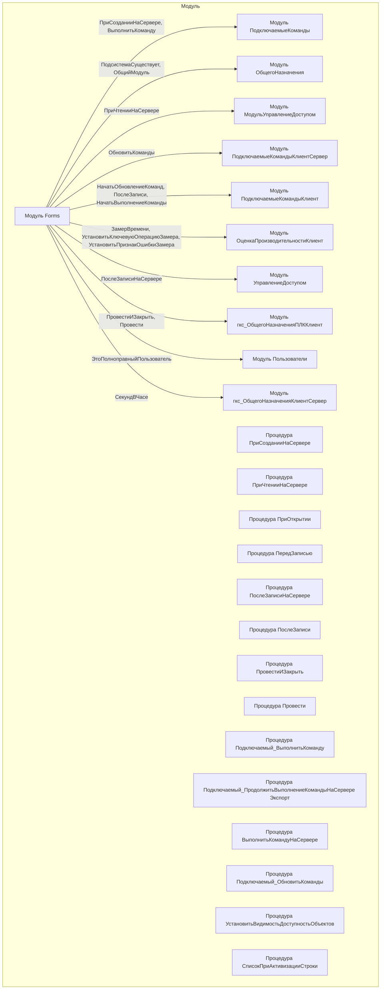

# Граф зависимостей: Forms

## Диаграмма

## Статистика

- **Процедур/функций:** 19
- **Экспортируемых:** 2
- **Внешних зависимостей:** 10
- **Внутренних вызовов:** 14

## Детали зависимостей

| Тип | Имя | Использований | Тип использования | Методы |
|-----|-----|---------------|-------------------|--------|
| module | ПодключаемыеКоманды | 4 | call | ПриСозданииНаСервере, ВыполнитьКоманду |
| module | ОбщегоНазначения | 2 | call | ПодсистемаСуществует, ОбщийМодуль |
| module | МодульУправлениеДоступом | 1 | call | ПриЧтенииНаСервере |
| module | ПодключаемыеКомандыКлиентСервер | 3 | call | ОбновитьКоманды |
| module | ПодключаемыеКомандыКлиент | 6 | call | НачатьОбновлениеКоманд, ПослеЗаписи, НачатьВыполнениеКоманды |
| module | ОценкаПроизводительностиКлиент | 3 | call | ЗамерВремени, УстановитьКлючевуюОперациюЗамера, УстановитьПризнакОшибкиЗамера |
| module | УправлениеДоступом | 1 | call | ПослеЗаписиНаСервере |
| module | гкс_ОбщегоНазначенияПЛККлиент | 2 | call | ПровестиИЗакрыть, Провести |
| module | Пользователи | 1 | call | ЭтоПолноправныйПользователь |
| module | гкс_ОбщегоНазначенияКлиентСервер | 1 | call | СекундВЧасе |

---
*Сгенерировано автоматически: 2026-03-09T02:01:03.246Z*
