# Граф зависимостей: Ext

## Диаграмма

```mermaid
graph TD
    subgraph Модуль
        Процедура_ПриСозданииНаСервере[Процедура ПриСозданииНаСервере]
        Процедура_ПриЧтенииНаСервере[Процедура ПриЧтенииНаСервере]
        Процедура_ПриОткрытии[Процедура ПриОткрытии]
        Процедура_ПередЗаписью[Процедура ПередЗаписью]
        Процедура_ПослеЗаписиНаСервере[Процедура ПослеЗаписиНаСервере]
        Процедура_ПослеЗаписи[Процедура ПослеЗаписи]
        Процедура_ПровестиИЗакрыть[Процедура ПровестиИЗакрыть]
        Процедура_Провести[Процедура Провести]
        Процедура_Подключаемый_ВыполнитьКоманду[Процедура Подключаемый_ВыполнитьКоманду]
        Процедура_Подключаемый_ПродолжитьВыполнениеКомандыНаСервере[Процедура Подключаемый_ПродолжитьВыполнениеКомандыНаСервере]
        Процедура_ВыполнитьКомандуНаСервере[Процедура ВыполнитьКомандуНаСервере]
        Процедура_Подключаемый_ОбновитьКоманды[Процедура Подключаемый_ОбновитьКоманды]
        Процедура_УстановитьВидимостьДоступностьОбъектов[Процедура УстановитьВидимостьДоступностьОбъектов]
    end

    subgraph Общие модули
        Модуль_ПодключаемыеКоманды["Модуль ПодключаемыеКоманды"]
        Модуль_ОбщегоНазначения["Модуль ОбщегоНазначения"]
        Модуль_МодульУправлениеДоступом["Модуль МодульУправлениеДоступом"]
        Модуль_ПодключаемыеКомандыКлиентСервер["Модуль ПодключаемыеКомандыКлиентСервер"]
        Модуль_ПодключаемыеКомандыКлиент["Модуль ПодключаемыеКомандыКлиент"]
        Модуль_ОценкаПроизводительностиКлиент["Модуль ОценкаПроизводительностиКлиент"]
        Модуль_УправлениеДоступом["Модуль УправлениеДоступом"]
        Модуль_гкс_ОбщегоНазначенияПЛККлиент["Модуль гкс_ОбщегоНазначенияПЛККлиент"]
        Модуль_Пользователи["Модуль Пользователи"]
        Модуль_гкс_ОбщегоНазначенияКлиентСервер["Модуль гкс_ОбщегоНазначенияКлиентСервер"]
    end

    Процедура_ПриСозданииНаСервере -->|ПриСозданииНаСервере, ВыполнитьКоманду| Модуль_ПодключаемыеКоманды
    Процедура_ПриЧтенииНаСервере -->|ПриЧтенииНаСервере| Модуль_МодульУправлениеДоступом
    Процедура_ПередЗаписью -->|ссылка| Модуль_ПодключаемыеКомандыКлиент
    Процедура_ПослеЗаписиНаСервере -->|ПослеЗаписиНаСервере| Модуль_УправлениеДоступом
    Процедура_ПослеЗаписи -->|ПослеЗаписи| Модуль_ПодключаемыеКомандыКлиент
    Процедура_ПровестиИЗакрыть -->|ПровестиИЗакрыть| Модуль_гкс_ОбщегоНазначенияПЛККлиент
    Процедура_Провести -->|Провести| Модуль_гкс_ОбщегоНазначенияПЛККлиент
    Процедура_Подключаемый_ВыполнитьКоманду -->|ВыполнитьКоманду| Модуль_ПодключаемыеКоманды
    Процедура_Подключаемый_ПродолжитьВыполнениеКомандыНаСервере -->|ссылка| Модуль_ПодключаемыеКомандыКлиент
    Процедура_ВыполнитьКомандуНаСервере -->|ссылка| Модуль_ПодключаемыеКомандыКлиент
    Процедура_Подключаемый_ОбновитьКоманды -->|ОбновитьКоманды| Модуль_ПодключаемыеКомандыКлиентСервер
    Процедура_УстановитьВидимостьДоступностьОбъектов -->|ПодсистемаСуществует, ОбщийМодуль| Модуль_ОбщегоНазначения
    Процедура_УстановитьВидимостьДоступностьОбъектов -->|ЭтоПолноправныйПользователь| Модуль_Пользователи
    Процедура_ПриСозданииНаСервере -->|ЗамерВремени, УстановитьКлючевуюОперациюЗамера, УстановитьПризнакОшибкиЗамера| Модуль_ОценкаПроизводительностиКлиент
    Процедура_ПриЧтенииНаСервере -->|ЗамерВремени, УстановитьКлючевуюОперациюЗамера, УстановитьПризнакОшибкиЗамера| Модуль_ОценкаПроизводительностиКлиент
    Процедура_ПриОткрытии -->|ЗамерВремени, УстановитьКлючевуюОперациюЗамера, УстановитьПризнакОшибкиЗамера| Модуль_ОценкаПроизводительностиКлиент
    Процедура_ПередЗаписью -->|ЗамерВремени, УстановитьКлючевуюОперациюЗамера, УстановитьПризнакОшибкиЗамера| Модуль_ОценкаПроизводительностиКлиент
    Процедура_ПослеЗаписиНаСервере -->|ЗамерВремени, УстановитьКлючевуюОперациюЗамера, УстановитьПризнакОшибкиЗамера| Модуль_ОценкаПроизводительностиКлиент
    Процедура_ПослеЗаписи -->|ЗамерВремени, УстановитьКлючевуюОперациюЗамера, УстановитьПризнакОшибкиЗамера| Модуль_ОценкаПроизводительностиКлиент
    Процедура_ПровестиИЗакрыть -->|ЗамерВремени, УстановитьКлючевуюОперациюЗамера, УстановитьПризнакОшибкиЗамера| Модуль_ОценкаПроизводительностиКлиент
    Процедура_Провести -->|ЗамерВремени, УстановитьКлючевуюОперациюЗамера, УстановитьПризнакОшибкиЗамера| Модуль_ОценкаПроизводительностиКлиент
    Процедура_Подключаемый_ВыполнитьКоманду -->|ЗамерВремени, УстановитьКлючевуюОперациюЗамера, УстановитьПризнакОшибкиЗамера| Модуль_ОценкаПроизводительностиКлиент
    Процедура_Подключаемый_ПродолжитьВыполнениеКомандыНаСервере -->|ЗамерВремени, УстановитьКлючевуюОперациюЗамера, УстановитьПризнакОшибкиЗамера| Модуль_ОценкаПроизводительностиКлиент
    Процедура_ВыполнитьКомандуНаСервере -->|ЗамерВремени, УстановитьКлючевуюОперациюЗамера, УстановитьПризнакОшибкиЗамера| Модуль_ОценкаПроизводительностиКлиент
    Процедура_Подключаемый_ОбновитьКоманды -->|ЗамерВремени, УстановитьКлючевуюОперациюЗамера, УстановитьПризнакОшибкиЗамера| Модуль_ОценкаПроизводительностиКлиент
    Процедура_УстановитьВидимостьДоступностьОбъектов -->|СекундВЧасе| Модуль_гкс_ОбщегоНазначенияКлиентСервер
```

## Статистика

- **Процедур/функций:** 13
- **Экспортируемых:** 1
- **Внешних зависимостей:** 10
- **Внутренних вызовов:** 13

## Детали зависимостей

| Тип | Имя | Использований | Тип использования | Методы |
|-----|-----|---------------|-------------------|--------|
| module | ПодключаемыеКоманды | 2 | call | ПриСозданииНаСервере, ВыполнитьКоманду |
| module | ОбщегоНазначения | 2 | call | ПодсистемаСуществует, ОбщийМодуль |
| module | МодульУправлениеДоступом | 1 | call | ПриЧтенииНаСервере |
| module | ПодключаемыеКомандыКлиентСервер | 2 | call | ОбновитьКоманды |
| module | ПодключаемыеКомандыКлиент | 4 | call | НачатьОбновлениеКоманд, ПослеЗаписи, НачатьВыполнениеКоманды |
| module | ОценкаПроизводительностиКлиент | 3 | call | ЗамерВремени, УстановитьКлючевуюОперациюЗамера, УстановитьПризнакОшибкиЗамера |
| module | УправлениеДоступом | 1 | call | ПослеЗаписиНаСервере |
| module | гкс_ОбщегоНазначенияПЛККлиент | 2 | call | ПровестиИЗакрыть, Провести |
| module | Пользователи | 1 | call | ЭтоПолноправныйПользователь |
| module | гкс_ОбщегоНазначенияКлиентСервер | 1 | call | СекундВЧасе |

---
*Сгенерировано автоматически: 2026-03-09T01:56:31.499Z*
