# Граф зависимостей: Forms

## Диаграмма

```mermaid
graph TD
    subgraph module["Модуль"]
        Модуль_Forms["Модуль Forms"]
        Процедура_ПриСозданииНаСервере["Процедура ПриСозданииНаСервере"]
        Процедура_ПриОткрытии["Процедура ПриОткрытии"]
        Процедура_ПриЧтенииНаСервере["Процедура ПриЧтенииНаСервере"]
        Процедура_ПередЗаписью["Процедура ПередЗаписью"]
        Процедура_ПослеЗаписиНаСервере["Процедура ПослеЗаписиНаСервере"]
        Процедура_ПослеЗаписи["Процедура ПослеЗаписи"]
        Процедура_ПровестиИЗакрыть["Процедура ПровестиИЗакрыть"]
        Процедура_Провести["Процедура Провести"]
        Процедура_Подключаемый_ВыполнитьКоманду["Процедура Подключаемый_ВыполнитьКоманду"]
        Процедура_Подключаемый_ПродолжитьВыполнениеКомандыНаСервере_Экспорт["Процедура Подключаемый_ПродолжитьВыполнениеКомандыНаСервере Экспорт"]
        Процедура_ВыполнитьКомандуНаСервере["Процедура ВыполнитьКомандуНаСервере"]
        Процедура_Подключаемый_ОбновитьКоманды["Процедура Подключаемый_ОбновитьКоманды"]
        Процедура_СпецификацияНачалоВыбора["Процедура СпецификацияНачалоВыбора"]
        Процедура_ТочкаМаршрутаПриИзменении["Процедура ТочкаМаршрутаПриИзменении"]
        Процедура_ИнициализацияФормы["Процедура ИнициализацияФормы"]
        Процедура_УстановитьВидимостьДоступностьОбъектов["Процедура УстановитьВидимостьДоступностьОбъектов"]
        Функция_ПолучитьТекущийСтатус(["Функция ПолучитьТекущийСтатус"])
        Функция_ОрганизацияСпецификации(["Функция ОрганизацияСпецификации"])
        Процедура_ПриЗакрытииФормыВыбораСпецификации_Экспорт["Процедура ПриЗакрытииФормыВыбораСпецификации Экспорт"]
        Процедура_ПриСозданииНаСервере["Процедура ПриСозданииНаСервере"]
        Процедура_СписокПриАктивизацииСтроки["Процедура СписокПриАктивизацииСтроки"]
        Процедура_Подключаемый_ВыполнитьКоманду["Процедура Подключаемый_ВыполнитьКоманду"]
        Процедура_Подключаемый_ПродолжитьВыполнениеКомандыНаСервере_Экспорт["Процедура Подключаемый_ПродолжитьВыполнениеКомандыНаСервере Экспорт"]
        Процедура_ВыполнитьКомандуНаСервере["Процедура ВыполнитьКомандуНаСервере"]
        Процедура_Подключаемый_ОбновитьКоманды["Процедура Подключаемый_ОбновитьКоманды"]
    end
    subgraph module["Общие модули"]
        Модуль_ПодключаемыеКоманды["Модуль ПодключаемыеКоманды"]
        Модуль_ПодключаемыеКомандыКлиент["Модуль ПодключаемыеКомандыКлиент"]
        Модуль_ОбщегоНазначения["Модуль ОбщегоНазначения"]
        Модуль_МодульУправлениеДоступом["Модуль МодульУправлениеДоступом"]
        Модуль_ПодключаемыеКомандыКлиентСервер["Модуль ПодключаемыеКомандыКлиентСервер"]
        Модуль_ОценкаПроизводительностиКлиент["Модуль ОценкаПроизводительностиКлиент"]
        Модуль_УправлениеДоступом["Модуль УправлениеДоступом"]
        Модуль_гкс_ОбщегоНазначенияПЛККлиент["Модуль гкс_ОбщегоНазначенияПЛККлиент"]
        Модуль_ЗначениеОтбора["Модуль ЗначениеОтбора"]
        Модуль_ПараметрыФормы["Модуль ПараметрыФормы"]
        Модуль_Ключ["Модуль Ключ"]
        Модуль_Пользователи["Модуль Пользователи"]
        Модуль_гкс_ОбщегоНазначенияКлиентСервер["Модуль гкс_ОбщегоНазначенияКлиентСервер"]
        Модуль_гкс_СтатусыЗаписейВОчередиПриемкиПЛК["Модуль гкс_СтатусыЗаписейВОчередиПриемкиПЛК"]
    end
    subgraph register["Регистры"]
        Регистр_гкс_СтатусыЗаписейВОчередиПриемкиПЛК[(Регистр гкс_СтатусыЗаписейВОчередиПриемкиПЛК)]
    end
    Модуль_Forms -->|ПриСозданииНаСервере, ВыполнитьКоманду| Модуль_ПодключаемыеКоманды
    Модуль_Forms -->|НачатьОбновлениеКоманд, ПослеЗаписи, НачатьВыполнениеКоманды| Модуль_ПодключаемыеКомандыКлиент
    Модуль_Forms -->|ПодсистемаСуществует, ОбщийМодуль, ЗначениеРеквизитаОбъекта| Модуль_ОбщегоНазначения
    Модуль_Forms -->|ПриЧтенииНаСервере| Модуль_МодульУправлениеДоступом
    Модуль_Forms -->|ОбновитьКоманды| Модуль_ПодключаемыеКомандыКлиентСервер
    Модуль_Forms -->|ЗамерВремени, УстановитьКлючевуюОперациюЗамера, УстановитьПризнакОшибкиЗамера| Модуль_ОценкаПроизводительностиКлиент
    Модуль_Forms -->|ПослеЗаписиНаСервере| Модуль_УправлениеДоступом
    Модуль_Forms -->|ПровестиИЗакрыть, Провести| Модуль_гкс_ОбщегоНазначенияПЛККлиент
    Модуль_Forms -->|Вставить| Модуль_ЗначениеОтбора
    Модуль_Forms -->|Вставить| Модуль_ПараметрыФормы
    Модуль_Forms -->|Пустая| Модуль_Ключ
    Модуль_Forms -->|ЭтоПолноправныйПользователь| Модуль_Пользователи
    Модуль_Forms -->|СекундВЧасе| Модуль_гкс_ОбщегоНазначенияКлиентСервер
    Модуль_Forms -->|ТекущийСтатус| Модуль_гкс_СтатусыЗаписейВОчередиПриемкиПЛК
    Модуль_Forms -->|ссылка| Регистр_гкс_СтатусыЗаписейВОчередиПриемкиПЛК
```

## Статистика

- **Процедур/функций:** 25
- **Экспортируемых:** 3
- **Внешних зависимостей:** 15
- **Внутренних вызовов:** 20

## Детали зависимостей

| Тип | Имя | Использований | Тип использования | Методы |
|-----|-----|---------------|-------------------|--------|
| module | ПодключаемыеКоманды | 4 | call | ПриСозданииНаСервере, ВыполнитьКоманду |
| module | ПодключаемыеКомандыКлиент | 6 | call | НачатьОбновлениеКоманд, ПослеЗаписи, НачатьВыполнениеКоманды |
| module | ОбщегоНазначения | 3 | call | ПодсистемаСуществует, ОбщийМодуль, ЗначениеРеквизитаОбъекта |
| module | МодульУправлениеДоступом | 1 | call | ПриЧтенииНаСервере |
| module | ПодключаемыеКомандыКлиентСервер | 3 | call | ОбновитьКоманды |
| module | ОценкаПроизводительностиКлиент | 3 | call | ЗамерВремени, УстановитьКлючевуюОперациюЗамера, УстановитьПризнакОшибкиЗамера |
| module | УправлениеДоступом | 1 | call | ПослеЗаписиНаСервере |
| module | гкс_ОбщегоНазначенияПЛККлиент | 2 | call | ПровестиИЗакрыть, Провести |
| module | ЗначениеОтбора | 3 | call | Вставить |
| module | ПараметрыФормы | 2 | call | Вставить |
| module | Ключ | 1 | call | Пустая |
| module | Пользователи | 1 | call | ЭтоПолноправныйПользователь |
| module | гкс_ОбщегоНазначенияКлиентСервер | 1 | call | СекундВЧасе |
| module | гкс_СтатусыЗаписейВОчередиПриемкиПЛК | 1 | call | ТекущийСтатус |
| register | гкс_СтатусыЗаписейВОчередиПриемкиПЛК | 1 | reference | - |

---
*Сгенерировано автоматически: 2026-03-09T02:01:05.862Z*
