# Граф зависимостей: гкс_ЗаписьВОчередьПриемкиПЛК

## Диаграмма

```mermaid
graph TD
    subgraph module["Модуль"]
        Модуль_гкс_ЗаписьВОчередьПриемкиПЛК["Модуль гкс_ЗаписьВОчередьПриемкиПЛК"]
        Процедура_ЗарегистрироватьУчетныеМеханизмы_Экспорт["Процедура ЗарегистрироватьУчетныеМеханизмы Экспорт"]
        Функция_ДанныеДокументаДляПроведения_Экспорт(["Функция ДанныеДокументаДляПроведения Экспорт"])
        Процедура_ПриЗаполненииОграниченияДоступа_Экспорт["Процедура ПриЗаполненииОграниченияДоступа Экспорт"]
        Процедура_ЗаполнитьПараметрыИнициализации["Процедура ЗаполнитьПараметрыИнициализации"]
        Функция_ТекстЗапросаТаблицагкс_ОчередьПриемкиПЛК(["Функция ТекстЗапросаТаблицагкс_ОчередьПриемкиПЛК"])
        Процедура_ТекстЗапросаТаблицаВТ_ОчередьПриемкиПЛК["Процедура ТекстЗапросаТаблицаВТ_ОчередьПриемкиПЛК"]
        Функция_ТекстЗапросаТаблицагкс_СтатусыЗаписейВОчередиПриемкиПЛК(["Функция ТекстЗапросаТаблицагкс_СтатусыЗаписейВОчередиПриемкиПЛК"])
        Процедура_ОбработкаЗаполнения["Процедура ОбработкаЗаполнения"]
        Процедура_ПередЗаписью["Процедура ПередЗаписью"]
        Процедура_ОбработкаПроведения["Процедура ОбработкаПроведения"]
        Процедура_ОбработкаУдаленияПроведения["Процедура ОбработкаУдаленияПроведения"]
        Процедура_ВыполнитьДополнительныеДействияПередЗаписьюВРежимеОбменаДанными["Процедура ВыполнитьДополнительныеДействияПередЗаписьюВРежимеОбменаДанными"]
        Функция_ВыполнятьОчисткуСтатусаЗаписиРегистрацииВОчереди(["Функция ВыполнятьОчисткуСтатусаЗаписиРегистрацииВОчереди"])
        Процедура_ОчиститьСтатусЗаписиРегистрацииВОчередиПриемки["Процедура ОчиститьСтатусЗаписиРегистрацииВОчередиПриемки"]
        Процедура_ДобавитьСтатусОтмененВОчереди["Процедура ДобавитьСтатусОтмененВОчереди"]
        Процедура_УдалитьСтатусОтмененВОчереди["Процедура УдалитьСтатусОтмененВОчереди"]
        Процедура_ИзменитьПризнакОтменено["Процедура ИзменитьПризнакОтменено"]
        Процедура_ДозаполнитьОбъектПередЗаписью["Процедура ДозаполнитьОбъектПередЗаписью"]
        Процедура_ЗаполнитьОрганизацию["Процедура ЗаполнитьОрганизацию"]
        Процедура_ПроверитьЗаполнениеОбъектаПередЗаписью["Процедура ПроверитьЗаполнениеОбъектаПередЗаписью"]
        Процедура_ПроверитьДоступностьМестВГрафикеИОчереди["Процедура ПроверитьДоступностьМестВГрафикеИОчереди"]
        Функция_ЕстьСвободноеМестоВОчереди(["Функция ЕстьСвободноеМестоВОчереди"])
        Функция_ГрафикЗаполнен(["Функция ГрафикЗаполнен"])
        Процедура_УстановитьБлокировкуОчереди["Процедура УстановитьБлокировкуОчереди"]
        Процедура_ПриСозданииНаСервере["Процедура ПриСозданииНаСервере"]
        Процедура_ПриОткрытии["Процедура ПриОткрытии"]
        Процедура_ПриЧтенииНаСервере["Процедура ПриЧтенииНаСервере"]
        Процедура_ПередЗаписью["Процедура ПередЗаписью"]
        Процедура_ПослеЗаписиНаСервере["Процедура ПослеЗаписиНаСервере"]
        Процедура_ПослеЗаписи["Процедура ПослеЗаписи"]
        Процедура_ПровестиИЗакрыть["Процедура ПровестиИЗакрыть"]
        Процедура_Провести["Процедура Провести"]
        Процедура_Подключаемый_ВыполнитьКоманду["Процедура Подключаемый_ВыполнитьКоманду"]
        Процедура_Подключаемый_ПродолжитьВыполнениеКомандыНаСервере_Экспорт["Процедура Подключаемый_ПродолжитьВыполнениеКомандыНаСервере Экспорт"]
        Процедура_ВыполнитьКомандуНаСервере["Процедура ВыполнитьКомандуНаСервере"]
        Процедура_Подключаемый_ОбновитьКоманды["Процедура Подключаемый_ОбновитьКоманды"]
        Процедура_СпецификацияНачалоВыбора["Процедура СпецификацияНачалоВыбора"]
        Процедура_ТочкаМаршрутаПриИзменении["Процедура ТочкаМаршрутаПриИзменении"]
        Процедура_ИнициализацияФормы["Процедура ИнициализацияФормы"]
        Процедура_УстановитьВидимостьДоступностьОбъектов["Процедура УстановитьВидимостьДоступностьОбъектов"]
        Функция_ПолучитьТекущийСтатус(["Функция ПолучитьТекущийСтатус"])
        Функция_ОрганизацияСпецификации(["Функция ОрганизацияСпецификации"])
        Процедура_ПриЗакрытииФормыВыбораСпецификации_Экспорт["Процедура ПриЗакрытииФормыВыбораСпецификации Экспорт"]
        Процедура_ПриСозданииНаСервере["Процедура ПриСозданииНаСервере"]
        Процедура_СписокПриАктивизацииСтроки["Процедура СписокПриАктивизацииСтроки"]
        Процедура_Подключаемый_ВыполнитьКоманду["Процедура Подключаемый_ВыполнитьКоманду"]
        Процедура_Подключаемый_ПродолжитьВыполнениеКомандыНаСервере_Экспорт["Процедура Подключаемый_ПродолжитьВыполнениеКомандыНаСервере Экспорт"]
        Процедура_ВыполнитьКомандуНаСервере["Процедура ВыполнитьКомандуНаСервере"]
        Процедура_Подключаемый_ОбновитьКоманды["Процедура Подключаемый_ОбновитьКоманды"]
    end
    subgraph module["Общие модули"]
        Модуль_МеханизмыДокумента["Модуль МеханизмыДокумента"]
        Модуль_гкс_ПроведениеДокументов["Модуль гкс_ПроведениеДокументов"]
        Модуль_Запрос["Модуль Запрос"]
        Модуль_Реквизиты["Модуль Реквизиты"]
        Модуль_ТекстыЗапроса["Модуль ТекстыЗапроса"]
        Модуль_гкс_СтатусыЗаписейВОчередиПриемкиПЛК["Модуль гкс_СтатусыЗаписейВОчередиПриемкиПЛК"]
        Модуль_гкс_ЗаполнениеДокументов["Модуль гкс_ЗаполнениеДокументов"]
        Модуль_ОбновлениеИнформационнойБазы["Модуль ОбновлениеИнформационнойБазы"]
        Модуль_ДополнительныеСвойства["Модуль ДополнительныеСвойства"]
        Модуль_ОбщегоНазначения["Модуль ОбщегоНазначения"]
        Модуль_УправлениеДоступом["Модуль УправлениеДоступом"]
        Модуль_гкс_ЭлектроннаяОчередь["Модуль гкс_ЭлектроннаяОчередь"]
        Модуль_ДанныеОбъекта["Модуль ДанныеОбъекта"]
        Модуль_Параметры["Модуль Параметры"]
        Модуль_гкс_ОчередьПриемкиПЛК["Модуль гкс_ОчередьПриемкиПЛК"]
        Модуль_гкс_ГрафикПриемкиПЛК["Модуль гкс_ГрафикПриемкиПЛК"]
        Модуль_Блокировка["Модуль Блокировка"]
        Модуль_ЭлементБлокировки["Модуль ЭлементБлокировки"]
        Модуль_ОбщегоНазначенияКлиентСервер["Модуль ОбщегоНазначенияКлиентСервер"]
        Модуль_ПодключаемыеКоманды["Модуль ПодключаемыеКоманды"]
        Модуль_ПодключаемыеКомандыКлиент["Модуль ПодключаемыеКомандыКлиент"]
        Модуль_МодульУправлениеДоступом["Модуль МодульУправлениеДоступом"]
        Модуль_ПодключаемыеКомандыКлиентСервер["Модуль ПодключаемыеКомандыКлиентСервер"]
        Модуль_ОценкаПроизводительностиКлиент["Модуль ОценкаПроизводительностиКлиент"]
        Модуль_гкс_ОбщегоНазначенияПЛККлиент["Модуль гкс_ОбщегоНазначенияПЛККлиент"]
        Модуль_ЗначениеОтбора["Модуль ЗначениеОтбора"]
        Модуль_ПараметрыФормы["Модуль ПараметрыФормы"]
        Модуль_Ключ["Модуль Ключ"]
        Модуль_Пользователи["Модуль Пользователи"]
        Модуль_гкс_ОбщегоНазначенияКлиентСервер["Модуль гкс_ОбщегоНазначенияКлиентСервер"]
    end
    subgraph register["Регистры"]
        Регистр_гкс_СтатусыЗаписейВОчередиПриемкиПЛК[(Регистр гкс_СтатусыЗаписейВОчередиПриемкиПЛК)]
        Регистр_гкс_ОчередьПриемкиПЛК[(Регистр гкс_ОчередьПриемкиПЛК)]
        Регистр_гкс_ГрафикПриемкиПЛК[(Регистр гкс_ГрафикПриемкиПЛК)]
    end
    subgraph enum["Перечисления"]
        Перечисление_гкс_СтатусыЭлектроннойОчереди(["Перечисление гкс_СтатусыЭлектроннойОчереди"])
        Перечисление_гкс_ТипРегистрации(["Перечисление гкс_ТипРегистрации"])
    end
    Модуль_гкс_ЗаписьВОчередьПриемкиПЛК -->|Добавить| Модуль_МеханизмыДокумента
    Модуль_гкс_ЗаписьВОчередьПриемкиПЛК -->|ДопПараметрыИнициализироватьДанныеДокументаДляПроведения, ИнициализироватьДанныеДокументаДляПроведения, ТребуетсяТаблицаДляДвижений...| Модуль_гкс_ПроведениеДокументов
    Модуль_гкс_ЗаписьВОчередьПриемкиПЛК -->|УстановитьПараметр, Выполнить| Модуль_Запрос
    Модуль_гкс_ЗаписьВОчередьПриемкиПЛК -->|Следующий| Модуль_Реквизиты
    Модуль_гкс_ЗаписьВОчередьПриемкиПЛК -->|Добавить| Модуль_ТекстыЗапроса
    Модуль_гкс_ЗаписьВОчередьПриемкиПЛК -->|СрезПоследних, УдалитьЗапись, УстановитьСтатусОтменен...| Модуль_гкс_СтатусыЗаписейВОчередиПриемкиПЛК
    Модуль_гкс_ЗаписьВОчередьПриемкиПЛК -->|Заполнить| Модуль_гкс_ЗаполнениеДокументов
    Модуль_гкс_ЗаписьВОчередьПриемкиПЛК -->|ПроверитьОбъектОбработан| Модуль_ОбновлениеИнформационнойБазы
    Модуль_гкс_ЗаписьВОчередьПриемкиПЛК -->|Свойство| Модуль_ДополнительныеСвойства
    Модуль_гкс_ЗаписьВОчередьПриемкиПЛК -->|ЗначениеРеквизитаОбъекта, СообщитьПользователю, ПодсистемаСуществует...| Модуль_ОбщегоНазначения
    Модуль_гкс_ЗаписьВОчередьПриемкиПЛК -->|ЕстьРоль, ПослеЗаписиНаСервере| Модуль_УправлениеДоступом
    Модуль_гкс_ЗаписьВОчередьПриемкиПЛК -->|ДатаЗаявкиАктуальна, ПериодЭлектроннойОчередиЗаданКорректно| Модуль_гкс_ЭлектроннаяОчередь
    Модуль_гкс_ЗаписьВОчередьПриемкиПЛК -->|Вставить| Модуль_ДанныеОбъекта
    Модуль_гкс_ЗаписьВОчередьПриемкиПЛК -->|Вставить| Модуль_Параметры
    Модуль_гкс_ЗаписьВОчередьПриемкиПЛК -->|ЕстьСвободноеМесто| Модуль_гкс_ОчередьПриемкиПЛК
    Модуль_гкс_ЗаписьВОчередьПриемкиПЛК -->|ГрафикЗаполнен| Модуль_гкс_ГрафикПриемкиПЛК
    Модуль_гкс_ЗаписьВОчередьПриемкиПЛК -->|Добавить, Заблокировать| Модуль_Блокировка
    Модуль_гкс_ЗаписьВОчередьПриемкиПЛК -->|УстановитьЗначение| Модуль_ЭлементБлокировки
    Модуль_гкс_ЗаписьВОчередьПриемкиПЛК -->|КодОсновногоЯзыка| Модуль_ОбщегоНазначенияКлиентСервер
    Модуль_гкс_ЗаписьВОчередьПриемкиПЛК -->|ПриСозданииНаСервере, ВыполнитьКоманду| Модуль_ПодключаемыеКоманды
    Модуль_гкс_ЗаписьВОчередьПриемкиПЛК -->|НачатьОбновлениеКоманд, ПослеЗаписи, НачатьВыполнениеКоманды| Модуль_ПодключаемыеКомандыКлиент
    Модуль_гкс_ЗаписьВОчередьПриемкиПЛК -->|ПриЧтенииНаСервере| Модуль_МодульУправлениеДоступом
    Модуль_гкс_ЗаписьВОчередьПриемкиПЛК -->|ОбновитьКоманды| Модуль_ПодключаемыеКомандыКлиентСервер
    Модуль_гкс_ЗаписьВОчередьПриемкиПЛК -->|ЗамерВремени, УстановитьКлючевуюОперациюЗамера, УстановитьПризнакОшибкиЗамера| Модуль_ОценкаПроизводительностиКлиент
    Модуль_гкс_ЗаписьВОчередьПриемкиПЛК -->|ПровестиИЗакрыть, Провести| Модуль_гкс_ОбщегоНазначенияПЛККлиент
    Модуль_гкс_ЗаписьВОчередьПриемкиПЛК -->|Вставить| Модуль_ЗначениеОтбора
    Модуль_гкс_ЗаписьВОчередьПриемкиПЛК -->|Вставить| Модуль_ПараметрыФормы
    Модуль_гкс_ЗаписьВОчередьПриемкиПЛК -->|Пустая| Модуль_Ключ
    Модуль_гкс_ЗаписьВОчередьПриемкиПЛК -->|ЭтоПолноправныйПользователь| Модуль_Пользователи
    Модуль_гкс_ЗаписьВОчередьПриемкиПЛК -->|СекундВЧасе| Модуль_гкс_ОбщегоНазначенияКлиентСервер
    Модуль_гкс_ЗаписьВОчередьПриемкиПЛК -->|ссылка| Регистр_гкс_СтатусыЗаписейВОчередиПриемкиПЛК
    Модуль_гкс_ЗаписьВОчередьПриемкиПЛК -->|ссылка| Регистр_гкс_ОчередьПриемкиПЛК
    Модуль_гкс_ЗаписьВОчередьПриемкиПЛК -->|ссылка| Регистр_гкс_ГрафикПриемкиПЛК
    Модуль_гкс_ЗаписьВОчередьПриемкиПЛК -->|ссылка| Перечисление_гкс_СтатусыЭлектроннойОчереди
    Модуль_гкс_ЗаписьВОчередьПриемкиПЛК -->|ссылка| Перечисление_гкс_ТипРегистрации
```

## Статистика

- **Процедур/функций:** 49
- **Экспортируемых:** 6
- **Внешних зависимостей:** 35
- **Внутренних вызовов:** 43

## Детали зависимостей

| Тип | Имя | Использований | Тип использования | Методы |
|-----|-----|---------------|-------------------|--------|
| module | МеханизмыДокумента | 1 | call | Добавить |
| module | гкс_ПроведениеДокументов | 7 | call | ДопПараметрыИнициализироватьДанныеДокументаДляПроведения, ИнициализироватьДанныеДокументаДляПроведения, ТребуетсяТаблицаДляДвижений, ПередЗаписьюДокумента, ОбработкаПроведенияДокумента... |
| module | Запрос | 15 | call | УстановитьПараметр, Выполнить |
| module | Реквизиты | 1 | call | Следующий |
| module | ТекстыЗапроса | 2 | call | Добавить |
| module | гкс_СтатусыЗаписейВОчередиПриемкиПЛК | 6 | call | СрезПоследних, УдалитьЗапись, УстановитьСтатусОтменен, ТекущийСтатус |
| module | гкс_ЗаполнениеДокументов | 1 | call | Заполнить |
| module | ОбновлениеИнформационнойБазы | 1 | call | ПроверитьОбъектОбработан |
| module | ДополнительныеСвойства | 1 | call | Свойство |
| module | ОбщегоНазначения | 9 | call | ЗначениеРеквизитаОбъекта, СообщитьПользователю, ПодсистемаСуществует, ОбщийМодуль |
| module | УправлениеДоступом | 2 | call | ЕстьРоль, ПослеЗаписиНаСервере |
| module | гкс_ЭлектроннаяОчередь | 2 | call | ДатаЗаявкиАктуальна, ПериодЭлектроннойОчередиЗаданКорректно |
| module | ДанныеОбъекта | 5 | call | Вставить |
| module | Параметры | 6 | call | Вставить |
| module | гкс_ОчередьПриемкиПЛК | 1 | call | ЕстьСвободноеМесто |
| module | гкс_ГрафикПриемкиПЛК | 1 | call | ГрафикЗаполнен |
| module | Блокировка | 2 | call | Добавить, Заблокировать |
| module | ЭлементБлокировки | 5 | call | УстановитьЗначение |
| module | ОбщегоНазначенияКлиентСервер | 1 | call | КодОсновногоЯзыка |
| register | гкс_СтатусыЗаписейВОчередиПриемкиПЛК | 4 | reference | - |
| enum | гкс_СтатусыЭлектроннойОчереди | 1 | reference | - |
| enum | гкс_ТипРегистрации | 1 | reference | - |
| register | гкс_ОчередьПриемкиПЛК | 1 | reference | - |
| register | гкс_ГрафикПриемкиПЛК | 1 | reference | - |
| module | ПодключаемыеКоманды | 4 | call | ПриСозданииНаСервере, ВыполнитьКоманду |
| module | ПодключаемыеКомандыКлиент | 6 | call | НачатьОбновлениеКоманд, ПослеЗаписи, НачатьВыполнениеКоманды |
| module | МодульУправлениеДоступом | 1 | call | ПриЧтенииНаСервере |
| module | ПодключаемыеКомандыКлиентСервер | 3 | call | ОбновитьКоманды |
| module | ОценкаПроизводительностиКлиент | 3 | call | ЗамерВремени, УстановитьКлючевуюОперациюЗамера, УстановитьПризнакОшибкиЗамера |
| module | гкс_ОбщегоНазначенияПЛККлиент | 2 | call | ПровестиИЗакрыть, Провести |
| module | ЗначениеОтбора | 3 | call | Вставить |
| module | ПараметрыФормы | 2 | call | Вставить |
| module | Ключ | 1 | call | Пустая |
| module | Пользователи | 1 | call | ЭтоПолноправныйПользователь |
| module | гкс_ОбщегоНазначенияКлиентСервер | 1 | call | СекундВЧасе |

---
*Сгенерировано автоматически: 2026-03-09T02:01:24.638Z*
