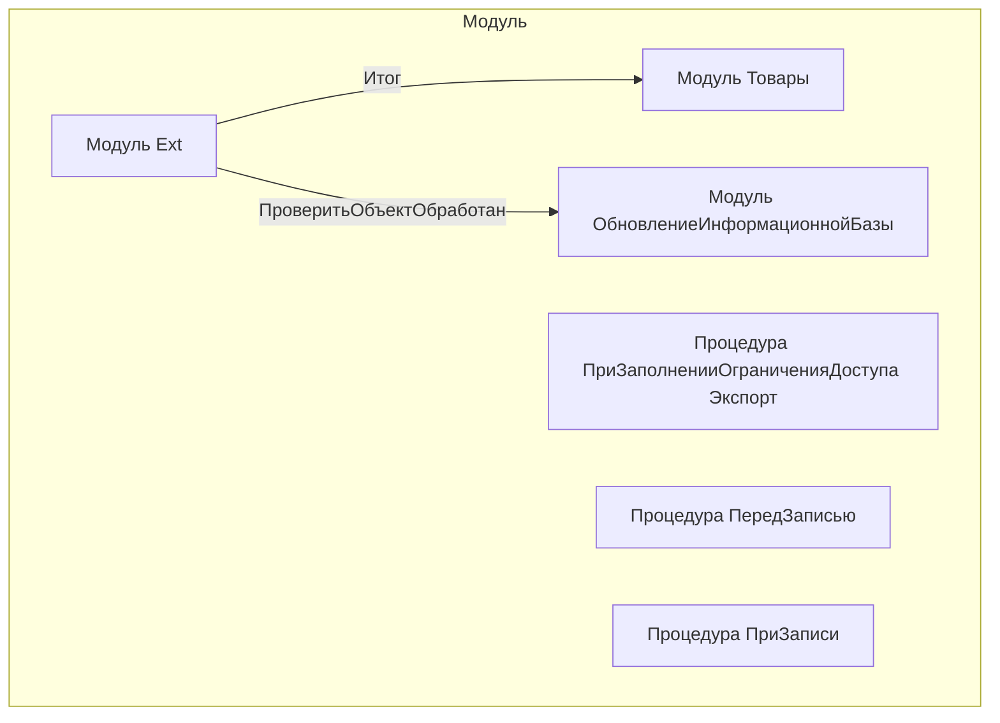

# Граф зависимостей: Ext

## Диаграмма

## Статистика

- **Процедур/функций:** 3
- **Экспортируемых:** 1
- **Внешних зависимостей:** 2
- **Внутренних вызовов:** 3

## Детали зависимостей

| Тип | Имя | Использований | Тип использования | Методы |
|-----|-----|---------------|-------------------|--------|
| module | Товары | 1 | call | Итог |
| module | ОбновлениеИнформационнойБазы | 1 | call | ПроверитьОбъектОбработан |

---
*Сгенерировано автоматически: 2026-03-09T02:01:05.862Z*
