# Граф зависимостей: ФормаДокумента

## Диаграмма

```mermaid
graph TD
    subgraph Модуль
        Процедура_ПриСозданииНаСервере["Процедура ПриСозданииНаСервере"]
        Процедура_ПриЧтенииНаСервере["Процедура ПриЧтенииНаСервере"]
        Процедура_ПриОткрытии["Процедура ПриОткрытии"]
        Процедура_ПослеЗаписи["Процедура ПослеЗаписи"]
        Процедура_ПослеЗаписиНаСервере["Процедура ПослеЗаписиНаСервере"]
        Процедура_РучныеЦеныТТНПриИзменении["Процедура РучныеЦеныТТНПриИзменении"]
        Процедура_РучныеЦеныТТНПриИзмененииНаСервере["Процедура РучныеЦеныТТНПриИзмененииНаСервере"]
        Процедура_Подключаемый_ВыполнитьКоманду["Процедура Подключаемый_ВыполнитьКоманду"]
        Процедура_Подключаемый_ПродолжитьВыполнениеКомандыНаСервере["Процедура Подключаемый_ПродолжитьВыполнениеКомандыНаСервере"]
        Процедура_ВыполнитьКомандуНаСервере["Процедура ВыполнитьКомандуНаСервере"]
        Процедура_Подключаемый_ОбновитьКоманды["Процедура Подключаемый_ОбновитьКоманды"]
        Процедура_УправлениеФормой["Процедура УправлениеФормой"]
    end

    subgraph Общие модули
        Модуль_Параметры["Модуль Параметры"]
        Модуль_ПодключаемыеКоманды["Модуль ПодключаемыеКоманды"]
        Модуль_ПодключаемыеКомандыКлиентСервер["Модуль ПодключаемыеКомандыКлиентСервер"]
        Модуль_ОбщегоНазначения["Модуль ОбщегоНазначения"]
        Модуль_МодульУправлениеДоступом["Модуль МодульУправлениеДоступом"]
        Модуль_ПодключаемыеКомандыКлиент["Модуль ПодключаемыеКомандыКлиент"]
        Модуль_УправлениеДоступом["Модуль УправлениеДоступом"]
    end

    Процедура_ПриСозданииНаСервере -->|ПриСозданииНаСервере| Модуль_ПодключаемыеКоманды
    Процедура_ПриЧтенииНаСервере -->|ПриЧтенииНаСервере| Модуль_МодульУправлениеДоступом
    Процедура_ПослеЗаписи -->|ПослеЗаписи| Модуль_ПодключаемыеКомандыКлиент
    Процедура_ПослеЗаписиНаСервере -->|ПослеЗаписиНаСервере| Модуль_УправлениеДоступом
    Процедура_РучныеЦеныТТНПриИзменении -->|вызов| Модуль_Параметры
    Процедура_РучныеЦеныТТНПриИзменении -->|вызов| Модуль_ПодключаемыеКоманды
    Процедура_РучныеЦеныТТНПриИзменении -->|вызов| Модуль_ПодключаемыеКомандыКлиент
    Процедура_РучныеЦеныТТНПриИзмененииНаСервере -->|вызов| Модуль_Параметры
    Процедура_РучныеЦеныТТНПриИзмененииНаСервере -->|вызов| Модуль_ПодключаемыеКоманды
    Процедура_РучныеЦеныТТНПриИзмененииНаСервере -->|вызов| Модуль_ПодключаемыеКомандыКлиент
    Процедура_Подключаемый_ВыполнитьКоманду -->|ВыполнитьКоманду| Модуль_ПодключаемыеКоманды
    Процедура_Подключаемый_ВыполнитьКоманду -->|НачатьВыполнениеКоманды| Модуль_ПодключаемыеКомандыКлиент
    Процедура_Подключаемый_ПродолжитьВыполнениеКомандыНаСервере -->|вызов| Модуль_ПодключаемыеКомандыКлиентСервер
    Процедура_ВыполнитьКомандуНаСервере -->|вызов| Модуль_ПодключаемыеКоманды
    Процедура_ВыполнитьКомандуНаСервере -->|вызов| Модуль_ПодключаемыеКомандыКлиентСервер
    Процедура_Подключаемый_ОбновитьКоманды -->|ОбновитьКоманды| Модуль_ПодключаемыеКомандыКлиентСервер
    Процедура_Подключаемый_ОбновитьКоманды -->|НачатьОбновлениеКоманд| Модуль_ПодключаемыеКомандыКлиент
    Процедура_УправлениеФормой -->|ПодсистемаСуществует| Модуль_ОбщегоНазначения
    Процедура_УправлениеФормой -->|ОбщийМодуль| Модуль_ОбщегоНазначения
```

## Статистика

- **Процедур/функций:** 12
- **Экспортируемых:** 1
- **Внешних зависимостей:** 7
- **Внутренних вызовов:** 12

## Детали зависимостей

| Тип | Имя | Использований | Тип использования | Методы |
|-----|-----|---------------|-------------------|--------|
| module | Параметры | 1 | call | Свойство |
| module | ПодключаемыеКоманды | 2 | call | ПриСозданииНаСервере, ВыполнитьКоманду |
| module | ПодключаемыеКомандыКлиентСервер | 2 | call | ОбновитьКоманды |
| module | ОбщегоНазначения | 2 | call | ПодсистемаСуществует, ОбщийМодуль |
| module | МодульУправлениеДоступом | 1 | call | ПриЧтенииНаСервере |
| module | ПодключаемыеКомандыКлиент | 3 | call | НачатьОбновлениеКоманд, ПослеЗаписи, НачатьВыполнениеКоманды |
| module | УправлениеДоступом | 1 | call | ПослеЗаписиНаСервере |

---
*Сгенерировано автоматически: 2026-03-09T01:59:08.295Z*
