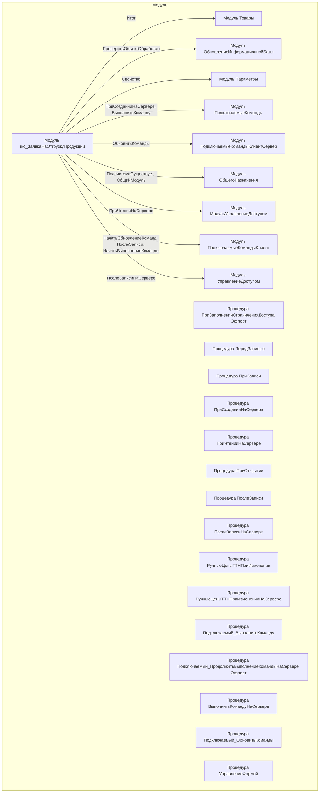

# Граф зависимостей: гкс_ЗаявкаНаОтгрузкуПродукции

## Диаграмма

## Статистика

- **Процедур/функций:** 15
- **Экспортируемых:** 2
- **Внешних зависимостей:** 9
- **Внутренних вызовов:** 15

## Детали зависимостей

| Тип | Имя | Использований | Тип использования | Методы |
|-----|-----|---------------|-------------------|--------|
| module | Товары | 1 | call | Итог |
| module | ОбновлениеИнформационнойБазы | 1 | call | ПроверитьОбъектОбработан |
| module | Параметры | 1 | call | Свойство |
| module | ПодключаемыеКоманды | 2 | call | ПриСозданииНаСервере, ВыполнитьКоманду |
| module | ПодключаемыеКомандыКлиентСервер | 2 | call | ОбновитьКоманды |
| module | ОбщегоНазначения | 2 | call | ПодсистемаСуществует, ОбщийМодуль |
| module | МодульУправлениеДоступом | 1 | call | ПриЧтенииНаСервере |
| module | ПодключаемыеКомандыКлиент | 3 | call | НачатьОбновлениеКоманд, ПослеЗаписи, НачатьВыполнениеКоманды |
| module | УправлениеДоступом | 1 | call | ПослеЗаписиНаСервере |

---
*Сгенерировано автоматически: 2026-03-09T02:01:24.629Z*
