# Граф зависимостей: УстановитьСтатусОтборПроб

## Диаграмма

```mermaid
graph TD
    subgraph Модуль
        УстановитьСтатусОтборПроб[Модуль УстановитьСтатусОтборПроб]
        ОбработкаКоманды["Процедура ОбработкаКоманды"]
        ОбработкаКомандыЗавершение["Процедура ОбработкаКомандыЗавершение"]
        ПослеФоновогоИзменениеСтатуса["Процедура ПослеФоновогоИзменениеСтатуса"]
        ЗапуститьФоновоеИзменениеСтатусаНаСервере(["Функция ЗапуститьФоновоеИзменениеСтатусаНаСервере"])
    end

    subgraph Документы
        Документ_гкс_ЛабораторныйАнализ{{Документ гкс_ЛабораторныйАнализ}}
    end

    subgraph Общие модули
        Модуль_ПараметрКоманды["Модуль ПараметрКоманды"]
        Модуль_ДлительныеОперацииКлиент["Модуль ДлительныеОперацииКлиент"]
        Модуль_ПараметрыОповещения["Модуль ПараметрыОповещения"]
        Модуль_ДлительныеОперации["Модуль ДлительныеОперации"]
    end

    УстановитьСтатусОтборПроб --> ОбработкаКоманды
    УстановитьСтатусОтборПроб --> ОбработкаКомандыЗавершение
    УстановитьСтатусОтборПроб --> ПослеФоновогоИзменениеСтатуса
    УстановитьСтатусОтборПроб --> ЗапуститьФоновоеИзменениеСтатусаНаСервере

    ОбработкаКоманды -->|Количество| Модуль_ПараметрКоманды
    ОбработкаКоманды -->|ПараметрыОжидания, ОжидатьЗавершение| Модуль_ДлительныеОперацииКлиент
    ОбработкаКоманды -->|Вставить| Модуль_ПараметрыОповещения
    ОбработкаКоманды -->|ПараметрыВыполненияВФоне, ВыполнитьВФоне| Модуль_ДлительныеОперации
    ОбработкаКоманды -->|ссылка| Документ_гкс_ЛабораторныйАнализ

    ОбработкаКомандыЗавершение -->|Количество| Модуль_ПараметрКоманды
    ОбработкаКомандыЗавершение -->|ПараметрыОжидания, ОжидатьЗавершение| Модуль_ДлительныеОперацииКлиент
    ОбработкаКомандыЗавершение -->|Вставить| Модуль_ПараметрыОповещения
    ОбработкаКомандыЗавершение -->|ПараметрыВыполненияВФоне, ВыполнитьВФоне| Модуль_ДлительныеОперации
    ОбработкаКомандыЗавершение -->|ссылка| Документ_гкс_ЛабораторныйАнализ

    ПослеФоновогоИзменениеСтатуса -->|Количество| Модуль_ПараметрКоманды
    ПослеФоновогоИзменениеСтатуса -->|ПараметрыОжидания, ОжидатьЗавершение| Модуль_ДлительныеОперацииКлиент
    ПослеФоновогоИзменениеСтатуса -->|Вставить| Модуль_ПараметрыОповещения
    ПослеФоновогоИзменениеСтатуса -->|ПараметрыВыполненияВФоне, ВыполнитьВФоне| Модуль_ДлительныеОперации
    ПослеФоновогоИзменениеСтатуса -->|ссылка| Документ_гкс_ЛабораторныйАнализ

    ЗапуститьФоновоеИзменениеСтатусаНаСервере -->|Количество| Модуль_ПараметрКоманды
    ЗапуститьФоновоеИзменениеСтатусаНаСервере -->|ПараметрыОжидания, ОжидатьЗавершение| Модуль_ДлительныеОперацииКлиент
    ЗапуститьФоновоеИзменениеСтатусаНаСервере -->|Вставить| Модуль_ПараметрыОповещения
    ЗапуститьФоновоеИзменениеСтатусаНаСервере -->|ПараметрыВыполненияВФоне, ВыполнитьВФоне| Модуль_ДлительныеОперации
    ЗапуститьФоновоеИзменениеСтатусаНаСервере -->|ссылка| Документ_гкс_ЛабораторныйАнализ
```

## Статистика

- **Процедур/функций:** 4
- **Экспортируемых:** 2
- **Внешних зависимостей:** 5
- **Внутренних вызовов:** 4

## Детали зависимостей

| Тип | Имя | Использований | Тип использования | Методы |
|-----|-----|---------------|-------------------|--------|
| module | ПараметрКоманды | 1 | call | Количество |
| module | ДлительныеОперацииКлиент | 2 | call | ПараметрыОжидания, ОжидатьЗавершение |
| module | ПараметрыОповещения | 1 | call | Вставить |
| module | ДлительныеОперации | 2 | call | ПараметрыВыполненияВФоне, ВыполнитьВФоне |
| document | гкс_ЛабораторныйАнализ | 1 | reference | - |

---
*Сгенерировано автоматически: 2026-03-09T01:59:16.659Z*
