# Граф зависимостей: Ext

## Диаграмма

```mermaid
graph TD
    subgraph module["Модуль"]
        Модуль_Ext["Модуль Ext"]
        Процедура_ЗаполнитьОбъектЗначениямиПоУмолчанию_Экспорт["Процедура ЗаполнитьОбъектЗначениямиПоУмолчанию Экспорт"]
        Процедура_ЗаполнитьСредневзвешенныеПоказатели_Экспорт["Процедура ЗаполнитьСредневзвешенныеПоказатели Экспорт"]
        Процедура_ПроверитьСоотвествиеКачеству_Экспорт["Процедура ПроверитьСоотвествиеКачеству Экспорт"]
        Процедура_ОбработкаЗаполнения["Процедура ОбработкаЗаполнения"]
        Процедура_ПередЗаписью["Процедура ПередЗаписью"]
        Процедура_ПриЗаписи["Процедура ПриЗаписи"]
        Процедура_ОбработкаПроведения["Процедура ОбработкаПроведения"]
        Процедура_ОбработкаУдаленияПроведения["Процедура ОбработкаУдаленияПроведения"]
        Процедура_ПроверитьСтрокуАнализаСоотвествиюКачеству["Процедура ПроверитьСтрокуАнализаСоотвествиюКачеству"]
        Функция_ПроверкаМинимальногоКачестваПриемкиПоставщика(["Функция ПроверкаМинимальногоКачестваПриемкиПоставщика"])
        Процедура_ПроверитьВхождениеВИнтервалКачества["Процедура ПроверитьВхождениеВИнтервалКачества"]
        Процедура_УстановитьСвойствоПроведенияСостоянияРегистрации_Экспорт["Процедура УстановитьСвойствоПроведенияСостоянияРегистрации Экспорт"]
        Процедура_ЗаписатьДокументПослеОбработки_Экспорт["Процедура ЗаписатьДокументПослеОбработки Экспорт"]
        Процедура_ЗаполнитьПоказателиДляИсследования_Экспорт["Процедура ЗаполнитьПоказателиДляИсследования Экспорт"]
        Функция_ДопустимыеИнтервалыНормативнойСпецификации(["Функция ДопустимыеИнтервалыНормативнойСпецификации"])
        Функция_ДопустимыеИнтервалыУсиленногоКонтроля(["Функция ДопустимыеИнтервалыУсиленногоКонтроля"])
        Функция_МинимальныеЗначенияКачестваПриемкиПоставщика(["Функция МинимальныеЗначенияКачестваПриемкиПоставщика"])
        Функция_ДатаАнализа(["Функция ДатаАнализа"])
        Процедура_ЗаполнитьРегистрПоказателейУсиленногоКонтроля["Процедура ЗаполнитьРегистрПоказателейУсиленногоКонтроля"]
        Процедура_ЗаполнитьРегистрЗаблокированныеРегистрацииПЛК["Процедура ЗаполнитьРегистрЗаблокированныеРегистрацииПЛК"]
        Функция_СоответствуетНормативу(["Функция СоответствуетНормативу"])
        Процедура_ПерезаполнитьОснованиеДвиженияЗапасовПриНеобходимости["Процедура ПерезаполнитьОснованиеДвиженияЗапасовПриНеобходимости"]
        Процедура_ИнициализироватьДопПараметры["Процедура ИнициализироватьДопПараметры"]
        Процедура_ЗаполнитьДопПараметры["Процедура ЗаполнитьДопПараметры"]
        Процедура_СформироватьНаправлениеНаРазгрузкуПриНеобходимости["Процедура СформироватьНаправлениеНаРазгрузкуПриНеобходимости"]
        Функция_НазначатьНаСкладыПоПараметрам(["Функция НазначатьНаСкладыПоПараметрам"])
        Функция_ТребуетсяУсиленныйКонтрольЛабАнализа(["Функция ТребуетсяУсиленныйКонтрольЛабАнализа"])
        Функция_ТребуетсяЗаблокированныеТСЛабАнализа(["Функция ТребуетсяЗаблокированныеТСЛабАнализа"])
        Функция_ЭтоРегистрацияНаПЛК(["Функция ЭтоРегистрацияНаПЛК"])
        Функция_ЭтоФормированиеНомераПроб(["Функция ЭтоФормированиеНомераПроб"])
        Процедура_СформироватьВспомогательныеДанныеДляЗаблокированныхТС["Процедура СформироватьВспомогательныеДанныеДляЗаблокированныхТС"]
        Процедура_СформироватьНаправленияНаРазгрузкуДляРазблокированныхТС["Процедура СформироватьНаправленияНаРазгрузкуДляРазблокированныхТС"]
        Функция_ЭтоЛабАнализДляЗаблокированныхТС(["Функция ЭтоЛабАнализДляЗаблокированныхТС"])
        Функция_НеОжидатьОкончанияАнализаДляВыполнения(["Функция НеОжидатьОкончанияАнализаДляВыполнения"])
        Функция_РегистрацияЗаблокированаДляРазгрузки(["Функция РегистрацияЗаблокированаДляРазгрузки"])
        Функция_ЭтоПриемкаПриемкаКомпозит(["Функция ЭтоПриемкаПриемкаКомпозит"])
        Функция_ЭтоПриемкаПромежуточныйКомпозит(["Функция ЭтоПриемкаПромежуточныйКомпозит"])
        Функция_ФормироватьДополнительныеДанные(["Функция ФормироватьДополнительныеДанные"])
        Функция_ОбновитьДаннымАРМПриемка(["Функция ОбновитьДаннымАРМПриемка"])
        Функция_ОбновитьНаправлениеНаРазгрузку(["Функция ОбновитьНаправлениеНаРазгрузку"])
        Функция_РазблокироватьРегистрациюНаПЛК(["Функция РазблокироватьРегистрациюНаПЛК"])
    end
    subgraph module["Общие модули"]
        Модуль_ОбщегоНазначения["Модуль ОбщегоНазначения"]
        Модуль_гкс_НастройкиПечатиФормированияПроб["Модуль гкс_НастройкиПечатиФормированияПроб"]
        Модуль_КачественныеПоказатели["Модуль КачественныеПоказатели"]
        Модуль_гкс_ЗаполнениеДокументов["Модуль гкс_ЗаполнениеДокументов"]
        Модуль_ДанныеЗаполнения["Модуль ДанныеЗаполнения"]
        Модуль_Пользователи["Модуль Пользователи"]
        Модуль_ОбновлениеИнформационнойБазы["Модуль ОбновлениеИнформационнойБазы"]
        Модуль_гкс_ПроведениеДокументов["Модуль гкс_ПроведениеДокументов"]
        Модуль_ДополнительныеСвойства["Модуль ДополнительныеСвойства"]
        Модуль_гкс_ПриемкаТранспортаВызовСервера["Модуль гкс_ПриемкаТранспортаВызовСервера"]
        Модуль_ДопустимыеИнтервалыУсиленногоКонтроля["Модуль ДопустимыеИнтервалыУсиленногоКонтроля"]
        Модуль_ДопустимыеИнтервалыНормативнойСпецификации["Модуль ДопустимыеИнтервалыНормативнойСпецификации"]
        Модуль_МинимальноеКачествоПриемкиПоставщика["Модуль МинимальноеКачествоПриемкиПоставщика"]
        Модуль_гкс_РегистрацияНаПЛК["Модуль гкс_РегистрацияНаПЛК"]
        Модуль_гкс_РаботаСПоказателямиНоменклатуры["Модуль гкс_РаботаСПоказателямиНоменклатуры"]
        Модуль_гкс_РезультатыНормативнойСертификацииНоменклатуры["Модуль гкс_РезультатыНормативнойСертификацииНоменклатуры"]
        Модуль_Запрос["Модуль Запрос"]
        Модуль_РезультатЗапроса["Модуль РезультатЗапроса"]
        Модуль_гкс_МинимальныеПоказателиКачестваПриемки["Модуль гкс_МинимальныеПоказателиКачестваПриемки"]
        Модуль_гкс_ВходнойКонтрольКачества["Модуль гкс_ВходнойКонтрольКачества"]
        Модуль_гкс_ПриемкаТранспорта["Модуль гкс_ПриемкаТранспорта"]
        Модуль_Параметры["Модуль Параметры"]
        Модуль_гкс_НазначенияИспользованияКачества["Модуль гкс_НазначенияИспользованияКачества"]
        Модуль_Назначения["Модуль Назначения"]
    end
    subgraph register["Регистры"]
        Регистр_гкс_НастройкиПечатиФормированияПроб[(Регистр гкс_НастройкиПечатиФормированияПроб)]
    end
    subgraph enum["Перечисления"]
        Перечисление_гкс_СтатусыЛабораторногоАнализа(["Перечисление гкс_СтатусыЛабораторногоАнализа"])
        Перечисление_гкс_НазначенияИспользованияКачества(["Перечисление гкс_НазначенияИспользованияКачества"])
    end
    subgraph document["Документы"]
        Документ_гкс_РегистрацияНаПЛК{{Документ гкс_РегистрацияНаПЛК}}
        Документ_гкс_ЛабораторныйАнализ{{Документ гкс_ЛабораторныйАнализ}}
    end
    Модуль_Ext -->|ЗначениеРеквизитаОбъекта, СообщитьПользователю| Модуль_ОбщегоНазначения
    Модуль_Ext -->|КоличествоОбразцовПробПоПараметрамОтбора| Модуль_гкс_НастройкиПечатиФормированияПроб
    Модуль_Ext -->|Найти, Добавить, Очистить...| Модуль_КачественныеПоказатели
    Модуль_Ext -->|Заполнить| Модуль_гкс_ЗаполнениеДокументов
    Модуль_Ext -->|Свойство| Модуль_ДанныеЗаполнения
    Модуль_Ext -->|ЭтоПолноправныйПользователь| Модуль_Пользователи
    Модуль_Ext -->|ПроверитьОбъектОбработан| Модуль_ОбновлениеИнформационнойБазы
    Модуль_Ext -->|ПередЗаписьюДокумента, ПриЗаписиДокумента, ДопПараметрыИнициализироватьДанныеДокументаДляПроведения...| Модуль_гкс_ПроведениеДокументов
    Модуль_Ext -->|Вставить, Свойство| Модуль_ДополнительныеСвойства
    Модуль_Ext -->|РассчитатьДанныеРегистрацииДляРМПриемкаТранспорта| Модуль_гкс_ПриемкаТранспортаВызовСервера
    Модуль_Ext -->|Найти| Модуль_ДопустимыеИнтервалыУсиленногоКонтроля
    Модуль_Ext -->|Найти| Модуль_ДопустимыеИнтервалыНормативнойСпецификации
    Модуль_Ext -->|Найти| Модуль_МинимальноеКачествоПриемкиПоставщика
    Модуль_Ext -->|ОтражатьСостояниеРегистрацииДляЛабораторногоАнализа| Модуль_гкс_РегистрацияНаПЛК
    Модуль_Ext -->|НормативныеПоказатели, ПоказателиУсиленногоКонтроля| Модуль_гкс_РаботаСПоказателямиНоменклатуры
    Модуль_Ext -->|СрезПоследних| Модуль_гкс_РезультатыНормативнойСертификацииНоменклатуры
    Модуль_Ext -->|УстановитьПараметр, Выполнить| Модуль_Запрос
    Модуль_Ext -->|Пустой, Выгрузить| Модуль_РезультатЗапроса
    Модуль_Ext -->|СрезПоследних| Модуль_гкс_МинимальныеПоказателиКачестваПриемки
    Модуль_Ext -->|ЗаполнитьРегистрПоказателейУсиленногоКонтроляЛабАнализом, ОбновитьБлокировкуТекущейРегистрации, ЗаписатьСостоянияРегистрацииЗаблокированныхТС...| Модуль_гкс_ВходнойКонтрольКачества
    Модуль_Ext -->|ПерезаполнитьОснованияПриИзмененииАнализа, НаправлятьНаРазгрузкуРазрешение, СформироватьНаправлениеНаРазгрузку| Модуль_гкс_ПриемкаТранспорта
    Модуль_Ext -->|Свойство| Модуль_Параметры
    Модуль_Ext -->|ЭтоПриемка, ЭтоПромежуточныйКомпозит| Модуль_гкс_НазначенияИспользованияКачества
    Модуль_Ext -->|Добавить, НайтиПоЗначению| Модуль_Назначения
    Модуль_Ext -->|ссылка| Регистр_гкс_НастройкиПечатиФормированияПроб
    Модуль_Ext -->|ссылка| Перечисление_гкс_СтатусыЛабораторногоАнализа
    Модуль_Ext -->|ссылка| Перечисление_гкс_НазначенияИспользованияКачества
    Модуль_Ext -->|ссылка| Документ_гкс_РегистрацияНаПЛК
    Модуль_Ext -->|ссылка| Документ_гкс_ЛабораторныйАнализ
```

## Статистика

- **Процедур/функций:** 41
- **Экспортируемых:** 6
- **Внешних зависимостей:** 29
- **Внутренних вызовов:** 41

## Детали зависимостей

| Тип | Имя | Использований | Тип использования | Методы |
|-----|-----|---------------|-------------------|--------|
| module | ОбщегоНазначения | 5 | call | ЗначениеРеквизитаОбъекта, СообщитьПользователю |
| module | гкс_НастройкиПечатиФормированияПроб | 1 | call | КоличествоОбразцовПробПоПараметрамОтбора |
| module | КачественныеПоказатели | 10 | call | Найти, Добавить, Очистить, Количество, НайтиСтроки |
| module | гкс_ЗаполнениеДокументов | 1 | call | Заполнить |
| module | ДанныеЗаполнения | 1 | call | Свойство |
| module | Пользователи | 1 | call | ЭтоПолноправныйПользователь |
| module | ОбновлениеИнформационнойБазы | 1 | call | ПроверитьОбъектОбработан |
| module | гкс_ПроведениеДокументов | 5 | call | ПередЗаписьюДокумента, ПриЗаписиДокумента, ДопПараметрыИнициализироватьДанныеДокументаДляПроведения, ОбработкаПроведенияДокумента, ОбработкаУдаленияПроведенияДокумента |
| module | ДополнительныеСвойства | 5 | call | Вставить, Свойство |
| module | гкс_ПриемкаТранспортаВызовСервера | 1 | call | РассчитатьДанныеРегистрацииДляРМПриемкаТранспорта |
| module | ДопустимыеИнтервалыУсиленногоКонтроля | 1 | call | Найти |
| module | ДопустимыеИнтервалыНормативнойСпецификации | 1 | call | Найти |
| module | МинимальноеКачествоПриемкиПоставщика | 1 | call | Найти |
| module | гкс_РегистрацияНаПЛК | 1 | call | ОтражатьСостояниеРегистрацииДляЛабораторногоАнализа |
| module | гкс_РаботаСПоказателямиНоменклатуры | 2 | call | НормативныеПоказатели, ПоказателиУсиленногоКонтроля |
| module | гкс_РезультатыНормативнойСертификацииНоменклатуры | 1 | call | СрезПоследних |
| module | Запрос | 13 | call | УстановитьПараметр, Выполнить |
| module | РезультатЗапроса | 6 | call | Пустой, Выгрузить |
| module | гкс_МинимальныеПоказателиКачестваПриемки | 1 | call | СрезПоследних |
| module | гкс_ВходнойКонтрольКачества | 6 | call | ЗаполнитьРегистрПоказателейУсиленногоКонтроляЛабАнализом, ОбновитьБлокировкуТекущейРегистрации, ЗаписатьСостоянияРегистрацииЗаблокированныхТС, ЗаполнитьЗаблокированныеРегистрацииУсиленныйКонтроль, ЭтоПерваяРегистрацияТСПоставщика... |
| module | гкс_ПриемкаТранспорта | 3 | call | ПерезаполнитьОснованияПриИзмененииАнализа, НаправлятьНаРазгрузкуРазрешение, СформироватьНаправлениеНаРазгрузку |
| module | Параметры | 1 | call | Свойство |
| module | гкс_НазначенияИспользованияКачества | 3 | call | ЭтоПриемка, ЭтоПромежуточныйКомпозит |
| module | Назначения | 6 | call | Добавить, НайтиПоЗначению |
| register | гкс_НастройкиПечатиФормированияПроб | 1 | reference | - |
| enum | гкс_СтатусыЛабораторногоАнализа | 7 | reference | - |
| document | гкс_РегистрацияНаПЛК | 1 | reference | - |
| enum | гкс_НазначенияИспользованияКачества | 8 | reference | - |
| document | гкс_ЛабораторныйАнализ | 2 | reference | - |

---
*Сгенерировано автоматически: 2026-03-09T02:01:08.619Z*
