# Граф зависимостей: Ext

## Диаграмма

```mermaid
graph TD
    subgraph Модуль
        Процедура_ПриСозданииНаСервере[Процедура ПриСозданииНаСервере]
        Процедура_ПриЧтенииНаСервере[Процедура ПриЧтенииНаСервере]
        Процедура_ПриОткрытии[Процедура ПриОткрытии]
        Процедура_ПередЗаписью[Процедура ПередЗаписью]
        Процедура_ПослеЗаписиНаСервере[Процедура ПослеЗаписиНаСервере]
        Процедура_ПослеЗаписи[Процедура ПослеЗаписи]
        Процедура_НоменклатураПриИзменении[Процедура НоменклатураПриИзменении]
        Процедура_ОрганизацияПриИзменении[Процедура ОрганизацияПриИзменении]
        Процедура_СтатусПриИзменении[Процедура СтатусПриИзменении]
        Процедура_ДокументРегистрацииПриИзменении[Процедура ДокументРегистрацииПриИзменении]
        Процедура_КачественныеПоказателиЗначениеПриИзменении[Процедура КачественныеПоказателиЗначениеПриИзменении]
        Процедура_ПровестиИЗакрыть[Процедура ПровестиИЗакрыть]
        Процедура_ПровестиДокумент[Процедура ПровестиДокумент]
        Процедура_ЗаписатьДокумент[Процедура ЗаписатьДокумент]
        Процедура_ЗаполнитьПоСпецификации[Процедура ЗаполнитьПоСпецификации]
        Процедура_ПодобратьСпецификацию[Процедура ПодобратьСпецификацию]
        Процедура_Подключаемый_ВыполнитьКоманду[Процедура Подключаемый_ВыполнитьКоманду]
        Процедура_Подключаемый_ПродолжитьВыполнениеКомандыНаСервере[Процедура Подключаемый_ПродолжитьВыполнениеКомандыНаСервере]
        Процедура_ВыполнитьКомандуНаСервере[Процедура ВыполнитьКомандуНаСервере]
        Процедура_Подключаемый_ОбновитьКоманды[Процедура Подключаемый_ОбновитьКоманды]
        Процедура_УстановитьВидимостьДоступностьЭлементовФормы[Процедура УстановитьВидимостьДоступностьЭлементовФормы]
        Процедура_ОграничитьДоступностьЭлементовЕслиФормаПодчинена[Процедура ОграничитьДоступностьЭлементовЕслиФормаПодчинена]
        Процедура_УстановитьВидимостьЭлементовФормы[Процедура УстановитьВидимостьЭлементовФормы]
        Процедура_ОграничитьДоступКФорме[Процедура ОграничитьДоступКФорме]
        Процедура_ОбновитьДатуДокумента[Процедура ОбновитьДатуДокумента]
        Процедура_ОбновитьСоответствиеБазисуВСтроке[Процедура ОбновитьСоответствиеБазисуВСтроке]
        Процедура_ЗаполнитьПоСпецификацииДляИсследования[Процедура ЗаполнитьПоСпецификацииДляИсследования]
        Процедура_ЗаполнитьПоСпецификацииЗавершение[Процедура ЗаполнитьПоСпецификацииЗавершение]
        Процедура_ЗаполнитьПоказателиДляИсследования[Процедура ЗаполнитьПоказателиДляИсследования]
        Функция_ЛабораторныйАнализВыполняется([Функция ЛабораторныйАнализВыполняется])
        Процедура_ПодобратьСпецификациюНаСервере[Процедура ПодобратьСпецификациюНаСервере]
    end

    subgraph Общие модули
        Модуль_ПодключаемыеКоманды["Модуль ПодключаемыеКоманды"]
        Модуль_ОбщегоНазначения["Модуль ОбщегоНазначения"]
        Модуль_МодульУправлениеДоступом["Модуль МодульУправлениеДоступом"]
        Модуль_ДатыЗапретаИзменения["Модуль ДатыЗапретаИзменения"]
        Модуль_ПодключаемыеКомандыКлиентСервер["Модуль ПодключаемыеКомандыКлиентСервер"]
        Модуль_гкс_УправлениеДоступом["Модуль гкс_УправлениеДоступом"]
        Модуль_ПодключаемыеКомандыКлиент["Модуль ПодключаемыеКомандыКлиент"]
        Модуль_ОценкаПроизводительностиКлиент["Модуль ОценкаПроизводительностиКлиент"]
        Модуль_УправлениеДоступом["Модуль УправлениеДоступом"]
        Модуль_гкс_ОбщегоНазначенияПЛККлиент["Модуль гкс_ОбщегоНазначенияПЛККлиент"]
        Модуль_Ключ["Модуль Ключ"]
        Модуль_Параметры["Модуль Параметры"]
        Модуль_Пользователи["Модуль Пользователи"]
        Модуль_КачественныеПоказатели["Модуль КачественныеПоказатели"]
        Модуль_гкс_РаботаСПоказателямиНоменклатуры["Модуль гкс_РаботаСПоказателямиНоменклатуры"]
        Модуль_ТекущийОбъект["Модуль ТекущийОбъект"]
    end

    subgraph Документы
        Документ_ДокументОбъект{{Документ ДокументОбъект}}
    end

    subgraph Перечисления
        Перечисление_гкс_СтатусыЛабораторногоАнализа[[Перечисление гкс_СтатусыЛабораторногоАнализа]]
    end

    Процедура_ПриСозданииНаСервере -->|ПриСозданииНаСервере| Модуль_ПодключаемыеКоманды
    Процедура_ПриЧтенииНаСервере -->|ПриЧтенииНаСервере| Модуль_МодульУправлениеДоступом
    Процедура_ПриЧтенииНаСервере -->|ОбъектПриЧтенииНаСервере| Модуль_ДатыЗапретаИзменения
    Процедура_ПослеЗаписиНаСервере -->|ПослеЗаписиНаСервере| Модуль_УправлениеДоступом
    Процедура_ПослеЗаписи -->|ПослеЗаписи| Модуль_ПодключаемыеКомандыКлиент
    Процедура_НоменклатураПриИзменении -->|вызов| Модуль_ОбщегоНазначения
    Процедура_ОрганизацияПриИзменении -->|вызов| Модуль_ОбщегоНазначения
    Процедура_СтатусПриИзменении -->|вызов| Модуль_ОбщегоНазначения
    Процедура_ДокументРегистрацииПриИзменении -->|вызов| Модуль_ОбщегоНазначения
    Процедура_КачественныеПоказателиЗначениеПриИзменении -->|Количество, Очистить| Модуль_КачественныеПоказатели
    Процедура_ПровестиИЗакрыть -->|ПровестиИЗакрыть| Модуль_гкс_ОбщегоНазначенияПЛККлиент
    Процедура_ПровестиДокумент -->|Провести| Модуль_гкс_ОбщегоНазначенияПЛККлиент
    Процедура_ЗаписатьДокумент -->|Записать| Модуль_гкс_ОбщегоНазначенияПЛККлиент
    Процедура_ЗаполнитьПоСпецификации -->|вызов| Модуль_ОбщегоНазначения
    Процедура_ПодобратьСпецификацию -->|вызов| Модуль_ОбщегоНазначения
    Процедура_Подключаемый_ВыполнитьКоманду -->|ВыполнитьКоманду| Модуль_ПодключаемыеКоманды
    Процедура_Подключаемый_ПродолжитьВыполнениеКомандыНаСервере -->|НачатьВыполнениеКоманды| Модуль_ПодключаемыеКомандыКлиент
    Процедура_ВыполнитьКомандуНаСервере -->|ВыполнитьКоманду| Модуль_ПодключаемыеКоманды
    Процедура_Подключаемый_ОбновитьКоманды -->|ОбновитьКоманды| Модуль_ПодключаемыеКомандыКлиентСервер
    Процедура_Подключаемый_ОбновитьКоманды -->|НачатьОбновлениеКоманды| Модуль_ПодключаемыеКомандыКлиент
    Процедура_УстановитьВидимостьДоступностьЭлементовФормы -->|вызов| Модуль_ОбщегоНазначения
    Процедура_ОграничитьДоступностьЭлементовЕслиФормаПодчинена -->|вызов| Модуль_ОбщегоНазначения
    Процедура_УстановитьВидимостьЭлементовФормы -->|вызов| Модуль_ОбщегоНазначения
    Процедура_ОграничитьДоступКФорме -->|вызов| Модуль_ОбщегоНазначения
    Процедура_ОбновитьДатуДокумента -->|вызов| Модуль_ОбщегоНазначения
    Процедура_ОбновитьСоответствиеБазисуВСтроке -->|вызов| Модуль_ОбщегоНазначения
    Процедура_ЗаполнитьПоСпецификацииДляИсследования -->|ЗаполнитьПоказателиДляИсследования| Документ_ДокументОбъект
    Процедура_ЗаполнитьПоказателиДляИсследования -->|ЗаполнитьПоказателиДляИсследования| Документ_ДокументОбъект
    Процедура_ЗаполнитьПоказателиДляИсследования -->|НормативнаяСертификацияПоФактическомуКачеству| Модуль_гкс_РаботаСПоказателямиНоменклатуры
    Процедура_ЗаполнитьПоказателиДляИсследования -->|ПроверитьСоотвествиеКачеству| Модуль_ТекущийОбъект
    Процедура_ПодобратьСпецификациюНаСервере -->|ПодобратьСпецификациюНаСервере| Модуль_ОбщегоНазначения
    Процедура_ПриСозданииНаСервере -->|НачатьВыполнениеКоманды| Модуль_ПодключаемыеКомандыКлиент
    Процедура_ПослеЗаписи -->|ПослеЗаписи| Модуль_ПодключаемыеКомандыКлиент
    Процедура_ВыполнитьКомандуНаСервере -->|вызов| Модуль_ПодключаемыеКоманды
    Процедура_ПриСозданииНаСервере -->|ПриСозданииНаСервере| Модуль_ПодключаемыеКоманды
    Процедура_ПриЧтенииНаСервере -->|ПриЧтенииНаСервере| Модуль_ОбщегоНазначения
    Процедура_ПриОткрытии -->|ПриОткрытии| Модуль_ОбщегоНазначения
    Процедура_ПередЗаписью -->|ПередЗаписью| Модуль_ОбщегоНазначения
    Процедура_ПослеЗаписиНаСервере -->|ПослеЗаписиНаСервере| Модуль_ОбщегоНазначения
    Процедура_ОграничитьДоступКФорме -->|ОпределитьДоступностьВозможностьИзмененияДокументаПоРеестру| Модуль_гкс_УправлениеДоступом
    Процедура_ПослеЗаписи -->|ПослеЗаписи| Модуль_ОбщегоНазначения
    Процедура_НоменклатураПриИзменении -->|вызов| Модуль_Ключ
    Процедура_НоменклатураПриИзменении -->|Свойство| Модуль_Параметры
    Процедура_ОрганизацияПриИзменении -->|ЭтоПолноправныйПользователь| Модуль_Пользователи
    Процедура_КачественныеПоказателиЗначениеПриИзменении -->|ПроверитьСоотвествиеКачеству| Документ_ДокументОбъект
    Процедура_ЗаполнитьПоказателиДляИсследования -->|вызов| Модуль_КачественныеПоказатели
    Функция_ЛабораторныйАнализВыполняется -->|гкс_СтатусыЛабораторногоАнализа| Перечисление_гкс_СтатусыЛабораторногоАнализа
    Процедура_ПриСозданииНаСервере -->|ЗамерВремени, УстановитьПризнакОшибкиЗамера| Модуль_ОценкаПроизводительностиКлиент
```

## Статистика

- **Процедур/функций:** 31
- **Экспортируемых:** 2
- **Внешних зависимостей:** 18
- **Внутренних вызовов:** 31

## Детали зависимостей

| Тип | Имя | Использований | Тип использования | Методы |
|-----|-----|---------------|-------------------|--------|
| module | ПодключаемыеКоманды | 2 | call | ПриСозданииНаСервере, ВыполнитьКоманду |
| module | ОбщегоНазначения | 2 | call | ПодсистемаСуществует, ОбщийМодуль |
| module | МодульУправлениеДоступом | 1 | call | ПриЧтенииНаСервере |
| module | ДатыЗапретаИзменения | 1 | call | ОбъектПриЧтенииНаСервере |
| module | ПодключаемыеКомандыКлиентСервер | 2 | call | ОбновитьКоманды |
| module | гкс_УправлениеДоступом | 1 | call | ОпределитьДоступностьВозможностьИзмененияДокументаПоРеестру |
| module | ПодключаемыеКомандыКлиент | 3 | call | НачатьОбновлениеКоманд, ПослеЗаписи, НачатьВыполнениеКоманды |
| module | ОценкаПроизводительностиКлиент | 2 | call | ЗамерВремени, УстановитьПризнакОшибкиЗамера |
| module | УправлениеДоступом | 1 | call | ПослеЗаписиНаСервере |
| module | гкс_ОбщегоНазначенияПЛККлиент | 3 | call | ПровестиИЗакрыть, Провести, Записать |
| module | Ключ | 1 | call | Пустая |
| module | Параметры | 1 | call | Свойство |
| module | Пользователи | 1 | call | ЭтоПолноправныйПользователь |
| document | ДокументОбъект | 2 | reference | ПроверитьСоотвествиеКачеству, ЗаполнитьПоказателиДляИсследования |
| module | КачественныеПоказатели | 2 | call | Количество, Очистить |
| module | гкс_РаботаСПоказателямиНоменклатуры | 1 | call | НормативнаяСертификацияПоФактическомуКачеству |
| module | ТекущийОбъект | 1 | call | ПроверитьСоотвествиеКачеству |
| enum | гкс_СтатусыЛабораторногоАнализа | 2 | reference | - |

---
*Сгенерировано автоматически: 2026-03-09T01:56:57.333Z*
