# Граф зависимостей: ФормаСписка

## Диаграмма

```mermaid
graph TD
    subgraph Модуль
        Процедура_ПриСозданииНаСервере[ПриСозданииНаСервере]
        Процедура_ОбработкаОповещения[ОбработкаОповещения]
        Процедура_СписокПриАктивизацииСтроки[СписокПриАктивизацииСтроки]
        Процедура_ВыполнитьКомандуНаСервере[ВыполнитьКомандуНаСервере]
        Процедура_Подключаемый_ПродолжитьВыполнениеКомандыНаСервере[Подключаемый_ПродолжитьВыполнениеКомандыНаСервере]
        Процедура_Подключаемый_ВыполнитьКоманду[Подключаемый_ВыполнитьКоманду]
        Процедура_Подключаемый_ОбновитьКоманды[Подключаемый_ОбновитьКоманды]
    end

    subgraph Общие модули
        Модуль_ПодключаемыеКоманды["ПодключаемыеКоманды"]
        Модуль_Список["Список"]
        Модуль_Параметр["Параметр"]
        Модуль_ОбщегоНазначенияКлиент["ОбщегоНазначенияКлиент"]
        Модуль_ПодключаемыеКомандыКлиент["ПодключаемыеКомандыКлиент"]
        Модуль_ПодключаемыеКомандыКлиентСервер["ПодключаемыеКомандыКлиентСервер"]
    end

    Процедура_ПриСозданииНаСервере -->|ПриСозданииНаСервере| Модуль_ПодключаемыеКоманды
    Процедура_ВыполнитьКомандуНаСервере -->|ВыполнитьКоманду| Модуль_ПодключаемыеКоманды
    Процедура_Подключаемый_ВыполнитьКоманду -->|ВыполнитьКоманду| Модуль_ПодключаемыеКоманды
    Процедура_Подключаемый_ОбновитьКоманды -->|ОбновитьКоманды| Модуль_ПодключаемыеКоманды
    Процедура_СписокПриАктивизацииСтроки -->|Обновить| Модуль_Список
    Процедура_ВыполнитьКомандуНаСервере -->|Свойство| Модуль_Параметр
    Процедура_ВыполнитьКомандуНаСервере -->|СообщитьПользователю| Модуль_ОбщегоНазначенияКлиент
    Процедура_ПриСозданииНаСервере -->|НачатьОбновлениеКоманд| Модуль_ПодключаемыеКомандыКлиент
    Процедура_ВыполнитьКомандуНаСервере -->|НачатьВыполнениеКоманды| Модуль_ПодключаемыеКомандыКлиент
    Процедура_Подключаемый_ПродолжитьВыполнениеКомандыНаСервере -->|ОбновитьКоманды| Модуль_ПодключаемыеКомандыКлиентСервер
```

## Статистика

- **Процедур/функций:** 7
- **Экспортируемых:** 1
- **Внешних зависимостей:** 6
- **Внутренних вызовов:** 7

## Детали зависимостей

| Тип | Имя | Использований | Тип использования | Методы |
|-----|-----|---------------|-------------------|--------|
| module | ПодключаемыеКоманды | 2 | call | ПриСозданииНаСервере, ВыполнитьКоманду |
| module | Список | 1 | call | Обновить |
| module | Параметр | 1 | call | Свойство |
| module | ОбщегоНазначенияКлиент | 1 | call | СообщитьПользователю |
| module | ПодключаемыеКомандыКлиент | 2 | call | НачатьОбновлениеКоманд, НачатьВыполнениеКоманды |
| module | ПодключаемыеКомандыКлиентСервер | 1 | call | ОбновитьКоманды |

---
*Сгенерировано автоматически: 2026-03-09T01:59:16.612Z*
