# Граф зависимостей: Forms

## Диаграмма

```mermaid
graph TD
    subgraph module["Модуль"]
        Модуль_Forms["Модуль Forms"]
        Процедура_ПриСозданииНаСервере["Процедура ПриСозданииНаСервере"]
        Процедура_ПриЧтенииНаСервере["Процедура ПриЧтенииНаСервере"]
        Процедура_ПриОткрытии["Процедура ПриОткрытии"]
        Процедура_ОбработкаПроверкиЗаполненияНаСервере["Процедура ОбработкаПроверкиЗаполненияНаСервере"]
        Процедура_ПередЗаписью["Процедура ПередЗаписью"]
        Процедура_ПередЗаписьюНаСервере["Процедура ПередЗаписьюНаСервере"]
        Процедура_ПослеЗаписи["Процедура ПослеЗаписи"]
        Процедура_ПослеЗаписиНаСервере["Процедура ПослеЗаписиНаСервере"]
        Процедура_ПринятьКачествоПриИзменении["Процедура ПринятьКачествоПриИзменении"]
        Процедура_СкладПриИзменении["Процедура СкладПриИзменении"]
        Процедура_ДокументРегистрацииПриИзменении["Процедура ДокументРегистрацииПриИзменении"]
        Процедура_СлужебнаяНоменклатураНачалоВыбора["Процедура СлужебнаяНоменклатураНачалоВыбора"]
        Процедура_СлужебнаяНоменклатураОбработкаВыбора["Процедура СлужебнаяНоменклатураОбработкаВыбора"]
        Процедура_СлужебнаяНоменклатураАвтоПодбор["Процедура СлужебнаяНоменклатураАвтоПодбор"]
        Процедура_ДоступныеМестаРазгрузкиВыбор["Процедура ДоступныеМестаРазгрузкиВыбор"]
        Процедура_ПоказатьСкрытьДоступныеМестаРазгрузки["Процедура ПоказатьСкрытьДоступныеМестаРазгрузки"]
        Процедура_Подключаемый_ВыполнитьКоманду["Процедура Подключаемый_ВыполнитьКоманду"]
        Процедура_Подключаемый_ПродолжитьВыполнениеКомандыНаСервере_Экспорт["Процедура Подключаемый_ПродолжитьВыполнениеКомандыНаСервере Экспорт"]
        Процедура_ВыполнитьКомандуНаСервере["Процедура ВыполнитьКомандуНаСервере"]
        Процедура_Подключаемый_ОбновитьКоманды["Процедура Подключаемый_ОбновитьКоманды"]
        Процедура_СообщитьПользователюОбОшибкеВместимости["Процедура СообщитьПользователюОбОшибкеВместимости"]
        Процедура_ПоказатьСообщенияПользователю["Процедура ПоказатьСообщенияПользователю"]
        Процедура_ИнициализироватьРеквизитыФормы["Процедура ИнициализироватьРеквизитыФормы"]
        Процедура_ИнициализироватьЭлементыФормы["Процедура ИнициализироватьЭлементыФормы"]
        Процедура_ИнициализироватьДоступныеТочкиМаршрутаДляДокумента["Процедура ИнициализироватьДоступныеТочкиМаршрутаДляДокумента"]
        Процедура_ИнициализироватьДоступныеТочкиМаршрутаДляНовогоДокумента["Процедура ИнициализироватьДоступныеТочкиМаршрутаДляНовогоДокумента"]
        Процедура_УстановитьВидимостьДоступностьЭлементовФормы["Процедура УстановитьВидимостьДоступностьЭлементовФормы"]
        Процедура_СкладПриИзмененииНаСервере["Процедура СкладПриИзмененииНаСервере"]
        Процедура_ПолучитьЗначенияРегистрации["Процедура ПолучитьЗначенияРегистрации"]
        Функция_ПереполнениеНаСкладе(["Функция ПереполнениеНаСкладе"])
        Процедура_ЗаполнитьДоступныеМестаРазгрузки["Процедура ЗаполнитьДоступныеМестаРазгрузки"]
        Функция_ТранспортноеСредствоЗаблокировано(["Функция ТранспортноеСредствоЗаблокировано"])
        Процедура_ПриСозданииНаСервере["Процедура ПриСозданииНаСервере"]
        Процедура_СписокПриАктивизацииСтроки["Процедура СписокПриАктивизацииСтроки"]
        Процедура_Подключаемый_ВыполнитьКоманду["Процедура Подключаемый_ВыполнитьКоманду"]
        Процедура_Подключаемый_ПродолжитьВыполнениеКомандыНаСервере_Экспорт["Процедура Подключаемый_ПродолжитьВыполнениеКомандыНаСервере Экспорт"]
        Процедура_ВыполнитьКомандуНаСервере["Процедура ВыполнитьКомандуНаСервере"]
        Процедура_Подключаемый_ОбновитьКоманды["Процедура Подключаемый_ОбновитьКоманды"]
    end
    subgraph module["Общие модули"]
        Модуль_Параметры["Модуль Параметры"]
        Модуль_ПодключаемыеКоманды["Модуль ПодключаемыеКоманды"]
        Модуль_ОбщегоНазначения["Модуль ОбщегоНазначения"]
        Модуль_МодульУправлениеДоступом["Модуль МодульУправлениеДоступом"]
        Модуль_ПодключаемыеКомандыКлиентСервер["Модуль ПодключаемыеКомандыКлиентСервер"]
        Модуль_гкс_УправлениеДоступом["Модуль гкс_УправлениеДоступом"]
        Модуль_ПодключаемыеКомандыКлиент["Модуль ПодключаемыеКомандыКлиент"]
        Модуль_гкс_ПриемкаТранспорта["Модуль гкс_ПриемкаТранспорта"]
        Модуль_ОценкаПроизводительностиКлиент["Модуль ОценкаПроизводительностиКлиент"]
        Модуль_Ссылка["Модуль Ссылка"]
        Модуль_МассивСообщений["Модуль МассивСообщений"]
        Модуль_УправлениеДоступом["Модуль УправлениеДоступом"]
        Модуль_ФиксМассивСообщений["Модуль ФиксМассивСообщений"]
        Модуль_ПараметрыОткрытия["Модуль ПараметрыОткрытия"]
        Модуль_гкс_ОбщегоНазначения["Модуль гкс_ОбщегоНазначения"]
        Модуль_гкс_ОстаткиТочекМаршрутаMFM["Модуль гкс_ОстаткиТочекМаршрутаMFM"]
        Модуль_Пользователи["Модуль Пользователи"]
        Модуль_Ключ["Модуль Ключ"]
        Модуль_гкс_ПриемкаНаПЛКСервер["Модуль гкс_ПриемкаНаПЛКСервер"]
        Модуль_ДоступныеТочкиМаршрута["Модуль ДоступныеТочкиМаршрута"]
        Модуль_гкс_НастройкиПользователейПриемкаНаПЛК["Модуль гкс_НастройкиПользователейПриемкаНаПЛК"]
        Модуль_СписокВыбора["Модуль СписокВыбора"]
        Модуль_гкс_ВходнойКонтрольКачества["Модуль гкс_ВходнойКонтрольКачества"]
    end
    subgraph document["Документы"]
        Документ_ДокументОбъект{{Документ ДокументОбъект}}
        Документ_гкс_РегистрацияНаПЛК{{Документ гкс_РегистрацияНаПЛК}}
    end
    subgraph register["Регистры"]
        Регистр_гкс_ОстаткиТочекМаршрутаMFM[(Регистр гкс_ОстаткиТочекМаршрутаMFM)]
        Регистр_гкс_НастройкиПользователейПриемкаНаПЛК[(Регистр гкс_НастройкиПользователейПриемкаНаПЛК)]
    end
    subgraph enum["Перечисления"]
        Перечисление_гкс_ТипРегистрации(["Перечисление гкс_ТипРегистрации"])
        Перечисление_гкс_СостоянияРегистрации(["Перечисление гкс_СостоянияРегистрации"])
    end
    Модуль_Forms -->|Свойство| Модуль_Параметры
    Модуль_Forms -->|ПриСозданииНаСервере, ВыполнитьКоманду| Модуль_ПодключаемыеКоманды
    Модуль_Forms -->|ЗначениеРеквизитаОбъекта, ПодсистемаСуществует, ОбщийМодуль...| Модуль_ОбщегоНазначения
    Модуль_Forms -->|ПриЧтенииНаСервере| Модуль_МодульУправлениеДоступом
    Модуль_Forms -->|ОбновитьКоманды| Модуль_ПодключаемыеКомандыКлиентСервер
    Модуль_Forms -->|ОпределитьДоступностьВозможностьИзмененияДокументаПоРеестру| Модуль_гкс_УправлениеДоступом
    Модуль_Forms -->|НачатьОбновлениеКоманд, ПослеЗаписи, НачатьВыполнениеКоманды| Модуль_ПодключаемыеКомандыКлиент
    Модуль_Forms -->|ПропуститьИнициализациюМестаРазгрузки| Модуль_гкс_ПриемкаТранспорта
    Модуль_Forms -->|ЗамерВремени, УстановитьПризнакОшибкиЗамера| Модуль_ОценкаПроизводительностиКлиент
    Модуль_Forms -->|Пустая| Модуль_Ссылка
    Модуль_Forms -->|Количество, Очистить, Добавить| Модуль_МассивСообщений
    Модуль_Forms -->|ПослеЗаписиНаСервере| Модуль_УправлениеДоступом
    Модуль_Forms -->|Количество, Получить| Модуль_ФиксМассивСообщений
    Модуль_Forms -->|Вставить| Модуль_ПараметрыОткрытия
    Модуль_Forms -->|ЗначениеРеквизитаОбъекта| Модуль_гкс_ОбщегоНазначения
    Модуль_Forms -->|ОстатокНаСкладеМФМ, ТочкаМаршрутаПереполнена| Модуль_гкс_ОстаткиТочекМаршрутаMFM
    Модуль_Forms -->|ТекущийПользователь, ЭтоПолноправныйПользователь| Модуль_Пользователи
    Модуль_Forms -->|Пустая| Модуль_Ключ
    Модуль_Forms -->|ЭтоАдминистраторНаПЛК, ПолучитьЯмуРазгрузкиПриРучномИзмененииСклада| Модуль_гкс_ПриемкаНаПЛКСервер
    Модуль_Forms -->|Найти| Модуль_ДоступныеТочкиМаршрута
    Модуль_Forms -->|НастроенныеТочкиМаршрутаПользователя| Модуль_гкс_НастройкиПользователейПриемкаНаПЛК
    Модуль_Forms -->|ЗагрузитьЗначения, Количество| Модуль_СписокВыбора
    Модуль_Forms -->|ПроверитьБлокированиеТранспортногоСредстваДляРазгрузки| Модуль_гкс_ВходнойКонтрольКачества
    Модуль_Forms -->|ЗаполнитьДоступныеМестаРазгрузки| Документ_ДокументОбъект
    Модуль_Forms -->|ссылка| Документ_гкс_РегистрацияНаПЛК
    Модуль_Forms -->|ссылка| Регистр_гкс_ОстаткиТочекМаршрутаMFM
    Модуль_Forms -->|ссылка| Регистр_гкс_НастройкиПользователейПриемкаНаПЛК
    Модуль_Forms -->|ссылка| Перечисление_гкс_ТипРегистрации
    Модуль_Forms -->|ссылка| Перечисление_гкс_СостоянияРегистрации
```

## Статистика

- **Процедур/функций:** 38
- **Экспортируемых:** 2
- **Внешних зависимостей:** 29
- **Внутренних вызовов:** 33

## Детали зависимостей

| Тип | Имя | Использований | Тип использования | Методы |
|-----|-----|---------------|-------------------|--------|
| module | Параметры | 2 | call | Свойство |
| module | ПодключаемыеКоманды | 4 | call | ПриСозданииНаСервере, ВыполнитьКоманду |
| module | ОбщегоНазначения | 10 | call | ЗначениеРеквизитаОбъекта, ПодсистемаСуществует, ОбщийМодуль, СообщитьПользователю, ЗначенияРеквизитовОбъекта |
| module | МодульУправлениеДоступом | 1 | call | ПриЧтенииНаСервере |
| module | ПодключаемыеКомандыКлиентСервер | 3 | call | ОбновитьКоманды |
| module | гкс_УправлениеДоступом | 1 | call | ОпределитьДоступностьВозможностьИзмененияДокументаПоРеестру |
| module | ПодключаемыеКомандыКлиент | 5 | call | НачатьОбновлениеКоманд, ПослеЗаписи, НачатьВыполнениеКоманды |
| module | гкс_ПриемкаТранспорта | 2 | call | ПропуститьИнициализациюМестаРазгрузки |
| module | ОценкаПроизводительностиКлиент | 2 | call | ЗамерВремени, УстановитьПризнакОшибкиЗамера |
| module | Ссылка | 1 | call | Пустая |
| module | МассивСообщений | 4 | call | Количество, Очистить, Добавить |
| module | УправлениеДоступом | 1 | call | ПослеЗаписиНаСервере |
| module | ФиксМассивСообщений | 2 | call | Количество, Получить |
| module | ПараметрыОткрытия | 3 | call | Вставить |
| module | гкс_ОбщегоНазначения | 3 | call | ЗначениеРеквизитаОбъекта |
| module | гкс_ОстаткиТочекМаршрутаMFM | 2 | call | ОстатокНаСкладеМФМ, ТочкаМаршрутаПереполнена |
| module | Пользователи | 2 | call | ТекущийПользователь, ЭтоПолноправныйПользователь |
| module | Ключ | 1 | call | Пустая |
| module | гкс_ПриемкаНаПЛКСервер | 3 | call | ЭтоАдминистраторНаПЛК, ПолучитьЯмуРазгрузкиПриРучномИзмененииСклада |
| module | ДоступныеТочкиМаршрута | 1 | call | Найти |
| module | гкс_НастройкиПользователейПриемкаНаПЛК | 2 | call | НастроенныеТочкиМаршрутаПользователя |
| module | СписокВыбора | 3 | call | ЗагрузитьЗначения, Количество |
| document | ДокументОбъект | 1 | reference | ЗаполнитьДоступныеМестаРазгрузки |
| module | гкс_ВходнойКонтрольКачества | 1 | call | ПроверитьБлокированиеТранспортногоСредстваДляРазгрузки |
| register | гкс_ОстаткиТочекМаршрутаMFM | 2 | reference | - |
| enum | гкс_ТипРегистрации | 3 | reference | - |
| enum | гкс_СостоянияРегистрации | 1 | reference | - |
| register | гкс_НастройкиПользователейПриемкаНаПЛК | 2 | reference | - |
| document | гкс_РегистрацияНаПЛК | 1 | reference | - |

---
*Сгенерировано автоматически: 2026-03-09T02:01:08.622Z*
