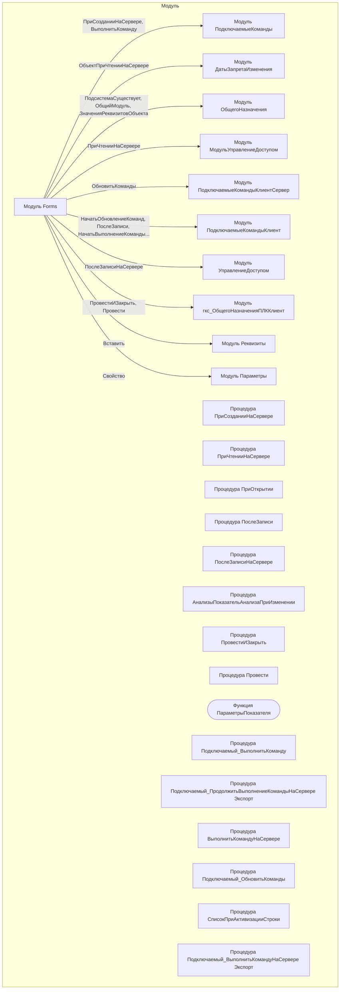

# Граф зависимостей: Forms

## Диаграмма

## Статистика

- **Процедур/функций:** 18
- **Экспортируемых:** 2
- **Внешних зависимостей:** 10
- **Внутренних вызовов:** 15

## Детали зависимостей

| Тип | Имя | Использований | Тип использования | Методы |
|-----|-----|---------------|-------------------|--------|
| module | ПодключаемыеКоманды | 4 | call | ПриСозданииНаСервере, ВыполнитьКоманду |
| module | ДатыЗапретаИзменения | 1 | call | ОбъектПриЧтенииНаСервере |
| module | ОбщегоНазначения | 3 | call | ПодсистемаСуществует, ОбщийМодуль, ЗначенияРеквизитовОбъекта |
| module | МодульУправлениеДоступом | 1 | call | ПриЧтенииНаСервере |
| module | ПодключаемыеКомандыКлиентСервер | 3 | call | ОбновитьКоманды |
| module | ПодключаемыеКомандыКлиент | 5 | call | НачатьОбновлениеКоманд, ПослеЗаписи, НачатьВыполнениеКоманды, ВыполнитьКоманду |
| module | УправлениеДоступом | 1 | call | ПослеЗаписиНаСервере |
| module | гкс_ОбщегоНазначенияПЛККлиент | 2 | call | ПровестиИЗакрыть, Провести |
| module | Реквизиты | 2 | call | Вставить |
| module | Параметры | 1 | call | Свойство |

---
*Сгенерировано автоматически: 2026-03-09T02:01:10.808Z*
