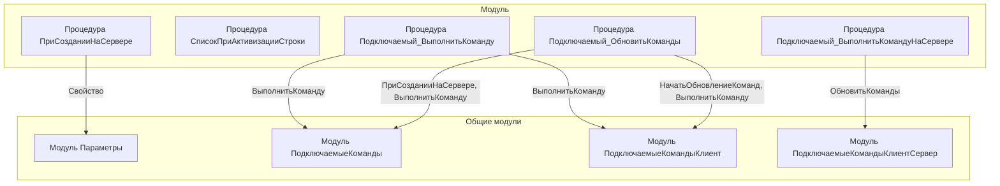

# Граф зависимостей: Ext

## Диаграмма

## Статистика

- **Процедур/функций:** 5
- **Экспортируемых:** 1
- **Внешних зависимостей:** 4
- **Внутренних вызовов:** 5

## Детали зависимостей

| Тип | Имя | Использований | Тип использования | Методы |
|-----|-----|---------------|-------------------|--------|
| module | Параметры | 1 | call | Свойство |
| module | ПодключаемыеКоманды | 2 | call | ПриСозданииНаСервере, ВыполнитьКоманду |
| module | ПодключаемыеКомандыКлиент | 2 | call | НачатьОбновлениеКоманд, ВыполнитьКоманду |
| module | ПодключаемыеКомандыКлиентСервер | 1 | call | ОбновитьКоманды |

---
*Сгенерировано автоматически: 2026-03-09T01:57:04.351Z*
