# Граф зависимостей: гкс_НормативнаяСертификацияНоменклатуры

## Диаграмма

```mermaid
graph TD
    subgraph module["Модуль"]
        Модуль_гкс_НормативнаяСертификацияНоменклатуры["Модуль гкс_НормативнаяСертификацияНоменклатуры"]
        Процедура_ЗарегистрироватьУчетныеМеханизмы_Экспорт["Процедура ЗарегистрироватьУчетныеМеханизмы Экспорт"]
        Функция_ДанныеДокументаДляПроведения_Экспорт(["Функция ДанныеДокументаДляПроведения Экспорт"])
        Процедура_ПриЗаполненииОграниченияДоступа_Экспорт["Процедура ПриЗаполненииОграниченияДоступа Экспорт"]
        Процедура_ДобавитьКомандыОтчетов_Экспорт["Процедура ДобавитьКомандыОтчетов Экспорт"]
        Процедура_ДобавитьКомандыСозданияНаОсновании_Экспорт["Процедура ДобавитьКомандыСозданияНаОсновании Экспорт"]
        Функция_ДобавитьКомандуСоздатьНаОсновании_Экспорт(["Функция ДобавитьКомандуСоздатьНаОсновании Экспорт"])
        Функция_ДополнительныеИсточникиДанныхДляДвижений_Экспорт(["Функция ДополнительныеИсточникиДанныхДляДвижений Экспорт"])
        Процедура_ЗаполнитьПараметрыИнициализации["Процедура ЗаполнитьПараметрыИнициализации"]
        Функция_ТекстЗапросаТаблицагкс_РезультатыНормативнойСертификацииНоменклатуры(["Функция ТекстЗапросаТаблицагкс_РезультатыНормативнойСертификацииНоменклатуры"])
        Процедура_ЗаполнитьТочкуМаршрутаВНормативнойСертификации_Экспорт["Процедура ЗаполнитьТочкуМаршрутаВНормативнойСертификации Экспорт"]
        Процедура_ЗаполнитьПризнакОтклонятьКачество_Экспорт["Процедура ЗаполнитьПризнакОтклонятьКачество Экспорт"]
        Процедура_ПередЗаписью["Процедура ПередЗаписью"]
        Процедура_ПриЗаписи["Процедура ПриЗаписи"]
        Процедура_ОбработкаПроведения["Процедура ОбработкаПроведения"]
        Процедура_ОбработкаУдаленияПроведения["Процедура ОбработкаУдаленияПроведения"]
        Процедура_ОбработкаПроверкиЗаполнения["Процедура ОбработкаПроверкиЗаполнения"]
        Процедура_ПроверитьЗаполнениеОбъектаПередЗаписью["Процедура ПроверитьЗаполнениеОбъектаПередЗаписью"]
        Функция_ПересеченияНормативныхПоказателейСуществуют(["Функция ПересеченияНормативныхПоказателейСуществуют"])
        Процедура_ПриСозданииНаСервере["Процедура ПриСозданииНаСервере"]
        Процедура_ПриЧтенииНаСервере["Процедура ПриЧтенииНаСервере"]
        Процедура_ПриОткрытии["Процедура ПриОткрытии"]
        Процедура_ПослеЗаписи["Процедура ПослеЗаписи"]
        Процедура_ПослеЗаписиНаСервере["Процедура ПослеЗаписиНаСервере"]
        Процедура_АнализыПоказательАнализаПриИзменении["Процедура АнализыПоказательАнализаПриИзменении"]
        Процедура_ПровестиИЗакрыть["Процедура ПровестиИЗакрыть"]
        Процедура_Провести["Процедура Провести"]
        Функция_ПараметрыПоказателя(["Функция ПараметрыПоказателя"])
        Процедура_Подключаемый_ВыполнитьКоманду["Процедура Подключаемый_ВыполнитьКоманду"]
        Процедура_Подключаемый_ПродолжитьВыполнениеКомандыНаСервере_Экспорт["Процедура Подключаемый_ПродолжитьВыполнениеКомандыНаСервере Экспорт"]
        Процедура_ВыполнитьКомандуНаСервере["Процедура ВыполнитьКомандуНаСервере"]
        Процедура_Подключаемый_ОбновитьКоманды["Процедура Подключаемый_ОбновитьКоманды"]
        Процедура_ПриСозданииНаСервере["Процедура ПриСозданииНаСервере"]
        Процедура_СписокПриАктивизацииСтроки["Процедура СписокПриАктивизацииСтроки"]
        Процедура_Подключаемый_ВыполнитьКоманду["Процедура Подключаемый_ВыполнитьКоманду"]
        Процедура_Подключаемый_ВыполнитьКомандуНаСервере_Экспорт["Процедура Подключаемый_ВыполнитьКомандуНаСервере Экспорт"]
        Процедура_Подключаемый_ОбновитьКоманды["Процедура Подключаемый_ОбновитьКоманды"]
    end
    subgraph module["Общие модули"]
        Модуль_МеханизмыДокумента["Модуль МеханизмыДокумента"]
        Модуль_гкс_ПроведениеДокументов["Модуль гкс_ПроведениеДокументов"]
        Модуль_ВариантыОтчетовПереопределяемый["Модуль ВариантыОтчетовПереопределяемый"]
        Модуль_КомандыСозданияНаОсновании["Модуль КомандыСозданияНаОсновании"]
        Модуль_гкс_НормативнаяСертификацияНоменклатуры["Модуль гкс_НормативнаяСертификацияНоменклатуры"]
        Модуль_гкс_ОбщегоНазначенияПЛК["Модуль гкс_ОбщегоНазначенияПЛК"]
        Модуль_Запрос["Модуль Запрос"]
        Модуль_ТекстыЗапроса["Модуль ТекстыЗапроса"]
        Модуль_ОбновлениеИнформационнойБазы["Модуль ОбновлениеИнформационнойБазы"]
        Модуль_гкс_ТочкаМаршрутаБазы["Модуль гкс_ТочкаМаршрутаБазы"]
        Модуль_Выборка["Модуль Выборка"]
        Модуль_Ссылка["Модуль Ссылка"]
        Модуль_СтроковыеФункцииКлиентСервер["Модуль СтроковыеФункцииКлиентСервер"]
        Модуль_ВыборкаПоДокументу["Модуль ВыборкаПоДокументу"]
        Модуль_НормативнаяСертификация["Модуль НормативнаяСертификация"]
        Модуль_ВыборкаПоказатель["Модуль ВыборкаПоказатель"]
        Модуль_Анализы["Модуль Анализы"]
        Модуль_ПроверяемыеРеквизиты["Модуль ПроверяемыеРеквизиты"]
        Модуль_ОбщегоНазначения["Модуль ОбщегоНазначения"]
        Модуль_гкс_ПриемкаТранспорта["Модуль гкс_ПриемкаТранспорта"]
        Модуль_гкс_ПриемкаНаПЛКСервер["Модуль гкс_ПриемкаНаПЛКСервер"]
        Модуль_ТаблицаПересечений["Модуль ТаблицаПересечений"]
        Модуль_ПодключаемыеКоманды["Модуль ПодключаемыеКоманды"]
        Модуль_ДатыЗапретаИзменения["Модуль ДатыЗапретаИзменения"]
        Модуль_МодульУправлениеДоступом["Модуль МодульУправлениеДоступом"]
        Модуль_ПодключаемыеКомандыКлиентСервер["Модуль ПодключаемыеКомандыКлиентСервер"]
        Модуль_ПодключаемыеКомандыКлиент["Модуль ПодключаемыеКомандыКлиент"]
        Модуль_УправлениеДоступом["Модуль УправлениеДоступом"]
        Модуль_гкс_ОбщегоНазначенияПЛККлиент["Модуль гкс_ОбщегоНазначенияПЛККлиент"]
        Модуль_Реквизиты["Модуль Реквизиты"]
        Модуль_Параметры["Модуль Параметры"]
    end
    subgraph processing["Обработки"]
        Обработка_ОбработкаОшибок["Обработка ОбработкаОшибок"]
    end
    subgraph document["Документы"]
        Документ_гкс_НормативнаяСертификацияНоменклатуры{{Документ гкс_НормативнаяСертификацияНоменклатуры}}
    end
    subgraph external["Внешние"]
        гкс_ТочкаМаршрутаБазы["гкс_ТочкаМаршрутаБазы"]
    end
    Модуль_гкс_НормативнаяСертификацияНоменклатуры -->|Добавить| Модуль_МеханизмыДокумента
    Модуль_гкс_НормативнаяСертификацияНоменклатуры -->|ДопПараметрыИнициализироватьДанныеДокументаДляПроведения, ИнициализироватьДанныеДокументаДляПроведения, ТребуетсяТаблицаДляДвижений...| Модуль_гкс_ПроведениеДокументов
    Модуль_гкс_НормативнаяСертификацияНоменклатуры -->|ДобавитьКомандуСтруктураПодчиненности| Модуль_ВариантыОтчетовПереопределяемый
    Модуль_гкс_НормативнаяСертификацияНоменклатуры -->|Добавить| Модуль_КомандыСозданияНаОсновании
    Модуль_гкс_НормативнаяСертификацияНоменклатуры -->|ПолноеИмя| Модуль_гкс_НормативнаяСертификацияНоменклатуры
    Модуль_гкс_НормативнаяСертификацияНоменклатуры -->|ПредставлениеОбъекта| Модуль_гкс_ОбщегоНазначенияПЛК
    Модуль_гкс_НормативнаяСертификацияНоменклатуры -->|УстановитьПараметр, Выполнить| Модуль_Запрос
    Модуль_гкс_НормативнаяСертификацияНоменклатуры -->|Добавить| Модуль_ТекстыЗапроса
    Модуль_гкс_НормативнаяСертификацияНоменклатуры -->|СобытиеЖурналаРегистрации, ЗаписатьОбъект, ПроверитьОбъектОбработан| Модуль_ОбновлениеИнформационнойБазы
    Модуль_гкс_НормативнаяСертификацияНоменклатуры -->|Получить| Модуль_гкс_ТочкаМаршрутаБазы
    Модуль_гкс_НормативнаяСертификацияНоменклатуры -->|Следующий| Модуль_Выборка
    Модуль_гкс_НормативнаяСертификацияНоменклатуры -->|ПолучитьОбъект| Модуль_Ссылка
    Модуль_гкс_НормативнаяСертификацияНоменклатуры -->|ПодставитьПараметрыВСтроку| Модуль_СтроковыеФункцииКлиентСервер
    Модуль_гкс_НормативнаяСертификацияНоменклатуры -->|Следующий, Выбрать| Модуль_ВыборкаПоДокументу
    Модуль_гкс_НормативнаяСертификацияНоменклатуры -->|ПолучитьОбъект| Модуль_НормативнаяСертификация
    Модуль_гкс_НормативнаяСертификацияНоменклатуры -->|Следующий| Модуль_ВыборкаПоказатель
    Модуль_гкс_НормативнаяСертификацияНоменклатуры -->|НайтиСтроки| Модуль_Анализы
    Модуль_гкс_НормативнаяСертификацияНоменклатуры -->|Добавить| Модуль_ПроверяемыеРеквизиты
    Модуль_гкс_НормативнаяСертификацияНоменклатуры -->|СообщитьПользователю, ПодсистемаСуществует, ОбщийМодуль...| Модуль_ОбщегоНазначения
    Модуль_гкс_НормативнаяСертификацияНоменклатуры -->|НоменклатураНазначенаНаЯмуДляТочкиМаршрута| Модуль_гкс_ПриемкаТранспорта
    Модуль_гкс_НормативнаяСертификацияНоменклатуры -->|ПолучитьПересекаемостьНормативныхПоказателейСерификации| Модуль_гкс_ПриемкаНаПЛКСервер
    Модуль_гкс_НормативнаяСертификацияНоменклатуры -->|Количество| Модуль_ТаблицаПересечений
    Модуль_гкс_НормативнаяСертификацияНоменклатуры -->|ПриСозданииНаСервере, ВыполнитьКоманду| Модуль_ПодключаемыеКоманды
    Модуль_гкс_НормативнаяСертификацияНоменклатуры -->|ОбъектПриЧтенииНаСервере| Модуль_ДатыЗапретаИзменения
    Модуль_гкс_НормативнаяСертификацияНоменклатуры -->|ПриЧтенииНаСервере| Модуль_МодульУправлениеДоступом
    Модуль_гкс_НормативнаяСертификацияНоменклатуры -->|ОбновитьКоманды| Модуль_ПодключаемыеКомандыКлиентСервер
    Модуль_гкс_НормативнаяСертификацияНоменклатуры -->|НачатьОбновлениеКоманд, ПослеЗаписи, НачатьВыполнениеКоманды...| Модуль_ПодключаемыеКомандыКлиент
    Модуль_гкс_НормативнаяСертификацияНоменклатуры -->|ПослеЗаписиНаСервере| Модуль_УправлениеДоступом
    Модуль_гкс_НормативнаяСертификацияНоменклатуры -->|ПровестиИЗакрыть, Провести| Модуль_гкс_ОбщегоНазначенияПЛККлиент
    Модуль_гкс_НормативнаяСертификацияНоменклатуры -->|Вставить| Модуль_Реквизиты
    Модуль_гкс_НормативнаяСертификацияНоменклатуры -->|Свойство| Модуль_Параметры
    Модуль_гкс_НормативнаяСертификацияНоменклатуры -->|ПодробноеПредставлениеОшибки| Обработка_ОбработкаОшибок
    Модуль_гкс_НормативнаяСертификацияНоменклатуры -->|ссылка| Документ_гкс_НормативнаяСертификацияНоменклатуры
    Модуль_гкс_НормативнаяСертификацияНоменклатуры -->|ссылка| гкс_ТочкаМаршрутаБазы
```

## Статистика

- **Процедур/функций:** 36
- **Экспортируемых:** 11
- **Внешних зависимостей:** 34
- **Внутренних вызовов:** 33

## Детали зависимостей

| Тип | Имя | Использований | Тип использования | Методы |
|-----|-----|---------------|-------------------|--------|
| module | МеханизмыДокумента | 1 | call | Добавить |
| module | гкс_ПроведениеДокументов | 7 | call | ДопПараметрыИнициализироватьДанныеДокументаДляПроведения, ИнициализироватьДанныеДокументаДляПроведения, ТребуетсяТаблицаДляДвижений, ПередЗаписьюДокумента, ПриЗаписиДокумента... |
| module | ВариантыОтчетовПереопределяемый | 1 | call | ДобавитьКомандуСтруктураПодчиненности |
| module | КомандыСозданияНаОсновании | 1 | call | Добавить |
| module | гкс_НормативнаяСертификацияНоменклатуры | 2 | call | ПолноеИмя |
| module | гкс_ОбщегоНазначенияПЛК | 1 | call | ПредставлениеОбъекта |
| module | Запрос | 3 | call | УстановитьПараметр, Выполнить |
| module | ТекстыЗапроса | 1 | call | Добавить |
| module | ОбновлениеИнформационнойБазы | 5 | call | СобытиеЖурналаРегистрации, ЗаписатьОбъект, ПроверитьОбъектОбработан |
| module | гкс_ТочкаМаршрутаБазы | 1 | call | Получить |
| module | Выборка | 1 | call | Следующий |
| module | Ссылка | 1 | call | ПолучитьОбъект |
| processing | ОбработкаОшибок | 2 | call | ПодробноеПредставлениеОшибки |
| module | СтроковыеФункцииКлиентСервер | 4 | call | ПодставитьПараметрыВСтроку |
| module | ВыборкаПоДокументу | 2 | call | Следующий, Выбрать |
| module | НормативнаяСертификация | 1 | call | ПолучитьОбъект |
| module | ВыборкаПоказатель | 1 | call | Следующий |
| module | Анализы | 1 | call | НайтиСтроки |
| document | гкс_НормативнаяСертификацияНоменклатуры | 11 | reference | - |
| external | гкс_ТочкаМаршрутаБазы | 1 | reference | - |
| module | ПроверяемыеРеквизиты | 1 | call | Добавить |
| module | ОбщегоНазначения | 4 | call | СообщитьПользователю, ПодсистемаСуществует, ОбщийМодуль, ЗначенияРеквизитовОбъекта |
| module | гкс_ПриемкаТранспорта | 1 | call | НоменклатураНазначенаНаЯмуДляТочкиМаршрута |
| module | гкс_ПриемкаНаПЛКСервер | 1 | call | ПолучитьПересекаемостьНормативныхПоказателейСерификации |
| module | ТаблицаПересечений | 1 | call | Количество |
| module | ПодключаемыеКоманды | 4 | call | ПриСозданииНаСервере, ВыполнитьКоманду |
| module | ДатыЗапретаИзменения | 1 | call | ОбъектПриЧтенииНаСервере |
| module | МодульУправлениеДоступом | 1 | call | ПриЧтенииНаСервере |
| module | ПодключаемыеКомандыКлиентСервер | 3 | call | ОбновитьКоманды |
| module | ПодключаемыеКомандыКлиент | 5 | call | НачатьОбновлениеКоманд, ПослеЗаписи, НачатьВыполнениеКоманды, ВыполнитьКоманду |
| module | УправлениеДоступом | 1 | call | ПослеЗаписиНаСервере |
| module | гкс_ОбщегоНазначенияПЛККлиент | 2 | call | ПровестиИЗакрыть, Провести |
| module | Реквизиты | 2 | call | Вставить |
| module | Параметры | 1 | call | Свойство |

---
*Сгенерировано автоматически: 2026-03-09T02:01:27.038Z*
