# Граф зависимостей: Ext

## Диаграмма

```mermaid
graph TD
    subgraph Модуль
        Процедура_ПриСозданииНаСервере["Процедура ПриСозданииНаСервере"]
        Процедура_ПриЧтенииНаСервере["Процедура ПриЧтенииНаСервере"]
        Процедура_ПриОткрытии["Процедура ПриОткрытии"]
        Процедура_ПослеЗаписи["Процедура ПослеЗаписи"]
        Процедура_ПослеЗаписиНаСервере["Процедура ПослеЗаписиНаСервере"]
        Процедура_Подключаемый_ВыполнитьКоманду["Процедура Подключаемый_ВыполнитьКоманду"]
        Процедура_Подключаемый_ПродолжитьВыполнениеКомандыНаСервере["Процедура Подключаемый_ПродолжитьВыполнениеКомандыНаСервере"]
        Процедура_ВыполнитьКомандуНаСервере["Процедура ВыполнитьКомандуНаСервере"]
        Процедура_Подключаемый_ОбновитьКоманды["Процедура Подключаемый_ОбновитьКоманды"]
        Процедура_ИнициализироватьРеквизитыФормы["Процедура ИнициализироватьРеквизитыФормы"]
        Процедура_УстановитьВидимостьДоступностьЭлементовФормы["Процедура УстановитьВидимостьДоступностьЭлементовФормы"]
        Процедура_ИнициализироватьДатуБУ["Процедура ИнициализироватьДатуБУ"]
    end

    subgraph Общие модули
        Модуль_Параметры["Модуль Параметры"]
        Модуль_ПодключаемыеКоманды["Модуль ПодключаемыеКоманды"]
        Модуль_ОбщегоНазначения["Модуль ОбщегоНазначения"]
        Модуль_МодульУправлениеДоступом["Модуль МодульУправлениеДоступом"]
        Модуль_ПодключаемыеКомандыКлиентСервер["Модуль ПодключаемыеКомандыКлиентСервер"]
        Модуль_гкс_УправлениеДоступом["Модуль гкс_УправлениеДоступом"]
        Модуль_ПодключаемыеКомандыКлиент["Модуль ПодключаемыеКомандыКлиент"]
        Модуль_УправлениеДоступом["Модуль УправлениеДоступом"]
        Модуль_гкс_ПриемкаТранспорта["Модуль гкс_ПриемкаТранспорта"]
    end

    subgraph Перечисления
        Перечисление_гкс_ТипРегистрации[[Перечисление гкс_ТипРегистрации]]
    end

    Процедура_ПриСозданииНаСервере -->|ПриСозданииНаСервере| Модуль_ПодключаемыеКоманды
    Процедура_ПриЧтенииНаСервере -->|ПриЧтенииНаСервере| Модуль_МодульУправлениеДоступом
    Процедура_ПриОткрытии -->|НачатьОбновлениеКоманд| Модуль_ПодключаемыеКомандыКлиент
    Процедура_ПослеЗаписи -->|ПослеЗаписи| Модуль_ПодключаемыеКомандыКлиент
    Процедура_ПослеЗаписиНаСервере -->|ПослеЗаписиНаСервере| Модуль_УправлениеДоступом
    Процедура_Подключаемый_ВыполнитьКоманду -->|ВыполнитьКоманду| Модуль_ПодключаемыеКоманды
    Процедура_Подключаемый_ВыполнитьКоманду -->|НачатьВыполнениеКоманды| Модуль_ПодключаемыеКомандыКлиент
    Процедура_Подключаемый_ПродолжитьВыполнениеКомандыНаСервере -->|call| Модуль_ПодключаемыеКомандыКлиентСервер
    Процедура_ВыполнитьКомандуНаСервере -->|call| Модуль_ПодключаемыеКоманды
    Процедура_Подключаемый_ОбновитьКоманды -->|ОбновитьКоманды| Модуль_ПодключаемыеКомандыКлиентСервер
    Процедура_ИнициализироватьРеквизитыФормы -->|Свойство| Модуль_Параметры
    Процедура_ИнициализироватьРеквизитыФормы -->|ПодсистемаСуществует, ОбщийМодуль| Модуль_ОбщегоНазначения
    Процедура_УстановитьВидимостьДоступностьЭлементовФормы -->|ОпределитьДоступностьВозможностьИзмененияДокументаПоРеестру| Модуль_гкс_УправлениеДоступом
    Процедура_ИнициализироватьДатуБУ -->|ДатаБУПриемкиТранспорта| Модуль_гкс_ПриемкаТранспорта
    Процедура_ИнициализироватьДатуБУ -->|гкс_ТипРегистрации| Перечисление_гкс_ТипРегистрации
```

## Статистика

- **Процедур/функций:** 12
- **Экспортируемых:** 1
- **Внешних зависимостей:** 10
- **Внутренних вызовов:** 12

## Детали зависимостей

| Тип | Имя | Использований | Тип использования | Методы |
|-----|-----|---------------|-------------------|--------|
| module | Параметры | 1 | call | Свойство |
| module | ПодключаемыеКоманды | 2 | call | ПриСозданииНаСервере, ВыполнитьКоманду |
| module | ОбщегоНазначения | 2 | call | ПодсистемаСуществует, ОбщийМодуль |
| module | МодульУправлениеДоступом | 1 | call | ПриЧтенииНаСервере |
| module | ПодключаемыеКомандыКлиентСервер | 2 | call | ОбновитьКоманды |
| module | гкс_УправлениеДоступом | 1 | call | ОпределитьДоступностьВозможностьИзмененияДокументаПоРеестру |
| module | ПодключаемыеКомандыКлиент | 3 | call | НачатьОбновлениеКоманд, ПослеЗаписи, НачатьВыполнениеКоманды |
| module | УправлениеДоступом | 1 | call | ПослеЗаписиНаСервере |
| module | гкс_ПриемкаТранспорта | 1 | call | ДатаБУПриемкиТранспорта |
| enum | гкс_ТипРегистрации | 1 | reference | - |

---
*Сгенерировано автоматически: 2026-03-09T01:57:06.473Z*
