# Граф зависимостей: гкс_ОснованиеДляДвиженияЗапасов

## Диаграмма

```mermaid
graph TD
    subgraph module["Модуль"]
        Модуль_гкс_ОснованиеДляДвиженияЗапасов["Модуль гкс_ОснованиеДляДвиженияЗапасов"]
        Процедура_ПриЗаполненииОграниченияДоступа_Экспорт["Процедура ПриЗаполненииОграниченияДоступа Экспорт"]
        Функция_СформироватьДокументПоНеобходимости_Экспорт(["Функция СформироватьДокументПоНеобходимости Экспорт"])
        Процедура_АктуализироватьДокументДвиженияЗапасов_Экспорт["Процедура АктуализироватьДокументДвиженияЗапасов Экспорт"]
        Функция_ПолучитьПоРегистрации_Экспорт(["Функция ПолучитьПоРегистрации Экспорт"])
        Функция_ДокументыОснованияДляДвиженияЗапасовПоФормированиюНомераПроб_Экспорт(["Функция ДокументыОснованияДляДвиженияЗапасовПоФормированиюНомераПроб Экспорт"])
        Процедура_ПерезаполнитьОснованиеДвиженияЗапасовКомпозит_Экспорт["Процедура ПерезаполнитьОснованиеДвиженияЗапасовКомпозит Экспорт"]
        Функция_ДокументыОснованияДляДвиженияЗапасовПоКомпозитномуЛабораторномуАнализу(["Функция ДокументыОснованияДляДвиженияЗапасовПоКомпозитномуЛабораторномуАнализу"])
        Процедура_ПерезаполнитьПоЛабАнализу_Экспорт["Процедура ПерезаполнитьПоЛабАнализу Экспорт"]
        Процедура_ОбработкаЗаполнения["Процедура ОбработкаЗаполнения"]
        Процедура_ЗаполнитьКачественныеПоказателиПоЛабораторномуАнализу["Процедура ЗаполнитьКачественныеПоказателиПоЛабораторномуАнализу"]
        Процедура_ЗаполнитьРеквизитыПоУсловиямРегистрации["Процедура ЗаполнитьРеквизитыПоУсловиямРегистрации"]
        Функция_ОпределитьДатуРазгрузки(["Функция ОпределитьДатуРазгрузки"])
        Функция_ОпределитьУсловиеПоставкиПоРегистрации(["Функция ОпределитьУсловиеПоставкиПоРегистрации"])
        Функция_ОпределитьСобственникаПоДаннымЗаполнения(["Функция ОпределитьСобственникаПоДаннымЗаполнения"])
        Процедура_ПереопределитьПунктПогрузкиРазгрузки["Процедура ПереопределитьПунктПогрузкиРазгрузки"]
        Процедура_ПриСозданииНаСервере["Процедура ПриСозданииНаСервере"]
        Процедура_ПриЧтенииНаСервере["Процедура ПриЧтенииНаСервере"]
        Процедура_ПриОткрытии["Процедура ПриОткрытии"]
        Процедура_ПослеЗаписи["Процедура ПослеЗаписи"]
        Процедура_ПослеЗаписиНаСервере["Процедура ПослеЗаписиНаСервере"]
        Процедура_Подключаемый_ВыполнитьКоманду["Процедура Подключаемый_ВыполнитьКоманду"]
        Процедура_Подключаемый_ПродолжитьВыполнениеКомандыНаСервере_Экспорт["Процедура Подключаемый_ПродолжитьВыполнениеКомандыНаСервере Экспорт"]
        Процедура_ВыполнитьКомандуНаСервере["Процедура ВыполнитьКомандуНаСервере"]
        Процедура_Подключаемый_ОбновитьКоманды["Процедура Подключаемый_ОбновитьКоманды"]
        Процедура_ИнициализироватьРеквизитыФормы["Процедура ИнициализироватьРеквизитыФормы"]
        Процедура_УстановитьВидимостьДоступностьЭлементовФормы["Процедура УстановитьВидимостьДоступностьЭлементовФормы"]
        Процедура_ИнициализироватьДатуБУ["Процедура ИнициализироватьДатуБУ"]
    end
    subgraph module["Общие модули"]
        Модуль_ДанныеЗаполнения["Модуль ДанныеЗаполнения"]
        Модуль_ОснованиеДляДвиженияЗапасов["Модуль ОснованиеДляДвиженияЗапасов"]
        Модуль_гкс_ОбщегоНазначения["Модуль гкс_ОбщегоНазначения"]
        Модуль_ОснованиеДляДвиженияЗапасовСсылка["Модуль ОснованиеДляДвиженияЗапасовСсылка"]
        Модуль_гкс_ПриемкаНаПЛКСервер["Модуль гкс_ПриемкаНаПЛКСервер"]
        Модуль_Запрос["Модуль Запрос"]
        Модуль_РезультатЗапроса["Модуль РезультатЗапроса"]
        Модуль_Выборка["Модуль Выборка"]
        Модуль_ДанныеЗапроса["Модуль ДанныеЗапроса"]
        Модуль_Блокировка["Модуль Блокировка"]
        Модуль_ЭлементБлокировки["Модуль ЭлементБлокировки"]
        Модуль_Результат["Модуль Результат"]
        Модуль_гкс_ПриемкаТранспорта["Модуль гкс_ПриемкаТранспорта"]
        Модуль_гкс_ЛабораторныйАнализ["Модуль гкс_ЛабораторныйАнализ"]
        Модуль_КачественныеПоказатели["Модуль КачественныеПоказатели"]
        Модуль_ВыборкаДетальныеЗаписи["Модуль ВыборкаДетальныеЗаписи"]
        Модуль_ОбщегоНазначения["Модуль ОбщегоНазначения"]
        Модуль_гкс_Взвешивание["Модуль гкс_Взвешивание"]
        Модуль_Контрагенты["Модуль Контрагенты"]
        Модуль_гкс_ТранспортныйДокумент["Модуль гкс_ТранспортныйДокумент"]
        Модуль_Параметры["Модуль Параметры"]
        Модуль_ПодключаемыеКоманды["Модуль ПодключаемыеКоманды"]
        Модуль_МодульУправлениеДоступом["Модуль МодульУправлениеДоступом"]
        Модуль_ПодключаемыеКомандыКлиентСервер["Модуль ПодключаемыеКомандыКлиентСервер"]
        Модуль_гкс_УправлениеДоступом["Модуль гкс_УправлениеДоступом"]
        Модуль_ПодключаемыеКомандыКлиент["Модуль ПодключаемыеКомандыКлиент"]
        Модуль_УправлениеДоступом["Модуль УправлениеДоступом"]
    end
    subgraph document["Документы"]
        Документ_ДокументОбъект{{Документ ДокументОбъект}}
        Документ_ДокументСсылка{{Документ ДокументСсылка}}
        Документ_гкс_ЛабораторныйАнализ{{Документ гкс_ЛабораторныйАнализ}}
        Документ_гкс_Взвешивание{{Документ гкс_Взвешивание}}
        Документ_гкс_ТранспортныйДокумент{{Документ гкс_ТранспортныйДокумент}}
    end
    subgraph processing["Обработки"]
        Обработка_ОбработкаОшибок["Обработка ОбработкаОшибок"]
    end
    subgraph catalog["Справочники"]
        Справочник_гкс_УсловияПоставки[(Справочник гкс_УсловияПоставки)]
        Справочник_Контрагенты[(Справочник Контрагенты)]
    end
    subgraph enum["Перечисления"]
        Перечисление_гкс_ТипРегистрации(["Перечисление гкс_ТипРегистрации"])
    end
    Модуль_гкс_ОснованиеДляДвиженияЗапасов -->|Вставить, Свойство| Модуль_ДанныеЗаполнения
    Модуль_гкс_ОснованиеДляДвиженияЗапасов -->|ПолучитьОбъект, ПерезаполнитьПоЛабАнализу| Модуль_ОснованиеДляДвиженияЗапасов
    Модуль_гкс_ОснованиеДляДвиженияЗапасов -->|СохранитьДокумент| Модуль_гкс_ОбщегоНазначения
    Модуль_гкс_ОснованиеДляДвиженияЗапасов -->|ПолучитьОбъект| Модуль_ОснованиеДляДвиженияЗапасовСсылка
    Модуль_гкс_ОснованиеДляДвиженияЗапасов -->|ПоказанияВесовПоРегистрации| Модуль_гкс_ПриемкаНаПЛКСервер
    Модуль_гкс_ОснованиеДляДвиженияЗапасов -->|УстановитьПараметр, Выполнить| Модуль_Запрос
    Модуль_гкс_ОснованиеДляДвиженияЗапасов -->|Пустой, Выбрать, Выгрузить| Модуль_РезультатЗапроса
    Модуль_гкс_ОснованиеДляДвиженияЗапасов -->|Следующий| Модуль_Выборка
    Модуль_гкс_ОснованиеДляДвиженияЗапасов -->|ВыгрузитьКолонку| Модуль_ДанныеЗапроса
    Модуль_гкс_ОснованиеДляДвиженияЗапасов -->|Добавить, Заблокировать| Модуль_Блокировка
    Модуль_гкс_ОснованиеДляДвиженияЗапасов -->|УстановитьЗначение| Модуль_ЭлементБлокировки
    Модуль_гкс_ОснованиеДляДвиженияЗапасов -->|Добавить| Модуль_Результат
    Модуль_гкс_ОснованиеДляДвиженияЗапасов -->|ПодходитДляОснованияДвиженияЗапасов, ДатаБУПриемкиТранспорта| Модуль_гкс_ПриемкаТранспорта
    Модуль_гкс_ОснованиеДляДвиженияЗапасов -->|ПустаяСсылка| Модуль_гкс_ЛабораторныйАнализ
    Модуль_гкс_ОснованиеДляДвиженияЗапасов -->|Очистить, Добавить| Модуль_КачественныеПоказатели
    Модуль_гкс_ОснованиеДляДвиженияЗапасов -->|Следующий| Модуль_ВыборкаДетальныеЗаписи
    Модуль_гкс_ОснованиеДляДвиженияЗапасов -->|ЗначенияРеквизитовОбъекта, ЗначениеРеквизитаОбъекта, ПодсистемаСуществует...| Модуль_ОбщегоНазначения
    Модуль_гкс_ОснованиеДляДвиженияЗапасов -->|ДатаВзвешиванияПоРегистрации| Модуль_гкс_Взвешивание
    Модуль_гкс_ОснованиеДляДвиженияЗапасов -->|ПустаяСсылка| Модуль_Контрагенты
    Модуль_гкс_ОснованиеДляДвиженияЗапасов -->|ПустаяСсылка| Модуль_гкс_ТранспортныйДокумент
    Модуль_гкс_ОснованиеДляДвиженияЗапасов -->|Свойство| Модуль_Параметры
    Модуль_гкс_ОснованиеДляДвиженияЗапасов -->|ПриСозданииНаСервере, ВыполнитьКоманду| Модуль_ПодключаемыеКоманды
    Модуль_гкс_ОснованиеДляДвиженияЗапасов -->|ПриЧтенииНаСервере| Модуль_МодульУправлениеДоступом
    Модуль_гкс_ОснованиеДляДвиженияЗапасов -->|ОбновитьКоманды| Модуль_ПодключаемыеКомандыКлиентСервер
    Модуль_гкс_ОснованиеДляДвиженияЗапасов -->|ОпределитьДоступностьВозможностьИзмененияДокументаПоРеестру| Модуль_гкс_УправлениеДоступом
    Модуль_гкс_ОснованиеДляДвиженияЗапасов -->|НачатьОбновлениеКоманд, ПослеЗаписи, НачатьВыполнениеКоманды| Модуль_ПодключаемыеКомандыКлиент
    Модуль_гкс_ОснованиеДляДвиженияЗапасов -->|ПослеЗаписиНаСервере| Модуль_УправлениеДоступом
    Модуль_гкс_ОснованиеДляДвиженияЗапасов -->|Заполнить| Документ_ДокументОбъект
    Модуль_гкс_ОснованиеДляДвиженияЗапасов -->|ПолучитьОбъект| Документ_ДокументСсылка
    Модуль_гкс_ОснованиеДляДвиженияЗапасов -->|ссылка| Документ_гкс_ЛабораторныйАнализ
    Модуль_гкс_ОснованиеДляДвиженияЗапасов -->|ссылка| Документ_гкс_Взвешивание
    Модуль_гкс_ОснованиеДляДвиженияЗапасов -->|ссылка| Документ_гкс_ТранспортныйДокумент
    Модуль_гкс_ОснованиеДляДвиженияЗапасов -->|ПодробноеПредставлениеОшибки| Обработка_ОбработкаОшибок
    Модуль_гкс_ОснованиеДляДвиженияЗапасов -->|ссылка| Справочник_гкс_УсловияПоставки
    Модуль_гкс_ОснованиеДляДвиженияЗапасов -->|ссылка| Справочник_Контрагенты
    Модуль_гкс_ОснованиеДляДвиженияЗапасов -->|ссылка| Перечисление_гкс_ТипРегистрации
```

## Статистика

- **Процедур/функций:** 27
- **Экспортируемых:** 8
- **Внешних зависимостей:** 36
- **Внутренних вызовов:** 27

## Детали зависимостей

| Тип | Имя | Использований | Тип использования | Методы |
|-----|-----|---------------|-------------------|--------|
| module | ДанныеЗаполнения | 3 | call | Вставить, Свойство |
| module | ОснованиеДляДвиженияЗапасов | 2 | call | ПолучитьОбъект, ПерезаполнитьПоЛабАнализу |
| document | ДокументОбъект | 1 | reference | Заполнить |
| module | гкс_ОбщегоНазначения | 3 | call | СохранитьДокумент |
| module | ОснованиеДляДвиженияЗапасовСсылка | 1 | call | ПолучитьОбъект |
| module | гкс_ПриемкаНаПЛКСервер | 1 | call | ПоказанияВесовПоРегистрации |
| module | Запрос | 8 | call | УстановитьПараметр, Выполнить |
| module | РезультатЗапроса | 7 | call | Пустой, Выбрать, Выгрузить |
| module | Выборка | 2 | call | Следующий |
| module | ДанныеЗапроса | 1 | call | ВыгрузитьКолонку |
| module | Блокировка | 2 | call | Добавить, Заблокировать |
| module | ЭлементБлокировки | 1 | call | УстановитьЗначение |
| document | ДокументСсылка | 1 | reference | ПолучитьОбъект |
| processing | ОбработкаОшибок | 1 | call | ПодробноеПредставлениеОшибки |
| module | Результат | 1 | call | Добавить |
| module | гкс_ПриемкаТранспорта | 2 | call | ПодходитДляОснованияДвиженияЗапасов, ДатаБУПриемкиТранспорта |
| module | гкс_ЛабораторныйАнализ | 1 | call | ПустаяСсылка |
| module | КачественныеПоказатели | 2 | call | Очистить, Добавить |
| module | ВыборкаДетальныеЗаписи | 1 | call | Следующий |
| module | ОбщегоНазначения | 5 | call | ЗначенияРеквизитовОбъекта, ЗначениеРеквизитаОбъекта, ПодсистемаСуществует, ОбщийМодуль |
| module | гкс_Взвешивание | 1 | call | ДатаВзвешиванияПоРегистрации |
| module | Контрагенты | 1 | call | ПустаяСсылка |
| module | гкс_ТранспортныйДокумент | 1 | call | ПустаяСсылка |
| document | гкс_ЛабораторныйАнализ | 1 | reference | - |
| document | гкс_Взвешивание | 1 | reference | - |
| catalog | гкс_УсловияПоставки | 2 | reference | - |
| catalog | Контрагенты | 1 | reference | - |
| document | гкс_ТранспортныйДокумент | 1 | reference | - |
| module | Параметры | 1 | call | Свойство |
| module | ПодключаемыеКоманды | 2 | call | ПриСозданииНаСервере, ВыполнитьКоманду |
| module | МодульУправлениеДоступом | 1 | call | ПриЧтенииНаСервере |
| module | ПодключаемыеКомандыКлиентСервер | 2 | call | ОбновитьКоманды |
| module | гкс_УправлениеДоступом | 1 | call | ОпределитьДоступностьВозможностьИзмененияДокументаПоРеестру |
| module | ПодключаемыеКомандыКлиент | 3 | call | НачатьОбновлениеКоманд, ПослеЗаписи, НачатьВыполнениеКоманды |
| module | УправлениеДоступом | 1 | call | ПослеЗаписиНаСервере |
| enum | гкс_ТипРегистрации | 1 | reference | - |

---
*Сгенерировано автоматически: 2026-03-09T02:01:27.035Z*
