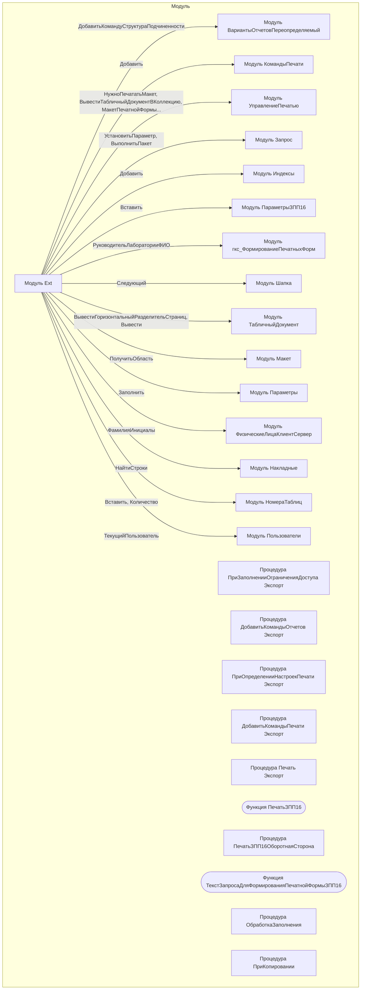

# Граф зависимостей: Ext

## Диаграмма

## Статистика

- **Процедур/функций:** 10
- **Экспортируемых:** 5
- **Внешних зависимостей:** 15
- **Внутренних вызовов:** 10

## Детали зависимостей

| Тип | Имя | Использований | Тип использования | Методы |
|-----|-----|---------------|-------------------|--------|
| module | ВариантыОтчетовПереопределяемый | 1 | call | ДобавитьКомандуСтруктураПодчиненности |
| module | КомандыПечати | 1 | call | Добавить |
| module | УправлениеПечатью | 4 | call | НужноПечататьМакет, ВывестиТабличныйДокументВКоллекцию, МакетПечатнойФормы, ЗадатьОбластьПечатиДокумента |
| module | Запрос | 2 | call | УстановитьПараметр, ВыполнитьПакет |
| module | Индексы | 1 | call | Добавить |
| module | ПараметрыЗПП16 | 2 | call | Вставить |
| module | гкс_ФормированиеПечатныхФорм | 1 | call | РуководительЛабораторииФИО |
| module | Шапка | 1 | call | Следующий |
| module | ТабличныйДокумент | 10 | call | ВывестиГоризонтальныйРазделительСтраниц, Вывести |
| module | Макет | 8 | call | ПолучитьОбласть |
| module | Параметры | 2 | call | Заполнить |
| module | ФизическиеЛицаКлиентСервер | 2 | call | ФамилияИнициалы |
| module | Накладные | 1 | call | НайтиСтроки |
| module | НомераТаблиц | 4 | call | Вставить, Количество |
| module | Пользователи | 2 | call | ТекущийПользователь |

---
*Сгенерировано автоматически: 2026-03-09T02:01:10.822Z*
