# Граф зависимостей: Forms

## Диаграмма

```mermaid
graph TD
    subgraph module["Модуль"]
        Модуль_Forms["Модуль Forms"]
        Процедура_ПриСозданииНаСервере["Процедура ПриСозданииНаСервере"]
        Процедура_ПриЧтенииНаСервере["Процедура ПриЧтенииНаСервере"]
        Процедура_ПриОткрытии["Процедура ПриОткрытии"]
        Процедура_ПослеЗаписи["Процедура ПослеЗаписи"]
        Процедура_ПослеЗаписиНаСервере["Процедура ПослеЗаписиНаСервере"]
        Процедура_НакладныеДокументРегистрацииПриИзменении["Процедура НакладныеДокументРегистрацииПриИзменении"]
        Процедура_ЗаполнитьДанныеРегистраций["Процедура ЗаполнитьДанныеРегистраций"]
        Процедура_ОбновитьДанныеРегистраций["Процедура ОбновитьДанныеРегистраций"]
        Процедура_Подключаемый_ВыполнитьКоманду["Процедура Подключаемый_ВыполнитьКоманду"]
        Процедура_Подключаемый_ПродолжитьВыполнениеКомандыНаСервере_Экспорт["Процедура Подключаемый_ПродолжитьВыполнениеКомандыНаСервере Экспорт"]
        Процедура_ВыполнитьКомандуНаСервере["Процедура ВыполнитьКомандуНаСервере"]
        Процедура_Подключаемый_ОбновитьКоманды["Процедура Подключаемый_ОбновитьКоманды"]
        Процедура_ЗаполнитьДанныеРегистрацийПродолжение_Экспорт["Процедура ЗаполнитьДанныеРегистрацийПродолжение Экспорт"]
        Процедура_НакладныеДокументРегистрацииПриИзмененииНаКлиенте["Процедура НакладныеДокументРегистрацииПриИзмененииНаКлиенте"]
        Процедура_ОбновитьДанныеРегистрацийЗавершение_Экспорт["Процедура ОбновитьДанныеРегистрацийЗавершение Экспорт"]
        Процедура_ЗаполнитьДанныеРегистрацийНаСервере["Процедура ЗаполнитьДанныеРегистрацийНаСервере"]
        Процедура_ОбновитьДанныеРегистрацийНаСервере["Процедура ОбновитьДанныеРегистрацийНаСервере"]
        Процедура_ЗаполнитьДанныеВесов["Процедура ЗаполнитьДанныеВесов"]
        Процедура_ПриСозданииНаСервере["Процедура ПриСозданииНаСервере"]
        Процедура_СписокПриАктивизацииСтроки["Процедура СписокПриАктивизацииСтроки"]
        Процедура_Подключаемый_ВыполнитьКоманду["Процедура Подключаемый_ВыполнитьКоманду"]
        Процедура_Подключаемый_ПродолжитьВыполнениеКомандыНаСервере_Экспорт["Процедура Подключаемый_ПродолжитьВыполнениеКомандыНаСервере Экспорт"]
        Процедура_ВыполнитьКомандуНаСервере["Процедура ВыполнитьКомандуНаСервере"]
        Процедура_Подключаемый_ОбновитьКоманды["Процедура Подключаемый_ОбновитьКоманды"]
    end
    subgraph module["Общие модули"]
        Модуль_Параметры["Модуль Параметры"]
        Модуль_ПодключаемыеКоманды["Модуль ПодключаемыеКоманды"]
        Модуль_ОбщегоНазначения["Модуль ОбщегоНазначения"]
        Модуль_МодульУправлениеДоступом["Модуль МодульУправлениеДоступом"]
        Модуль_ПодключаемыеКомандыКлиентСервер["Модуль ПодключаемыеКомандыКлиентСервер"]
        Модуль_ПодключаемыеКомандыКлиент["Модуль ПодключаемыеКомандыКлиент"]
        Модуль_УправлениеДоступом["Модуль УправлениеДоступом"]
        Модуль_Накладные["Модуль Накладные"]
        Модуль_гкс_РегистрацияНаПЛК["Модуль гкс_РегистрацияНаПЛК"]
        Модуль_гкс_ПриемкаНаПЛКСервер["Модуль гкс_ПриемкаНаПЛКСервер"]
    end
    subgraph document["Документы"]
        Документ_гкс_РегистрацияНаПЛК{{Документ гкс_РегистрацияНаПЛК}}
    end
    Модуль_Forms -->|Свойство| Модуль_Параметры
    Модуль_Forms -->|ПриСозданииНаСервере, ВыполнитьКоманду| Модуль_ПодключаемыеКоманды
    Модуль_Forms -->|ПодсистемаСуществует, ОбщийМодуль| Модуль_ОбщегоНазначения
    Модуль_Forms -->|ПриЧтенииНаСервере| Модуль_МодульУправлениеДоступом
    Модуль_Forms -->|ОбновитьКоманды| Модуль_ПодключаемыеКомандыКлиентСервер
    Модуль_Forms -->|НачатьОбновлениеКоманд, ПослеЗаписи, НачатьВыполнениеКоманды| Модуль_ПодключаемыеКомандыКлиент
    Модуль_Forms -->|ПослеЗаписиНаСервере| Модуль_УправлениеДоступом
    Модуль_Forms -->|Количество, Очистить, Выгрузить...| Модуль_Накладные
    Модуль_Forms -->|РегистрацииНаПЛКПоЗавкеНаОтгрузку| Модуль_гкс_РегистрацияНаПЛК
    Модуль_Forms -->|ПоказанияВесовДляСпискаРегистраций| Модуль_гкс_ПриемкаНаПЛКСервер
    Модуль_Forms -->|ссылка| Документ_гкс_РегистрацияНаПЛК
```

## Статистика

- **Процедур/функций:** 24
- **Экспортируемых:** 4
- **Внешних зависимостей:** 11
- **Внутренних вызовов:** 19

## Детали зависимостей

| Тип | Имя | Использований | Тип использования | Методы |
|-----|-----|---------------|-------------------|--------|
| module | Параметры | 1 | call | Свойство |
| module | ПодключаемыеКоманды | 4 | call | ПриСозданииНаСервере, ВыполнитьКоманду |
| module | ОбщегоНазначения | 2 | call | ПодсистемаСуществует, ОбщийМодуль |
| module | МодульУправлениеДоступом | 1 | call | ПриЧтенииНаСервере |
| module | ПодключаемыеКомандыКлиентСервер | 3 | call | ОбновитьКоманды |
| module | ПодключаемыеКомандыКлиент | 5 | call | НачатьОбновлениеКоманд, ПослеЗаписи, НачатьВыполнениеКоманды |
| module | УправлениеДоступом | 1 | call | ПослеЗаписиНаСервере |
| module | Накладные | 8 | call | Количество, Очистить, Выгрузить, Загрузить, Сортировать |
| module | гкс_РегистрацияНаПЛК | 1 | call | РегистрацииНаПЛКПоЗавкеНаОтгрузку |
| module | гкс_ПриемкаНаПЛКСервер | 1 | call | ПоказанияВесовДляСпискаРегистраций |
| document | гкс_РегистрацияНаПЛК | 1 | reference | - |

---
*Сгенерировано автоматически: 2026-03-09T02:01:10.811Z*
