# Граф зависимостей: ФормаДокумента

## Диаграмма

```mermaid
graph TD
    subgraph Модуль
        Процедура_ПриСозданииНаСервере["Процедура ПриСозданииНаСервере"]
        Процедура_ПриЧтенииНаСервере["Процедура ПриЧтенииНаСервере"]
        Процедура_ПриОткрытии["Процедура ПриОткрытии"]
        Процедура_ПослеЗаписи["Процедура ПослеЗаписи"]
        Процедура_ПослеЗаписиНаСервере["Процедура ПослеЗаписиНаСервере"]
        Процедура_НакладныеДокументРегистрацииПриИзменении["Процедура НакладныеДокументРегистрацииПриИзменении"]
        Процедура_ЗаполнитьДанныеРегистраций["Процедура ЗаполнитьДанныеРегистраций"]
        Процедура_ОбновитьДанныеРегистраций["Процедура ОбновитьДанныеРегистраций"]
        Процедура_Подключаемый_ВыполнитьКоманду["Процедура Подключаемый_ВыполнитьКоманду"]
        Процедура_Подключаемый_ПродолжитьВыполнениеКомандыНаСервере["Процедура Подключаемый_ПродолжитьВыполнениеКомандыНаСервере"]
        Процедура_ВыполнитьКомандуНаСервере["Процедура ВыполнитьКомандуНаСервере"]
        Процедура_Подключаемый_ОбновитьКоманды["Процедура Подключаемый_ОбновитьКоманды"]
        Процедура_ЗаполнитьДанныеРегистрацийПродолжение["Процедура ЗаполнитьДанныеРегистрацийПродолжение"]
        Процедура_НакладныеДокументРегистрацииПриИзмененииНаКлиенте["Процедура НакладныеДокументРегистрацииПриИзмененииНаКлиенте"]
        Процедура_ОбновитьДанныеРегистрацийЗавершение["Процедура ОбновитьДанныеРегистрацийЗавершение"]
        Процедура_ЗаполнитьДанныеРегистрацийНаСервере["Процедура ЗаполнитьДанныеРегистрацийНаСервере"]
        Процедура_ОбновитьДанныеРегистрацийНаСервере["Процедура ОбновитьДанныеРегистрацийНаСервере"]
        Процедура_ЗаполнитьДанныеВесов["Процедура ЗаполнитьДанныеВесов"]
    end

    subgraph Общие модули
        Модуль_Параметры["Модуль Параметры"]
        Модуль_ПодключаемыеКоманды["Модуль ПодключаемыеКоманды"]
        Модуль_ОбщегоНазначения["Модуль ОбщегоНазначения"]
        Модуль_МодульУправлениеДоступом["Модуль МодульУправлениеДоступом"]
        Модуль_ПодключаемыеКомандыКлиентСервер["Модуль ПодключаемыеКомандыКлиентСервер"]
        Модуль_ПодключаемыеКомандыКлиент["Модуль ПодключаемыеКомандыКлиент"]
        Модуль_УправлениеДоступом["Модуль УправлениеДоступом"]
        Модуль_Накладные["Модуль Накладные"]
        Модуль_гкс_РегистрацияНаПЛК["Модуль гкс_РегистрацияНаПЛК"]
        Модуль_гкс_ПриемкаНаПЛКСервер["Модуль гкс_ПриемкаНаПЛКСервер"]
    end

    subgraph Документы
        Документ_гкс_РегистрацияНаПЛК{{Документ гкс_РегистрацияНаПЛК}}
    end

    Процедура_ПриСозданииНаСервере -->|ПриСозданииНаСервере| Модуль_ПодключаемыеКоманды
    Процедура_ПриЧтенииНаСервере -->|ПриЧтенииНаСервере| Модуль_МодульУправлениеДоступом
    Процедура_ПослеЗаписи -->|ПослеЗаписи| Модуль_ПодключаемыеКомандыКлиент
    Процедура_ПослеЗаписиНаСервере -->|ПослеЗаписиНаСервере| Модуль_УправлениеДоступом
    Процедура_НакладныеДокументРегистрацииПриИзменении -->|Количество, Очистить, Выгрузить, Загрузить, Сортировать| Модуль_Накладные
    Процедура_ЗаполнитьДанныеРегистраций -->|РегистрацииНаПЛКПоЗавкеНаОтгрузку| Модуль_гкс_РегистрацияНаПЛК
    Процедура_ЗаполнитьДанныеРегистраций -->|ПоказанияВесовДляСпискаРегистраций| Модуль_гкс_ПриемкаНаПЛКСервер
    Процедура_ОбновитьДанныеРегистраций -->|ОбновитьКоманды| Модуль_ПодключаемыеКомандыКлиентСервер
    Процедура_Подключаемый_ВыполнитьКоманду -->|ВыполнитьКоманду| Модуль_ПодключаемыеКоманды
    Процедура_Подключаемый_ПродолжитьВыполнениеКомандыНаСервере -->|ВыполнитьКомандуНаСервере| Модуль_ПодключаемыеКомандыКлиентСервер
    Процедура_ВыполнитьКомандуНаСервере -->|ВыполнитьКоманду| Модуль_ПодключаемыеКоманды
    Процедура_Подключаемый_ОбновитьКоманды -->|ОбновитьКоманды| Модуль_ПодключаемыеКомандыКлиентСервер
    Процедура_НакладныеДокументРегистрацииПриИзмененииНаКлиенте -->|Количество, Очистить, Выгрузить, Загрузить, Сортировать| Модуль_Накладные
    Процедура_ЗаполнитьДанныеРегистрацийНаСервере -->|РегистрацииНаПЛКПоЗавкеНаОтгрузку| Модуль_гкс_РегистрацияНаПЛК
    Процедура_ЗаполнитьДанныеРегистрацийНаСервере -->|ПоказанияВесовДляСпискаРегистраций| Модуль_гкс_ПриемкаНаПЛКСервер
    Процедура_ОбновитьДанныеРегистрацийНаСервере -->|ОбновитьКоманды| Модуль_ПодключаемыеКомандыКлиентСервер
    Процедура_ЗаполнитьДанныеВесов -->|ПоказанияВесовДляСпискаРегистраций| Модуль_гкс_ПриемкаНаПЛКСервер
    Процедура_ПриОткрытии -->|Свойство| Модуль_Параметры
    Процедура_ПриОткрытии -->|ПодсистемаСуществует, ОбщийМодуль| Модуль_ОбщегоНазначения
    Процедура_ПриОткрытии -->|НачатьОбновлениеКоманд| Модуль_ПодключаемыеКомандыКлиент
    Процедура_ПриСозданииНаСервере -->|НачатьОбновлениеКоманд| Модуль_ПодключаемыеКомандыКлиент
    Процедура_ПослеЗаписи -->|ПослеЗаписи| Модуль_ПодключаемыеКомандыКлиент
    Процедура_ПослеЗаписиНаСервере -->|ПослеЗаписиНаСервере| Модуль_ПодключаемыеКомандыКлиент
    Процедура_НакладныеДокументРегистрацииПриИзмененииНаКлиенте -->|НачатьВыполнениеКоманды| Модуль_ПодключаемыеКомандыКлиент
    Документ_гкс_РегистрацияНаПЛК -->|ссылка| Модуль_гкс_РегистрацияНаПЛК
```

## Статистика

- **Процедур/функций:** 18
- **Экспортируемых:** 3
- **Внешних зависимостей:** 11
- **Внутренних вызовов:** 18

## Детали зависимостей

| Тип | Имя | Использований | Тип использования | Методы |
|-----|-----|---------------|-------------------|--------|
| module | Параметры | 1 | call | Свойство |
| module | ПодключаемыеКоманды | 2 | call | ПриСозданииНаСервере, ВыполнитьКоманду |
| module | ОбщегоНазначения | 2 | call | ПодсистемаСуществует, ОбщийМодуль |
| module | МодульУправлениеДоступом | 1 | call | ПриЧтенииНаСервере |
| module | ПодключаемыеКомандыКлиентСервер | 2 | call | ОбновитьКоманды |
| module | ПодключаемыеКомандыКлиент | 3 | call | НачатьОбновлениеКоманд, ПослеЗаписи, НачатьВыполнениеКоманды |
| module | УправлениеДоступом | 1 | call | ПослеЗаписиНаСервере |
| module | Накладные | 8 | call | Количество, Очистить, Выгрузить, Загрузить, Сортировать |
| module | гкс_РегистрацияНаПЛК | 1 | call | РегистрацииНаПЛКПоЗавкеНаОтгрузку |
| module | гкс_ПриемкаНаПЛКСервер | 1 | call | ПоказанияВесовДляСпискаРегистраций |
| document | гкс_РегистрацияНаПЛК | 1 | reference | - |

---
*Сгенерировано автоматически: 2026-03-09T01:59:40.431Z*
