# Граф зависимостей: гкс_ПриказНаОтпускПродукцииЭлеватораЗПП16

## Диаграмма

```mermaid
graph TD
    subgraph module["Модуль"]
        Модуль_гкс_ПриказНаОтпускПродукцииЭлеватораЗПП16["Модуль гкс_ПриказНаОтпускПродукцииЭлеватораЗПП16"]
        Процедура_ПриЗаполненииОграниченияДоступа_Экспорт["Процедура ПриЗаполненииОграниченияДоступа Экспорт"]
        Процедура_ДобавитьКомандыОтчетов_Экспорт["Процедура ДобавитьКомандыОтчетов Экспорт"]
        Процедура_ПриОпределенииНастроекПечати_Экспорт["Процедура ПриОпределенииНастроекПечати Экспорт"]
        Процедура_ДобавитьКомандыПечати_Экспорт["Процедура ДобавитьКомандыПечати Экспорт"]
        Процедура_Печать_Экспорт["Процедура Печать Экспорт"]
        Функция_ПечатьЗПП16(["Функция ПечатьЗПП16"])
        Процедура_ПечатьЗПП16ОборотнаяСторона["Процедура ПечатьЗПП16ОборотнаяСторона"]
        Функция_ТекстЗапросаДляФормированияПечатнойФормыЗПП16(["Функция ТекстЗапросаДляФормированияПечатнойФормыЗПП16"])
        Процедура_ОбработкаЗаполнения["Процедура ОбработкаЗаполнения"]
        Процедура_ПриКопировании["Процедура ПриКопировании"]
        Процедура_ПриСозданииНаСервере["Процедура ПриСозданииНаСервере"]
        Процедура_ПриЧтенииНаСервере["Процедура ПриЧтенииНаСервере"]
        Процедура_ПриОткрытии["Процедура ПриОткрытии"]
        Процедура_ПослеЗаписи["Процедура ПослеЗаписи"]
        Процедура_ПослеЗаписиНаСервере["Процедура ПослеЗаписиНаСервере"]
        Процедура_НакладныеДокументРегистрацииПриИзменении["Процедура НакладныеДокументРегистрацииПриИзменении"]
        Процедура_ЗаполнитьДанныеРегистраций["Процедура ЗаполнитьДанныеРегистраций"]
        Процедура_ОбновитьДанныеРегистраций["Процедура ОбновитьДанныеРегистраций"]
        Процедура_Подключаемый_ВыполнитьКоманду["Процедура Подключаемый_ВыполнитьКоманду"]
        Процедура_Подключаемый_ПродолжитьВыполнениеКомандыНаСервере_Экспорт["Процедура Подключаемый_ПродолжитьВыполнениеКомандыНаСервере Экспорт"]
        Процедура_ВыполнитьКомандуНаСервере["Процедура ВыполнитьКомандуНаСервере"]
        Процедура_Подключаемый_ОбновитьКоманды["Процедура Подключаемый_ОбновитьКоманды"]
        Процедура_ЗаполнитьДанныеРегистрацийПродолжение_Экспорт["Процедура ЗаполнитьДанныеРегистрацийПродолжение Экспорт"]
        Процедура_НакладныеДокументРегистрацииПриИзмененииНаКлиенте["Процедура НакладныеДокументРегистрацииПриИзмененииНаКлиенте"]
        Процедура_ОбновитьДанныеРегистрацийЗавершение_Экспорт["Процедура ОбновитьДанныеРегистрацийЗавершение Экспорт"]
        Процедура_ЗаполнитьДанныеРегистрацийНаСервере["Процедура ЗаполнитьДанныеРегистрацийНаСервере"]
        Процедура_ОбновитьДанныеРегистрацийНаСервере["Процедура ОбновитьДанныеРегистрацийНаСервере"]
        Процедура_ЗаполнитьДанныеВесов["Процедура ЗаполнитьДанныеВесов"]
        Процедура_ПриСозданииНаСервере["Процедура ПриСозданииНаСервере"]
        Процедура_СписокПриАктивизацииСтроки["Процедура СписокПриАктивизацииСтроки"]
        Процедура_Подключаемый_ВыполнитьКоманду["Процедура Подключаемый_ВыполнитьКоманду"]
        Процедура_Подключаемый_ПродолжитьВыполнениеКомандыНаСервере_Экспорт["Процедура Подключаемый_ПродолжитьВыполнениеКомандыНаСервере Экспорт"]
        Процедура_ВыполнитьКомандуНаСервере["Процедура ВыполнитьКомандуНаСервере"]
        Процедура_Подключаемый_ОбновитьКоманды["Процедура Подключаемый_ОбновитьКоманды"]
    end
    subgraph module["Общие модули"]
        Модуль_ВариантыОтчетовПереопределяемый["Модуль ВариантыОтчетовПереопределяемый"]
        Модуль_КомандыПечати["Модуль КомандыПечати"]
        Модуль_УправлениеПечатью["Модуль УправлениеПечатью"]
        Модуль_Запрос["Модуль Запрос"]
        Модуль_Индексы["Модуль Индексы"]
        Модуль_ПараметрыЗПП16["Модуль ПараметрыЗПП16"]
        Модуль_гкс_ФормированиеПечатныхФорм["Модуль гкс_ФормированиеПечатныхФорм"]
        Модуль_Шапка["Модуль Шапка"]
        Модуль_ТабличныйДокумент["Модуль ТабличныйДокумент"]
        Модуль_Макет["Модуль Макет"]
        Модуль_Параметры["Модуль Параметры"]
        Модуль_ФизическиеЛицаКлиентСервер["Модуль ФизическиеЛицаКлиентСервер"]
        Модуль_Накладные["Модуль Накладные"]
        Модуль_НомераТаблиц["Модуль НомераТаблиц"]
        Модуль_Пользователи["Модуль Пользователи"]
        Модуль_ПодключаемыеКоманды["Модуль ПодключаемыеКоманды"]
        Модуль_ОбщегоНазначения["Модуль ОбщегоНазначения"]
        Модуль_МодульУправлениеДоступом["Модуль МодульУправлениеДоступом"]
        Модуль_ПодключаемыеКомандыКлиентСервер["Модуль ПодключаемыеКомандыКлиентСервер"]
        Модуль_ПодключаемыеКомандыКлиент["Модуль ПодключаемыеКомандыКлиент"]
        Модуль_УправлениеДоступом["Модуль УправлениеДоступом"]
        Модуль_гкс_РегистрацияНаПЛК["Модуль гкс_РегистрацияНаПЛК"]
        Модуль_гкс_ПриемкаНаПЛКСервер["Модуль гкс_ПриемкаНаПЛКСервер"]
    end
    subgraph document["Документы"]
        Документ_гкс_РегистрацияНаПЛК{{Документ гкс_РегистрацияНаПЛК}}
    end
    Модуль_гкс_ПриказНаОтпускПродукцииЭлеватораЗПП16 -->|ДобавитьКомандуСтруктураПодчиненности| Модуль_ВариантыОтчетовПереопределяемый
    Модуль_гкс_ПриказНаОтпускПродукцииЭлеватораЗПП16 -->|Добавить| Модуль_КомандыПечати
    Модуль_гкс_ПриказНаОтпускПродукцииЭлеватораЗПП16 -->|НужноПечататьМакет, ВывестиТабличныйДокументВКоллекцию, МакетПечатнойФормы...| Модуль_УправлениеПечатью
    Модуль_гкс_ПриказНаОтпускПродукцииЭлеватораЗПП16 -->|УстановитьПараметр, ВыполнитьПакет| Модуль_Запрос
    Модуль_гкс_ПриказНаОтпускПродукцииЭлеватораЗПП16 -->|Добавить| Модуль_Индексы
    Модуль_гкс_ПриказНаОтпускПродукцииЭлеватораЗПП16 -->|Вставить| Модуль_ПараметрыЗПП16
    Модуль_гкс_ПриказНаОтпускПродукцииЭлеватораЗПП16 -->|РуководительЛабораторииФИО| Модуль_гкс_ФормированиеПечатныхФорм
    Модуль_гкс_ПриказНаОтпускПродукцииЭлеватораЗПП16 -->|Следующий| Модуль_Шапка
    Модуль_гкс_ПриказНаОтпускПродукцииЭлеватораЗПП16 -->|ВывестиГоризонтальныйРазделительСтраниц, Вывести| Модуль_ТабличныйДокумент
    Модуль_гкс_ПриказНаОтпускПродукцииЭлеватораЗПП16 -->|ПолучитьОбласть| Модуль_Макет
    Модуль_гкс_ПриказНаОтпускПродукцииЭлеватораЗПП16 -->|Заполнить, Свойство| Модуль_Параметры
    Модуль_гкс_ПриказНаОтпускПродукцииЭлеватораЗПП16 -->|ФамилияИнициалы| Модуль_ФизическиеЛицаКлиентСервер
    Модуль_гкс_ПриказНаОтпускПродукцииЭлеватораЗПП16 -->|НайтиСтроки, Количество, Очистить...| Модуль_Накладные
    Модуль_гкс_ПриказНаОтпускПродукцииЭлеватораЗПП16 -->|Вставить, Количество| Модуль_НомераТаблиц
    Модуль_гкс_ПриказНаОтпускПродукцииЭлеватораЗПП16 -->|ТекущийПользователь| Модуль_Пользователи
    Модуль_гкс_ПриказНаОтпускПродукцииЭлеватораЗПП16 -->|ПриСозданииНаСервере, ВыполнитьКоманду| Модуль_ПодключаемыеКоманды
    Модуль_гкс_ПриказНаОтпускПродукцииЭлеватораЗПП16 -->|ПодсистемаСуществует, ОбщийМодуль| Модуль_ОбщегоНазначения
    Модуль_гкс_ПриказНаОтпускПродукцииЭлеватораЗПП16 -->|ПриЧтенииНаСервере| Модуль_МодульУправлениеДоступом
    Модуль_гкс_ПриказНаОтпускПродукцииЭлеватораЗПП16 -->|ОбновитьКоманды| Модуль_ПодключаемыеКомандыКлиентСервер
    Модуль_гкс_ПриказНаОтпускПродукцииЭлеватораЗПП16 -->|НачатьОбновлениеКоманд, ПослеЗаписи, НачатьВыполнениеКоманды| Модуль_ПодключаемыеКомандыКлиент
    Модуль_гкс_ПриказНаОтпускПродукцииЭлеватораЗПП16 -->|ПослеЗаписиНаСервере| Модуль_УправлениеДоступом
    Модуль_гкс_ПриказНаОтпускПродукцииЭлеватораЗПП16 -->|РегистрацииНаПЛКПоЗавкеНаОтгрузку| Модуль_гкс_РегистрацияНаПЛК
    Модуль_гкс_ПриказНаОтпускПродукцииЭлеватораЗПП16 -->|ПоказанияВесовДляСпискаРегистраций| Модуль_гкс_ПриемкаНаПЛКСервер
    Модуль_гкс_ПриказНаОтпускПродукцииЭлеватораЗПП16 -->|ссылка| Документ_гкс_РегистрацияНаПЛК
```

## Статистика

- **Процедур/функций:** 34
- **Экспортируемых:** 9
- **Внешних зависимостей:** 24
- **Внутренних вызовов:** 29

## Детали зависимостей

| Тип | Имя | Использований | Тип использования | Методы |
|-----|-----|---------------|-------------------|--------|
| module | ВариантыОтчетовПереопределяемый | 1 | call | ДобавитьКомандуСтруктураПодчиненности |
| module | КомандыПечати | 1 | call | Добавить |
| module | УправлениеПечатью | 4 | call | НужноПечататьМакет, ВывестиТабличныйДокументВКоллекцию, МакетПечатнойФормы, ЗадатьОбластьПечатиДокумента |
| module | Запрос | 2 | call | УстановитьПараметр, ВыполнитьПакет |
| module | Индексы | 1 | call | Добавить |
| module | ПараметрыЗПП16 | 2 | call | Вставить |
| module | гкс_ФормированиеПечатныхФорм | 1 | call | РуководительЛабораторииФИО |
| module | Шапка | 1 | call | Следующий |
| module | ТабличныйДокумент | 10 | call | ВывестиГоризонтальныйРазделительСтраниц, Вывести |
| module | Макет | 8 | call | ПолучитьОбласть |
| module | Параметры | 3 | call | Заполнить, Свойство |
| module | ФизическиеЛицаКлиентСервер | 2 | call | ФамилияИнициалы |
| module | Накладные | 9 | call | НайтиСтроки, Количество, Очистить, Выгрузить, Загрузить... |
| module | НомераТаблиц | 4 | call | Вставить, Количество |
| module | Пользователи | 2 | call | ТекущийПользователь |
| module | ПодключаемыеКоманды | 4 | call | ПриСозданииНаСервере, ВыполнитьКоманду |
| module | ОбщегоНазначения | 2 | call | ПодсистемаСуществует, ОбщийМодуль |
| module | МодульУправлениеДоступом | 1 | call | ПриЧтенииНаСервере |
| module | ПодключаемыеКомандыКлиентСервер | 3 | call | ОбновитьКоманды |
| module | ПодключаемыеКомандыКлиент | 5 | call | НачатьОбновлениеКоманд, ПослеЗаписи, НачатьВыполнениеКоманды |
| module | УправлениеДоступом | 1 | call | ПослеЗаписиНаСервере |
| module | гкс_РегистрацияНаПЛК | 1 | call | РегистрацииНаПЛКПоЗавкеНаОтгрузку |
| module | гкс_ПриемкаНаПЛКСервер | 1 | call | ПоказанияВесовДляСпискаРегистраций |
| document | гкс_РегистрацияНаПЛК | 1 | reference | - |

---
*Сгенерировано автоматически: 2026-03-09T02:01:27.039Z*
