# Граф зависимостей: ФормаСписка

## Диаграмма

```mermaid
graph TD
    subgraph Модуль
        Процедура_ПриСозданииНаСервере[Процедура ПриСозданииНаСервере]
        Процедура_СписокПриАктивизацииСтроки[Процедура СписокПриАктивизацииСтроки]
        Процедура_Подключаемый_ВыполнитьКоманду[Процедура Подключаемый_ВыполнитьКоманду]
        Процедура_Подключаемый_ПродолжитьВыполнениеКомандыНаСервере[Процедура Подключаемый_ПродолжитьВыполнениеКомандыНаСервере]
        Процедура_ВыполнитьКомандуНаСервере[Процедура ВыполнитьКомандуНаСервере]
        Процедура_Подключаемый_ОбновитьКоманды[Процедура Подключаемый_ОбновитьКоманды]
        Процедура_Подключаемый_ВыполнитьКомандуИнтеграции[Процедура Подключаемый_ВыполнитьКомандуИнтеграции]
    end

    subgraph Общие модули
        Модуль_Параметры["Модуль Параметры"]
        Модуль_ПодключаемыеКоманды["Модуль ПодключаемыеКоманды"]
        Модуль_ИнтеграцияС1СДокументооборот["Модуль ИнтеграцияС1СДокументооборот"]
        Модуль_ПодключаемыеКомандыКлиент["Модуль ПодключаемыеКомандыКлиент"]
        Модуль_ПодключаемыеКомандыКлиентСервер["Модуль ПодключаемыеКомандыКлиентСервер"]
        Модуль_ИнтеграцияС1СДокументооборотКлиент["Модуль ИнтеграцияС1СДокументооборотКлиент"]
    end

    Процедура_ПриСозданииНаСервере -->|Свойство| Модуль_Параметры
    Процедура_ПриСозданииНаСервере -->|ПриСозданииНаСервере| Модуль_ПодключаемыеКоманды
    Процедура_ПриСозданииНаСервере -->|ПриСозданииНаСервере| Модуль_ИнтеграцияС1СДокументооборот

    Процедура_Подключаемый_ВыполнитьКоманду -->|НачатьВыполнениеКоманды| Модуль_ПодключаемыеКомандыКлиент

    Процедура_Подключаемый_ПродолжитьВыполнениеКомандыНаСервере -->|ВыполнитьКоманду| Модуль_ПодключаемыеКоманды

    Процедура_ВыполнитьКомандуНаСервере -->|ВыполнитьКоманду| Модуль_ПодключаемыеКоманды

    Процедура_Подключаемый_ОбновитьКоманды -->|ОбновитьКоманды| Модуль_ПодключаемыеКомандыКлиентСервер
    Процедура_Подключаемый_ОбновитьКоманды -->|НачатьОбновлениеКоманд| Модуль_ПодключаемыеКомандыКлиент

    Процедура_Подключаемый_ВыполнитьКомандуИнтеграции -->|ВыполнитьПодключаемуюКомандуИнтеграции| Модуль_ИнтеграцияС1СДокументооборотКлиент
```

## Статистика

- **Процедур/функций:** 7
- **Экспортируемых:** 1
- **Внешних зависимостей:** 6
- **Внутренних вызовов:** 7

## Детали зависимостей

| Тип | Имя | Использований | Тип использования | Методы |
|-----|-----|---------------|-------------------|--------|
| module | Параметры | 1 | call | Свойство |
| module | ПодключаемыеКоманды | 2 | call | ПриСозданииНаСервере, ВыполнитьКоманду |
| module | ИнтеграцияС1СДокументооборот | 1 | call | ПриСозданииНаСервере |
| module | ПодключаемыеКомандыКлиент | 2 | call | НачатьОбновлениеКоманд, НачатьВыполнениеКоманды |
| module | ПодключаемыеКомандыКлиентСервер | 1 | call | ОбновитьКоманды |
| module | ИнтеграцияС1СДокументооборотКлиент | 1 | call | ВыполнитьПодключаемуюКомандуИнтеграции |

---
*Сгенерировано автоматически: 2026-03-09T01:59:46.216Z*
