# Граф зависимостей: Forms

## Диаграмма

```mermaid
graph TD
    subgraph module["Модуль"]
        Модуль_Forms["Модуль Forms"]
        Процедура_ПриСозданииНаСервере["Процедура ПриСозданииНаСервере"]
        Процедура_Сохранить["Процедура Сохранить"]
        Функция_НастройкиПечатиПоУмолчанию(["Функция НастройкиПечатиПоУмолчанию"])
        Процедура_СохранитьНастройкиНаСервере["Процедура СохранитьНастройкиНаСервере"]
        Процедура_ПриСозданииНаСервере["Процедура ПриСозданииНаСервере"]
        Процедура_ПриЧтенииНаСервере["Процедура ПриЧтенииНаСервере"]
        Процедура_ПриОткрытии["Процедура ПриОткрытии"]
        Процедура_ПередЗаписью["Процедура ПередЗаписью"]
        Процедура_ПередЗаписьюНаСервере["Процедура ПередЗаписьюНаСервере"]
        Процедура_ПослеЗаписиНаСервере["Процедура ПослеЗаписиНаСервере"]
        Процедура_ПослеЗаписи["Процедура ПослеЗаписи"]
        Процедура_АнализПриИзменении["Процедура АнализПриИзменении"]
        Процедура_АлгоритмПриИзменении["Процедура АлгоритмПриИзменении"]
        Процедура_НакладныеПослеУдаления["Процедура НакладныеПослеУдаления"]
        Процедура_НакладныеПередНачаломДобавления["Процедура НакладныеПередНачаломДобавления"]
        Процедура_НакладныеВыбор["Процедура НакладныеВыбор"]
        Процедура_КачественныеПоказателиПослеУдаления["Процедура КачественныеПоказателиПослеУдаления"]
        Процедура_КачественныеПоказателиПередНачаломДобавления["Процедура КачественныеПоказателиПередНачаломДобавления"]
        Процедура_КачественныеПоказателиЗначениеПриИзменении["Процедура КачественныеПоказателиЗначениеПриИзменении"]
        Процедура_КачественныеПоказателиБазисПриИзменении["Процедура КачественныеПоказателиБазисПриИзменении"]
        Процедура_ЦенаПриИзменении["Процедура ЦенаПриИзменении"]
        Процедура_ТипВесаПриИзменении["Процедура ТипВесаПриИзменении"]
        Процедура_УслугиПередНачаломДобавления["Процедура УслугиПередНачаломДобавления"]
        Процедура_УслугиЦенаПриИзменении["Процедура УслугиЦенаПриИзменении"]
        Процедура_УслугиПослеУдаления["Процедура УслугиПослеУдаления"]
        Процедура_УслугиДобавлятьВСтоимостьПриИзменении["Процедура УслугиДобавлятьВСтоимостьПриИзменении"]
        Процедура_ОбновитьДанныеРегистраций["Процедура ОбновитьДанныеРегистраций"]
        Процедура_ОбновитьДанныеРегистрацийЗавершение_Экспорт["Процедура ОбновитьДанныеРегистрацийЗавершение Экспорт"]
        Процедура_Подключаемый_ВыполнитьКоманду["Процедура Подключаемый_ВыполнитьКоманду"]
        Процедура_Подключаемый_ПродолжитьВыполнениеКомандыНаСервере_Экспорт["Процедура Подключаемый_ПродолжитьВыполнениеКомандыНаСервере Экспорт"]
        Процедура_ВыполнитьКомандуНаСервере["Процедура ВыполнитьКомандуНаСервере"]
        Процедура_Подключаемый_ОбновитьКоманды["Процедура Подключаемый_ОбновитьКоманды"]
        Процедура_Подключаемый_ВыполнитьКомандуИнтеграции["Процедура Подключаемый_ВыполнитьКомандуИнтеграции"]
        Процедура_ЗаполнитьДатуРеестра["Процедура ЗаполнитьДатуРеестра"]
        Процедура_ОчиститьКачественныеПоказателиИУслуги["Процедура ОчиститьКачественныеПоказателиИУслуги"]
        Процедура_ЗаполнитьКачественныеПоказателиИУслугиНаСервере["Процедура ЗаполнитьКачественныеПоказателиИУслугиНаСервере"]
        Процедура_ПересчитатьТаблицуПоказателей["Процедура ПересчитатьТаблицуПоказателей"]
        Процедура_ТипВесаПриИзмененииНаСервере["Процедура ТипВесаПриИзмененииНаСервере"]
        Процедура_ЦенаПриИзмененииНаСервере["Процедура ЦенаПриИзмененииНаСервере"]
        Процедура_РассчитатьСуммуШапки["Процедура РассчитатьСуммуШапки"]
        Процедура_РассчитатьИтоговуюСуммуШапки["Процедура РассчитатьИтоговуюСуммуШапки"]
        Процедура_НакладныеПослеУдаленияНаСервере["Процедура НакладныеПослеУдаленияНаСервере"]
        Процедура_КачественныеПоказателиПослеУдаленияНаСервере["Процедура КачественныеПоказателиПослеУдаленияНаСервере"]
        Процедура_ПолучитьСкидкиНадбавки["Процедура ПолучитьСкидкиНадбавки"]
        Процедура_РассчитатьФизическийЗачетныйВес["Процедура РассчитатьФизическийЗачетныйВес"]
        Процедура_РассчитатьКоличествоУслуги["Процедура РассчитатьКоличествоУслуги"]
        Процедура_ОбновитьДанныеРегистрацийНаСервере["Процедура ОбновитьДанныеРегистрацийНаСервере"]
        Процедура_ПриСозданииНаСервере["Процедура ПриСозданииНаСервере"]
        Процедура_СписокПриАктивизацииСтроки["Процедура СписокПриАктивизацииСтроки"]
        Процедура_Подключаемый_ВыполнитьКоманду["Процедура Подключаемый_ВыполнитьКоманду"]
        Процедура_Подключаемый_ПродолжитьВыполнениеКомандыНаСервере_Экспорт["Процедура Подключаемый_ПродолжитьВыполнениеКомандыНаСервере Экспорт"]
        Процедура_ВыполнитьКомандуНаСервере["Процедура ВыполнитьКомандуНаСервере"]
        Процедура_Подключаемый_ОбновитьКоманды["Процедура Подключаемый_ОбновитьКоманды"]
        Процедура_Подключаемый_ВыполнитьКомандуИнтеграции["Процедура Подключаемый_ВыполнитьКомандуИнтеграции"]
    end
    subgraph module["Общие модули"]
        Модуль_Параметры["Модуль Параметры"]
        Модуль_гкс_РеестрНакладныхЗПП3["Модуль гкс_РеестрНакладныхЗПП3"]
        Модуль_ОбщегоНазначения["Модуль ОбщегоНазначения"]
        Модуль_ПодключаемыеКоманды["Модуль ПодключаемыеКоманды"]
        Модуль_ИнтеграцияС1СДокументооборот["Модуль ИнтеграцияС1СДокументооборот"]
        Модуль_Ссылка["Модуль Ссылка"]
        Модуль_МодульУправлениеДоступом["Модуль МодульУправлениеДоступом"]
        Модуль_ПодключаемыеКомандыКлиентСервер["Модуль ПодключаемыеКомандыКлиентСервер"]
        Модуль_гкс_УправлениеДоступом["Модуль гкс_УправлениеДоступом"]
        Модуль_ПодключаемыеКомандыКлиент["Модуль ПодключаемыеКомандыКлиент"]
        Модуль_ОценкаПроизводительностиКлиент["Модуль ОценкаПроизводительностиКлиент"]
        Модуль_УправлениеДоступом["Модуль УправлениеДоступом"]
        Модуль_гкс_ОбщегоНазначенияПЛККлиентСервер["Модуль гкс_ОбщегоНазначенияПЛККлиентСервер"]
        Модуль_Накладные["Модуль Накладные"]
        Модуль_ИнтеграцияС1СДокументооборотКлиент["Модуль ИнтеграцияС1СДокументооборотКлиент"]
        Модуль_гкс_ЛабораторияИКачество["Модуль гкс_ЛабораторияИКачество"]
        Модуль_КачественныеПоказатели["Модуль КачественныеПоказатели"]
        Модуль_Услуги["Модуль Услуги"]
        Модуль_ОбъектЗначение["Модуль ОбъектЗначение"]
        Модуль_ВременнаяТаблица["Модуль ВременнаяТаблица"]
        Модуль_гкс_ПриемкаНаПЛКСервер["Модуль гкс_ПриемкаНаПЛКСервер"]
    end
    subgraph document["Документы"]
        Документ_гкс_РеестрНакладныхЗПП3{{Документ гкс_РеестрНакладныхЗПП3}}
        Документ_Документ{{Документ Документ}}
    end
    subgraph enum["Перечисления"]
        Перечисление_гкс_ВидВесаНоменклатуры(["Перечисление гкс_ВидВесаНоменклатуры"])
    end
    Модуль_Forms -->|Свойство| Модуль_Параметры
    Модуль_Forms -->|КлючОбъектаПользовательскихНастроек, НастройкиПечатиПоУмолчанию| Модуль_гкс_РеестрНакладныхЗПП3
    Модуль_Forms -->|ХранилищеОбщихНастроекЗагрузить, ХранилищеОбщихНастроекСохранить, ПодсистемаСуществует...| Модуль_ОбщегоНазначения
    Модуль_Forms -->|ПриСозданииНаСервере, ВыполнитьКоманду| Модуль_ПодключаемыеКоманды
    Модуль_Forms -->|ПриСозданииНаСервере, ПередЗаписьюНаСервере| Модуль_ИнтеграцияС1СДокументооборот
    Модуль_Forms -->|Пустая| Модуль_Ссылка
    Модуль_Forms -->|ПриЧтенииНаСервере| Модуль_МодульУправлениеДоступом
    Модуль_Forms -->|ОбновитьКоманды| Модуль_ПодключаемыеКомандыКлиентСервер
    Модуль_Forms -->|ОпределитьДоступностьВозможностьИзмененияДокументаПоРеестру| Модуль_гкс_УправлениеДоступом
    Модуль_Forms -->|НачатьОбновлениеКоманд, ПослеЗаписи, НачатьВыполнениеКоманды| Модуль_ПодключаемыеКомандыКлиент
    Модуль_Forms -->|ЗамерВремени, УстановитьПризнакОшибкиЗамера| Модуль_ОценкаПроизводительностиКлиент
    Модуль_Forms -->|ПослеЗаписиНаСервере| Модуль_УправлениеДоступом
    Модуль_Forms -->|РассчитатьСуммуНДС| Модуль_гкс_ОбщегоНазначенияПЛККлиентСервер
    Модуль_Forms -->|Количество, Итог, Выгрузить...| Модуль_Накладные
    Модуль_Forms -->|ВыполнитьПодключаемуюКомандуИнтеграции| Модуль_ИнтеграцияС1СДокументооборотКлиент
    Модуль_Forms -->|ДатаРеестраНакладных| Модуль_гкс_ЛабораторияИКачество
    Модуль_Forms -->|Очистить, Выгрузить| Модуль_КачественныеПоказатели
    Модуль_Forms -->|Очистить, Выгрузить| Модуль_Услуги
    Модуль_Forms -->|ЗаполнитьКачественныеПоказателиИУслуги, ПересчитатьТаблицуПоказателей| Модуль_ОбъектЗначение
    Модуль_Forms -->|Итог| Модуль_ВременнаяТаблица
    Модуль_Forms -->|ПоказанияВесовДляСпискаРегистраций| Модуль_гкс_ПриемкаНаПЛКСервер
    Модуль_Forms -->|ссылка| Документ_гкс_РеестрНакладныхЗПП3
    Модуль_Forms -->|Пустая| Документ_Документ
    Модуль_Forms -->|ссылка| Перечисление_гкс_ВидВесаНоменклатуры
```

## Статистика

- **Процедур/функций:** 54
- **Экспортируемых:** 3
- **Внешних зависимостей:** 24
- **Внутренних вызовов:** 47

## Детали зависимостей

| Тип | Имя | Использований | Тип использования | Методы |
|-----|-----|---------------|-------------------|--------|
| module | Параметры | 5 | call | Свойство |
| module | гкс_РеестрНакладныхЗПП3 | 2 | call | КлючОбъектаПользовательскихНастроек, НастройкиПечатиПоУмолчанию |
| module | ОбщегоНазначения | 4 | call | ХранилищеОбщихНастроекЗагрузить, ХранилищеОбщихНастроекСохранить, ПодсистемаСуществует, ОбщийМодуль |
| document | гкс_РеестрНакладныхЗПП3 | 2 | reference | - |
| module | ПодключаемыеКоманды | 4 | call | ПриСозданииНаСервере, ВыполнитьКоманду |
| module | ИнтеграцияС1СДокументооборот | 3 | call | ПриСозданииНаСервере, ПередЗаписьюНаСервере |
| module | Ссылка | 1 | call | Пустая |
| module | МодульУправлениеДоступом | 1 | call | ПриЧтенииНаСервере |
| module | ПодключаемыеКомандыКлиентСервер | 3 | call | ОбновитьКоманды |
| module | гкс_УправлениеДоступом | 1 | call | ОпределитьДоступностьВозможностьИзмененияДокументаПоРеестру |
| module | ПодключаемыеКомандыКлиент | 5 | call | НачатьОбновлениеКоманд, ПослеЗаписи, НачатьВыполнениеКоманды |
| module | ОценкаПроизводительностиКлиент | 2 | call | ЗамерВремени, УстановитьПризнакОшибкиЗамера |
| module | УправлениеДоступом | 1 | call | ПослеЗаписиНаСервере |
| document | Документ | 1 | reference | Пустая |
| module | гкс_ОбщегоНазначенияПЛККлиентСервер | 3 | call | РассчитатьСуммуНДС |
| module | Накладные | 5 | call | Количество, Итог, Выгрузить, Очистить, Загрузить |
| module | ИнтеграцияС1СДокументооборотКлиент | 2 | call | ВыполнитьПодключаемуюКомандуИнтеграции |
| module | гкс_ЛабораторияИКачество | 1 | call | ДатаРеестраНакладных |
| module | КачественныеПоказатели | 3 | call | Очистить, Выгрузить |
| module | Услуги | 2 | call | Очистить, Выгрузить |
| module | ОбъектЗначение | 2 | call | ЗаполнитьКачественныеПоказателиИУслуги, ПересчитатьТаблицуПоказателей |
| module | ВременнаяТаблица | 2 | call | Итог |
| module | гкс_ПриемкаНаПЛКСервер | 1 | call | ПоказанияВесовДляСпискаРегистраций |
| enum | гкс_ВидВесаНоменклатуры | 1 | reference | - |

---
*Сгенерировано автоматически: 2026-03-09T02:01:13.010Z*
